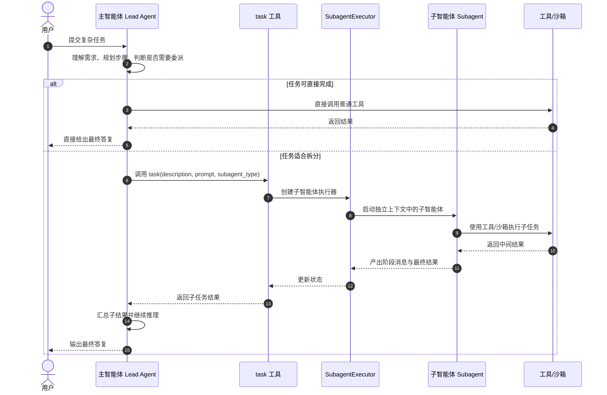
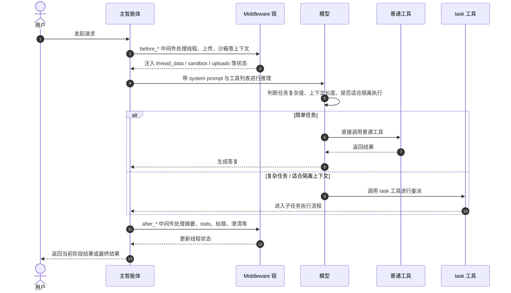
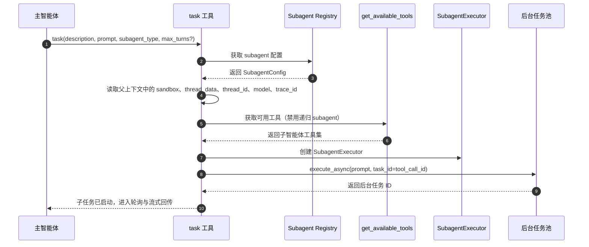
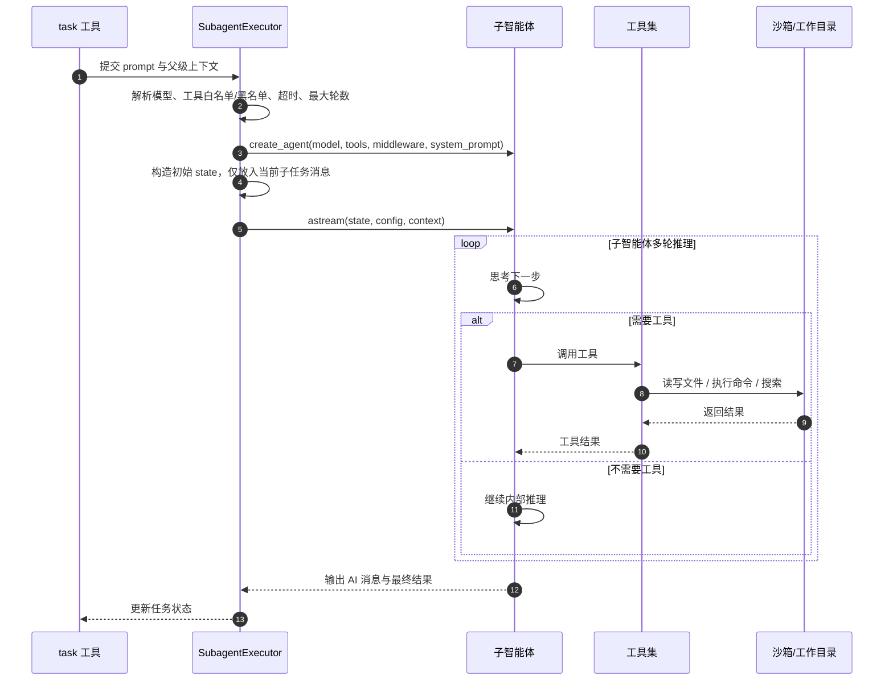
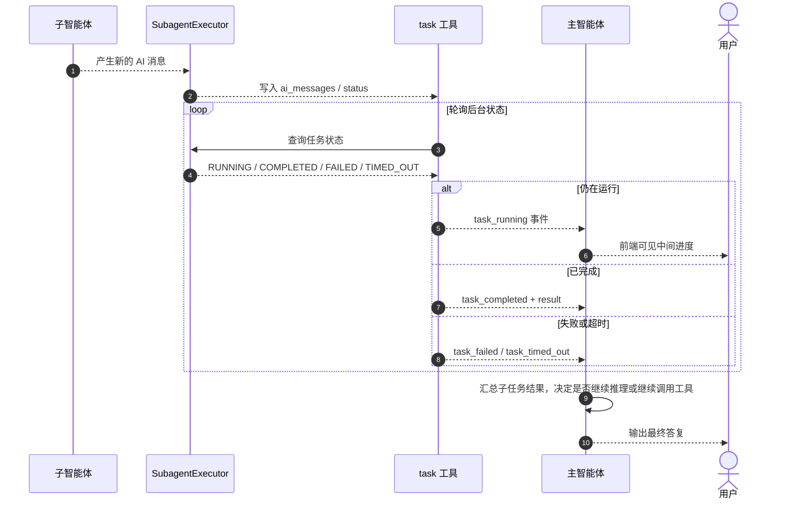
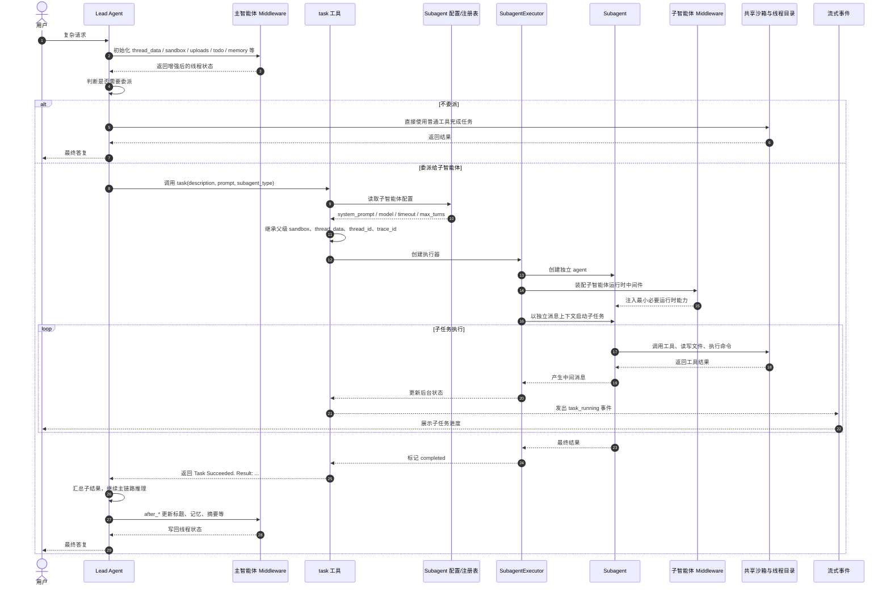

# DeerFlow 多智能体时序图解

本文用几张由浅入深的时序图，说明 DeerFlow 中“用户 -> 主智能体 -> task 工具 -> 子智能体 -> 回传结果”的完整工作链路。

为了便于阅读，本文把流程拆成四层：

1. 总览图：先看整体协作关系
2. 主智能体决策图：看主智能体何时决定委派
3. 子智能体执行图：看 task 工具如何启动 subagent
4. 回传与收尾图：看结果如何回到主智能体并最终回复用户

---

## 1. 一张图看懂整体流程



### 这张图想表达什么

最重要的是两点：

- 主智能体是调度者，不是所有事情都亲自做
- 子智能体不是普通函数，而是一个独立运行的小 agent

也就是说，DeerFlow 的多智能体不是“多个 agent 一起聊天”，而是“主智能体按需委派子任务给子智能体”。

---

## 2. 主智能体视角：什么时候决定调用 task 工具



### 这一层的关键理解

主智能体并不是一收到请求就开子智能体，而是先经过自己的运行时链路：

- middleware 先准备环境
- 模型结合 prompt 和工具能力做判断
- 只有在“复杂、多步、适合隔离”的情况下，才会调用 `task`

所以 `task` 是一种“按需升级”的执行策略，不是默认路径。

---

## 3. task 工具视角：如何把委派变成真正的子智能体执行



### 这一层的关键理解

`task` 工具不是自己完成任务，它更像一个“委派网关”。

它主要做五件事：

1. 选择子智能体类型
2. 继承父级必要上下文
3. 过滤子智能体可用工具
4. 创建执行器
5. 把执行放到后台线程/事件循环中

这里有一个很重要的设计：

**子智能体默认拿不到 `task` 工具，因此不会继续无限递归创建下一层子智能体。**

这让整个系统保持在“主智能体 -> 子智能体”的单层委派结构里，更可控。

---

## 4. 子智能体视角：在独立上下文中如何执行子任务



### 这一层的关键理解

子智能体虽然是被委派出来的，但它本身仍然是一个完整 agent：

- 有自己的模型
- 有自己的 system prompt
- 有自己的工具集
- 有自己的最大轮数
- 有自己的超时控制
- 有自己的执行状态

但它和主智能体最大的区别是：

**它不继承主对话的完整消息历史，只拿到当前子任务 prompt。**

这就是“上下文隔离”的核心。

---

## 5. 回传视角：子智能体的中间过程和最终结果如何返回



### 这一层的关键理解

这里不是“子智能体结束后一次性返回”，而是：

- 后台持续执行
- task 工具持续轮询
- 中间消息可以流式暴露
- 最终结果再交给主智能体整合

所以用户看到的体验通常是：

1. 主智能体发起一个子任务
2. 子任务在运行中
3. 中间过程不断出现
4. 最终结果被主智能体吸收并总结

---

## 6. 一张更完整的深度图：把状态、上下文和控制点都放进去



### 这张深度图强调了三件事

#### 1. 主智能体掌握全局状态
主智能体负责线程级状态管理，例如：

- thread_data
- sandbox
- todos
- title
- memory
- artifacts

#### 2. 子智能体掌握局部任务
子智能体只关心当前被委派的 prompt，不负责整条会话的全局治理。

#### 3. task 工具是桥梁
它连接了：

- 主智能体的委派意图
- 子智能体的实际执行
- 中间状态的流式回传
- 最终结果的回收

---

## 7. 用一句话概括整个时序

```text
用户提出复杂任务
-> 主智能体先在全局上下文中理解和规划
-> 若适合拆分，则调用 task 工具
-> task 工具创建并启动子智能体
-> 子智能体在独立上下文中使用工具完成子任务
-> task 工具轮询并流式回传中间状态
-> 最终结果回到主智能体
-> 主智能体整合后回复用户
```

---

## 8. 阅读这些图时最值得记住的几个结论

### 结论 1：这是“主从式”多智能体，不是对等协商式
主智能体负责调度，子智能体负责执行。

### 结论 2：子智能体是独立 agent，不是普通函数
它有自己的模型、prompt、工具和执行生命周期。

### 结论 3：上下文隔离是核心价值
子智能体不继承主对话全量历史，因此更聚焦、更省上下文。

### 结论 4：共享沙箱让协作变得可落地
虽然上下文隔离，但主子智能体仍可共享线程目录和沙箱环境，从而协同处理文件和命令执行。

### 结论 5：task 工具是整个多智能体机制的桥梁
没有 `task`，就没有从主智能体到子智能体的正式委派链路。

---

## 9. 对应代码位置

如果你想继续顺着代码读，建议按这个顺序：

1. `backend/packages/harness/deerflow/agents/lead_agent/agent.py`
2. `backend/packages/harness/deerflow/tools/builtins/task_tool.py`
3. `backend/packages/harness/deerflow/subagents/executor.py`
4. `backend/packages/harness/deerflow/subagents/registry.py`
5. `backend/packages/harness/deerflow/subagents/config.py`
6. `backend/packages/harness/deerflow/agents/thread_state.py`

---

## 10. 最后给你的阅读建议

如果你是从源码角度理解 DeerFlow，多智能体部分最容易混淆的点有两个：

- `task` 是工具，不是 agent 本身
- `SubagentExecutor` 才是真正把“委派”变成“独立 agent 执行”的地方

所以最好的理解顺序是：

**先看主智能体为什么决定委派，再看 task 如何搭桥，最后看 SubagentExecutor 如何真正跑起来。**
