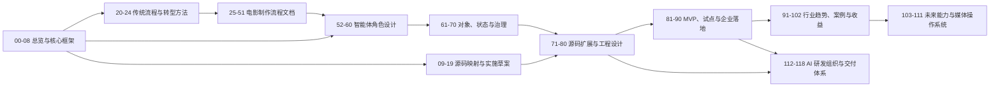
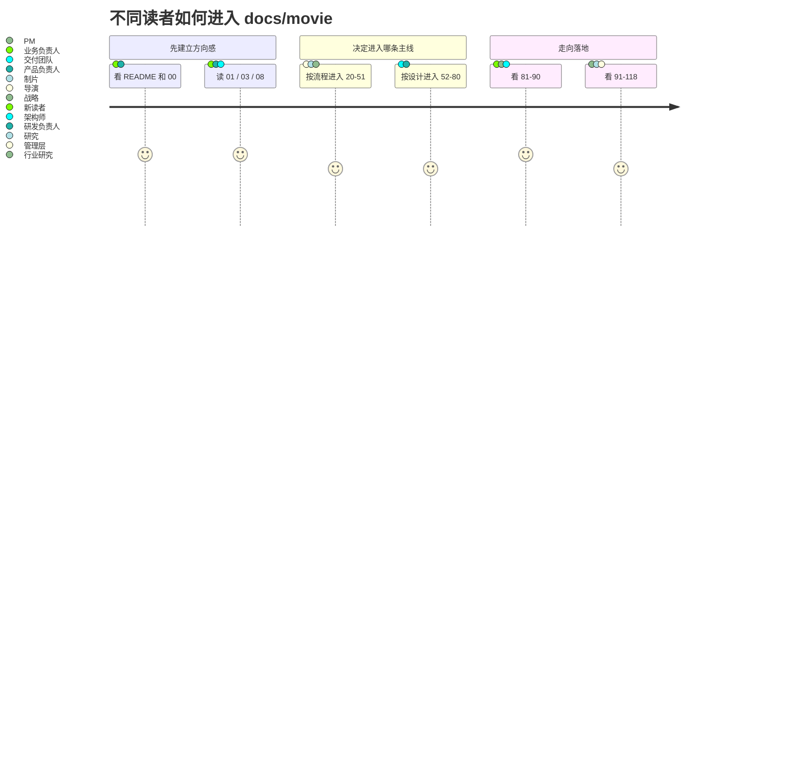

# 00. 阅读地图：如何系统阅读 `docs/movie`

这一篇不是新增方案内容，而是给整套 `docs/movie` 做一个更容易进入的地图。

如果把整个目录看成一个完整项目，它其实在回答 7 个连续问题：

1. 我们到底想做什么
2. 当前 DeerFlow 已经能承接什么
3. 真实电影工业流程应该如何映射进平台
4. 平台中的角色、对象、状态、工具应该怎样设计
5. 这些设计应如何落到当前仓库与研发计划里
6. 怎样做 MVP、试点、治理与企业化推广
7. 为什么这件事在 2026 年成立，以及未来会继续往哪里演进

---

## 1. 一张总图

这张图可以这样理解：

- `00-08` 是总入口，先建立统一认知。
- `20-24` 和 `25-51` 负责把“真实电影工业流程”讲清楚。
- `52-80` 负责把这些流程翻译成平台设计和工程结构。
- `81-118` 负责回答“怎么做出来、怎么落地、为什么值得长期做”。

---

## 2. 最推荐先读的 12 篇

如果你不想一开始就进入 100 多篇的全量阅读，可以先抓这 12 篇主干文档：

1. [01-overview.md](./01-overview.md)
2. [03-target-architecture.md](./03-target-architecture.md)
3. [04-production-phases.md](./04-production-phases.md)
4. [05-agent-system.md](./05-agent-system.md)
5. [06-data-models.md](./06-data-models.md)
6. [08-roadmap.md](./08-roadmap.md)
7. [21-traditional-filmmaking-overview.md](./21-traditional-filmmaking-overview.md)
8. [23-mapping-traditional-process-to-agent-platform.md](./23-mapping-traditional-process-to-agent-platform.md)
9. [61-project-object-system-overview.md](./61-project-object-system-overview.md)
10. [71-lead-agent-transformation-plan.md](./71-lead-agent-transformation-plan.md)
11. [81-mvp-scope-definition.md](./81-mvp-scope-definition.md)
12. [103-deerflow-movie-integration-strategy-summary.md](./103-deerflow-movie-integration-strategy-summary.md)

读完这 12 篇，基本就能把“为什么做、做成什么、怎么实现、如何落地”串起来。

---

## 3. 按问题来选阅读路线

### 我只想快速知道：这是不是一件值得做的事

按这个顺序读：

1. [01-overview.md](./01-overview.md)
2. [02-current-project-mapping.md](./02-current-project-mapping.md)
3. [03-target-architecture.md](./03-target-architecture.md)
4. [08-roadmap.md](./08-roadmap.md)
5. [99-deerflow-ai-film-operating-system-overview.md](./99-deerflow-ai-film-operating-system-overview.md)
6. [103-deerflow-movie-integration-strategy-summary.md](./103-deerflow-movie-integration-strategy-summary.md)

### 我想从电影工业角度理解，而不是从 AI 角度理解

按这个顺序读：

1. [20-master-plan-50-docs.md](./20-master-plan-50-docs.md)
2. [21-traditional-filmmaking-overview.md](./21-traditional-filmmaking-overview.md)
3. [22-non-ai-filmmaking-organization.md](./22-non-ai-filmmaking-organization.md)
4. [23-mapping-traditional-process-to-agent-platform.md](./23-mapping-traditional-process-to-agent-platform.md)
5. [24-deerflow-transformation-roadmap.md](./24-deerflow-transformation-roadmap.md)
6. [25-script-development-and-lock.md](./25-script-development-and-lock.md) 至 [51-project-retrospective-and-knowledge-capture.md](./51-project-retrospective-and-knowledge-capture.md)

### 我想看“平台设计”而不是“行业背景”

按这个顺序读：

1. [03-target-architecture.md](./03-target-architecture.md)
2. [05-agent-system.md](./05-agent-system.md)
3. [06-data-models.md](./06-data-models.md)
4. [07-tools-memory-skills.md](./07-tools-memory-skills.md)
5. [52-director-lead-agent-design.md](./52-director-lead-agent-design.md) 至 [60-cinematography-language-subagent-design.md](./60-cinematography-language-subagent-design.md)
6. [61-project-object-system-overview.md](./61-project-object-system-overview.md) 至 [70-artifact-version-and-archive-system.md](./70-artifact-version-and-archive-system.md)
7. [104-deerflow-future-capability-blueprint.md](./104-deerflow-future-capability-blueprint.md)
8. [105-deerflow-future-reference-architecture.md](./105-deerflow-future-reference-architecture.md)

### 我想直接推进研发

按这个顺序读：

1. [09-source-mapping-overview.md](./09-source-mapping-overview.md)
2. [13-system-blueprint.md](./13-system-blueprint.md)
3. [14-implementation-draft.md](./14-implementation-draft.md)
4. [16-b-interfaces-and-data-contracts.md](./16-b-interfaces-and-data-contracts.md)
5. [17-c-first-code-drop-plan.md](./17-c-first-code-drop-plan.md)
6. [71-lead-agent-transformation-plan.md](./71-lead-agent-transformation-plan.md) 至 [80-observability-logging-and-evaluation.md](./80-observability-logging-and-evaluation.md)
7. [81-mvp-scope-definition.md](./81-mvp-scope-definition.md)
8. [82-phase-1-development-plan.md](./82-phase-1-development-plan.md)
9. [112-ai-coding-and-multi-agent-delivery-plan.md](./112-ai-coding-and-multi-agent-delivery-plan.md)

### 我想看企业落地和治理

按这个顺序读：

1. [81-mvp-scope-definition.md](./81-mvp-scope-definition.md)
2. [85-pilot-project-implementation-manual.md](./85-pilot-project-implementation-manual.md)
3. [87-data-and-asset-governance.md](./87-data-and-asset-governance.md)
4. [88-security-permissions-and-audit.md](./88-security-permissions-and-audit.md)
5. [89-metrics-and-roi.md](./89-metrics-and-roi.md)
6. [90-enterprise-rollout-roadmap.md](./90-enterprise-rollout-roadmap.md)
7. [102-deerflow-roi-governance-and-adoption-roadmap-2026.md](./102-deerflow-roi-governance-and-adoption-roadmap-2026.md)
8. [118-program-governance-roadmap-and-operating-metrics.md](./118-program-governance-roadmap-and-operating-metrics.md)

### 我想看未来趋势与行业判断

按这个顺序读：

1. [91-2026-model-landscape-and-film-ai-stack.md](./91-2026-model-landscape-and-film-ai-stack.md)
2. [92-hollywood-ai-film-production-trends-2026.md](./92-hollywood-ai-film-production-trends-2026.md)
3. [93-china-film-ai-production-trends-2026.md](./93-china-film-ai-production-trends-2026.md)
4. [94-director-case-christopher-nolan.md](./94-director-case-christopher-nolan.md) 至 [98-director-case-guo-fan.md](./98-director-case-guo-fan.md)
5. [99-deerflow-ai-film-operating-system-overview.md](./99-deerflow-ai-film-operating-system-overview.md)
6. [100-deerflow-benefit-map-for-hollywood.md](./100-deerflow-benefit-map-for-hollywood.md)
7. [101-deerflow-benefit-map-for-china-film.md](./101-deerflow-benefit-map-for-china-film.md)
8. [106-video-foundation-models-future-evolution.md](./106-video-foundation-models-future-evolution.md) 至 [111-video-agents-risk-evals-and-governance.md](./111-video-agents-risk-evals-and-governance.md)

---

## 4. 一张读者旅程图

这张图强调的是：这套目录不是单一路径，而是根据你的角色和目标，从不同入口汇入同一张知识地图。

---

## 5. 目录之间的依赖关系

可以把整套文档拆成 4 层：

### 第一层：建立共识

- [01-overview.md](./01-overview.md) 到 [08-roadmap.md](./08-roadmap.md)

这一层解决的是“为什么不是一个聊天助手，而是一套系统”。

### 第二层：对齐现实世界

- [20-master-plan-50-docs.md](./20-master-plan-50-docs.md) 到 [51-project-retrospective-and-knowledge-capture.md](./51-project-retrospective-and-knowledge-capture.md)

这一层解决的是“真实电影工业中的流程、角色、资产和审批到底长什么样”。

### 第三层：翻译成平台与代码

- [52-director-lead-agent-design.md](./52-director-lead-agent-design.md) 到 [80-observability-logging-and-evaluation.md](./80-observability-logging-and-evaluation.md)

这一层解决的是“电影工业如何被翻译成 agent、object、state、tool、workspace、factory 和 runtime”。

### 第四层：走向真实部署与长期演进

- [81-mvp-scope-definition.md](./81-mvp-scope-definition.md) 到 [118-program-governance-roadmap-and-operating-metrics.md](./118-program-governance-roadmap-and-operating-metrics.md)

这一层解决的是“怎么从方案变成项目，再从项目变成平台能力”。

---

## 6. 如何在单篇文档之间跳转

这次整理后，单篇文档底部都统一补了“文档导航”，会提供：

- 总入口
- 阅读地图
- 所在分组
- 上一篇 / 下一篇
- 同组文档

所以有两种推荐读法：

- 主题式读法：先从本页或 [README.md](./README.md) 选路线，再跳到目标分组。
- 串行式读法：进入一篇文档后，直接沿着底部导航连续往后读。

---

## 7. 建议的使用方式

- 要写方案：优先读 `00-08`、`52-70`、`81-90`。
- 要做产品：优先读 `01-08`、`23-24`、`52-70`、`103-105`。
- 要做工程：优先读 `09-19`、`61-80`、`112-118`。
- 要做行业研究：优先读 `20-24`、`91-111`。
- 要做业务沟通：优先读 `01`、`08`、`99`、`100-103`。

---

## 8. 一句话记住这套目录

这套文档的主线不是“AI 能生成什么”，而是：

**电影工业如何被系统化建模，再被 DeerFlow 逐步实现成一个可协作、可治理、可落地的导演智能体平台。**

---

<!-- movie-visuals:start -->
## 补充图示：换一种视角看本篇

下面这张 流程图 把“阅读地图：如何系统阅读 `docs/movie`”再压缩成一个可快速扫读的结构视图，便于先抓关键关系，再回到正文细节。

<!-- movie-visuals:end -->

<!-- movie-doc-nav:start -->
## 文档导航

- 总入口：[README.md](./README.md)
- 阅读地图：[00-reading-map.md](./00-reading-map.md)
- 所在分组：00-08 总览与核心框架
- 上一篇：无，建议先从 [README.md](./README.md) 或 [00-reading-map.md](./00-reading-map.md) 开始。
- 下一篇：[01. 总览：什么是面向电影制作的导演智能体](./01-overview.md)

### 同组文档
- 00. 阅读地图：如何系统阅读 `docs/movie`（当前）
- [01. 总览：什么是面向电影制作的导演智能体](./01-overview.md)
- [02. 当前项目能力映射：DeerFlow 如何承接导演智能体](./02-current-project-mapping.md)
- [03. 目标架构：如何把 DeerFlow 演进成导演智能体系统](./03-target-architecture.md)
- [04. 阶段工作流：前期、中期、后期如何被导演智能体接管](./04-production-phases.md)
- [05. Agent 体系：导演、制片、摄影、后期如何组织成多智能体系统](./05-agent-system.md)
- [06. 数据模型：如何把电影制作从对话变成可管理项目](./06-data-models.md)
- [07. 工具、记忆、技能：导演智能体真正可用的执行底座](./07-tools-memory-skills.md)
- [08. 落地路线：如何分阶段把 DeerFlow 改造成导演智能体平台](./08-roadmap.md)
<!-- movie-doc-nav:end -->
