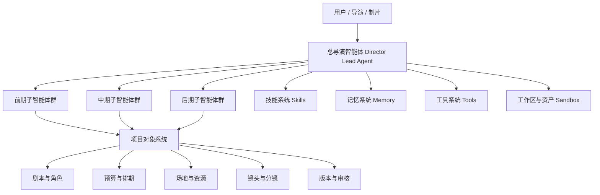

# 01. 总览：什么是面向电影制作的导演智能体

## 1. 先说结论

如果要把当前 DeerFlow 改造成面向大规模电影制作的系统，最合理的方向不是做一个“万能电影聊天助手”，而是做成：

**一个总导演智能体 + 一组部门子智能体 + 一套项目对象系统 + 一条阶段化工作流。**

这四者缺一不可。

---

## 2. 为什么不能只做一个大模型助手

电影制作不是单点问答，而是一个跨阶段、跨部门、跨资产、跨版本的复杂协作系统。

它同时包含：

- 创作决策
- 制片约束
- 预算控制
- 排期调度
- 人员协作
- 资产生产
- 审核与版本管理
- 项目复盘

如果只做一个大模型聊天入口，通常会出现三个问题：

1. 只能给建议，不能管理项目对象
2. 只能回答局部问题，不能推进阶段流程
3. 只能生成内容，不能承担组织协调职责

所以，导演智能体必须是一个系统，而不是一个 prompt。

---

## 3. 目标系统应该长什么样

### 这张图表达的核心意思

- 总导演智能体负责统一目标和最终决策
- 子智能体负责部门化执行
- 项目对象系统负责承载真实制作数据
- 技能、记忆、工具、工作区共同构成执行底座

---

## 4. 这个系统要解决什么问题

### 前期
- 剧本分析与拆解
- 风格参考研究
- 对白设计
- 文字分镜与概念设计
- 预算与排期草案
- 演员、场地、服化道、摄影、灯光、视效需求规划

### 中期
- 每日拍摄任务分配
- 助理导演调度
- 成本与进度控制
- 演员表演建议
- 摄影与灯光执行建议
- 视效预留与审核
- 出片与日审

### 后期
- 剪辑版本管理
- 配音、配乐、音效、调色协同
- 审核意见汇总
- 交付与宣发物料准备
- 项目复盘与知识沉淀

---

## 5. 为什么 DeerFlow 适合做这件事

当前项目已经具备多智能体系统最关键的几个基础能力：

- 主智能体入口
- 子智能体委派机制
- 线程状态管理
- Todo 计划模式
- Memory 记忆能力
- Skills 注入能力
- Sandbox 工作区与文件产物能力
- 自定义 agent 配置能力

这意味着我们不是从零开始，而是在一个已经具备 orchestration 能力的系统上做行业化升级。

---

## 6. 从浅到深理解这次改造

可以把这次改造分成三层理解。

### 第一层：人格层
先做一个“导演人格”的 agent。

它知道：
- 如何理解剧本
- 如何判断风格
- 如何组织前期筹备
- 如何协调各部门

### 第二层：组织层
再把它扩展成“导演 + 制片 + 摄影 + 美术 + 后期”的多智能体组织。

### 第三层：系统层
最后把它升级成真正的电影制作操作系统：

- 有项目对象
- 有阶段状态机
- 有审批流
- 有版本管理
- 有资产沉淀

---

## 7. 这套方案的最终定位

最终目标不是：

- 一个会写电影文案的 AI
- 一个会生成分镜提示词的 AI
- 一个会做预算表的 AI

而是：

**一个能把创作、制片、执行、审核、复盘串起来的导演智能体平台。**

---

## 8. 本文档后续怎么读

如果你已经理解了总体目标，建议继续看：

- [02-current-project-mapping.md](./02-current-project-mapping.md)：当前 DeerFlow 能承接哪些能力
- [03-target-architecture.md](./03-target-architecture.md)：目标系统应该如何分层
- [04-production-phases.md](./04-production-phases.md)：前期、中期、后期如何拆成工作流

---

---

<!-- movie-doc-nav:start -->
## 文档导航

- 总入口：[README.md](./README.md)
- 阅读地图：[00-reading-map.md](./00-reading-map.md)
- 所在分组：00-08 总览与核心框架
- 上一篇：[00. 阅读地图：如何系统阅读 `docs/movie`](./00-reading-map.md)
- 下一篇：[02. 当前项目能力映射：DeerFlow 如何承接导演智能体](./02-current-project-mapping.md)

### 同组文档
- [00. 阅读地图：如何系统阅读 `docs/movie`](./00-reading-map.md)
- 01. 总览：什么是面向电影制作的导演智能体（当前）
- [02. 当前项目能力映射：DeerFlow 如何承接导演智能体](./02-current-project-mapping.md)
- [03. 目标架构：如何把 DeerFlow 演进成导演智能体系统](./03-target-architecture.md)
- [04. 阶段工作流：前期、中期、后期如何被导演智能体接管](./04-production-phases.md)
- [05. Agent 体系：导演、制片、摄影、后期如何组织成多智能体系统](./05-agent-system.md)
- [06. 数据模型：如何把电影制作从对话变成可管理项目](./06-data-models.md)
- [07. 工具、记忆、技能：导演智能体真正可用的执行底座](./07-tools-memory-skills.md)
- [08. 落地路线：如何分阶段把 DeerFlow 改造成导演智能体平台](./08-roadmap.md)
<!-- movie-doc-nav:end -->
