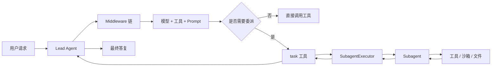
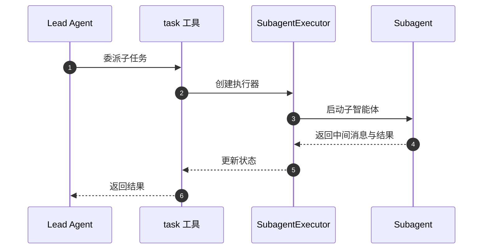
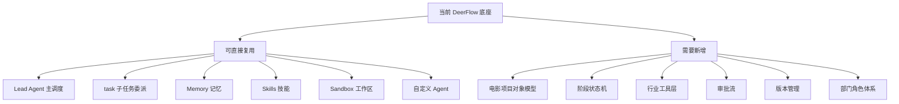

# 02. 当前项目能力映射：DeerFlow 如何承接导演智能体

这一篇的目标是回答一个很实际的问题：

**当前 DeerFlow 已经具备哪些能力，可以直接承接电影导演智能体；哪些能力还需要新增。**

---

## 1. 先看当前项目的核心运行方式

当前 DeerFlow 的主线可以概括为：

这条链路说明：

- 主智能体负责总体理解与调度
- 子智能体负责隔离上下文中的子任务执行
- 工具与沙箱负责实际动作
- 最终结果回到主智能体统一整合

这和电影制作中的“导演 -> 各部门 -> 回传 -> 导演决策”非常接近。

---

## 2. 当前项目中可直接复用的能力

## 2.1 主智能体机制

当前主智能体入口在 `make_lead_agent(config)`，它负责：

- 解析模型
- 组装工具
- 组装 middleware
- 生成系统提示词
- 创建主 agent

这意味着我们可以直接把“总导演智能体”建立在现有 Lead Agent 机制上。

### 对电影制作的意义

它天然适合承担：

- 项目总控
- 阶段推进
- 任务拆解
- 结果汇总
- 最终创作判断

---

## 2.2 子智能体委派机制

当前 `task` 工具会把复杂任务委派给子智能体执行。

### 对电影制作的意义

这非常适合映射成：

- 导演委派给制片
- 导演委派给摄影指导
- 导演委派给分镜设计
- 导演委派给预算控制
- 导演委派给后期总监

也就是说，当前 DeerFlow 已经具备“部门化执行”的基本骨架。

---

## 2.3 ThreadState 状态管理

当前线程状态已经支持：

- messages
- sandbox
- thread_data
- artifacts
- title
- todos
- viewed_images

### 对电影制作的意义

这说明系统已经有“项目上下文容器”的雏形。

虽然它现在还不是电影项目对象，但已经具备承载以下内容的基础：

- 当前项目工作区
- 当前阶段产物
- 当前任务列表
- 当前视觉参考

后续只需要把它从“通用线程状态”扩展成“电影项目状态”。

---

## 2.4 Memory 记忆能力

当前主智能体已经挂了 MemoryMiddleware。

### 对电影制作的意义

这可以直接升级成：

- 导演风格偏好记忆
- 项目阶段记忆
- 角色与演员偏好记忆
- 类型片经验记忆
- 历史项目复盘记忆

也就是说，系统已经有“记忆插槽”，只是还没有换成电影制作语义。

---

## 2.5 Skills 技能机制

当前系统支持把 skills 注入到 agent prompt 中。

### 对电影制作的意义

这非常适合承载：

- 科幻导演方法论
- 广告导演方法论
- 武打设计方法论
- 对白润色方法论
- 分镜设计方法论
- 摄影语言方法论
- 视效预演方法论

这比把所有行业知识都写死在一个 prompt 里更可维护。

---

## 2.6 Sandbox 与文件工作区

当前系统支持：

- 工作区目录
- 上传目录
- 输出目录
- 文件读写
- 命令执行
- 产物管理

### 对电影制作的意义

这意味着系统可以真正产出：

- 剧本拆解表
- 预算表
- 排期表
- 镜头表
- 分镜提示词
- 审核记录
- 版本说明

所以它不是只能聊天，而是可以生成项目资产。

---

## 2.7 自定义 agent 配置能力

当前系统已经支持自定义 agent 配置，包括：

- `name`
- `description`
- `model`
- `tool_groups`
- `skills`
- `SOUL.md`

### 对电影制作的意义

这意味着我们可以先快速做出：

- `director`
- `producer`
- `storyboard`
- `budget`
- `editor`

这些领域 agent，而不必先重写底层框架。

---

## 3. 当前项目还缺什么

虽然底座很好，但要变成电影制作系统，还缺四大块。

---

## 3.1 缺少电影项目对象模型

当前状态更像“通用会话状态”，还没有：

- Project
- Script
- Budget
- Schedule
- Casting
- Location
- ShotPlan
- Review
- Version

没有这些对象，系统就只能“讨论电影制作”，不能“管理电影制作”。

---

## 3.2 缺少阶段状态机

当前系统更偏开放式任务执行，还没有明确的：

- 前期
- 中期
- 后期
- 交付
- 复盘

以及每个阶段的：

- 输入
- 输出
- 必做任务
- 审批条件
- 风险检查

这部分是电影工业化落地的关键。

---

## 3.3 缺少行业工具层

当前工具偏通用，还没有电影制作专用工具，例如：

- 剧本解析
- 镜头表生成
- 预算估算
- 排期优化
- 演员匹配
- 场地匹配
- call sheet 生成
- 版本差异比较
- 审核意见聚合

这部分需要新增。

---

## 3.4 缺少审批与版本管理

电影制作不是只生成内容，还要：

- 审核
- 版本追踪
- 回滚
- 责任归属
- 交付确认

当前 DeerFlow 有产物能力，但还没有完整的“电影项目审批与版本系统”。

---

## 4. 一张图看清“可复用”和“待新增”

---

## 5. 这一篇最重要的结论

### 结论一
当前 DeerFlow 已经具备“导演智能体”的 orchestration 底座。

### 结论二
真正要补的不是“再加一个 prompt”，而是：

- 项目对象
- 阶段流程
- 行业工具
- 审批与版本

### 结论三
最合理的改造方式不是推倒重来，而是：

**在现有 Lead Agent + task + Memory + Skills + Sandbox 的基础上，做电影制作领域化扩展。**

---

## 6. 下一步建议阅读

建议继续看：

- [03-target-architecture.md](./03-target-architecture.md)
- [04-production-phases.md](./04-production-phases.md)
- [05-agent-system.md](./05-agent-system.md)

---

<!-- movie-visuals:start -->
## 补充图示：换一种视角看本篇

下面这张 流程图 把“当前项目能力映射：DeerFlow 如何承接导演智能体”再压缩成一个可快速扫读的结构视图，便于先抓关键关系，再回到正文细节。

<!-- movie-visuals:end -->

<!-- movie-doc-nav:start -->
## 文档导航

- 总入口：[README.md](./README.md)
- 阅读地图：[00-reading-map.md](./00-reading-map.md)
- 所在分组：00-08 总览与核心框架
- 上一篇：[01. 总览：什么是面向电影制作的导演智能体](./01-overview.md)
- 下一篇：[03. 目标架构：如何把 DeerFlow 演进成导演智能体系统](./03-target-architecture.md)

### 同组文档
- [00. 阅读地图：如何系统阅读 `docs/movie`](./00-reading-map.md)
- [01. 总览：什么是面向电影制作的导演智能体](./01-overview.md)
- 02. 当前项目能力映射：DeerFlow 如何承接导演智能体（当前）
- [03. 目标架构：如何把 DeerFlow 演进成导演智能体系统](./03-target-architecture.md)
- [04. 阶段工作流：前期、中期、后期如何被导演智能体接管](./04-production-phases.md)
- [05. Agent 体系：导演、制片、摄影、后期如何组织成多智能体系统](./05-agent-system.md)
- [06. 数据模型：如何把电影制作从对话变成可管理项目](./06-data-models.md)
- [07. 工具、记忆、技能：导演智能体真正可用的执行底座](./07-tools-memory-skills.md)
- [08. 落地路线：如何分阶段把 DeerFlow 改造成导演智能体平台](./08-roadmap.md)
<!-- movie-doc-nav:end -->
