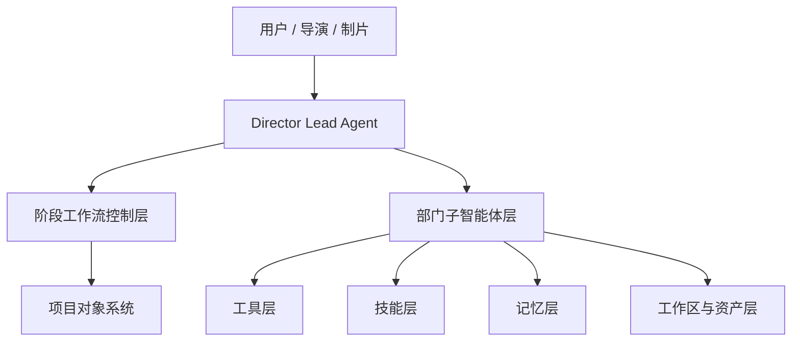
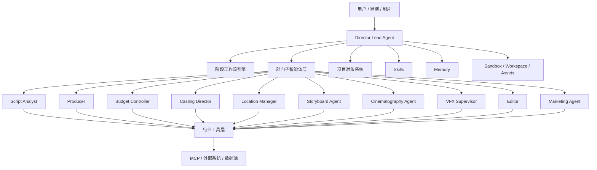
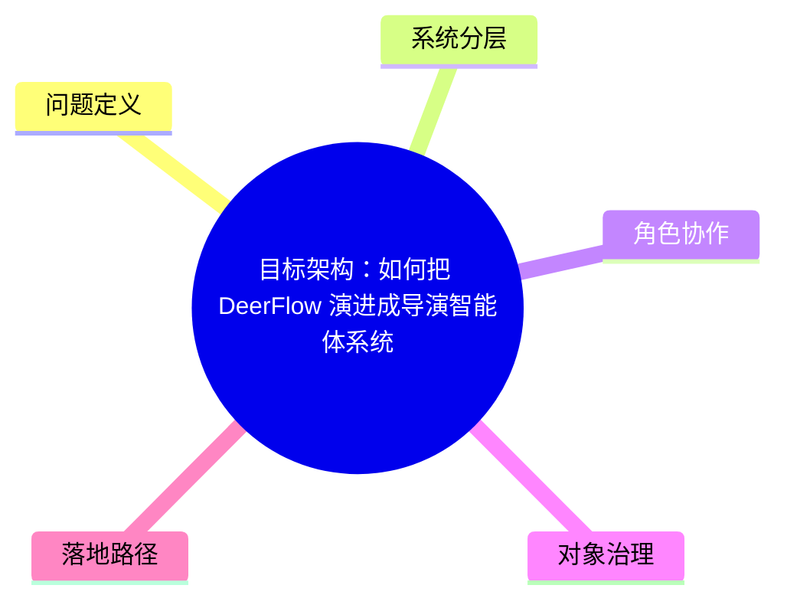

# 03. 目标架构：如何把 DeerFlow 演进成导演智能体系统

这一篇回答的是：

**如果以当前 DeerFlow 为底座，目标系统应该如何分层，才能支撑大规模电影制作。**

---

## 1. 目标不是一个 Agent，而是一套系统

最容易犯的错误，是把“导演智能体”理解成一个更强的聊天机器人。

更准确的理解应该是：

- 上层是总导演智能体
- 中层是部门子智能体
- 下层是工具、记忆、技能、工作区
- 中间贯穿项目对象与阶段工作流

---

## 2. 推荐的四层架构

## 2.1 第一层：导演控制层

这一层就是总导演智能体。

职责包括：

- 理解项目目标
- 统一创作方向
- 决定当前阶段
- 决定是否委派给子智能体
- 汇总各部门结果
- 做最终创作与制作判断

### 与当前项目的映射

这一层直接对应当前的 Lead Agent 机制。

也就是说，当前 DeerFlow 的主智能体可以直接演进成 Director Lead Agent。

---

## 2.2 第二层：部门执行层

这一层由多个专业子智能体组成。

例如：

- 制片子智能体
- 预算子智能体
- 演员子智能体
- 场地子智能体
- 分镜子智能体
- 摄影子智能体
- 灯光子智能体
- 视效子智能体
- 剪辑子智能体
- 声音子智能体
- 调色子智能体
- 宣发子智能体

### 与当前项目的映射

这一层直接对应当前的 `task -> SubagentExecutor -> Subagent` 机制。

也就是说，当前 DeerFlow 已经具备“总控 + 部门执行”的主从式多智能体骨架。

---

## 2.3 第三层：项目对象层

这是电影制作系统和通用 agent 系统最大的区别。

这一层负责承载真实项目数据，例如：

- Project
- Script
- Budget
- Schedule
- Casting
- Location
- ShotPlan
- Review
- Version
- Deliverable

### 为什么这一层重要

没有项目对象层，系统只能：

- 讨论剧本
- 讨论预算
- 讨论排期

但不能：

- 管理剧本版本
- 跟踪预算偏差
- 追踪镜头完成度
- 管理审核意见

所以这一层是“从聊天系统走向生产系统”的关键。

---

## 2.4 第四层：执行底座层

这一层包括：

- 工具层 Tools
- 技能层 Skills
- 记忆层 Memory
- 工作区与资产层 Sandbox
- 外部系统接入层 MCP / API / DB

### 与当前项目的映射

当前 DeerFlow 已经具备这层的大部分基础能力，只需要做行业化扩展。

---

## 3. 一张完整架构图

---

## 4. 为什么要保留“主从式多智能体”而不是改成对等协商

电影制作虽然是多人协作，但组织结构并不是完全对等的。

更符合现实的结构是：

- 导演统一创作意图
- 制片控制资源与约束
- 各部门执行专业任务
- 最终由导演或制片做关键决策

因此，当前 DeerFlow 的主从式多智能体结构其实非常适合电影制作。

### 好处

- 决策链清晰
- 责任边界清晰
- 上下文更可控
- 成本更可控
- 更容易做审批与版本管理

---

## 5. 目标系统中的关键控制点

为了让系统真正可用于大规模制作，建议增加五个控制点。

### 5.1 阶段控制点
系统必须知道当前处于：

- 前期
- 中期
- 后期
- 交付
- 复盘

### 5.2 审批控制点
关键产物必须经过审核，例如：

- 剧本锁定
- 预算审批
- 分镜确认
- 日拍摄计划确认
- 粗剪审核
- 精剪审核
- 最终交付确认

### 5.3 版本控制点
每个关键资产都要有版本，例如：

- 剧本 v1 / v2 / lock
- 预算 v1 / v2 / approved
- 分镜 v1 / v2 / final
- cut v1 / v2 / final

### 5.4 风险控制点
系统要能识别：

- 预算超支风险
- 排期延误风险
- 场地冲突风险
- 演员档期风险
- 视效返工风险

### 5.5 交付控制点
系统要知道每个阶段的交付物是否齐全。

---

## 6. 与当前 DeerFlow 结合时，最合理的演进方式

建议按下面方式演进，而不是一次性重写。

### 第一步：先做导演 Lead Agent
基于当前自定义 agent 机制，先做一个 `director` agent。

### 第二步：扩展子智能体角色库
把当前 subagent 从通用型扩展成电影制作部门角色。

### 第三步：引入项目对象层
把 ThreadState 扩展成电影项目状态，或引入独立项目存储层。

### 第四步：引入阶段工作流与审批流
让系统从“任务执行”升级成“阶段推进”。

### 第五步：接入行业工具与外部系统
例如预算系统、资产系统、场地库、演员库、版本库。

---

## 7. 这一篇最重要的结论

### 结论一
目标系统必须是“导演控制层 + 部门执行层 + 项目对象层 + 执行底座层”的四层结构。

### 结论二
当前 DeerFlow 已经具备其中两层半：

- 导演控制层的雏形
- 部门执行层的雏形
- 执行底座层的大部分能力

### 结论三
真正需要重点建设的是：

- 项目对象层
- 阶段工作流
- 审批与版本控制

---

## 8. 下一步建议阅读

建议继续看：

- [04-production-phases.md](./04-production-phases.md)
- [05-agent-system.md](./05-agent-system.md)
- [06-data-models.md](./06-data-models.md)

---

<!-- movie-visuals:start -->
## 补充图示：换一种视角看本篇

下面这张 心智图 把“目标架构：如何把 DeerFlow 演进成导演智能体系统”再压缩成一个可快速扫读的结构视图，便于先抓关键关系，再回到正文细节。

<!-- movie-visuals:end -->

<!-- movie-doc-nav:start -->
## 文档导航

- 总入口：[README.md](./README.md)
- 阅读地图：[00-reading-map.md](./00-reading-map.md)
- 所在分组：00-08 总览与核心框架
- 上一篇：[02. 当前项目能力映射：DeerFlow 如何承接导演智能体](./02-current-project-mapping.md)
- 下一篇：[04. 阶段工作流：前期、中期、后期如何被导演智能体接管](./04-production-phases.md)

### 同组文档
- [00. 阅读地图：如何系统阅读 `docs/movie`](./00-reading-map.md)
- [01. 总览：什么是面向电影制作的导演智能体](./01-overview.md)
- [02. 当前项目能力映射：DeerFlow 如何承接导演智能体](./02-current-project-mapping.md)
- 03. 目标架构：如何把 DeerFlow 演进成导演智能体系统（当前）
- [04. 阶段工作流：前期、中期、后期如何被导演智能体接管](./04-production-phases.md)
- [05. Agent 体系：导演、制片、摄影、后期如何组织成多智能体系统](./05-agent-system.md)
- [06. 数据模型：如何把电影制作从对话变成可管理项目](./06-data-models.md)
- [07. 工具、记忆、技能：导演智能体真正可用的执行底座](./07-tools-memory-skills.md)
- [08. 落地路线：如何分阶段把 DeerFlow 改造成导演智能体平台](./08-roadmap.md)
<!-- movie-doc-nav:end -->
