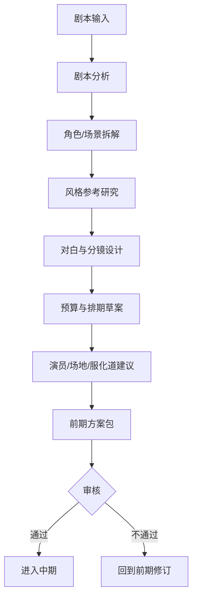
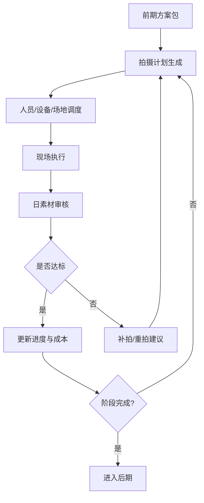
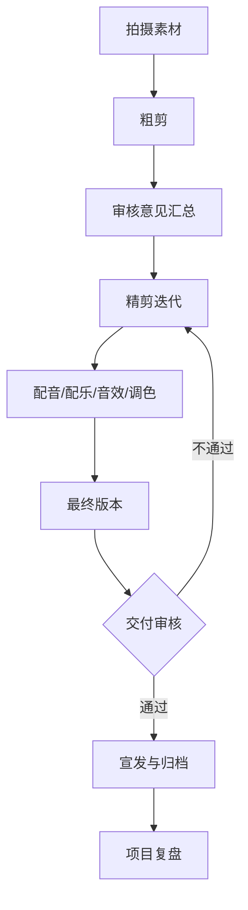

# 04. 阶段工作流：前期、中期、后期如何被导演智能体接管

这一篇重点讲业务流程。

目标不是泛泛而谈电影制作，而是把电影制作拆成：

- 可识别的阶段
- 可执行的任务
- 可交付的产物
- 可审核的节点

这样系统才能真正推进项目，而不是只给建议。

---

## 1. 为什么必须做阶段化

电影制作不是一个连续的开放式对话，而是一个强阶段流程。

如果系统不知道当前处于哪个阶段，就会出现：

- 前期还没锁剧本，就开始做后期版本管理
- 预算没批，就开始大规模排期
- 分镜没确认，就开始生成拍摄执行单

所以导演智能体必须具备“阶段意识”。

---

## 2. 推荐的阶段划分

建议至少划分为：

1. Development
2. Pre-production
3. Production
4. Post-production
5. Delivery
6. Retrospective

其中你当前最关心的，可以先聚焦三大阶段：

- 前期
- 中期
- 后期

---

## 3. 前期：从剧本到可拍摄方案

### 目标
把创意和剧本，转化成可执行的制作方案。

### 核心任务
- 剧本分析
- 角色拆解
- 场景拆解
- 风格参考研究
- 对白设计与润色
- 文字分镜
- 概念设计
- 静态分镜图任务单
- 氛围图任务单
- 预算草案
- 排期草案
- 演员建议
- 场地建议
- 服化道需求拆解
- 摄影、灯光、视效需求预估

### 关键交付物
- Script Breakdown
- Character Breakdown
- Style Reference Pack
- Shot List Draft
- Storyboard Prompt Pack
- Budget Draft
- Schedule Draft
- Casting Suggestions
- Location Suggestions

### 审核节点
- 剧本是否锁定
- 风格方向是否确认
- 预算是否可接受
- 排期是否可执行
- 分镜方向是否确认

---

## 4. 中期：从方案到拍摄执行

### 目标
把前期方案转化成每日可执行的拍摄与调度计划，并持续控制成本与进度。

### 核心任务
- 每日拍摄计划
- 助理导演调度
- 人员与设备调度
- 场地切换安排
- 演员表演建议
- 摄影机位建议
- 灯光氛围建议
- 视效预留建议
- 成本偏差监控
- 进度偏差监控
- 日素材审核
- 补拍 / 重拍建议

### 关键交付物
- Daily Call Sheet
- Shooting Order
- Resource Allocation Plan
- Daily Cost Report
- Daily Progress Report
- Dailies Review Notes
- Reshoot Recommendations

### 审核节点
- 当日计划是否可执行
- 成本是否超出阈值
- 进度是否偏离里程碑
- 素材是否达到质量要求

---

## 5. 后期：从素材到交付

### 目标
把拍摄素材转化成可交付版本，并完成审核、宣发与复盘。

### 核心任务
- 粗剪规划
- 精剪迭代
- 配音与 ADR 管理
- 配乐 brief
- 音效设计 brief
- 调色风格统一
- 视效交付跟踪
- 审核意见汇总
- 版本差异管理
- 宣发物料准备
- 项目复盘与总结

### 关键交付物
- Edit Version Plan
- Review Notes Summary
- ADR Task List
- Music Brief
- Sound Design Brief
- Color Grade Brief
- Final Delivery Package
- Retrospective Report

### 审核节点
- 粗剪是否通过
- 精剪是否通过
- 声音与调色是否通过
- 最终交付是否齐全
- 宣发物料是否齐全

---

## 6. 三大阶段如何映射到系统能力

| 阶段 | 系统重点 | 主要 Agent | 主要对象 | 主要产物 |
|------|----------|------------|----------|----------|
| 前期 | 创作规划 + 制片筹备 | Director / Script / Producer / Budget / Storyboard | Script / Budget / Schedule / Casting / Location | 分镜、预算、排期、风格包 |
| 中期 | 调度执行 + 成本进度控制 | Assistant Director / Scheduling / Cost Control / Cinematography / VFX | ShootingDay / Resource / DailyReport / Review | Call Sheet、日报、审核意见 |
| 后期 | 版本管理 + 审核交付 | Editor / Sound / Color / Marketing | EditVersion / Review / Deliverable | Cut 版本、交付包、复盘报告 |

---

## 7. 为什么阶段工作流必须和当前 DeerFlow 结合

当前 DeerFlow 已经有：

- Todo 计划模式
- 子任务委派
- 文件产物
- 记忆
- 工作区

这些能力非常适合做阶段工作流的执行底座。

### 可以怎么结合

- 用 Todo 表示阶段内任务清单
- 用 task 工具委派部门任务
- 用 Sandbox 保存阶段产物
- 用 Memory 记录阶段决策与偏好
- 用 ThreadState 或项目对象记录阶段状态

也就是说，阶段工作流不是另起炉灶，而是建立在现有运行时之上。

---

## 8. 这一篇最重要的结论

### 结论一
导演智能体必须具备阶段意识，否则无法真正管理电影制作。

### 结论二
每个阶段都必须定义：

- 输入
- 任务
- 交付物
- 审核节点
- 退出条件

### 结论三
当前 DeerFlow 的 Todo、task、Memory、Sandbox 已经足以承接阶段工作流的执行层。

---

## 9. 下一步建议阅读

建议继续看：

- [05-agent-system.md](./05-agent-system.md)
- [06-data-models.md](./06-data-models.md)
- [07-tools-memory-skills.md](./07-tools-memory-skills.md)

---

---

<!-- movie-doc-nav:start -->
## 文档导航

- 总入口：[README.md](./README.md)
- 阅读地图：[00-reading-map.md](./00-reading-map.md)
- 所在分组：00-08 总览与核心框架
- 上一篇：[03. 目标架构：如何把 DeerFlow 演进成导演智能体系统](./03-target-architecture.md)
- 下一篇：[05. Agent 体系：导演、制片、摄影、后期如何组织成多智能体系统](./05-agent-system.md)

### 同组文档
- [00. 阅读地图：如何系统阅读 `docs/movie`](./00-reading-map.md)
- [01. 总览：什么是面向电影制作的导演智能体](./01-overview.md)
- [02. 当前项目能力映射：DeerFlow 如何承接导演智能体](./02-current-project-mapping.md)
- [03. 目标架构：如何把 DeerFlow 演进成导演智能体系统](./03-target-architecture.md)
- 04. 阶段工作流：前期、中期、后期如何被导演智能体接管（当前）
- [05. Agent 体系：导演、制片、摄影、后期如何组织成多智能体系统](./05-agent-system.md)
- [06. 数据模型：如何把电影制作从对话变成可管理项目](./06-data-models.md)
- [07. 工具、记忆、技能：导演智能体真正可用的执行底座](./07-tools-memory-skills.md)
- [08. 落地路线：如何分阶段把 DeerFlow 改造成导演智能体平台](./08-roadmap.md)
<!-- movie-doc-nav:end -->
