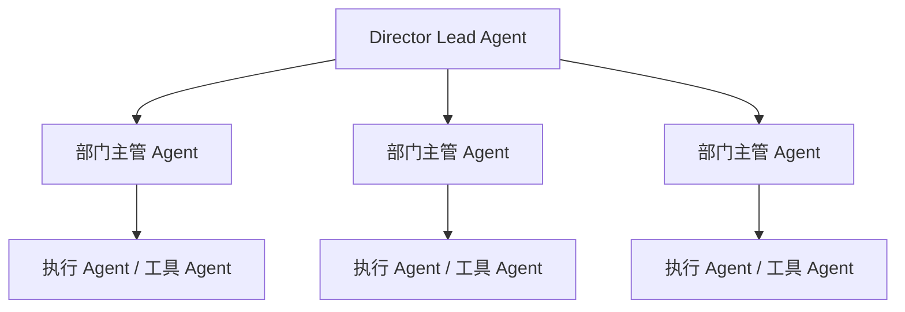
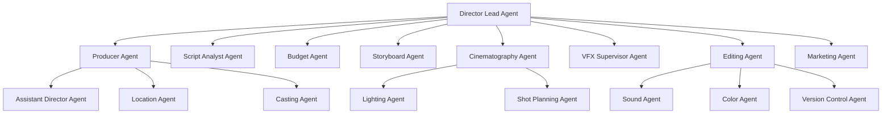

# 05. Agent 体系：导演、制片、摄影、后期如何组织成多智能体系统

这一篇重点讲角色体系。

目标是把“导演智能体”从一个抽象概念，拆成一套可实现的 agent 组织结构。

---

## 1. 为什么电影制作必须是多智能体

电影制作天然就是多角色协作：

- 导演
- 制片
- 助理导演
- 摄影指导
- 灯光
- 美术
- 服化道
- 视效
- 剪辑
- 声音
- 宣发

如果把这些职责都塞进一个 agent，会出现：

- 上下文过载
- 角色边界模糊
- 输出不稳定
- 难以做权限与审批

因此，最合理的方式是：

**总导演智能体负责统一目标，部门子智能体负责专业执行。**

---

## 2. 推荐的三层 Agent 结构

---

## 3. 第一层：总导演智能体

### 职责
- 理解项目目标
- 统一创作方向
- 决定阶段推进
- 决定是否委派
- 汇总各部门结果
- 做最终创作判断

### 在当前 DeerFlow 中如何实现
- 直接基于 Lead Agent
- 使用自定义 `director` agent 配置
- 开启 `subagent_enabled`
- 配置导演专属 skills 与 tool groups

### 它不应该做什么
- 不直接承担所有细节执行
- 不直接维护所有部门内部逻辑
- 不直接处理所有低层工具调用

它更像导演和总控，而不是所有岗位的合体。

---

## 4. 第二层：部门主管 Agent

这一层是最关键的扩展层。

建议至少包括：

### 前期部门 Agent
- Script Analyst Agent
- Producer Agent
- Budget Agent
- Casting Agent
- Location Agent
- Storyboard Agent
- Concept Design Agent
- Dialogue Agent
- Style Research Agent

### 中期部门 Agent
- Assistant Director Agent
- Scheduling Agent
- Cost Control Agent
- Performance Coach Agent
- Cinematography Agent
- Lighting Agent
- VFX Supervisor Agent
- Daily Review Agent

### 后期部门 Agent
- Editing Agent
- Sound Agent
- Music Agent
- Color Agent
- Version Control Agent
- Marketing Agent
- Retrospective Agent

---

## 5. 第三层：执行 Agent / 工具 Agent

这一层更偏任务执行。

例如：

- 镜头表生成 agent
- call sheet 生成 agent
- 预算差异分析 agent
- 审核意见聚合 agent
- 版本对比 agent
- 提示词加工 agent

这层不一定都要做成完整 subagent，有些可以直接做成工具。

### 判断标准
如果任务：

- 需要多轮推理
- 需要隔离上下文
- 需要独立角色视角

适合做 subagent。

如果任务：

- 输入输出明确
- 逻辑稳定
- 更像函数调用

适合做 tool。

---

## 6. 一张更贴近电影制作的角色图

---

## 7. 每类 Agent 的职责边界

| Agent | 核心职责 | 不负责什么 |
|------|----------|------------|
| Director | 总体创作与阶段决策 | 不做所有细节执行 |
| Producer | 资源、预算、排期、风险 | 不做最终创作判断 |
| Script Analyst | 剧本拆解、结构分析、角色分析 | 不做预算控制 |
| Storyboard | 文字分镜、镜头规划、提示词包 | 不做演员调度 |
| Cinematography | 摄影语言、机位、镜头建议 | 不做预算审批 |
| VFX Supervisor | 视效镜头识别、预留、返工风险 | 不做对白润色 |
| Editing | 剪辑版本规划与审核建议 | 不做前期排期 |
| Marketing | 宣发定位与物料规划 | 不做拍摄执行 |

---

## 8. 如何与当前 DeerFlow 的 subagent 机制结合

当前 DeerFlow 的 `task` 工具已经支持：

- 主智能体委派子任务
- 子智能体独立上下文执行
- 中间状态流式回传
- 最终结果回到主智能体

这意味着电影制作角色体系可以直接映射成 subagent registry。

### 推荐做法
把当前 subagent 类型扩展成：

- `producer`
- `script-analyst`
- `budget-controller`
- `casting-director`
- `location-manager`
- `storyboard`
- `cinematography`
- `lighting`
- `vfx-supervisor`
- `editor`
- `sound-designer`
- `colorist`
- `marketing-strategist`

每个子智能体定义：

- system prompt
- 可用工具白名单
- 默认模型
- 最大轮数
- 超时
- 输出模板

---

## 9. 为什么要强调“角色边界”

如果没有角色边界，系统会出现两个问题：

### 问题一：输出混乱
同一个 agent 同时扮演导演、制片、摄影、后期，输出会互相污染。

### 问题二：难以治理
你无法知道：

- 谁负责预算判断
- 谁负责镜头建议
- 谁负责版本审核

而电影制作是强责任链条的行业，所以角色边界必须清晰。

---

## 10. 这一篇最重要的结论

### 结论一
导演智能体必须是多智能体组织，而不是单智能体大脑。

### 结论二
最合理的结构是：

- 总导演 Lead Agent
- 部门主管 Subagents
- 执行 Agent / Tools

### 结论三
当前 DeerFlow 的 `task -> SubagentExecutor -> Subagent` 机制可以直接承接这套角色体系。

---

## 11. 下一步建议阅读

建议继续看：

- [06-data-models.md](./06-data-models.md)
- [07-tools-memory-skills.md](./07-tools-memory-skills.md)
- [08-roadmap.md](./08-roadmap.md)

---

---

<!-- movie-doc-nav:start -->
## 文档导航

- 总入口：[README.md](./README.md)
- 阅读地图：[00-reading-map.md](./00-reading-map.md)
- 所在分组：00-08 总览与核心框架
- 上一篇：[04. 阶段工作流：前期、中期、后期如何被导演智能体接管](./04-production-phases.md)
- 下一篇：[06. 数据模型：如何把电影制作从对话变成可管理项目](./06-data-models.md)

### 同组文档
- [00. 阅读地图：如何系统阅读 `docs/movie`](./00-reading-map.md)
- [01. 总览：什么是面向电影制作的导演智能体](./01-overview.md)
- [02. 当前项目能力映射：DeerFlow 如何承接导演智能体](./02-current-project-mapping.md)
- [03. 目标架构：如何把 DeerFlow 演进成导演智能体系统](./03-target-architecture.md)
- [04. 阶段工作流：前期、中期、后期如何被导演智能体接管](./04-production-phases.md)
- 05. Agent 体系：导演、制片、摄影、后期如何组织成多智能体系统（当前）
- [06. 数据模型：如何把电影制作从对话变成可管理项目](./06-data-models.md)
- [07. 工具、记忆、技能：导演智能体真正可用的执行底座](./07-tools-memory-skills.md)
- [08. 落地路线：如何分阶段把 DeerFlow 改造成导演智能体平台](./08-roadmap.md)
<!-- movie-doc-nav:end -->
