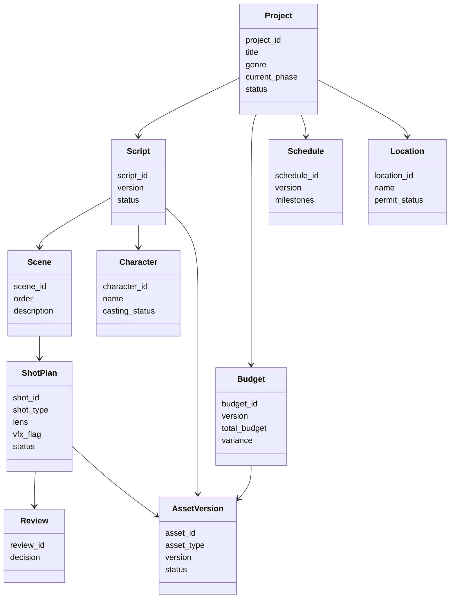

# 06. 数据模型：如何把电影制作从对话变成可管理项目

这一篇重点讲数据模型。

如果没有结构化对象，导演智能体就只能“讨论电影制作”，不能“管理电影制作”。

所以这一篇是整套方案里最偏系统化的一部分。

---

## 1. 为什么数据模型是关键

电影制作不是一段聊天记录，而是一组持续演化的项目对象。

例如：

- 剧本会有多个版本
- 预算会不断修订
- 排期会不断调整
- 镜头会不断补充与删改
- 审核意见会不断积累
- 最终交付会有多个版本

如果这些信息只存在于自然语言上下文里，系统就无法：

- 做版本比较
- 做审批流
- 做风险分析
- 做阶段推进
- 做复盘沉淀

---

## 2. 推荐的核心对象

建议至少定义以下对象：

- Project
- Script
- Character
- Scene
- Budget
- Schedule
- Casting
- Location
- ShotPlan
- Review
- AssetVersion
- Deliverable

---

## 3. 顶层对象：Project

Project 是整个系统的根对象。

### 建议字段

| 字段 | 含义 |
|------|------|
| project_id | 项目唯一标识 |
| title | 项目名称 |
| genre | 类型，如科幻、广告、武打 |
| format | 长片、短片、广告、预告片 |
| target_duration | 目标时长 |
| target_audience | 目标受众 |
| style_keywords | 风格关键词 |
| current_phase | 当前阶段 |
| status | 项目状态 |
| owner | 项目负责人 |
| created_at | 创建时间 |
| updated_at | 更新时间 |

### 作用
Project 用来统一挂载所有子对象。

---

## 4. 剧本对象：Script / Scene / Character

### Script

| 字段 | 含义 |
|------|------|
| script_id | 剧本 ID |
| project_id | 所属项目 |
| version | 版本号 |
| status | draft / review / locked |
| summary | 剧本摘要 |
| theme | 主题 |
| tone | 调性 |
| revision_notes | 修订说明 |

### Scene

| 字段 | 含义 |
|------|------|
| scene_id | 场景 ID |
| script_id | 所属剧本 |
| order | 场景顺序 |
| location_type | 内景 / 外景 |
| time_of_day | 日 / 夜 |
| description | 场景描述 |
| characters | 出场角色 |
| props | 关键道具 |
| wardrobe | 服装要求 |
| vfx_flag | 是否涉及视效 |
| estimated_complexity | 复杂度 |

### Character

| 字段 | 含义 |
|------|------|
| character_id | 角色 ID |
| name | 角色名 |
| role_type | 主角 / 配角 / 群演 |
| age_range | 年龄范围 |
| personality | 性格 |
| performance_notes | 表演说明 |
| casting_status | 选角状态 |

---

## 5. 制片对象：Budget / Schedule / Casting / Location

### Budget

| 字段 | 含义 |
|------|------|
| budget_id | 预算 ID |
| project_id | 所属项目 |
| version | 版本号 |
| total_budget | 总预算 |
| department_budgets | 各部门预算 |
| actual_costs | 实际成本 |
| variance | 偏差 |
| approval_status | 审批状态 |

### Schedule

| 字段 | 含义 |
|------|------|
| schedule_id | 排期 ID |
| project_id | 所属项目 |
| version | 版本号 |
| milestones | 关键里程碑 |
| shooting_days | 拍摄日列表 |
| dependencies | 依赖关系 |
| risk_flags | 风险标记 |
| approval_status | 审批状态 |

### Casting

| 字段 | 含义 |
|------|------|
| casting_id | 选角 ID |
| role_id | 角色 ID |
| candidates | 候选人 |
| confirmed_actor | 已确认演员 |
| availability | 档期 |
| notes | 备注 |

### Location

| 字段 | 含义 |
|------|------|
| location_id | 场地 ID |
| project_id | 所属项目 |
| name | 场地名称 |
| type | 场地类型 |
| cost | 成本 |
| permit_status | 许可状态 |
| weather_risk | 天气风险 |
| constraints | 限制条件 |

---

## 6. 创作执行对象：ShotPlan

ShotPlan 是导演智能体系统里非常关键的对象。

### 建议字段

| 字段 | 含义 |
|------|------|
| shot_id | 镜头 ID |
| scene_id | 所属场景 |
| shot_type | 远景 / 中景 / 特写 |
| camera_movement | 推拉摇移跟 |
| lens | 镜头焦段 |
| framing | 构图说明 |
| lighting_notes | 灯光说明 |
| performance_notes | 表演说明 |
| dialogue_notes | 对白说明 |
| vfx_flag | 是否涉及视效 |
| storyboard_ref | 分镜引用 |
| prompt_ref | 提示词引用 |
| status | planned / shot / review / locked |

### 为什么重要

它连接了：

- 剧本
- 分镜
- 摄影
- 灯光
- 表演
- 视效
- 审核

是创作与执行之间的桥梁对象。

---

## 7. 审核与版本对象：Review / AssetVersion / Deliverable

### Review

| 字段 | 含义 |
|------|------|
| review_id | 审核 ID |
| target_type | 审核对象类型 |
| target_id | 审核对象 ID |
| reviewer | 审核人 |
| comments | 审核意见 |
| decision | approve / revise / reject |
| created_at | 时间 |

### AssetVersion

| 字段 | 含义 |
|------|------|
| asset_id | 资产 ID |
| asset_type | script / budget / storyboard / cut |
| version | 版本号 |
| file_path | 文件路径 |
| summary | 版本摘要 |
| parent_version | 父版本 |
| status | draft / review / approved / final |

### Deliverable

| 字段 | 含义 |
|------|------|
| deliverable_id | 交付物 ID |
| project_id | 所属项目 |
| type | 正片 / 预告 / 海报 / 宣发包 |
| version | 版本 |
| status | preparing / review / delivered |
| checklist | 交付清单 |

---

## 8. 一张对象关系图

---

## 9. 如何与当前 DeerFlow 结合

当前 DeerFlow 的 ThreadState 还比较轻量。

建议有两种演进方式：

### 方式一：扩展 ThreadState
适合 MVP。

在状态中增加：

- project
- phase
- budget_state
- schedule_state
- shot_plan
- reviews
- asset_versions

### 方式二：引入独立项目存储层
适合中长期。

把 ThreadState 只作为运行时上下文，真正的项目对象存到：

- 数据库
- 文件系统
- MCP 外部系统

### 推荐策略
- MVP 用扩展 ThreadState
- 中长期迁移到独立项目对象层

---

## 10. 这一篇最重要的结论

### 结论一
没有结构化对象，就没有真正的电影制作系统。

### 结论二
Project、Script、Budget、Schedule、ShotPlan、Review、AssetVersion 是最核心的一组对象。

### 结论三
当前 DeerFlow 可以先从扩展 ThreadState 起步，再逐步演进到独立项目存储层。

---

## 11. 下一步建议阅读

建议继续看：

- [07-tools-memory-skills.md](./07-tools-memory-skills.md)
- [08-roadmap.md](./08-roadmap.md)

---

---

<!-- movie-doc-nav:start -->
## 文档导航

- 总入口：[README.md](./README.md)
- 阅读地图：[00-reading-map.md](./00-reading-map.md)
- 所在分组：00-08 总览与核心框架
- 上一篇：[05. Agent 体系：导演、制片、摄影、后期如何组织成多智能体系统](./05-agent-system.md)
- 下一篇：[07. 工具、记忆、技能：导演智能体真正可用的执行底座](./07-tools-memory-skills.md)

### 同组文档
- [00. 阅读地图：如何系统阅读 `docs/movie`](./00-reading-map.md)
- [01. 总览：什么是面向电影制作的导演智能体](./01-overview.md)
- [02. 当前项目能力映射：DeerFlow 如何承接导演智能体](./02-current-project-mapping.md)
- [03. 目标架构：如何把 DeerFlow 演进成导演智能体系统](./03-target-architecture.md)
- [04. 阶段工作流：前期、中期、后期如何被导演智能体接管](./04-production-phases.md)
- [05. Agent 体系：导演、制片、摄影、后期如何组织成多智能体系统](./05-agent-system.md)
- 06. 数据模型：如何把电影制作从对话变成可管理项目（当前）
- [07. 工具、记忆、技能：导演智能体真正可用的执行底座](./07-tools-memory-skills.md)
- [08. 落地路线：如何分阶段把 DeerFlow 改造成导演智能体平台](./08-roadmap.md)
<!-- movie-doc-nav:end -->
