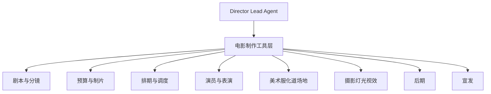
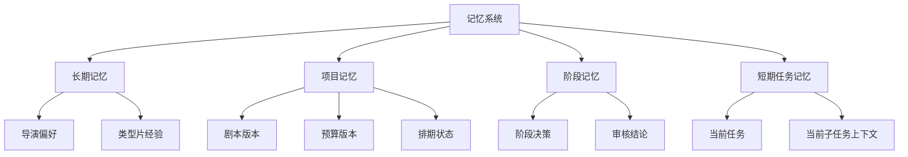
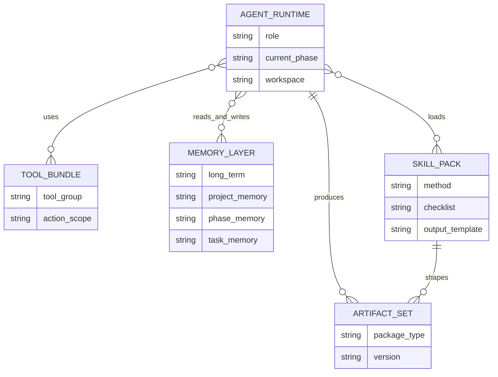

# 07. 工具、记忆、技能：导演智能体真正可用的执行底座

这一篇重点讲三件事：

- 工具层怎么扩展
- 记忆层怎么升级
- 技能层怎么沉淀行业方法论

这三层决定了导演智能体是不是“真的能干活”。

---

## 1. 工具层：从通用工具升级到电影制作工具

当前 DeerFlow 的工具层已经支持：

- 文件读写
- 命令执行
- 搜索
- MCP 工具接入

但电影制作需要的是行业工具。

---

## 2. 推荐的电影制作工具组

## 2.1 剧本与分镜工具

- `parse_script`
- `extract_scenes`
- `extract_characters`
- `generate_beat_sheet`
- `generate_shot_list`
- `generate_storyboard_prompt`
- `generate_dialogue_variants`
- `scene_continuity_check`

### 作用
把剧本转成结构化创作资产。

---

## 2.2 预算与制片工具

- `build_budget_sheet`
- `estimate_scene_cost`
- `compare_budget_versions`
- `track_actual_costs`
- `detect_budget_risk`
- `generate_procurement_list`

### 作用
把预算从静态表格变成可分析、可预警的对象。

---

## 2.3 排期与调度工具

- `build_shooting_schedule`
- `optimize_shooting_order`
- `generate_call_sheet`
- `detect_schedule_conflicts`
- `reschedule_by_weather_or_actor`
- `resource_allocation_check`

### 作用
支撑中期拍摄执行与调度。

---

## 2.4 演员与表演工具

- `role_cast_match`
- `actor_availability_check`
- `performance_note_generator`
- `dialogue_tone_adjuster`

### 作用
支撑选角与表演指导。

---

## 2.5 美术 / 服化道 / 场地工具

- `location_match`
- `costume_breakdown`
- `props_breakdown`
- `art_direction_brief`
- `continuity_asset_check`

### 作用
支撑前期筹备与现场连续性管理。

---

## 2.6 摄影 / 灯光 / 视效工具

- `camera_plan_generator`
- `lighting_plan_generator`
- `vfx_shot_flagger`
- `previs_prompt_generator`
- `lens_language_recommender`

### 作用
支撑镜头语言与技术执行。

---

## 2.7 后期工具

- `edit_version_compare`
- `adr_task_generator`
- `music_brief_generator`
- `sound_design_brief`
- `color_grade_brief`
- `review_note_aggregator`

### 作用
支撑后期版本管理与审核。

---

## 2.8 宣发工具

- `trailer_cut_brief`
- `poster_prompt_generator`
- `campaign_calendar_generator`
- `audience_positioning_analysis`

### 作用
支撑交付后的市场传播。

---

## 3. 一张工具层结构图

---

## 4. 记忆层：从聊天记忆升级成项目记忆

当前 DeerFlow 已经有 MemoryMiddleware，这意味着系统已经有记忆插槽。

但电影制作需要的不是普通聊天记忆，而是项目级记忆。

---

## 5. 推荐的记忆分层

## 5.1 长期记忆

记录长期稳定偏好，例如：

- 导演风格偏好
- 常用镜头语言
- 常用合作班底
- 常见类型片经验
- 常用预算策略

## 5.2 项目记忆

记录当前项目的稳定事实，例如：

- 项目类型
- 当前剧本版本
- 当前预算版本
- 当前排期版本
- 已确认演员
- 已确认场地
- 当前风格方向

## 5.3 阶段记忆

记录当前阶段的关键决策，例如：

- 前期已确认的分镜方向
- 中期已发生的延误与调整
- 后期已通过的审核意见

## 5.4 短期任务记忆

记录当前会话与当前子任务上下文。

---

## 6. 一张记忆层结构图

---

## 7. 技能层：把行业方法论沉淀成 Skills

当前 DeerFlow 已经支持 skills 注入 prompt。

这非常适合把电影制作知识做成可复用能力包。

---

## 8. 推荐的电影制作 Skills

- `sci-fi-directing`
- `commercial-directing`
- `action-choreography`
- `dialogue-polish`
- `storyboard-design`
- `cinematography-language`
- `vfx-previs`
- `post-production-supervision`
- `budget-control`
- `shooting-schedule-optimization`

### 每个 Skill 建议包含
- 适用场景
- 工作方法
- 检查清单
- 输出模板
- 常见错误
- 提示词模板

---

## 9. 为什么工具、记忆、技能必须一起设计

如果只有工具，没有技能：
- 系统会调用工具，但不知道行业方法论

如果只有技能，没有记忆：
- 系统知道方法，但记不住项目状态

如果只有记忆，没有工具：
- 系统知道项目事实，但无法执行动作

所以三者必须一起设计。

---

## 10. 与当前 DeerFlow 的结合方式

### 工具层
在现有 `get_available_tools()` 体系上增加电影制作工具组。

### 记忆层
在现有 MemoryMiddleware 基础上，把记忆内容从通用对话升级成项目语义。

### 技能层
沿用现有 skills 机制，把电影制作方法论拆成独立 skill 包。

---

## 11. 这一篇最重要的结论

### 结论一
工具层决定系统能不能做事。

### 结论二
记忆层决定系统能不能持续做事。

### 结论三
技能层决定系统能不能专业地做事。

### 结论四
当前 DeerFlow 已经具备这三层的基础插槽，最重要的是做电影制作语义化扩展。

---

## 12. 下一步建议阅读

建议继续看：

- [08-roadmap.md](./08-roadmap.md)

---

<!-- movie-visuals:start -->
## 补充图示：换一种视角看本篇

下面这张关系图把工具、记忆、技能和运行时放进同一个结构里，更能解释这篇为什么一直强调三者必须一起设计，而不是零散补能力。

<!-- movie-visuals:end -->

<!-- movie-doc-nav:start -->
## 文档导航

- 总入口：[README.md](./README.md)
- 阅读地图：[00-reading-map.md](./00-reading-map.md)
- 所在分组：00-08 总览与核心框架
- 上一篇：[06. 数据模型：如何把电影制作从对话变成可管理项目](./06-data-models.md)
- 下一篇：[08. 落地路线：如何分阶段把 DeerFlow 改造成导演智能体平台](./08-roadmap.md)

### 同组文档
- [00. 阅读地图：如何系统阅读 `docs/movie`](./00-reading-map.md)
- [01. 总览：什么是面向电影制作的导演智能体](./01-overview.md)
- [02. 当前项目能力映射：DeerFlow 如何承接导演智能体](./02-current-project-mapping.md)
- [03. 目标架构：如何把 DeerFlow 演进成导演智能体系统](./03-target-architecture.md)
- [04. 阶段工作流：前期、中期、后期如何被导演智能体接管](./04-production-phases.md)
- [05. Agent 体系：导演、制片、摄影、后期如何组织成多智能体系统](./05-agent-system.md)
- [06. 数据模型：如何把电影制作从对话变成可管理项目](./06-data-models.md)
- 07. 工具、记忆、技能：导演智能体真正可用的执行底座（当前）
- [08. 落地路线：如何分阶段把 DeerFlow 改造成导演智能体平台](./08-roadmap.md)
<!-- movie-doc-nav:end -->
