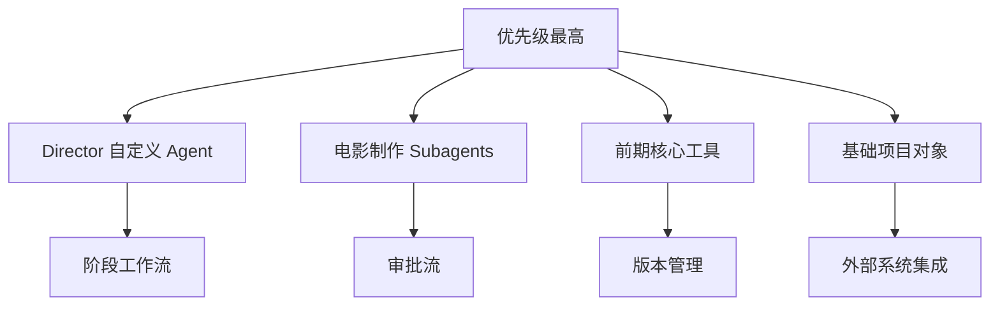

# 08. 落地路线：如何分阶段把 DeerFlow 改造成导演智能体平台

这一篇重点讲实施路线。

目标不是一次性做成一个庞大系统，而是分阶段落地，逐步验证价值。

---

## 1. 为什么必须分阶段实施

如果一开始就试图同时做：

- 前期创作
- 中期调度
- 后期版本管理
- 审批流
- 资产系统
- 外部系统集成

项目会非常重，而且很难验证哪一部分真正有价值。

所以更合理的方式是：

- 先做最有价值的 MVP
- 再逐步扩展到完整电影制作流程

---

## 2. 推荐的四阶段路线

---

## 3. Phase 1：前期导演智能体 MVP

### 目标
先让系统在前期具备明确价值。

### 范围
聚焦：

- 剧本分析
- 风格参考
- 对白设计
- 文字分镜
- 概念图提示词
- 初步预算
- 初步排期
- 演员 / 场地建议

### 推荐 Agent
- director
- script-analyst
- producer
- budget
- storyboard
- style-research

### 推荐工具
- parse_script
- extract_scenes
- extract_characters
- generate_shot_list
- generate_storyboard_prompt
- build_budget_sheet
- build_shooting_schedule
- audience_positioning_analysis

### 推荐数据对象
- Project
- Script
- Scene
- Character
- Budget
- Schedule
- Location

### 成功标准
系统能从剧本出发，产出一套前期方案包。

---

## 4. Phase 2：拍摄执行中台

### 目标
让系统从“前期规划”进入“中期执行”。

### 范围
聚焦：

- 每日拍摄计划
- 助理导演调度
- 成本控制
- 进度控制
- 日素材审核
- 补拍建议

### 推荐 Agent
- assistant-director
- scheduling
- cost-control
- cinematography
- lighting
- vfx-supervisor
- daily-review

### 推荐工具
- generate_call_sheet
- detect_schedule_conflicts
- reschedule_by_weather_or_actor
- track_actual_costs
- detect_budget_risk
- review_note_aggregator

### 推荐数据对象
- ShootingDay
- ResourceAllocation
- DailyReport
- CostReport
- Review

### 成功标准
系统能支持每日拍摄执行与偏差控制。

---

## 5. Phase 3：后期与版本管理

### 目标
让系统覆盖后期生产与交付。

### 范围
聚焦：

- 剪辑版本管理
- 配音 / 配乐 / 音效 / 调色协同
- 审核意见汇总
- 最终交付包
- 宣发物料规划

### 推荐 Agent
- editor
- sound-designer
- composer
- colorist
- version-control
- marketing
- retrospective

### 推荐工具
- edit_version_compare
- adr_task_generator
- music_brief_generator
- sound_design_brief
- color_grade_brief
- trailer_cut_brief
- poster_prompt_generator

### 推荐数据对象
- EditVersion
- AudioTask
- ColorTask
- Deliverable
- AssetVersion

### 成功标准
系统能支持后期版本迭代、审核与交付。

---

## 6. Phase 4：行业级导演操作系统

### 目标
面向大规模电影制作与多项目并行。

### 范围
- 多项目并行管理
- 多团队权限体系
- 供应商 / 演员 / 场地数据库
- 财务系统对接
- 法务 / 合同 / 版权流程
- 资产管理系统对接
- 多模态素材理解
- 企业级审计与追踪

### 成功标准
系统从“导演助手”升级成“电影制作 AI 中台”。

---

## 7. 与当前 DeerFlow 代码的落地顺序建议

## 7.1 第一批优先改造点

### 自定义 Agent 配置层
先做 `director` 自定义 agent。

### Subagent 注册层
扩展电影制作角色。

### Tool Groups
增加电影制作工具组。

### Skills
增加电影制作方法论 skills。

### ThreadState / 项目状态
先做 MVP 级扩展。

---

## 7.2 第二批改造点

### 项目对象持久化
把项目对象从运行时状态迁移到独立存储层。

### 阶段状态机
增加阶段推进与退出条件。

### 审批流
增加审核节点与责任链。

### 版本管理
增加资产版本树与差异说明。

---

## 8. 一张实施优先级图

---

## 9. 推荐的 MVP 边界

为了避免项目过重，我建议 MVP 只做：

- 前期
- 少量核心角色
- 少量核心对象
- 少量核心工具

### 不建议一开始就做的内容
- 全量后期系统
- 全量宣发系统
- 全量 ERP / 财务 / 法务集成
- 复杂权限体系
- 多项目并行调度

这些都应该放到后续阶段。

---

## 10. 风险与注意事项

### 风险一：过度依赖 Prompt
如果不做对象模型和流程控制，系统会停留在“会说不会管”。

### 风险二：角色边界不清
如果所有角色都混在一个 agent 里，输出会失控。

### 风险三：没有版本与审批
电影制作是强审核行业，没有版本与审批就无法落地。

### 风险四：MVP 做得过大
如果一开始就覆盖全流程，项目很容易失控。

---

## 11. 这一篇最重要的结论

### 结论一
最合理的路线是：先前期，再中期，再后期，最后企业化。

### 结论二
MVP 应该聚焦前期导演智能体，而不是一开始覆盖整个电影工业流程。

### 结论三
当前 DeerFlow 最适合先承接：

- Director Lead Agent
- 电影制作 Subagents
- 前期核心工具
- 基础项目对象

---

## 12. 最后的建议

如果你准备真正启动这个方向，我建议第一阶段只做一句话目标：

**让系统能够从剧本出发，自动生成一套可讨论、可修订、可落地的前期导演方案包。**

只要这一步做扎实，后面的中期、后期、版本、审批、企业化才有坚实基础。

---

<!-- movie-visuals:start -->
## 补充图示：换一种视角看本篇

下面这张甘特图把四阶段实施路线和代码落地优先级压缩到同一张图里，更接近这篇正文的执行语气: 不是泛泛谈愿景，而是明确每一阶段先做什么、后做什么。

```mermaid
gantt
    title 导演智能体平台的分阶段实施路线
    dateFormat X
    axisFormat %s

    section Phase 1 MVP
    导演LeadAgent与前期角色 :a1, 0, 2
    前期核心对象与工具 :a2, after a1, 2

    section Phase 2 拍摄执行
    CallSheet与日报流 :a3, after a2, 2
    现场调度与成本控制 :a4, after a3, 2

    section Phase 3 后期与版本
    Review与Version系统 :a5, after a4, 2
    交付包与归档链 :a6, after a5, 1

    section Phase 4 行业平台
    多项目治理与企业化 :a7, after a6, 2
```

<!-- movie-visuals:end -->

<!-- movie-doc-nav:start -->
## 文档导航

- 总入口：[README.md](./README.md)
- 阅读地图：[00-reading-map.md](./00-reading-map.md)
- 所在分组：00-08 总览与核心框架
- 上一篇：[07. 工具、记忆、技能：导演智能体真正可用的执行底座](./07-tools-memory-skills.md)
- 下一篇：[09. 源码对照总览：导演智能体方案如何映射到当前仓库](./09-source-mapping-overview.md)

### 同组文档
- [00. 阅读地图：如何系统阅读 `docs/movie`](./00-reading-map.md)
- [01. 总览：什么是面向电影制作的导演智能体](./01-overview.md)
- [02. 当前项目能力映射：DeerFlow 如何承接导演智能体](./02-current-project-mapping.md)
- [03. 目标架构：如何把 DeerFlow 演进成导演智能体系统](./03-target-architecture.md)
- [04. 阶段工作流：前期、中期、后期如何被导演智能体接管](./04-production-phases.md)
- [05. Agent 体系：导演、制片、摄影、后期如何组织成多智能体系统](./05-agent-system.md)
- [06. 数据模型：如何把电影制作从对话变成可管理项目](./06-data-models.md)
- [07. 工具、记忆、技能：导演智能体真正可用的执行底座](./07-tools-memory-skills.md)
- 08. 落地路线：如何分阶段把 DeerFlow 改造成导演智能体平台（当前）
<!-- movie-doc-nav:end -->
