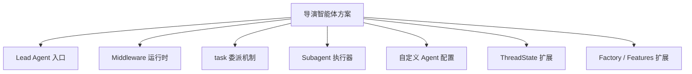

# 09. 源码对照总览：导演智能体方案如何映射到当前仓库

这一篇是“源码对照版文档”的入口。

前面的 01-08 更偏方案设计；这一篇开始，重点回答：

**我们提出的每个导演智能体方案点，在当前 DeerFlow 仓库里分别对应哪些代码入口、哪些运行机制、哪些可扩展点。**

---

## 1. 先给结论

当前仓库并没有“电影导演智能体”的现成实现，但已经具备非常完整的底座，足以承接这个方向。

从源码角度看，最关键的五个支点是：

1. Lead Agent 创建入口
2. Middleware 运行时链
3. `task` 子任务委派机制
4. Subagent 执行器与注册表
5. 自定义 agent / state / factory 扩展点

---

## 2. 方案点与源码入口的总映射

| 方案点 | 当前源码入口 | 当前能力 | 改造方向 |
|------|--------------|----------|----------|
| 总导演智能体 | `agents/lead_agent/agent.py` | 创建主 agent、挂模型/工具/middleware/prompt | 演进成 `director` Lead Agent |
| 部门子智能体 | `tools/builtins/task_tool.py` + `subagents/executor.py` | 主 agent 委派子任务，子 agent 独立执行 | 扩展成制片、摄影、后期等角色 |
| 子智能体注册 | `subagents/registry.py` + `subagents/config.py` | 子智能体配置、模型/超时/轮数覆盖 | 扩展电影制作角色注册表 |
| 自定义 agent | `config/agents_config.py` + `tools/builtins/setup_agent_tool.py` | 支持 agent config 与 SOUL | 新增 `director`、`producer` 等 agent |
| 项目状态 | `agents/thread_state.py` | 通用线程状态 | 扩展为电影项目状态 |
| 运行时装配 | `agents/factory.py` | 通过 features 组装 agent | 为电影制作场景提供专用工厂 |
| 计划与阶段执行 | `lead_agent/agent.py` 中 middleware + Todo | 支持 plan mode、memory、title、subagent limit | 演进成阶段工作流执行层 |

---

## 3. 总导演智能体对应哪里

当前主入口在 `make_lead_agent(config)`。

它会：

- 读取 `agent_name`
- 读取 `model_name`
- 读取 `subagent_enabled`
- 读取 `is_plan_mode`
- 加载 agent config
- 组装工具、middleware、prompt
- 创建主 agent

这意味着：

**当前仓库已经有“总导演智能体”的天然挂载点。**

后续只需要把 `agent_name=director` 的配置补齐，就能先做出导演主智能体。

---

## 4. 部门子智能体对应哪里

当前 `task` 工具负责把复杂任务委派给子智能体，`SubagentExecutor` 负责真正执行。

这意味着：

- 导演 -> 制片
- 导演 -> 分镜
- 导演 -> 摄影
- 导演 -> 后期

这些关系都可以直接映射到现有委派链路。

也就是说，电影制作的“组织结构”并不需要从零发明，当前仓库已经有主从式多智能体骨架。

---

## 5. 项目对象层对应哪里

当前 `ThreadState` 还只是通用状态容器，字段包括：

- sandbox
- thread_data
- title
- artifacts
- todos
- uploaded_files
- viewed_images

这说明：

- 当前系统已经有状态容器
- 但还没有电影项目对象语义

所以电影制作改造的关键，不是重写 agent，而是把状态层升级成项目对象层。

---

## 6. 运行时治理对应哪里

当前主 agent 的 middleware 链已经支持：

- ThreadData
- Uploads
- Sandbox
- Summarization
- Todo
- Title
- Memory
- ViewImage
- SubagentLimit
- LoopDetection
- Clarification

这说明：

- 当前系统已经有运行时治理能力
- 电影制作阶段工作流可以建立在这条链上

例如：

- Todo 可承接阶段任务清单
- Memory 可承接项目记忆
- SubagentLimit 可承接部门并发控制
- Sandbox 可承接项目资产工作区

---

## 7. 自定义 agent 与设计稿的关系

当前仓库已经支持：

- `config.yaml`
- `SOUL.md`
- `tool_groups`
- `skills`
- `model`

这意味着体系化设计稿里提到的：

- `director`
- `producer`
- `storyboard`
- `budget`

都可以先通过自定义 agent 机制落地，而不必先改底层。

---

## 8. 这一组源码对照文档怎么读

建议按下面顺序阅读：

1. [09-source-mapping-overview.md](./09-source-mapping-overview.md)
2. [10-source-mapping-agent-runtime.md](./10-source-mapping-agent-runtime.md)
3. [11-source-mapping-subagents.md](./11-source-mapping-subagents.md)
4. [12-source-mapping-state-and-config.md](./12-source-mapping-state-and-config.md)
5. [13-system-blueprint.md](./13-system-blueprint.md)
6. [14-implementation-draft.md](./14-implementation-draft.md)

---

## 9. 这一篇最重要的结论

### 结论一
当前仓库已经具备导演智能体的运行时底座。

### 结论二
真正需要新增的重点不是“再造一个 agent 框架”，而是：

- 电影项目对象
- 电影角色注册
- 电影工具层
- 阶段工作流与审批流

### 结论三
源码对照版文档的价值，在于把“方案”直接落到“当前仓库的可改造位置”。

---

---

<!-- movie-doc-nav:start -->
## 文档导航

- 总入口：[README.md](./README.md)
- 阅读地图：[00-reading-map.md](./00-reading-map.md)
- 所在分组：09-19 源码映射与实施草案
- 上一篇：[08. 落地路线：如何分阶段把 DeerFlow 改造成导演智能体平台](./08-roadmap.md)
- 下一篇：[10. 源码对照：主智能体与运行时链如何承接导演智能体](./10-source-mapping-agent-runtime.md)

### 同组文档
- 09. 源码对照总览：导演智能体方案如何映射到当前仓库（当前）
- [10. 源码对照：主智能体与运行时链如何承接导演智能体](./10-source-mapping-agent-runtime.md)
- [11. 源码对照：子智能体、委派机制与电影部门角色如何落地](./11-source-mapping-subagents.md)
- [12. 源码对照：状态、配置与工厂扩展如何承接电影项目系统](./12-source-mapping-state-and-config.md)
- [13. 体系化设计稿：导演智能体平台系统蓝图](./13-system-blueprint.md)
- [14. 实施设计稿：从当前仓库出发的具体改造草案](./14-implementation-draft.md)
- [15A. 代码级设计草案：导演智能体第一批代码改造方案](./15-a-code-design-draft.md)
- [16B. 接口与数据结构草案：导演智能体的对象、状态与契约设计](./16-b-interfaces-and-data-contracts.md)
- [17C. 第一版代码落地方案：从文档走向最小可实现代码](./17-c-first-code-drop-plan.md)
- [18. 方案1细稿：可直接开发的 Markdown 细稿集合](./18-solution-1-detailed-md-drafts.md)
- [19. 方案2细稿：最小 MVP 代码实现路径与模块关系图](./19-solution-2-mvp-implementation-path.md)
<!-- movie-doc-nav:end -->
