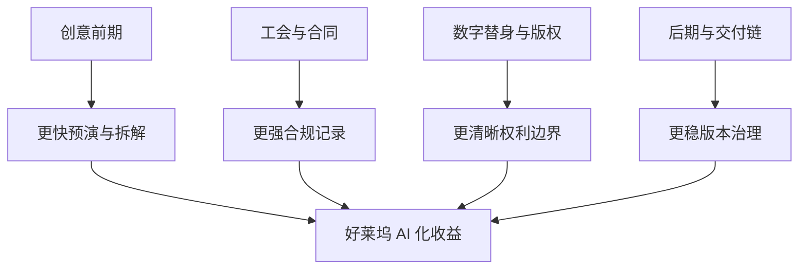
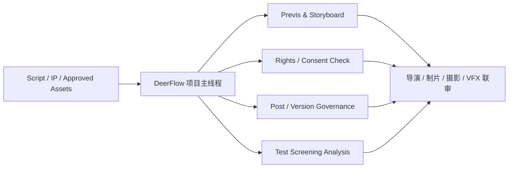

# 100. DeerFlow 在好莱坞电影制作 AI 化中的收益地图

这一篇聚焦：

**好莱坞在 2026 年面临的不是“能不能上 AI”，而是“如何在工会、版权、数字替身、后期工业链和高预算风控约束下，把 AI 安全地接入正式生产”。DeerFlow 的优势，正是在这种高治理密度环境里最明显。**

---

## 1. 好莱坞的 AI 化不是中国式“先跑起来再补规则”，而是“规则和应用同时推进”

WGA 2023 协议、SAG-AFTRA 2023 电视与院线合同的 AI 约束，以及 2025-2026 继续推进的数字替身保护、NO FAKES 法案讨论，已经把好莱坞的 AI 使用边界推到了非常明确的位置：

- 写作与脚本相关使用有明确边界
- 数字替身、肖像与声音复制需要明确同意与补偿机制
- 平台和片方必须面对更高透明度要求

这意味着在好莱坞环境里，最不缺的是模型入口，最缺的是：

- 可以留下正式记录的流程系统

---

## 2. 为什么 DeerFlow 在好莱坞语境下会更有价值

因为 DeerFlow 解决的，正是好莱坞最在意的五类问题：

1. 谁发起了 AI 调用
2. 这个调用基于什么素材
3. 产出是否进入正式版本链
4. 是否触及演员、编剧、版权与数字替身边界
5. 谁审批、谁确认、谁归档

这些问题如果没有系统，团队只能靠：

- 邮件
- Slack
- Google Docs
- 本地命名规范
- 人工记忆

这在高预算片场几乎一定会失控。

---

## 3. 一张图：好莱坞环境里 DeerFlow 的收益结构

---

## 4. DeerFlow 对好莱坞最实际的四个落点

### 4.1 前期预演与多部门对齐

好莱坞大片在 AI 上最容易产生短期价值的地方，不是最终正片镜头，而是：

- 剧本拆解
- storyboard / previs
- location / production design 比较
- VFX 复杂度预测

DeerFlow 可以让这些产出：

- 进入同一个项目线程
- 进入可审批工单
- 进入正式版本链

### 4.2 数字替身与受保护素材治理

一旦项目涉及：

- 演员肖像
- 声音复制
- 训练素材
- 已拍素材再生成

系统必须能回答：

- 是否取得同意
- 素材来自哪里
- 使用目的是什么
- 是否超出授权范围

DeerFlow 的对象体系和审批链，在这里比“模型演示能力”更重要。

### 4.3 后期版本与交付追踪

Hollywood pipeline 最大的现实问题之一，是版本和交付链极长。  
尤其当 AI 开始进入：

- temp comp
- cleanup
- search
- generative extend
- marketing localization

如果没有统一状态系统，团队很快会分不清：

- 哪版可用于试映
- 哪版只是临时 AI 草稿
- 哪版已进入正式交付范围

### 4.4 试映反馈与结构性分析

好莱坞很擅长 test screening，但问题往往是：

- 反馈量大
- 情绪化表述多
- 结构问题难归因

DeerFlow 可以把观众、发行、测试团队、内部评审的反馈转成结构化议题：

- 节奏
- 人物理解
- 信息过载
- 情感落点
- 市场定位

---

## 5. 一个非常现实的收益点：DeerFlow 让“AI 可以用”变成“AI 可审计”

很多平台都能帮助生成内容，但好莱坞更看重的是：

- 这件事出了问题能不能追责
- 发生争议时有没有链路记录

DeerFlow 在这里的价值，可以概括成一句话：

**把创意工具变成可审计生产流程。**

这在涉及工会、保险、交付和法务时，价值会非常高。

---

## 6. 一张流程图：DeerFlow 如何进入好莱坞项目主链

---

## 7. 一个试点测算模型：DeerFlow 在好莱坞项目中的收益怎样被量化

下面不是行业公开统计，而是基于 2026 电影工作流变化给出的**试点测算框架**，用于评估平台价值。

| 指标 | 没有 DeerFlow 时的典型问题 | 有 DeerFlow 后可观察的改善方向 |
|------|----------------------------|--------------------------------|
| Previs 决策周期 | 分散在不同工具和会议里 | 缩短 20%-40% 的前期对齐时间 |
| 版本检索时间 | 文件夹和消息链中反复确认 | 下降 50% 以上的定位时间 |
| AI 使用留痕率 | 依赖手工记录 | 接近 100% 的工单和审批留痕 |
| 风险暴露时点 | 很多问题到后期才暴露 | 向前移动到前期与中期 |
| 试映意见整理时间 | 人工归类慢 | 可压缩到原先的一小部分 |

这里最重要的不是“绝对节省多少美元”，而是：

- 高预算项目对错误极度敏感
- 只要减少一次重大返工，就足以证明平台价值

---

## 8. 对好莱坞来说，DeerFlow 的核心卖点不是便宜，而是稳

这点很关键。  
如果用太互联网式的思维讲 AI，好莱坞往往不会买账，因为他们更在意：

- 风险
- 责任
- 可追责
- 工会关系
- 法务边界

所以 DeerFlow 的卖点应该被表述成：

- 让 AI 更安全地进入 studio-grade pipeline

而不是：

- 让某个岗位少几个人

---

## 9. 核心结论

在好莱坞环境里，DeerFlow 的真正价值可以归纳为三句话：

1. 让 AI 前期探索进入正式生产链
2. 让数字替身、版权与工会边界可记录、可审批、可追踪
3. 让后期、版本和试映反馈不再被碎片化工具拖垮

因此，好莱坞最需要的不是“一个更会生成的模型”，而是一个能把模型使用变成正式 studio workflow 的系统。  
这正是 DeerFlow 最容易站住的位置。

---

## 参考资料

- [WGA 2023 Theatrical and Television Basic Agreement MOA](https://www.wgacontract2023.org/wgacontract/files/memorandum-of-agreement-for-the-2023-wga-theatrical-and-television-basic-agreement.pdf)
- [SAG-AFTRA AI Resources](https://www.sagaftra.org/contracts-industry-resources/contracts/2023-tvtheatrical-contracts/artificial-intelligence-resources)
- [SAG-AFTRA on NO FAKES Act reintroduction](https://www.sagaftra.org/sag-aftra-leaders-take-capitol-hill-no-fakes-act-reintroduction)
- [SAG-AFTRA on California digital replica protections](https://www.sagaftra.org/sag-aftra-applauds-gov-newsom-enhancing-protections-against-nonconsensual-digital-replicas)
- [Netflix: Why InterPositive is joining Netflix](https://about.netflix.com/news/why-interpositive-is-joining-netflix)
- [Adobe: AI innovations in professional post-production](https://news.adobe.com/news/2025/04/new-ai-innovation-in-industry)
- [Runway: Gen-4](https://runwayml.com/research/introducing-runway-gen-4)

---

---

<!-- movie-doc-nav:start -->
## 文档导航

- 总入口：[README.md](./README.md)
- 阅读地图：[00-reading-map.md](./00-reading-map.md)
- 所在分组：91-102 行业趋势、导演案例与收益分析
- 上一篇：[99. DeerFlow 作为 2026 电影 AI 操作系统的总体收益框架](./99-deerflow-ai-film-operating-system-overview.md)
- 下一篇：[101. DeerFlow 在中国电影制作 AI 化中的收益地图](./101-deerflow-benefit-map-for-china-film.md)

### 同组文档
- [91. 2026 模型版图与电影 AI 技术栈](./91-2026-model-landscape-and-film-ai-stack.md)
- [92. 2026 好莱坞电影制作 AI 化趋势](./92-hollywood-ai-film-production-trends-2026.md)
- [93. 2026 中国电影制作 AI 化趋势](./93-china-film-ai-production-trends-2026.md)
- [94. 导演案例：Christopher Nolan 在 AI 时代的工作法重构](./94-director-case-christopher-nolan.md)
- [95. 导演案例：James Cameron 在 AI 时代的系统工程电影观](./95-director-case-james-cameron.md)
- [96. 导演案例：Denis Villeneuve 在 AI 时代如何守住“存在感”](./96-director-case-denis-villeneuve.md)
- [97. 导演案例：张艺谋与中国电影作者工业化的 AI 路径](./97-director-case-zhang-yimou.md)
- [98. 导演案例：郭帆与中国科幻工业化的 AI 操作系统](./98-director-case-guo-fan.md)
- [99. DeerFlow 作为 2026 电影 AI 操作系统的总体收益框架](./99-deerflow-ai-film-operating-system-overview.md)
- 100. DeerFlow 在好莱坞电影制作 AI 化中的收益地图（当前）
- [101. DeerFlow 在中国电影制作 AI 化中的收益地图](./101-deerflow-benefit-map-for-china-film.md)
- [102. DeerFlow 在 2026-2027 电影行业中的 ROI、治理与落地路线图](./102-deerflow-roi-governance-and-adoption-roadmap-2026.md)
<!-- movie-doc-nav:end -->
