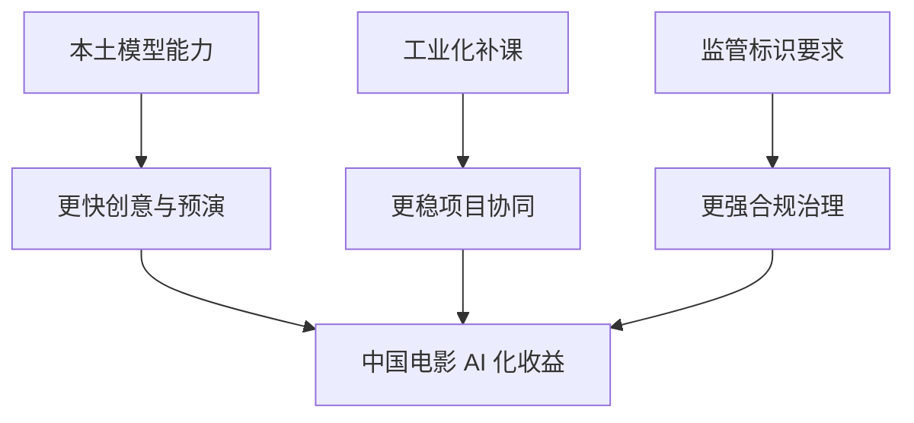
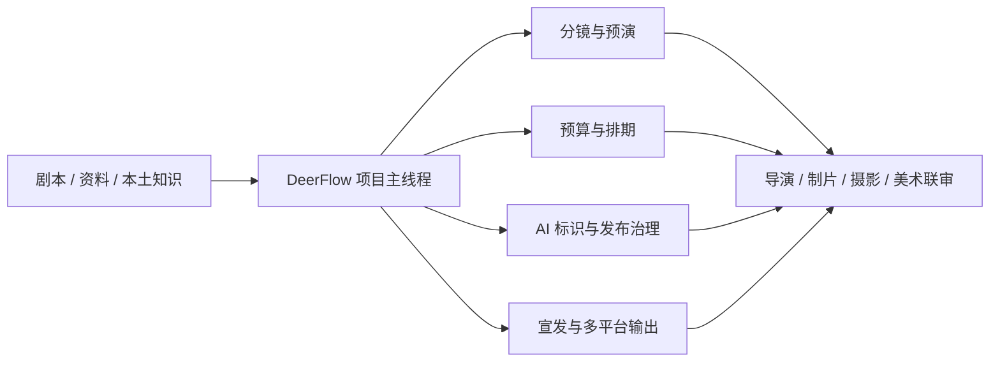
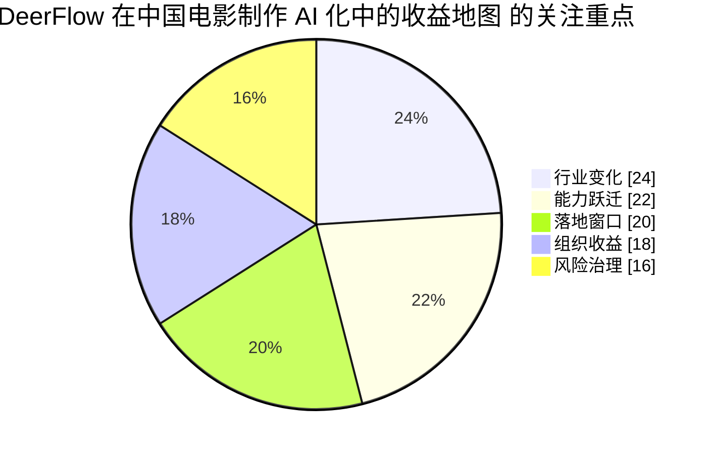

# 101. DeerFlow 在中国电影制作 AI 化中的收益地图

这一篇聚焦：

**中国电影在 2026 年面对的局面非常独特：本土模型快速成熟、AIGC 内容试验加速、电影工业化仍在补课、监管对 AI 标识要求已经落地。DeerFlow 的价值，不是简单提高生成效率，而是帮助中国电影把“AI 工具热”升级为“正式生产能力”。**

---

## 1. 中国电影的 AI 化，为什么和好莱坞不是同一道题

中国电影在 2026 年的 AI 化有四个同时发生的变量：

- 本土模型能力快速成熟
- 短剧、动画、概念片先行试验
- 科幻和重工业项目开始系统接入
- 标识与传播规则正式落地

这意味着中国电影面对的不是“要不要上 AI”，而是：

- 如何在工业化还未完全成熟的同时，把 AI 纳入主链

这其实比好莱坞更复杂，也更有跃迁机会。

---

## 2. 为什么 DeerFlow 在中国环境里会特别有价值

因为中国项目往往同时存在三类现实约束：

### 2.1 时间紧

- 档期压力大
- 项目节奏快
- 决策窗口短

### 2.2 组织混合

- 既有成熟工业团队
- 也有大量项目制、外包制、基地协作与供应商协作

### 2.3 合规开始变硬

CAC 2025 的《人工智能生成合成内容标识办法》已经把显式标识、隐式标识、元数据与传播平台责任说得很清楚。  
这意味着 AI 不再能以“临时试验素材”的名义无痕混入流程。

DeerFlow 恰好能同时处理：

- 效率问题
- 组织问题
- 治理问题

---

## 3. 一张图：中国电影环境里 DeerFlow 的价值闭环

---

## 4. DeerFlow 在中国电影里最现实的五个收益点

### 4.1 本土多模型统一接入

中国团队很可能会同时接触：

- OpenAI / Gemini 等推理与全球路线能力
- Seedance 2.0 / HappyHorse-1.0 / Kling / Hailuo / Hunyuan 等国内视频路线
- Adobe / 剪辑平台 / 本地插件

如果没有 DeerFlow，这些能力很容易变成分散工具。  
有了 DeerFlow，就可以按项目阶段路由模型，而不是按个人喜好使用模型。

而且到了 2026 年，这已经不只是“多模型”问题，也是“模型更替太快”问题：

- Seedance 2.0 把中国视频模型能力上限推高
- HappyHorse-1.0 又说明新竞争者可能突然进入前排
- Sora 2 的停运则提醒团队，海外消费级入口未必会长期稳定存在

因此 DeerFlow 在中国环境里的价值，还包括：

- 建立 model registry
- 做模型 AB 路由
- 做供应商 fallback
- 做产品退场迁移

### 4.2 前期工业化加速

对中国电影而言，AI 最容易直接带来价值的地方包括：

- 剧本拆解
- 场景复杂度标注
- 分镜和风格探索
- 预算与排期辅助
- 大场面预演

很多以前靠总制片、执行制片和助手反复拉表的工作，都可以被前移并结构化。

### 4.3 监管与发布链治理

中国环境与好莱坞最大的差异之一，是 AI 标识要求已经形成明确的发布责任链。

DeerFlow 可以把：

- 内容来源
- 是否 AI 生成
- 是否含显式标识
- 文件元数据状态
- 发布平台声明

全部纳入对象和工单。

这意味着平台天然更适合服务中国环境。

### 4.4 中国题材本地化知识组织

无论是历史题材、国风奇幻，还是中国科幻，本地知识都极其重要。  
DeerFlow 的强项在于，不只是让模型“会说中文”，而是让：

- 资料
- 世界观
- 风格说明
- 审核意见
- 版本差异

形成正式项目知识层。

### 4.5 经验沉淀与组织复制

中国电影长期有一个问题：

- 每个项目像一次性搭班子
- 经验很难沉淀成组织资产

DeerFlow 如果把 AI 工作流做成对象化系统，就能把：

- 试点经验
- 供应商协作方式
- 工具使用规范
- 标识与审校流程

复制到下一部片子。

---

## 5. 一张流程图：DeerFlow 在中国电影项目中的典型部署

---

## 6. 一个中国式收益测算模型

下面是一个**试点测算框架**，不是行业普适统计，而是用于帮助团队评估 DeerFlow 的投入产出。

| 指标 | 中国电影项目的典型痛点 | DeerFlow + AI 的改善方向 |
|------|------------------------|---------------------------|
| 前期准备周期 | 资料、分镜、预算、排期经常串联较晚 | 有机会缩短 20%-35% 的前期准备时间 |
| 沟通轮次 | 大量靠会议、微信群、临时文件推进 | 用线程化与对象化降低沟通噪声 |
| 问题暴露时点 | 冲突经常在开机后暴露 | 通过预演和任务拆解前移风险 |
| 宣发物料生产 | 节奏快且版本多 | 通过模板化和版本治理提升稳定性 |
| 合规留痕 | AI 素材来源与标识容易混乱 | 实现接近完整的链路记录 |

对中国市场来说，最有价值的不是“每个镜头节省多少”，而是：

- 把原本非常依赖人海战术与救火式管理的流程，转成更稳定的系统化流程

---

## 7. DeerFlow 对中国电影尤其重要的一点：它能把“局部试验”变成“平台能力”

中国电影现在很容易出现一种现象：

- 某个团队会用某个模型
- 某个导演会用某个工作流
- 但这些能力无法组织化复用

DeerFlow 的意义就在于：

- 把个人技巧提升为组织流程

这对中国电影工业化而言，比单次创作效果更重要。

---

## 8. 一个很具体的战略判断

如果说好莱坞更适合把 DeerFlow 卖成：

- studio-grade governance system

那么在中国，更适合把 DeerFlow 卖成：

- AI 时代的电影项目操作系统

因为中国团队最能感知到的痛点，是：

- 人多、文件多、变化快、标准不稳、协作碎

DeerFlow 恰好能把这些问题一起处理。

---

## 9. 核心结论

在中国电影环境里，DeerFlow 的价值不应只被理解为“接入了多少模型”，而应该被理解为：

- 让本土多模型真正进入项目主链
- 让工业化与 AI 化一起推进
- 让标识、发布、合规与知识沉淀形成闭环

换句话说，DeerFlow 最适合服务的不是某一个模型爆款时刻，而是中国电影未来几年持续的系统升级。

---

## 参考资料

- [CAC：人工智能生成合成内容标识办法](https://www.cac.gov.cn/2025-03/14/c_1743654684782215.htm)
- [快手 Kling 2.0](https://ir.kuaishou.com/zh-hans/news-releases/news-release-details/kling-ai-advances-20-era-empowering-everyone-tell-great-stories)
- [快手 Kling 3.0](https://ir.kuaishou.com/news-releases/news-release-details/kling-ai-launches-30-model-ushering-era-where-everyone-can-be/)
- [字节 Seed：Official launch of Seedance 2.0](https://seed.bytedance.com/en/blog/official-launch-of-seedance-2-0)
- [Caixin Global：Alibaba unveils HappyHorse](https://www.caixinglobal.com/2026-04-10/alibaba-unveils-happyhorse-after-ai-model-tops-video-rankings-under-alias-102432775.html)
- [OpenAI Help Center：What to know about the Sora discontinuation](https://help.openai.com/zh-hant/articles/20001152-what-to-know-about-the-sora-discontinuation)
- [MiniMax Hailuo 02](https://www.minimax.io/news/minimax-hailuo-02)
- [MiniMax Hailuo 2.3](https://www.minimax.io/news/minimax-hailuo-23)
- [Tencent HunyuanVideo](https://github.com/Tencent-Hunyuan/HunyuanVideo)
- [新华网：AIGC 电影走进院线](https://www.news.cn/ent/20250627/21088f7761404e2486fcd398c8e9893c/c.html)
- [中国日报：AI 视听产业论坛报道](https://caijing.chinadaily.com.cn/a/202503/31/WS67ea3320a31008317a2af846.html)
- [新华网：2026 中国电影市场新消费与“电影+科技”观察](https://big5.news.cn/gate/big5/www.xinhuanet.com/ent/20260104/6a00a154295b4a46b25ecfcb9f1ab354/c.html)

---

<!-- movie-visuals:start -->
## 补充图示：换一种视角看本篇

下面这张 占比图 把“DeerFlow 在中国电影制作 AI 化中的收益地图”再压缩成一个可快速扫读的结构视图，便于先抓关键关系，再回到正文细节。

<!-- movie-visuals:end -->

<!-- movie-doc-nav:start -->
## 文档导航

- 总入口：[README.md](./README.md)
- 阅读地图：[00-reading-map.md](./00-reading-map.md)
- 所在分组：91-102 行业趋势、导演案例与收益分析
- 上一篇：[100. DeerFlow 在好莱坞电影制作 AI 化中的收益地图](./100-deerflow-benefit-map-for-hollywood.md)
- 下一篇：[102. DeerFlow 在 2026-2027 电影行业中的 ROI、治理与落地路线图](./102-deerflow-roi-governance-and-adoption-roadmap-2026.md)

### 同组文档
- [91. 2026 模型版图与电影 AI 技术栈](./91-2026-model-landscape-and-film-ai-stack.md)
- [92. 2026 好莱坞电影制作 AI 化趋势](./92-hollywood-ai-film-production-trends-2026.md)
- [93. 2026 中国电影制作 AI 化趋势](./93-china-film-ai-production-trends-2026.md)
- [94. 导演案例：Christopher Nolan 在 AI 时代的工作法重构](./94-director-case-christopher-nolan.md)
- [95. 导演案例：James Cameron 在 AI 时代的系统工程电影观](./95-director-case-james-cameron.md)
- [96. 导演案例：Denis Villeneuve 在 AI 时代如何守住“存在感”](./96-director-case-denis-villeneuve.md)
- [97. 导演案例：张艺谋与中国电影作者工业化的 AI 路径](./97-director-case-zhang-yimou.md)
- [98. 导演案例：郭帆与中国科幻工业化的 AI 操作系统](./98-director-case-guo-fan.md)
- [99. DeerFlow 作为 2026 电影 AI 操作系统的总体收益框架](./99-deerflow-ai-film-operating-system-overview.md)
- [100. DeerFlow 在好莱坞电影制作 AI 化中的收益地图](./100-deerflow-benefit-map-for-hollywood.md)
- 101. DeerFlow 在中国电影制作 AI 化中的收益地图（当前）
- [102. DeerFlow 在 2026-2027 电影行业中的 ROI、治理与落地路线图](./102-deerflow-roi-governance-and-adoption-roadmap-2026.md)
<!-- movie-doc-nav:end -->
