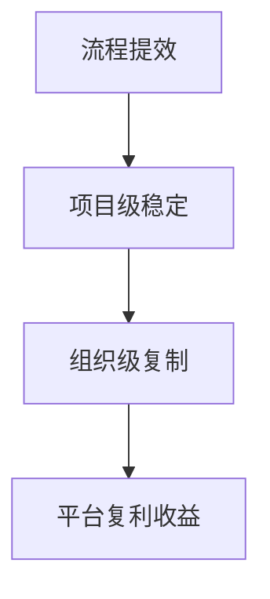
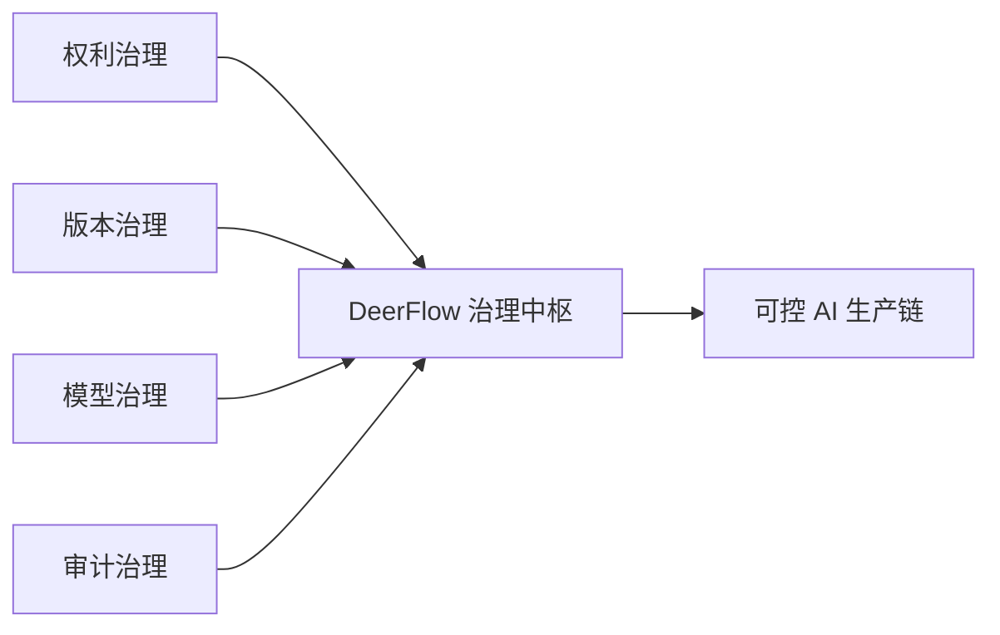
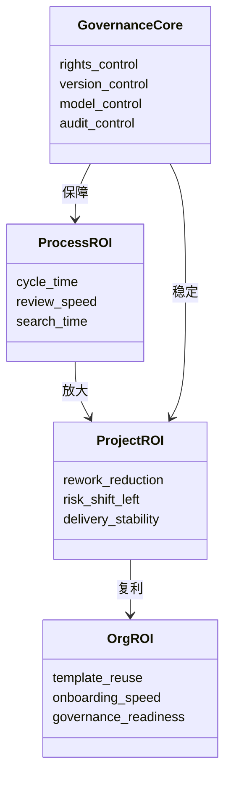
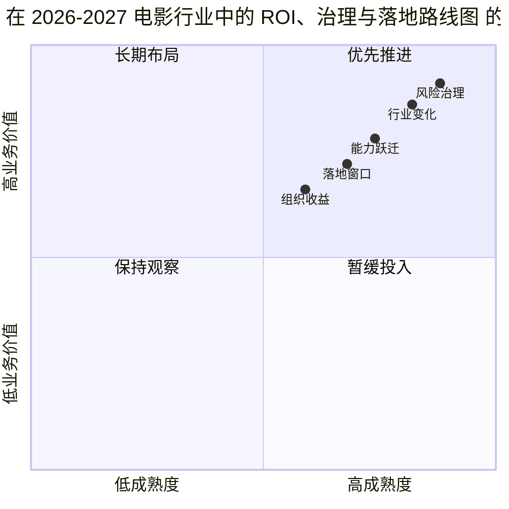

# 102. DeerFlow 在 2026-2027 电影行业中的 ROI、治理与落地路线图

这一篇聚焦：

**电影行业对 AI 的真正问题不是“能不能用”，而是“怎么安全地用、怎么持续地产生回报、怎么从一个试点长成组织能力”。DeerFlow 如果要走入好莱坞与中国电影，必须同时给出 ROI 逻辑、治理结构和分阶段落地路径。**

---

## 1. 为什么只讲“效率提升”远远不够

电影行业和普通互联网业务最大的不同之一，是：

- 错误成本极高
- 决策链长
- 创作权边界敏感
- 后期返工代价巨大

因此，电影行业对 AI 的 ROI 不能只算：

- 某个岗位节省了多少小时

更应该算：

- 是否减少了高成本返工
- 是否让风险更早暴露
- 是否让审批更稳
- 是否让经验能复用到下一部项目

所以，DeerFlow 的 ROI 应该被分成三层。

---

## 2. DeerFlow 的 ROI 三层模型

### 第一层：流程 ROI

关注：

- 剧本拆解时间
- 预演周期
- 版本检索时间
- 试映反馈整理时间

这是最容易在试点里证明的一层。

### 第二层：项目 ROI

关注：

- 返工减少
- 风险前移
- 资源冲突减少
- 交付稳定性提升

这是平台真正开始产生经营价值的一层。

### 第三层：组织 ROI

关注：

- 模板复用率
- 团队上手速度
- 跨项目知识复用
- 合规与审计准备度

这一层往往在第二个、第三个项目之后才会显现，但战略价值最大。

---

## 3. 一张图：DeerFlow 的 ROI 不是线性收益，而是复利收益

---

## 4. 如果要算账，应该盯哪些指标

建议把指标分成六组。

### 4.1 决策指标

- 剧本拆解完成时长
- 分镜确认周期
- 关键镜头决策轮次

### 4.2 执行指标

- 资源冲突发现数
- 现场临时变更数
- 重复沟通轮次

### 4.3 后期指标

- 版本检索耗时
- 镜头状态可见率
- 包装交付错误率

### 4.4 治理指标

- AI 调用留痕率
- 审批闭环率
- 标识与元数据完备率

### 4.5 知识指标

- 模板复用次数
- Lessons Learned 引用次数
- 资产再利用率

### 4.6 经营指标

- 单项目交付周期变化
- 试点转正式项目转化率
- 平台在组织内的覆盖部门数

---

## 5. DeerFlow 的治理框架应该怎么搭

DeerFlow 要真正进入电影行业，治理不能是补丁，而必须从一开始就写进系统。

### 5.1 权利治理

需要明确：

- 输入素材来源
- 使用授权边界
- 演员 / 声音 / 数字替身同意状态
- 是否可对外发布

### 5.2 版本治理

需要明确：

- 哪个版本是草稿
- 哪个版本进入正式评审
- 哪个版本可对外流转
- 哪个版本已经归档

### 5.3 模型治理

需要明确：

- 哪个阶段可调用哪个模型
- 哪类任务必须经过审批
- 哪些敏感素材不能出域
- 哪些输出必须带标识

### 5.4 审计治理

需要明确：

- 谁发起
- 谁批准
- 谁修改
- 谁导出
- 谁发布

---

## 6. 一张图：DeerFlow 的治理骨架

---

## 7. 2026-2027 的落地路线应该怎么走

建议按四个阶段推进。

### 阶段 0：受控试点

目标：

- 只接入低风险、高收益任务

典型范围：

- 剧本拆解
- 分镜组织
- 预演协同
- 试映反馈整理

### 阶段 1：进入项目主链

目标：

- 把 AI 从外围试验工具，变成正式工单节点

典型范围：

- 预算与排期辅助
- 版本治理
- 后期状态追踪
- 宣发物料版本化

### 阶段 2：进入治理主链

目标：

- 让 AI 调用、标识、权利和审批全部进入正式系统

典型范围：

- 数字替身审批
- AI 生成标识
- 发布链元数据
- 权限与审计

### 阶段 3：组织级复制

目标：

- 从一个项目成功，走向多个项目可复制

典型范围：

- 模板中心
- 角色配置中心
- 供应商工作流模板
- 区域化或国家化合规模板

---

## 8. 一张路线图

---

## 9. 针对好莱坞与中国，应分别怎么讲 ROI

### 对好莱坞

更有效的话术是：

- 减少高成本返工
- 增强可审计性
- 降低工会与法务风险
- 让 AI 安全进入 studio pipeline

### 对中国电影

更有效的话术是：

- 加快工业化补课
- 压缩项目沟通与预演成本
- 让本土多模型真正进入项目主链
- 把监管标识与发布流程纳入统一系统

虽然两边诉求不同，但都可以落回 DeerFlow 的同一套系统骨架。

---

## 10. 一个务实建议：不要把 DeerFlow 先卖成“创意神器”，而要卖成“生产与治理基础设施”

这是很关键的策略判断。

原因是：

- “创意神器”容易被替代
- “治理基础设施”更容易进入长期预算

尤其在 2026 这个时间点，模型层日新月异，平台最该占位的是：

- 生产中枢
- 审批中枢
- 版本中枢
- 合规中枢

一旦这个位置站住，模型能力的升级反而会不断放大 DeerFlow 的价值。

如果把 ROI、治理、落地路线放进一张对象图，会更容易看出 DeerFlow 为什么必须同时经营“价值证明”和“控制能力”：

---

## 11. 核心结论

DeerFlow 的 ROI 不能只按“生成更快”来理解，而要按三件事来理解：

1. 它让创意探索更高效
2. 它让电影生产更稳定
3. 它让组织能力可以复利增长

而这一切成立的前提，是 DeerFlow 从第一天起就把：

- 权利
- 版本
- 模型
- 审计

写进系统设计。

这会使 DeerFlow 从一个 AI 工具，变成电影行业在 2026-2027 年真正需要的生产与治理基础设施。

---

## 参考资料

- [WGA 2023 MOA](https://www.wgacontract2023.org/wgacontract/files/memorandum-of-agreement-for-the-2023-wga-theatrical-and-television-basic-agreement.pdf)
- [SAG-AFTRA AI Resources](https://www.sagaftra.org/contracts-industry-resources/contracts/2023-tvtheatrical-contracts/artificial-intelligence-resources)
- [NO FAKES Act policy explainer](https://www.sagaftra.org/sites/default/files/2026-03/NO%20FAKES%20Policy%20Two-Pager.pdf)
- [CAC：人工智能生成合成内容标识办法](https://www.cac.gov.cn/2025-03/14/c_1743654684782215.htm)
- [OpenAI: GPT-4.1](https://openai.com/index/gpt-4-1//)
- [Google: Flow and Veo for filmmaking](https://blog.google/technology/ai/generative-media-models-io-2025)
- [Adobe: Firefly and Premiere AI updates](https://blog.adobe.com/en/publish/2026/04/15/adobe-extends-leadership-video-unleashing-new-ai-powered-creation-firefly-reinventing-color-editors-in-premiere)
- [Kling 3.0](https://ir.kuaishou.com/news-releases/news-release-details/kling-ai-launches-30-model-ushering-era-where-everyone-can-be/)

---

<!-- movie-visuals:start -->
## 补充图示：换一种视角看本篇

下面这张 象限图 把“DeerFlow 在 2026-2027 电影行业中的 ROI、治理与落地路线图”再压缩成一个可快速扫读的结构视图，便于先抓关键关系，再回到正文细节。

<!-- movie-visuals:end -->

<!-- movie-doc-nav:start -->
## 文档导航

- 总入口：[README.md](./README.md)
- 阅读地图：[00-reading-map.md](./00-reading-map.md)
- 所在分组：91-102 行业趋势、导演案例与收益分析
- 上一篇：[101. DeerFlow 在中国电影制作 AI 化中的收益地图](./101-deerflow-benefit-map-for-china-film.md)
- 下一篇：[103. DeerFlow 结合电影 AI 化的总体推进方案总梳理](./103-deerflow-movie-integration-strategy-summary.md)

### 同组文档
- [91. 2026 模型版图与电影 AI 技术栈](./91-2026-model-landscape-and-film-ai-stack.md)
- [92. 2026 好莱坞电影制作 AI 化趋势](./92-hollywood-ai-film-production-trends-2026.md)
- [93. 2026 中国电影制作 AI 化趋势](./93-china-film-ai-production-trends-2026.md)
- [94. 导演案例：Christopher Nolan 在 AI 时代的工作法重构](./94-director-case-christopher-nolan.md)
- [95. 导演案例：James Cameron 在 AI 时代的系统工程电影观](./95-director-case-james-cameron.md)
- [96. 导演案例：Denis Villeneuve 在 AI 时代如何守住“存在感”](./96-director-case-denis-villeneuve.md)
- [97. 导演案例：张艺谋与中国电影作者工业化的 AI 路径](./97-director-case-zhang-yimou.md)
- [98. 导演案例：郭帆与中国科幻工业化的 AI 操作系统](./98-director-case-guo-fan.md)
- [99. DeerFlow 作为 2026 电影 AI 操作系统的总体收益框架](./99-deerflow-ai-film-operating-system-overview.md)
- [100. DeerFlow 在好莱坞电影制作 AI 化中的收益地图](./100-deerflow-benefit-map-for-hollywood.md)
- [101. DeerFlow 在中国电影制作 AI 化中的收益地图](./101-deerflow-benefit-map-for-china-film.md)
- 102. DeerFlow 在 2026-2027 电影行业中的 ROI、治理与落地路线图（当前）
<!-- movie-doc-nav:end -->
