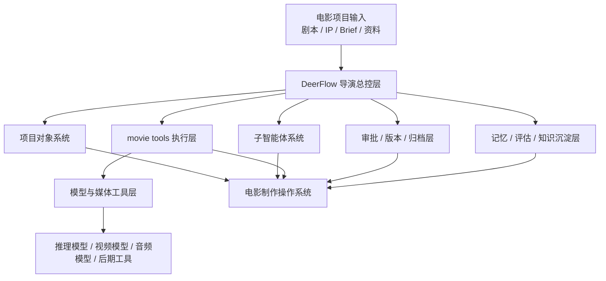
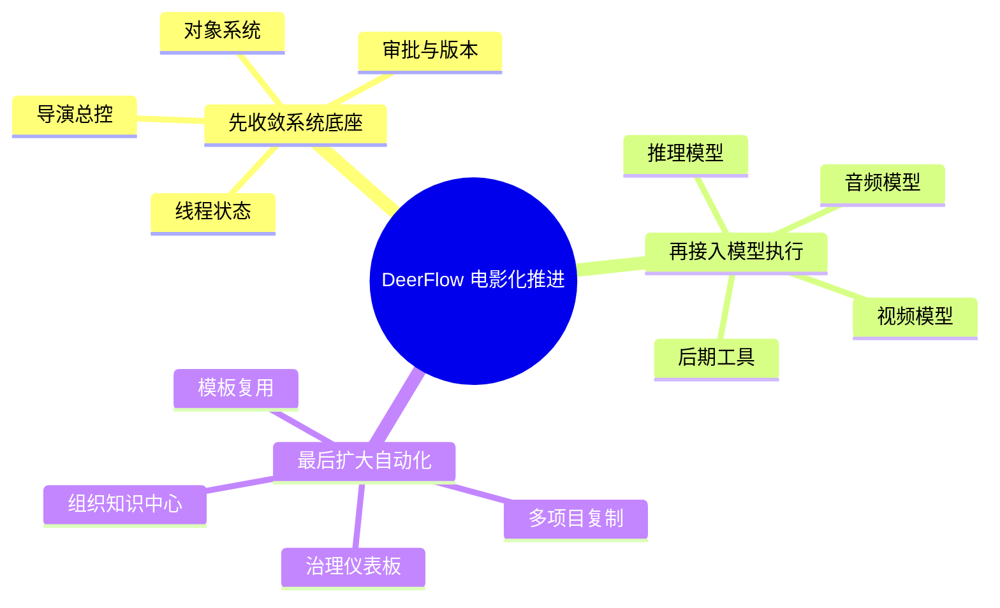
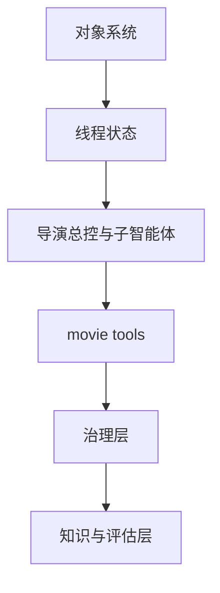
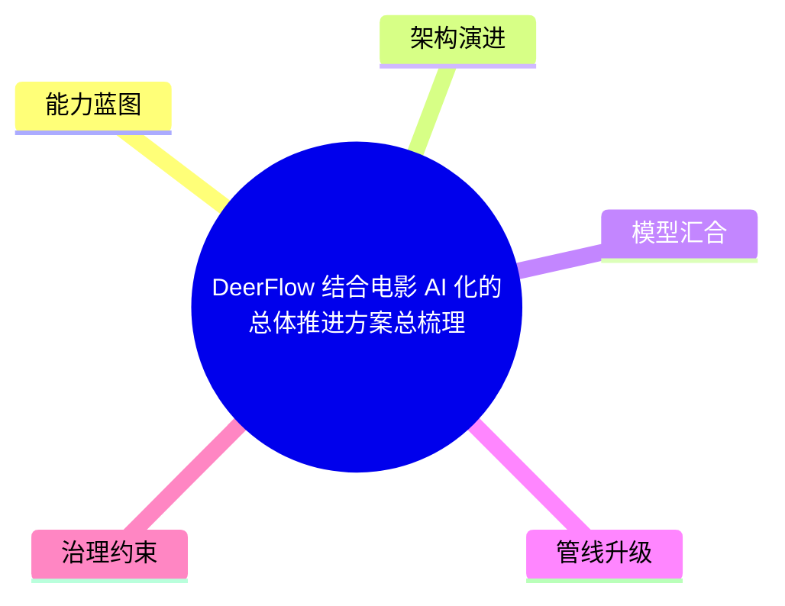

# 103. DeerFlow 结合电影 AI 化的总体推进方案总梳理

这一篇聚焦：

**在前面 1-102 篇把业务流程、对象体系、子智能体、行业趋势、导演案例与 ROI 讲清楚之后，这一篇要把问题重新收敛成一句话：如果现在就要推进 DeerFlow 与电影制作 AI 化的结合，应该按什么顺序推进、先做什么、后做什么、哪些能力必须收敛成系统、哪些能力暂时不要做重。**

---

## 1. 先把一句话结论说清楚

DeerFlow 与电影制作 AI 化的结合，不应该从“做一个更炫的生成入口”开始，而应该从：

- 建立电影项目对象系统
- 建立导演总控与子智能体分工
- 建立任务、审批、版本、归档与知识沉淀闭环
- 再把模型能力接入这些正式节点

也就是说：

- 先做 film OS
- 再做 model routing
- 最后再做大规模自动化

这里在 2026 年有两个特别现实的提醒：

- Sora 2 的 web / app / API 已经进入官方停运时间表
- Seedance 2.0 与 HappyHorse-1.0 又说明前沿视频模型排名可能在很短时间内重排

这条顺序非常重要。

因为如果一开始就反过来：

- 先堆模型
- 再想流程

最后大概率会得到一个很多人会用、但没有人敢把正式项目放进去的平台。

---

## 2. DeerFlow 真正要解决的，不是“生成问题”，而是“组织问题”

到 2026 年，电影行业的痛点已经越来越清晰：

- 模型越来越多
- 生成越来越容易
- 但正式项目更容易混乱

原因是电影制作从来都不是单一创作动作，而是一个同时包含：

- 创意判断
- 资源协调
- 审批治理
- 版本控制
- 合规边界
- 跨团队交付

的复杂系统。

DeerFlow 最该承担的不是“替导演画一张图”，而是把这些本来分散在会议、聊天记录、硬盘目录和人脑经验里的东西，组织成：

- 对象
- 状态
- 任务
- 审批
- 版本
- 记忆

这才是它和电影 AI 化结合的真正切口。

---

## 3. 一张总图：DeerFlow 与电影制作结合的主线

这张图要表达的核心是：

- DeerFlow 不是模型本体
- DeerFlow 是模型进入电影项目主链的组织层

---

## 4. 推进 DeerFlow 结合，建议按四个阶段走

### 第一阶段：做“前期电影操作系统”

目标不是覆盖全流程，而是先把最容易证明价值、也最适合作为系统入口的部分做稳。

这一阶段应该收敛到：

- 剧本解析
- 角色与场景抽取
- 分镜与 shot plan 组织
- 风格统一
- 预算 / 排期草案
- 前期方案包输出

这个阶段的关键，不是生成效果多强，而是让前期工作第一次变成：

- 有对象
- 有状态
- 有工单
- 有版本

### 第二阶段：把 DeerFlow 接到“拍摄执行链”

当第一阶段稳定后，再进入更强的执行型能力：

- call sheet
- 现场调度
- 问题升级
- 资源冲突跟踪
- 进度与成本联动

这一阶段的目标是：

- 让 DeerFlow 不再只是“前期规划台”
- 而是项目真正运行中的控制台

### 第三阶段：接入“后期与发布链”

等中期执行链稳定后，再进入：

- 剪辑版本治理
- 声音 / 调色 / VFX 协同
- review round
- release package
- archive snapshot

这一阶段很关键，因为电影行业最真实的治理压力，很多都集中在后期与交付。

### 第四阶段：进入“企业级与多项目组合管理”

只有当前三阶段成立，才应该进一步做：

- portfolio 级项目管理
- 权限与审计
- 数据治理
- 模板复用
- 组织知识中心
- ROI 仪表板

这才是 DeerFlow 从一个行业化工具，成长为平台的标志。

---

## 5. 一张路线图：怎么从试点走到平台

### 一张推进组合图

这张图把 103 的一句话结论压缩成了“先系统、再模型、后自动化”的推进组合，适合给管理层或项目发起人快速扫读。

---

## 6. 推进过程中，最重要的不是“多做”，而是“先收敛”

这件事很容易做重。  
尤其一旦看到 2026 年模型能力很强，团队会自然想把以下事情一起做：

- 剧本
- 分镜
- 视频生成
- 数字人
- 动捕
- 后期
- 宣发
- 合规
- 企业管理

但如果一开始全做，系统一定会失焦。

更务实的推进方式是：

- 每一阶段只做一个主要闭环

比如：

- 第一阶段只证明“前期方案闭环”
- 第二阶段只证明“拍摄执行闭环”
- 第三阶段只证明“后期交付闭环”

这样平台的边界会清楚得多。

---

## 7. DeerFlow 在推进结合时，必须优先新增哪几类平台能力

从整体推进角度看，最先应该补的不是“内容生成能力”，而是六类底盘能力。

### 7.1 电影对象系统能力

包括：

- Script / Scene / Character
- Budget / Schedule / Resource
- ShotPlan / Storyboard / PromptPack
- Review / Approval / ReleasePackage

这是整个 film OS 的语义底座。

### 7.2 电影线程状态能力

包括：

- 当前阶段
- 当前 gate
- 当前活跃对象
- 当前风险
- 当前审批状态
- 当前版本快照

没有这一层，DeerFlow 就无法成为项目控制台。

### 7.3 导演总控与子智能体协作能力

包括：

- 导演主智能体
- 剧本分析
- 分镜
- 预算
- 排期
- 场景 / 选角 / 摄影 / 后期

这一层决定平台是否真的具备“部门化协作”能力。

### 7.4 movie tools 专业动作层

包括：

- 脚本解析
- 预算草案
- 排期冲突检测
- review round 打开
- package 组装
- archive snapshot
- 模型注册、切换与退场迁移动作

这一层决定系统是否从“聊天”进入“动作”。

### 7.5 治理层

包括：

- 权限
- 审批
- 版本
- 标识
- 审计

这是平台未来能不能进正式项目的关键。

### 7.6 知识与评估层

包括：

- 记忆沉淀
- 经验模板
- 项目回顾
- 效果评估
- ROI 指标

这一层决定 DeerFlow 是否能从项目工具走向组织资产。

---

## 8. 一张能力依赖图：为什么这些能力要按顺序补

这张图表达的是：

- 不先有对象系统，就没有稳定状态
- 不先有状态，就没有可靠调度
- 不先有调度，就没有正式动作层
- 不先有动作层，就很难谈治理
- 不先有治理，就很难沉淀组织级知识

---

## 9. DeerFlow 应该怎么组织内部推进

建议不要按“功能菜单”来推进，而要按“工作流闭环”来推进。

更具体一点：

### 产品侧

负责定义：

- 每个阶段的最小闭环
- 每个对象的最小字段集合
- 每个审批节点的进入和退出条件

### 架构侧

负责定义：

- 状态模型
- 工具协议
- 子智能体注册方式
- 版本与审计边界

### 研发侧

负责优先打通：

- Lead Agent
- MovieThreadState
- movie tools
- artifact / archive / review

### 行业专家侧

负责提供：

- 真实剧组流程
- 样例文档
- 审批习惯
- 风险案例

如果缺少这一侧，平台很容易做成“看起来很像电影，但其实不能落地”的样子。

---

## 10. 试点项目应该怎么选

建议优先选择满足以下条件的项目：

- 前期工作量大于现场复杂度
- 团队愿意配合结构化流程
- 有较强文档产出需求
- 有一定版本治理压力

因此更适合先试点的项目包括：

- 科幻片前期开发
- 动画电影前期开发
- 大型类型片预演期
- 多宣发包、多版本输出项目

不建议第一批就选择：

- 高度即兴创作、极少文档化的项目
- 完全依赖单人作者、没有团队协同需求的项目
- 权限边界极复杂但组织还未准备好的项目

---

## 11. 一句话总结推进策略

如果把所有内容压缩成一句话，那么 DeerFlow 结合电影制作 AI 化的推进策略应该是：

**从“前期方案系统”切入，向“拍摄执行控制台”和“后期治理中枢”扩展，最终形成一个覆盖项目对象、任务动作、审批版本和组织记忆的电影操作系统。**

这才是一条真实可落地、也最容易积累平台护城河的路线。

---

## 12. 核心结论

DeerFlow 下一步最重要的不是“再接一个模型”，而是把自己真正做成：

- 电影项目的语义层
- 电影流程的控制层
- 电影协作的治理层
- 电影组织的记忆层

一旦这四层成立，模型只会越来越多地放大 DeerFlow 的价值；  
如果这四层不成立，再强的模型也只会把流程变得更碎。

---

<!-- movie-visuals:start -->
## 补充图示：换一种视角看本篇

下面这张 心智图 把“DeerFlow 结合电影 AI 化的总体推进方案总梳理”再压缩成一个可快速扫读的结构视图，便于先抓关键关系，再回到正文细节。

<!-- movie-visuals:end -->

<!-- movie-doc-nav:start -->
## 文档导航

- 总入口：[README.md](./README.md)
- 阅读地图：[00-reading-map.md](./00-reading-map.md)
- 所在分组：103-111 未来能力与媒体操作系统演进
- 上一篇：[102. DeerFlow 在 2026-2027 电影行业中的 ROI、治理与落地路线图](./102-deerflow-roi-governance-and-adoption-roadmap-2026.md)
- 下一篇：[104. DeerFlow 未来应该增加的能力蓝图](./104-deerflow-future-capability-blueprint.md)

### 同组文档
- 103. DeerFlow 结合电影 AI 化的总体推进方案总梳理（当前）
- [104. DeerFlow 未来应该增加的能力蓝图](./104-deerflow-future-capability-blueprint.md)
- [105. DeerFlow 未来能力的参考架构与图示说明](./105-deerflow-future-reference-architecture.md)
- [106. 视频大模型未来发展的主线：从生成器走向世界模拟器](./106-video-foundation-models-future-evolution.md)
- [107. 智能体未来发展的主线：从对话助手走向工作操作系统](./107-agents-future-evolution.md)
- [108. 视频大模型与智能体的汇合：从生成工具走向媒体操作系统](./108-video-models-and-agents-convergence.md)
- [109. AI 原生媒体生产管线的未来：从前期预演到交互式后期](./109-ai-native-media-production-pipeline-future.md)
- [110. DeerFlow 面向“视频大模型 + 智能体”时代的演进路线](./110-deerflow-roadmap-for-video-agent-era.md)
- [111. 视频大模型与智能体时代的风险、评估与治理](./111-video-agents-risk-evals-and-governance.md)
<!-- movie-doc-nav:end -->
