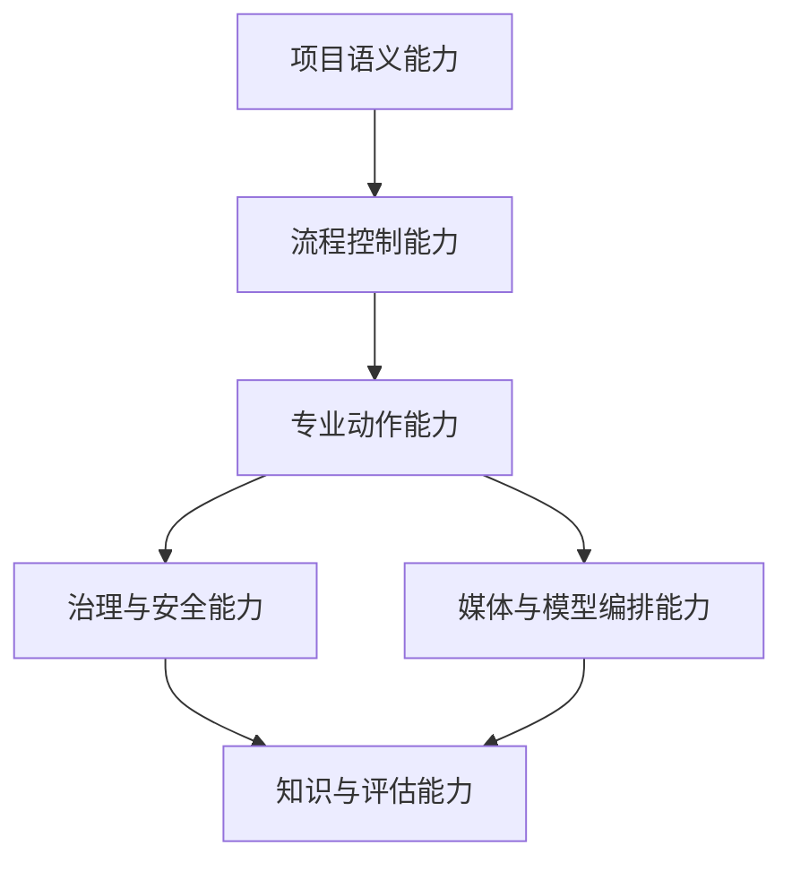

# 104. DeerFlow 未来应该增加的能力蓝图

这一篇聚焦：

**如果 DeerFlow 未来要真正成为电影行业的 AI 操作系统，它应该增加哪些能力，这些能力的优先级如何划分，它们之间的依赖关系是什么，以及哪些能力是“必须做”、哪些能力是“可以后做”的。**

---

## 1. 先说结论：未来能力不应该按“技术酷炫度”排序，而应该按“进入正式项目的必要性”排序

很多团队在规划 AI 平台能力时，会自然优先想到：

- 文生视频
- 数字人
- 语音克隆
- 自动剪辑

这些当然重要，但如果 DeerFlow 的目标是进入正式电影制作流程，那么优先级更高的往往是另外一些事情：

- 能不能读懂项目
- 能不能控制状态
- 能不能可靠委派
- 能不能留下审批记录
- 能不能追踪版本
- 能不能把经验沉淀下来

所以，这一篇把 DeerFlow 未来能力分成六大能力簇。

---

## 2. 六大能力簇总览

### 第一簇：项目语义能力

让系统真正理解电影项目“是什么”。

### 第二簇：流程控制能力

让系统真正知道项目“现在在做什么”。

### 第三簇：专业动作能力

让系统真正能够“推进工作”。

### 第四簇：媒体与模型编排能力

让系统真正能够“调动外部 AI 与媒体工具”。

### 第五簇：治理与安全能力

让系统真正能够“进入正式生产”。

### 第六簇：知识与评估能力

让系统真正能够“越做越强，而不是每次重来”。

---

## 3. 一张图：DeerFlow 未来能力蓝图

---

## 4. 第一簇：项目语义能力

这是 DeerFlow 未来最不能缺的底层能力。

建议增加：

- 更完整的 `Project / Script / Scene / Character / Asset / Deliverable` 类型系统
- 跨对象引用与关联图谱
- 对象级 diff
- 对象级历史追踪
- 对象级权限边界

这类能力的重要性在于：

- 只有当系统理解“项目对象”，它才不是一个通用聊天外壳

### 未来加值方向

- 世界观对象
- VFX shot 对象
- 数字替身对象
- 法务授权对象
- 宣发物料对象

---

## 5. 第二簇：流程控制能力

这是让 DeerFlow 从“会分析”走向“会控盘”的关键。

建议增加：

- Gate 机制
- Workflow 状态机
- 风险板
- 依赖图
- 升级链路
- 现场事件流

这类能力的重要性在于：

- 一个电影项目最需要控制的，不是单个答案，而是阶段推进与阻塞暴露

### 未来加值方向

- 自动 blocker 检测
- 风险等级自动重算
- 多项目冲突检测
- 关键路径预测

---

## 6. 第三簇：专业动作能力

这是 DeerFlow 未来最直接提升用户体感的一层。

建议增加：

- 剧本解析器
- breakdown 生成器
- 预算草案生成器
- 排期草案生成器
- shot plan 生成器
- storyboard pack 组装器
- review round 管理器
- release package 组装器

### 未来加值方向

- dailies 归档助手
- test screening feedback 结构化助手
- 宣发物料批量版本生成助手
- 交付 manifest 自动检查器

这类能力的核心不是“看起来聪明”，而是：

- 让系统能完成正式动作

---

## 7. 第四簇：媒体与模型编排能力

这一簇决定 DeerFlow 能不能真正适配 2026 之后快速变化的模型生态。

建议增加：

- 多模型路由
- 前沿模型注册表
- 模型选择策略
- PromptPack 管理
- 风格约束层
- 一致性约束层
- 生成任务重试与回滚
- 输出结果评分与筛选
- 供应商退出与迁移 fallback

### 未来加值方向

- 视频模型 AB 路由
- 闭源 / API / 封测 / 私有部署接入管理
- 镜头级生成策略
- 音频 / Foley / 配音任务编排
- 后期工具链自动衔接
- 生成结果 provenance 追踪

如果没有这一层，DeerFlow 未来会很难稳定接入不断变化的外部模型。

而 2026 年已经给出很具体的例子：

- Sora 2 的停运说明外部产品面板可能退出
- Seedance 2.0 与 HappyHorse-1.0 的快速上升说明前沿模型格局可能快速变化

所以 DeerFlow 未来不能只做“接模型”，还要做：

- 模型发现
- 模型评测
- 模型替换
- 模型退场迁移

---

## 8. 第五簇：治理与安全能力

这是 DeerFlow 能不能进入 studio / 制片公司正式项目的生死线。

建议增加：

- 权限模型
- 审批流
- 版本链
- 审计日志
- AI 产物标识
- 文件元数据管理
- 数字替身与授权记录
- 对外发布前检查

### 未来加值方向

- 法务模板中心
- 国家 / 地区合规模板
- 数字替身使用边界策略
- 敏感素材出域策略

这类能力平时最不显眼，但一旦没有，就根本无法进正式项目。

---

## 9. 第六簇：知识与评估能力

如果 DeerFlow 想从工具升级为平台，这一簇必须尽早设计。

建议增加：

- 项目记忆库
- Lessons Learned 结构化沉淀
- 模板中心
- 角色工作法模板
- 评估指标面板
- ROI 仪表板
- 项目复盘助手

### 未来加值方向

- 组织级知识检索
- 相似项目推荐
- 最佳实践建议
- 团队能力画像

这一层决定 DeerFlow 会不会随着项目越做越强。

---

## 10. 一张优先级图：哪些能力必须先做

这里有一个反直觉但很重要的判断：

- 媒体与模型编排虽然性感
- 但在优先级上并不一定高于项目语义和流程控制

因为后者决定 DeerFlow 是否真正成立为系统。

---

## 11. 一张依赖图：能力之间如何互相支撑

这张图要说明的是：

- 语义与流程是底
- 动作与治理是中层
- 编排与知识是放大器

---

## 12. 建议 DeerFlow 未来新增的 12 项代表性能力

为了更方便落地，可以把未来能力收敛为下面这 12 项代表能力：

| 能力 | 作用 | 优先级 |
|------|------|--------|
| Movie Object Graph | 统一电影项目对象 | P0 |
| MovieThreadState 2.0 | 承接阶段、风险、审批、版本 | P0 |
| Director Lead Control | 形成导演总控 | P0 |
| Movie Tool Runtime | 承接正式专业动作 | P0 |
| Gate & Approval Engine | 承接阶段推进与审批 | P0 |
| Artifact Version Ledger | 管理版本与归档 | P1 |
| Model Registry / Routing / Fallback | 接入外部模型生态并处理替换与退场 | P1 |
| PromptPack & Style Constraints | 控制风格、一致性、生成边界 | P1 |
| Compliance & Provenance Layer | 支撑标识、授权、审计 | P1 |
| Evaluation Dashboard | 跟踪效果与质量 | P2 |
| Knowledge & Template Hub | 沉淀经验和模板 | P2 |
| Portfolio Command Center | 支撑多项目与企业级视角 | P3 |

---

## 13. 核心结论

DeerFlow 未来应该增加的能力，不是“把所有 AI 能力都接进来”，而是有意识地补齐四类根基：

- 让系统懂项目
- 让系统控流程
- 让系统会动作
- 让系统可治理

只有这四件事成立，后续无论接入更强的视频模型、声音模型、数字人模型还是后期工具，DeerFlow 都会越来越像平台，而不是越来越像拼装台。
