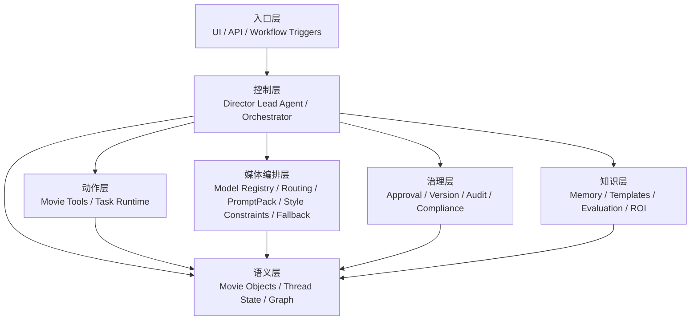
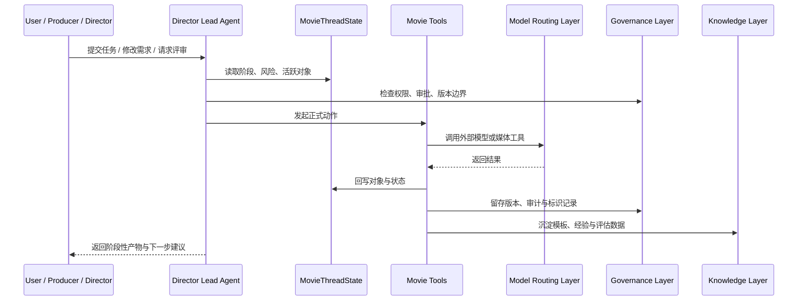
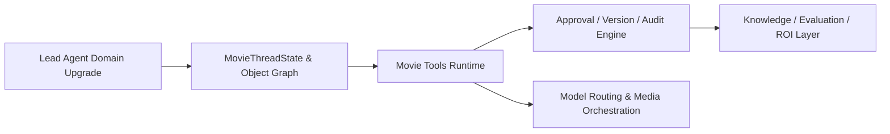
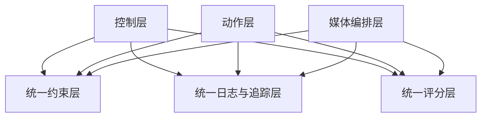

# 105. DeerFlow 未来能力的参考架构与图示说明

这一篇聚焦：

**前一篇讲了 DeerFlow 未来应该增加哪些能力，这一篇进一步回答：这些能力在平台中应该如何分层、如何互相连接、运行时如何流转，以及如果未来真的进入研发实施，应该先在哪些技术层落刀。**

---

## 1. 目标不是“堆功能”，而是形成稳定平台骨架

DeerFlow 后续最容易犯的一个错误，是把未来能力理解成：

- 多几个 agent
- 多几个 tool
- 多接几个模型

但真正的平台化不是这么长出来的。

未来能力应该被组织成一套稳定骨架：

- 入口层
- 控制层
- 语义层
- 动作层
- 媒体编排层
- 治理层
- 知识层

只有这样，平台能力才会越加越稳，而不是越加越乱。

---

## 2. 一张总架构图：DeerFlow 未来能力的参考分层

---

## 3. 每一层分别解决什么问题

### 入口层

解决：

- 用户从哪里进来
- 系统由什么触发
- 不同角色看到什么视图

### 控制层

解决：

- 谁读状态
- 谁决定下一步
- 谁发起任务
- 谁整合多部门结果

这就是导演总控智能体的核心位置。

### 语义层

解决：

- 项目对象如何表示
- 当前阶段如何表示
- 风险、版本、审批如何挂在对象上

### 动作层

解决：

- 系统到底靠什么执行正式动作

这里不是自由文本，而是明确的 movie tools 和 task runtime。

### 媒体编排层

解决：

- 外部模型如何接入
- 风格与一致性如何约束
- 不同生成任务如何路由
- 模型停运或替换时如何迁移

这一层之所以要单独强调，是因为 2026 已经出现了两种相反但同样重要的变量：

- Sora 2 这样的产品面板会退出
- Seedance 2.0、HappyHorse-1.0 这样的新前沿模型会快速冒头

### 治理层

解决：

- 谁可以做什么
- 什么能进入正式版本
- 什么必须审批
- 什么必须打标

### 知识层

解决：

- 项目经验如何沉淀
- 模板如何复用
- 指标如何评估
- ROI 如何被看见

---

## 4. 一张运行时图：一次电影任务如何穿过整个平台

这张图的重点是：

- 模型调用只是其中一步
- 真正重要的是调用前后的状态、治理和知识沉淀

---

## 5. 如果要落到 DeerFlow 工程里，建议优先新增哪些模块

这一节不是在写具体代码，而是在给未来的工程边界划线。

### 5.1 Agent 层

建议强化：

- `lead_agent` 的导演总控化
- movie domain subagents
- subagent registry 的领域化注册机制

### 5.2 State 层

建议强化：

- `MovieThreadState`
- gate / risk / review / version 字段体系
- 对象快照与当前活跃工作面板

### 5.3 Tool 层

建议强化：

- movie tools runtime
- tool 输入输出 contract
- tool-level provenance

### 5.4 Artifact 层

建议强化：

- story package
- shot package
- review package
- release package
- archive snapshot

### 5.5 Governance 层

建议强化：

- approval engine
- audit ledger
- compliance metadata
- role permission policy

### 5.6 Knowledge 层

建议强化：

- memory hub
- template hub
- evaluation hub
- ROI dashboard data layer

---

## 6. 一张模块依赖图：未来代码能力怎么长

这张图对应的工程逻辑是：

- 先把主控和状态打牢
- 再把动作层变正式
- 然后补治理
- 最后把模型编排与知识复利放大

---

## 7. DeerFlow 未来最值得新增的三个横切能力

除了上面的分层能力，还有三类横切能力很值得尽早设计。

### 7.1 统一约束层

用于管理：

- 风格约束
- 角色一致性约束
- 场景物理约束
- 合规边界约束

它的价值在于：

- 不同 agent、tool、model 都遵守同一套项目规则

### 7.2 统一日志与追踪层

用于管理：

- 谁做了什么
- 哪个模型被调用
- 哪个版本进入了审批
- 哪个输出被废弃

这会极大提升排障、归因和审计能力。

### 7.3 统一评分层

用于管理：

- 生成结果评分
- 审批通过率
- 版本返工率
- 工具效果评估

没有这一层，平台很难做真正的数据驱动迭代。

---

## 8. 一张横切能力图

---

## 9. 从产品视角看，未来平台最好长成什么样

一个成熟的 DeerFlow 电影平台，未来应该至少有五个核心界面或工作面：

- 项目总控面板
- 阶段与 gate 面板
- 电影对象浏览面板
- review / approval / version 面板
- knowledge / evaluation / ROI 面板

这说明未来 DeerFlow 的产品形态，也不应只是一个聊天窗口，而应该逐步演进为：

- 聊天入口 + 项目控制台 + 治理后台 + 知识中枢

---

## 10. 核心结论

如果要给 DeerFlow 的未来能力画一张“真正能实施”的图，那么这张图不该从模型开始，而应该从：

- 控制层
- 语义层
- 动作层
- 治理层

开始。

因为只有这四层稳定，媒体编排能力、知识复用能力、企业级 ROI 能力才会越来越有价值。

所以，DeerFlow 未来最值得追求的，不是成为“最会生成的电影助手”，而是成为：

- 最会组织电影项目的 AI 平台
- 最会承接多模型能力的工作流平台
- 最会沉淀项目经验的电影操作系统
