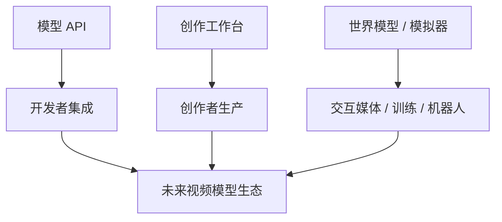
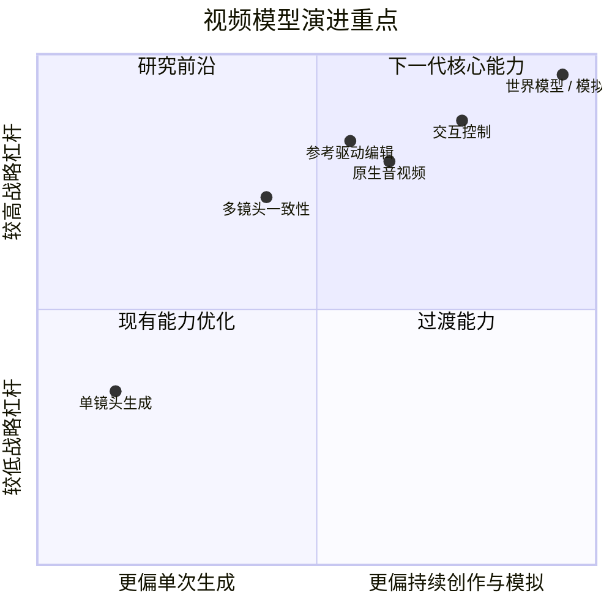
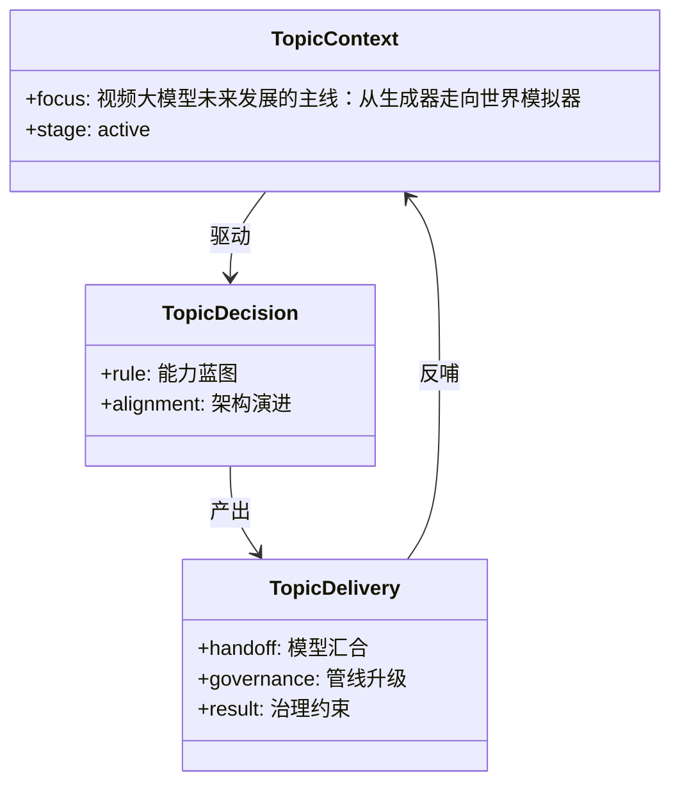

# 106. 视频大模型未来发展的主线：从生成器走向世界模拟器

这一篇聚焦：

**视频大模型的未来，并不只是“画面越来越真”，而是沿着生成、编辑、一致性、原生音频、交互控制、世界模型六条线一起推进。到了 2026 年，真正有战略价值的视频模型，已经开始从单次内容生成器，转向可连续编辑、可多镜头组织、可交互模拟的世界表示系统。**

---

## 1. 先说结论：视频大模型未来不会停留在“文生视频”

过去两年，很多人对视频模型的理解停留在：

- 输入一句 prompt
- 输出一个短视频

但从 2025 到 2026，前沿路线已经明显发生变化：

- Google 把 Veo 3、Flow、reference powered video、camera controls 连成了创作工作台
- Runway 把 Gen-4.5 往多镜头编辑、原生音频和 GWM-1 世界模型方向推进
- 字节 Seedance 2.0 直接把多模态参考、联合音视频、可编辑性做成一体
- 中国前沿模型格局又被 HappyHorse-1.0 等新变量进一步加速

这说明下一代视频模型的竞争，不再只是：

- 谁能先出一个更像真的片段

而是：

- 谁能更稳定地参与一个持续创作过程

---

## 2. 六条最重要的演进主线

建议把视频大模型未来的发展，理解成六条并行主线。

### 主线一：从单镜头生成走向多镜头叙事

未来视频模型不只是输出 clip，而是要支持：

- 多 shot 连续性
- 叙事推进
- 镜头语言变化
- scene-to-scene 一致性

这决定模型能不能进入真正的影视工作流。

### 主线二：从纯生成走向可编辑

未来最有价值的不是“一次出片”，而是：

- 增量修改
- 定向改动
- 参考驱动编辑
- 多轮继续拍

这会让视频模型从 demo 工具变成 production tool。

### 主线三：从静默视频走向原生音视频

Veo 3 与 Seedance 2.0 都已经把音视频一体推到一线。  
这意味着未来视频模型会逐渐承担：

- 环境声
- Foley
- 对白
- 音画节奏配合

没有这一层，很多应用只能停留在前期概念阶段。

### 主线四：从视觉一致性走向世界一致性

以前大家讨论的是：

- 同一个角色像不像同一个人

未来更关键的是：

- 这个世界是否连贯
- 空间是否自洽
- 物理是否稳定
- 交互是否连续

这正是世界模型路线的核心。

### 主线五：从被动生成走向可控交互

未来视频模型需要越来越像一个可导演的引擎，而不是不可控的老虎机。

关键能力包括：

- 镜头控制
- 动作条件控制
- 角色轨迹控制
- 空间与物体约束
- 参考素材绑定

### 主线六：从内容模型走向模拟器

Runway GWM-1 的信号很清楚：  
视频模型未来的一条重要路线，是成为能模拟世界、支撑 agent 训练、游戏、机器人和交互媒体的底层引擎。

这条路线一旦成熟，视频模型就不再只是“媒体生成”。

---

## 3. 一张总图：视频模型未来的能力阶梯

这张图的重点是：

- 每上升一层，视频模型就更接近正式生产和实时交互

---

## 4. 为什么 2026 是一个分水岭

2026 年出现了几个非常关键的信号。

### 4.1 Google 把“模型 + 工作台”一体化

Google 不只是发布了 Veo 3，还发布了 Flow。  
Flow 不是单独模型，而是把 Veo、Imagen、Gemini 放进同一个 filmmaking 界面里，让用户用自然语言组织 shot、角色、场景和风格。  
这说明未来视频模型的重要战场之一，是：

- 工作台形态

### 4.2 Runway 把视频生成推向世界模型

Runway GWM-1 明确提出：

- real-time simulation
- action-conditioned generation
- worlds / avatars / robotics 三条分支

这说明未来视频模型不仅在争创意市场，也在争：

- 仿真
- 游戏
- agent 训练
- interactive media

### 4.3 Seedance 2.0 把多模态参考与音视频一体做深

Seedance 2.0 的官方描述里，最值得注意的不是“更清晰”，而是：

- text / image / audio / video 四模态输入
- 多模态参考
- video continuation
- 15 秒 multi-shot audio-video output

这非常接近影视创作真正需要的能力形态。

### 4.4 Sora 的退场说明产品形态并不稳定

OpenAI 官方帮助中心已明确给出 Sora 的停运时间表。  
这带来的启发不是“某家输了”，而是：

- 单一创作入口的生命周期未必稳定
- 未来视频模型平台一定会高度动态

这也意味着视频模型领域的长期护城河，未必只在模型本身，而更多在：

- 工作流
- 生态
- 治理

---

## 5. 一张竞争图：未来视频模型的三种主要产品形态

这张图说明：

- 未来不会只有一种视频模型产品形态
- 不同公司会在不同层次上竞争

---

## 6. 视频大模型未来最值得关注的五个判断

### 判断一：一致性会比清晰度更重要

因为进入生产之后，用户最痛的不是一帧不好看，而是：

- 角色前后不一致
- 场景前后不一致
- 镜头逻辑不一致

### 判断二：编辑能力会比一次性生成更有商业价值

创作和工业流程都不需要“一次完成”，而需要：

- 快速试错
- 精准改动
- 多轮打磨

### 判断三：音频会成为下一轮分水岭

谁能把：

- 对白
- 音效
- 空间声
- 音画同步

做得更稳定，谁就更接近生产级应用。

### 判断四：世界模型会打开更大的市场

因为它对应的不只是影视，还包括：

- 游戏
- VR / XR
- agent 训练
- 教育模拟
- 机器人

### 判断五：工作流和治理会越来越重要

Sora 的退场与前沿模型的快速换位都说明：

- 仅靠“最强模型”不够
- 还需要稳定的创作与治理基础设施

---

## 7. 对电影行业意味着什么

从电影行业视角看，视频模型未来不再只是概念片工具，而会分化成三类角色。

### 第一类：前期创意与预演引擎

用于：

- 概念验证
- 风格探索
- shot 预演

### 第二类：中后期编辑与修改引擎

用于：

- 延展镜头
- 定向替换
- 音画修整

### 第三类：交互式世界与数字角色引擎

用于：

- 可探索场景
- 可对话角色
- 训练与模拟环境

也就是说，未来的视频模型不会只服务电影的一个阶段，而会在不同阶段扮演不同角色。

---

## 8. 这对 DeerFlow 的启发是什么

DeerFlow 最重要的启发不是“自己去做视频模型”，而是：

- 认识到视频模型未来会越来越多层次化

因此 DeerFlow 应该准备承接：

- 生成型模型
- 编辑型模型
- 工作台型产品
- 世界模型型引擎

并用统一对象、统一状态、统一审批和统一版本去管理它们。

---

如果把六条演进主线放进成熟度矩阵，会更容易看出未来几年真正拉开差距的，不只是画质，而是“编辑、交互、世界表示”的跃迁：

---

## 9. 核心结论

视频大模型未来的发展主线，不是“把文生视频做得更真”这么简单，而是：

- 从 clip 走向 sequence
- 从生成走向编辑
- 从静默走向音视频一体
- 从一致性走向世界表示
- 从创意工具走向模拟器

这会使视频模型越来越不像单一模型，越来越像：

- 内容引擎
- 编辑引擎
- 交互引擎
- 世界引擎

这也是为什么未来真正稳的系统，不会只押注某一个视频模型，而一定要有更高层的编排和治理能力。

---

## 参考资料

- [Google: Veo 3, Flow and generative media models](https://blog.google/innovation-and-ai/products/generative-media-models-io-2025/)
- [Runway: Introducing Gen-4.5](https://runwayml.com/research/introducing-runway-gen-4.5)
- [Runway: Introducing GWM-1](https://runwayml.com/research/introducing-runway-gwm-1)
- [ByteDance Seed: Seedance 2.0 Official Launch](https://seed.bytedance.com/en/blog/official-launch-of-seedance-2-0)
- [OpenAI Help Center: What to know about the Sora discontinuation](https://help.openai.com/zh-hant/articles/20001152-what-to-know-about-the-sora-discontinuation)
- [Caixin Global: Alibaba unveils HappyHorse](https://www.caixinglobal.com/2026-04-10/alibaba-unveils-happyhorse-after-ai-model-tops-video-rankings-under-alias-102432775.html)
- [Global Times: Another AI ‘black horse’](https://www.globaltimes.cn/page/202604/1358648.shtml)

---

<!-- movie-visuals:start -->
## 补充图示：换一种视角看本篇

下面这张 类图 把“视频大模型未来发展的主线：从生成器走向世界模拟器”再压缩成一个可快速扫读的结构视图，便于先抓关键关系，再回到正文细节。

<!-- movie-visuals:end -->

<!-- movie-doc-nav:start -->
## 文档导航

- 总入口：[README.md](./README.md)
- 阅读地图：[00-reading-map.md](./00-reading-map.md)
- 所在分组：103-111 未来能力与媒体操作系统演进
- 上一篇：[105. DeerFlow 未来能力的参考架构与图示说明](./105-deerflow-future-reference-architecture.md)
- 下一篇：[107. 智能体未来发展的主线：从对话助手走向工作操作系统](./107-agents-future-evolution.md)

### 同组文档
- [103. DeerFlow 结合电影 AI 化的总体推进方案总梳理](./103-deerflow-movie-integration-strategy-summary.md)
- [104. DeerFlow 未来应该增加的能力蓝图](./104-deerflow-future-capability-blueprint.md)
- [105. DeerFlow 未来能力的参考架构与图示说明](./105-deerflow-future-reference-architecture.md)
- 106. 视频大模型未来发展的主线：从生成器走向世界模拟器（当前）
- [107. 智能体未来发展的主线：从对话助手走向工作操作系统](./107-agents-future-evolution.md)
- [108. 视频大模型与智能体的汇合：从生成工具走向媒体操作系统](./108-video-models-and-agents-convergence.md)
- [109. AI 原生媒体生产管线的未来：从前期预演到交互式后期](./109-ai-native-media-production-pipeline-future.md)
- [110. DeerFlow 面向“视频大模型 + 智能体”时代的演进路线](./110-deerflow-roadmap-for-video-agent-era.md)
- [111. 视频大模型与智能体时代的风险、评估与治理](./111-video-agents-risk-evals-and-governance.md)
<!-- movie-doc-nav:end -->
