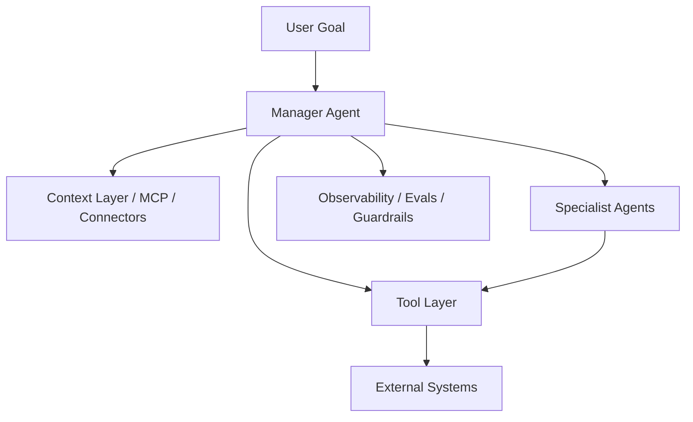

# 107. 智能体未来发展的主线：从对话助手走向工作操作系统

这一篇聚焦：

**智能体的未来，不是让聊天窗口更会回答问题，而是让系统能够理解目标、调用工具、连接上下文、分解任务、执行动作、接受监督并留下可观测记录。到了 2026 年，智能体已经明显从“聊天产品”转向“执行系统”，并开始形成协议、平台、工作台和多智能体管理面。**

---

## 1. 智能体为什么正在进入第二阶段

第一阶段的智能体，大多可以概括为：

- 对话
- 问答
- 辅助写作
- 辅助搜索

第二阶段的智能体，则越来越像：

- 工具调用器
- 上下文连接器
- 工作流执行器
- 多智能体协调器

这个变化的核心，不是模型突然“有了意识”，而是三个条件同时成熟：

- 推理能力变强
- 工具调用变标准化
- 平台开始提供观测、评估和协议支持

---

## 2. 2025-2026 最关键的四个信号

### 2.1 OpenAI 把 agent builder 变成平台能力

OpenAI 在 2025 年推出 Responses API、内置 web search / file search / computer use、Agents SDK 和 observability。  
这意味着 OpenAI 不再只在卖模型，而是在卖：

- 构建 agent 的底座

### 2.2 Anthropic 把协议层做成事实标准

Anthropic 开源 MCP 后，协议本身开始快速扩散。  
到 2026 年初，Anthropic 公开表示 MCP 已经成为连接 AI 与工具/数据的行业标准之一，并达到很大的生态规模。  
这说明未来 agent 不只是“更强”，而是：

- 更能连系统

### 2.3 Google 把 agent mode 和 manager surface 做成产品形态

Google 一边在 Gemini app 里推进 Agent Mode，一边又通过 Gemini CLI、Code Assist、Antigravity 提出 manager surface 和 agent-first interface。  
这说明未来 agent 的形态，不会只是一个侧边栏，而会越来越像：

- 一个专门的工作面

### 2.4 多智能体开始从研究概念变成组织方式

OpenAI 的 practical guide、Google 的 manager surface、Anthropic 的 Claude Code / Cowork / Skills，都在说明一件事：

- 智能体未来的重要问题，不是“单体够不够聪明”
- 而是“如何组织多个能力单元一起工作”

---

## 3. 一张图：智能体未来的能力阶梯

这张图要表达的是：

- 智能体的终点不是聊天，而是执行和组织

---

## 4. 智能体未来发展的六条主线

### 主线一：从 prompt 走向 routine

未来 agent 不会主要依赖一次性的 prompt 技巧，而会越来越依赖：

- 可复用的 routine
- 可验证的步骤
- 明确的指令结构

### 主线二：从工具调用走向协议连接

过去是：

- 一个 agent 接一个 tool

未来会更多变成：

- 一个 agent 接一个协议生态

MCP 的意义就在这里。  
它不是单一工具，而是让上下文、数据、动作接口标准化。

### 主线三：从单 agent 走向 manager + specialists

OpenAI 的 practical guide 明确讨论了 manager pattern 和 decentralized handoff pattern。  
这说明未来的 agent 很可能会长期存在两层结构：

- 中央管理者
- 专业执行者

### 主线四：从问答走向 computer use 和 environment use

随着 computer use、browser automation、CLI agent 等路线成熟，未来 agent 越来越不只是回答，而是：

- 直接操作环境

### 主线五：从黑箱走向可观测

2026 年的 agent 平台已经不再满足于“能跑就行”，而是越来越强调：

- tracing
- evals
- observability
- guardrails

因为 agent 一旦进入执行层，不可观测就不可治理。

### 主线六：从产品功能走向组织基础设施

未来大型组织真正会购买的，不是“会聊天的助手”，而是：

- 能接系统
- 能审计
- 能评估
- 能复用

的 agent 基础设施。

---

## 5. 一张架构图：未来 agent 的典型结构

---

## 6. 未来最重要的不是“多 agent”，而是“什么时候该多 agent”

这点很容易被误解。  
因为多智能体听上去很高级，但 OpenAI 的指南其实给出一个很务实的判断：

- 先把单 agent 能力做满
- 再考虑多 agent

原因很简单：

- agent 越多，协调和评估越复杂

所以未来成熟的 agent 系统，不会是“能拆就拆”，而是：

- 在需要专业分工和并行执行时才拆

这也是 why manager pattern 会长期重要。

---

## 7. Google、OpenAI、Anthropic 三条路线分别说明了什么

### OpenAI 路线

说明 agent 正在平台化：

- Responses API
- Built-in tools
- Agents SDK
- Observability

### Anthropic 路线

说明 agent 正在协议化：

- MCP
- Connectors
- Claude Code / Cowork / Skills

### Google 路线

说明 agent 正在界面化和工作台化：

- Agent Mode
- Gemini CLI
- Antigravity manager surface

三条路线合在一起说明：

- agent 未来不是单一形态，而是平台 + 协议 + 工作台的复合体

---

## 8. 未来 agent 产品最可能长成什么样

未来最可能出现的不是一种 agent，而是三种 agent 产品。

### 第一种：嵌入式 agent

嵌在：

- IDE
- 浏览器
- 办公软件
- 创作软件

### 第二种：任务型 agent 工作台

提供：

- 目标输入
- 任务队列
- 观察界面
- 结果审阅

### 第三种：组织级 agent 平台

提供：

- 协议接入
- 权限与审计
- 多智能体编排
- 评估和模板沉淀

---

## 9. 这对电影行业意味着什么

电影行业最需要的 agent，不是一个“懂电影的聊天机器人”，而是一个能做到下面这些事的系统：

- 读剧本
- 读状态
- 调工具
- 做分工
- 推审批
- 管版本
- 留痕迹

这意味着电影行业很适合 agent 第二阶段，而不是第一阶段。

因为电影制作天然就是：

- 多角色
- 多任务
- 多对象
- 多轮 review

---

## 10. 对 DeerFlow 的核心启发

DeerFlow 最应该吸收的，不是某家公司的 UI，而是这三条未来规律：

1. agent 必须连接系统
2. agent 必须进入工作流
3. agent 必须可观测、可评估、可治理

从这个角度看，DeerFlow 未来不该只是“把模型套个电影 prompt”，而应该像：

- 一个 manager-agent 主导的项目控制系统

---

## 11. 核心结论

智能体未来的发展主线，不是“更会聊天”，而是：

- 更会连接
- 更会执行
- 更会分工
- 更会留痕
- 更会被管理

所以未来智能体最有价值的地方，不是单次回答，而是：

- 能否作为组织的工作操作系统成立

这也是为什么真正面向电影行业的 agent 平台，一定会越来越像 DeerFlow 这种：

- 以对象、状态、任务、审批、版本、评估为中心的系统

---

## 参考资料

- [OpenAI: New tools for building agents](https://openai.com/index/new-tools-for-building-agents/)
- [OpenAI: A practical guide to building agents](https://cdn.openai.com/business-guides-and-resources/a-practical-guide-to-building-agents.pdf)
- [Anthropic: Introducing the Model Context Protocol](https://www.anthropic.com/news/model-context-protocol)
- [MCP docs](https://modelcontextprotocol.io/docs/getting-started/intro)
- [Anthropic: Introducing Labs](https://www.anthropic.com/news/introducing-anthropic-labs)
- [Google: Gemini app updates and Agent Mode](https://blog.google/products-and-platforms/products/gemini/gemini-app-updates-io-2025/)
- [Google: Gemini CLI open-source AI agent](https://blog.google/innovation-and-ai/technology/developers-tools/introducing-gemini-cli-open-source-ai-agent/)
- [Google Developers Blog: Antigravity agentic development platform](https://developers.googleblog.com/build-with-google-antigravity-our-new-agentic-development-platform/)

---

---

<!-- movie-doc-nav:start -->
## 文档导航

- 总入口：[README.md](./README.md)
- 阅读地图：[00-reading-map.md](./00-reading-map.md)
- 所在分组：103-111 未来能力与媒体操作系统演进
- 上一篇：[106. 视频大模型未来发展的主线：从生成器走向世界模拟器](./106-video-foundation-models-future-evolution.md)
- 下一篇：[108. 视频大模型与智能体的汇合：从生成工具走向媒体操作系统](./108-video-models-and-agents-convergence.md)

### 同组文档
- [103. DeerFlow 结合电影 AI 化的总体推进方案总梳理](./103-deerflow-movie-integration-strategy-summary.md)
- [104. DeerFlow 未来应该增加的能力蓝图](./104-deerflow-future-capability-blueprint.md)
- [105. DeerFlow 未来能力的参考架构与图示说明](./105-deerflow-future-reference-architecture.md)
- [106. 视频大模型未来发展的主线：从生成器走向世界模拟器](./106-video-foundation-models-future-evolution.md)
- 107. 智能体未来发展的主线：从对话助手走向工作操作系统（当前）
- [108. 视频大模型与智能体的汇合：从生成工具走向媒体操作系统](./108-video-models-and-agents-convergence.md)
- [109. AI 原生媒体生产管线的未来：从前期预演到交互式后期](./109-ai-native-media-production-pipeline-future.md)
- [110. DeerFlow 面向“视频大模型 + 智能体”时代的演进路线](./110-deerflow-roadmap-for-video-agent-era.md)
- [111. 视频大模型与智能体时代的风险、评估与治理](./111-video-agents-risk-evals-and-governance.md)
<!-- movie-doc-nav:end -->
