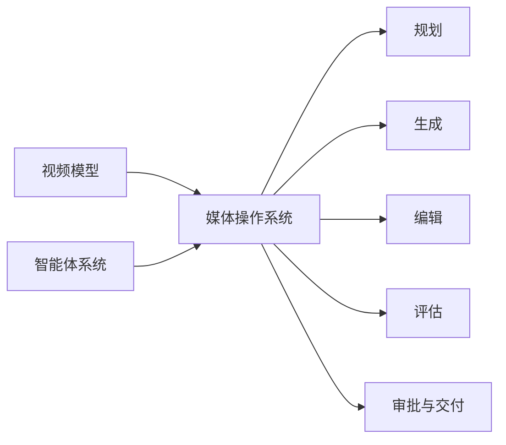
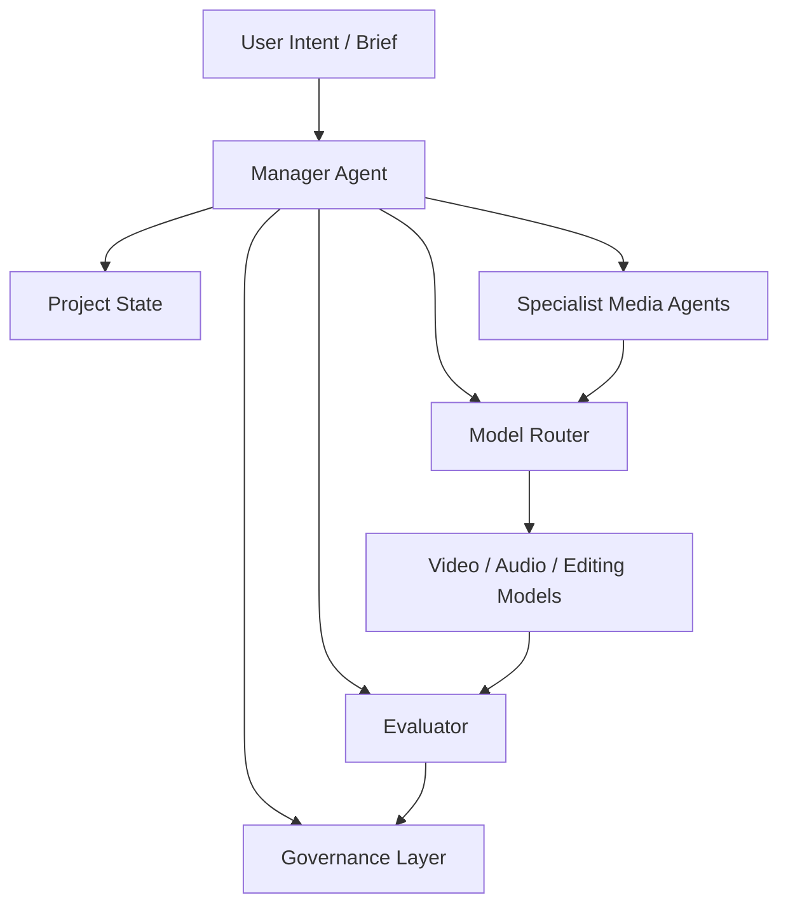

# 108. 视频大模型与智能体的汇合：从生成工具走向媒体操作系统

这一篇聚焦：

**视频大模型和智能体原本像两条技术线：一条解决内容生成，一条解决任务执行。但到 2026 年，它们正在开始汇合。未来真正有战略价值的系统，不是“有视频能力的聊天机器人”，也不是“会说话的视频生成器”，而是能够理解目标、拆分任务、调度模型、管理资产、评估结果、推动审批的媒体操作系统。**

---

## 1. 为什么说两条路线正在汇合

过去我们会把问题分得很开：

- 视频模型负责生成内容
- agent 负责理解和调度

但在真实工作流里，这两者很快会互相穿透。

因为一旦用户的目标从：

- “给我一个视频”

变成：

- “帮我完成一个 8 镜头短片方案”
- “把这个角色和场景延续到 3 个版本”
- “替我做一次预演并比较 A/B 两套镜头设计”

系统就一定需要同时具备：

- 视频生成与编辑能力
- 目标理解与工作流能力

这就是汇合发生的地方。

---

## 2. 一张图：从“两套工具”变成“一套系统”

---

## 3. 视频模型与 agent 汇合后的典型能力结构

建议把未来系统拆成五个层级。

### 第一层：目标层

负责理解：

- 用户真正想做什么
- 需要交付什么
- 成功标准是什么

这通常是 agent 的职责。

### 第二层：规划层

负责拆解：

- shot
- sequence
- version
- asset
- review round

这也是 agent 的职责，但已经进入媒体领域语义。

### 第三层：生成与编辑层

负责调用：

- text-to-video
- image-to-video
- reference-driven generation
- video editing
- video continuation
- audio / foley / dubbing

这主要是视频模型和媒体工具的职责。

### 第四层：评估层

负责判断：

- 风格是否一致
- 人物是否连续
- 镜头是否符合 brief
- 哪个版本更接近要求

这一层将成为未来特别关键的竞争点。

### 第五层：治理层

负责：

- 权限
- 审批
- 版本
- provenance
- 发布边界

这层决定系统能不能进入正式生产。

---

## 4. 为什么未来最值钱的不是模型，而是“模型被组织的方式”

这个判断非常重要。  
因为 2026 年的现实已经说明：

- 前沿视频模型会快速换位
- 产品入口未必稳定
- 能力边界变化很快

在这种情况下，真正稳定的价值，不再只是“你有没有某个模型”，而是：

- 你能不能把多个模型组织成稳定工作流

这就是 agent 和视频模型汇合后真正的产品护城河。

---

## 5. 一张架构图：未来媒体操作系统的典型结构

---

## 6. 未来会出现哪三种“汇合型产品”

### 第一种：创作者级媒体工作台

典型特点：

- 用自然语言组织创意
- 系统自动分解 shot 和素材引用
- 生成结果可立即编辑和比较

这类产品会非常适合：

- 广告
- 短片
- 社媒视频
- 概念验证

### 第二种：企业级媒体自动化平台

典型特点：

- 大量模板
- 大量资产
- 多角色权限
- A/B 流程
- 批量生成和审核

这类产品会更适合：

- 电商
- 品牌
- 内容工厂
- 宣发团队

### 第三种：影视与交互世界操作系统

典型特点：

- 既能做媒体，也能做世界
- 支持场景、角色、事件持续演进
- 支持 agent 进入环境交互

这类产品会更适合：

- 电影预演
- 游戏原型
- 虚拟拍摄
- 数字角色系统

---

## 7. 为什么评估层会越来越关键

很多人仍然把评估看成最后一步，但未来的系统里，评估会越来越像发动机。

原因是：

- 模型输出越来越多
- 人工不可能逐条筛选
- 多版本并行会成为常态

所以未来一定需要评估层来做：

- 选择
- 排序
- 过滤
- 归因

对媒体系统来说，这可能比单次生成本身更重要。

---

## 8. 电影行业为什么会比别的行业更需要这种汇合

因为电影制作天然就是一个：

- 多阶段
- 多角色
- 多版本
- 多资产
- 多轮评审

的系统。

如果没有 agent，视频模型就很容易变成碎片工具。  
如果没有视频模型，agent 又只能停留在文档组织。

只有两者合在一起，才会变成：

- 真正可执行的电影工作流

---

## 9. DeerFlow 在这条汇合线上的位置

DeerFlow 最适合扮演的，不是底层视频模型，也不是单一创作面板，而是：

- manager-agent 主导的媒体操作系统

更具体地说，它最应该负责：

- 项目对象
- 当前状态
- 子智能体协作
- 模型路由
- 版本与审批
- 评估与沉淀

这使它天然适合站在视频模型和 agent 汇合点上。

---

## 10. 一个战略判断：未来的 AI 媒体平台会越来越像 ERP + DCC + Agent 的混合体

这句话听起来很重，但趋势确实如此。

未来的系统会同时具备：

- ERP 式的流程与审批
- DCC 式的创意与编辑
- Agent 式的任务执行与调度

谁能把这三者真正拼起来，谁就更接近下一代媒体平台。

---

## 11. 核心结论

视频大模型和智能体未来不会各自独立发展，而会在“媒体操作系统”这一层汇合。

这个系统的核心不是：

- 只会生成

而是：

- 会理解目标
- 会拆任务
- 会调模型
- 会比结果
- 会推审批
- 会留记忆

这也正是 DeerFlow 最值得去占据的位置。

---

## 参考资料

- [OpenAI: New tools for building agents](https://openai.com/index/new-tools-for-building-agents/)
- [OpenAI: A practical guide to building agents](https://cdn.openai.com/business-guides-and-resources/a-practical-guide-to-building-agents.pdf)
- [Google: Veo 3, Flow and generative media models](https://blog.google/innovation-and-ai/products/generative-media-models-io-2025/)
- [Runway: Introducing GWM-1](https://runwayml.com/research/introducing-runway-gwm-1)
- [ByteDance Seed: Seedance 2.0 Official Launch](https://seed.bytedance.com/en/blog/official-launch-of-seedance-2-0)
- [Anthropic: Introducing the Model Context Protocol](https://www.anthropic.com/news/model-context-protocol)
