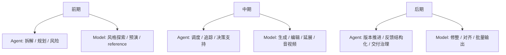
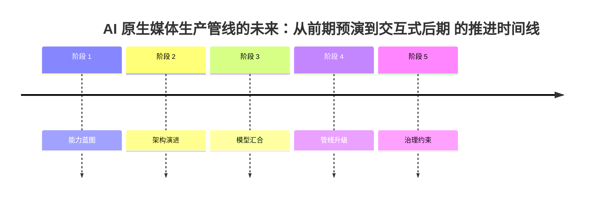

# 109. AI 原生媒体生产管线的未来：从前期预演到交互式后期

这一篇聚焦：

**当视频大模型和智能体真正汇合后，媒体生产管线本身会被重写。未来的生产链不再是“人工流程里插入几个 AI 工具”，而更像“由智能体控制、由多模型支撑、由版本与审批约束”的 AI 原生生产系统。**

---

## 1. 未来生产管线不会消失，但会被重排

电影和视频行业不会突然没有：

- 前期
- 中期
- 后期

这些阶段。

真正会变的是每个阶段内部的组织方式：

- 更多前置模拟
- 更多自动拆解
- 更多多版本并行
- 更多人机共同评审

所以未来不是“没有管线”，而是：

- 管线被 agent 化

---

## 2. 一张总览图：未来 AI 原生媒体管线

---

## 3. 前期会发生什么变化

未来前期最大的变化，不是“更快出图”，而是：

- 更早把项目结构化

### 未来前期的五个典型动作

- 剧本与 brief 自动拆解
- 角色 / 场景 / 资产图谱建立
- 风格与 shot 规划
- 视频 / 图像 / 声音 reference 绑定
- 预算 / 排期 / 风险初评

这里 agent 的作用更大，因为前期本质上是：

- 理解问题
- 组织问题
- 提前暴露问题

---

## 4. 中期的核心变化：生产不再只依赖真实拍摄链

AI 原生媒体生产里，“中期”会变得更复杂。

因为它可能同时包含：

- 实拍
- 虚拟拍摄
- 生成镜头
- 编辑性补镜
- 数字角色

这意味着中期不再是单一路线，而会变成：

- 多源生产合流

系统要做的事情也会更多：

- 追踪镜头来源
- 追踪版本
- 追踪是否进入正式 cut

---

## 5. 后期的核心变化：不是收尾，而是持续迭代中枢

未来后期会越来越不像“最后修一修”，而像：

- 多轮生成与编辑的汇合点

因为：

- 生成镜头要继续修改
- 音视频要继续对齐
- 多版本要并行比较
- 试映与反馈要快速反哺

所以未来后期最重要的不是“某个工具更快”，而是：

- 整个系统有没有稳定的 review / approval / version 链

---

## 6. 一张图：未来每个阶段里 agent 和模型各自做什么

---

## 7. 未来生产管线里的“新瓶颈”会是什么

很多人以为 AI 原生媒体时代的瓶颈还是“生成质量”，但实际上会越来越不是。

未来的新瓶颈更可能是：

- 对象不清楚
- 状态不清楚
- 版本太多
- 审批混乱
- 结果不可复用

也就是说，未来瓶颈会从：

- 生成能力

转向：

- 系统治理能力

---

## 8. 为什么“版本”会成为未来媒体生产的中心对象

AI 原生生产下，版本数会极大增加。

过去一个镜头可能只有：

- rough
- temp
- final

未来一个镜头可能会同时有：

- 多模型版本
- 多指令版本
- 多风格版本
- 多后期修整版本
- 多平台发布版本

因此“版本系统”不再是附属模块，而会变成生产主线的一部分。

---

## 9. 一张版本推进图

---

## 10. 未来生产管线的一个关键变化：评审越来越早、越来越频繁

过去很多 review 集中在后期。  
未来由于生成与编辑都变得更快，review 会更早、更频繁地发生：

- brief review
- style review
- shot review
- asset review
- package review

这意味着未来系统必须天然支持：

- review as workflow

---

## 11. 这对 DeerFlow 的启发

DeerFlow 如果要接住未来生产管线，最重要的不是“让用户在里面直接生成视频”，而是让它成为：

- AI 原生生产管线的控制器

它需要能承接：

- 前期的拆解与预演
- 中期的多源生产追踪
- 后期的 review / approval / release
- 全流程的知识沉淀

这样它才能站在生产链中心，而不是成为外围插件。

---

## 12. 核心结论

未来 AI 原生媒体生产管线最大的变化，不是“某一步更快”，而是：

- 前期更结构化
- 中期更多源合流
- 后期更持续迭代
- 全流程更依赖版本与审批

所以未来真正重要的系统，一定要同时处理：

- 生成
- 编辑
- 状态
- 评审
- 版本
- 交付

这也是 DeerFlow 最值得去承接的生产中枢位置。

---

## 参考资料

- [Google: Flow for filmmaking](https://blog.google/innovation-and-ai/products/google-flow-veo-ai-filmmaking-tool/)
- [Google: Veo 3, Flow and generative media models](https://blog.google/innovation-and-ai/products/generative-media-models-io-2025/)
- [Runway: Introducing Gen-4.5](https://runwayml.com/research/introducing-runway-gen-4.5)
- [Runway: Introducing GWM-1](https://runwayml.com/research/introducing-runway-gwm-1)
- [ByteDance Seed: Seedance 2.0 Official Launch](https://seed.bytedance.com/en/blog/official-launch-of-seedance-2-0)
- [OpenAI: A practical guide to building agents](https://cdn.openai.com/business-guides-and-resources/a-practical-guide-to-building-agents.pdf)

---

<!-- movie-visuals:start -->
## 补充图示：换一种视角看本篇

下面这张 时间线 把“AI 原生媒体生产管线的未来：从前期预演到交互式后期”再压缩成一个可快速扫读的结构视图，便于先抓关键关系，再回到正文细节。

<!-- movie-visuals:end -->

<!-- movie-doc-nav:start -->
## 文档导航

- 总入口：[README.md](./README.md)
- 阅读地图：[00-reading-map.md](./00-reading-map.md)
- 所在分组：103-111 未来能力与媒体操作系统演进
- 上一篇：[108. 视频大模型与智能体的汇合：从生成工具走向媒体操作系统](./108-video-models-and-agents-convergence.md)
- 下一篇：[110. DeerFlow 面向“视频大模型 + 智能体”时代的演进路线](./110-deerflow-roadmap-for-video-agent-era.md)

### 同组文档
- [103. DeerFlow 结合电影 AI 化的总体推进方案总梳理](./103-deerflow-movie-integration-strategy-summary.md)
- [104. DeerFlow 未来应该增加的能力蓝图](./104-deerflow-future-capability-blueprint.md)
- [105. DeerFlow 未来能力的参考架构与图示说明](./105-deerflow-future-reference-architecture.md)
- [106. 视频大模型未来发展的主线：从生成器走向世界模拟器](./106-video-foundation-models-future-evolution.md)
- [107. 智能体未来发展的主线：从对话助手走向工作操作系统](./107-agents-future-evolution.md)
- [108. 视频大模型与智能体的汇合：从生成工具走向媒体操作系统](./108-video-models-and-agents-convergence.md)
- 109. AI 原生媒体生产管线的未来：从前期预演到交互式后期（当前）
- [110. DeerFlow 面向“视频大模型 + 智能体”时代的演进路线](./110-deerflow-roadmap-for-video-agent-era.md)
- [111. 视频大模型与智能体时代的风险、评估与治理](./111-video-agents-risk-evals-and-governance.md)
<!-- movie-doc-nav:end -->
