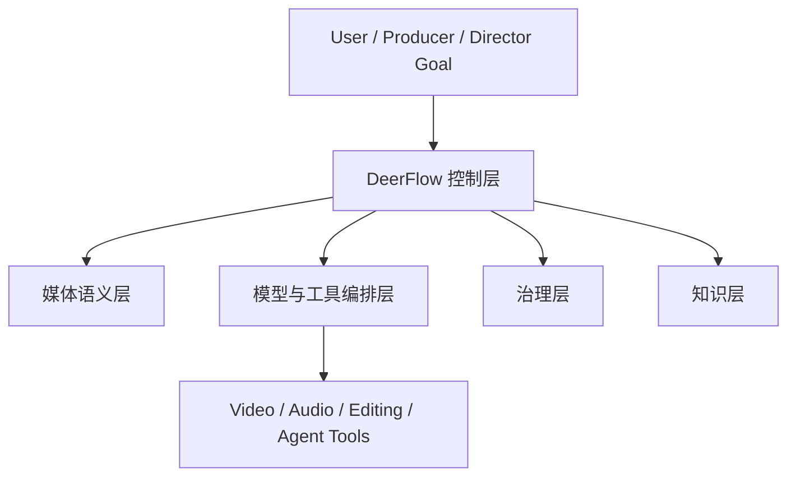
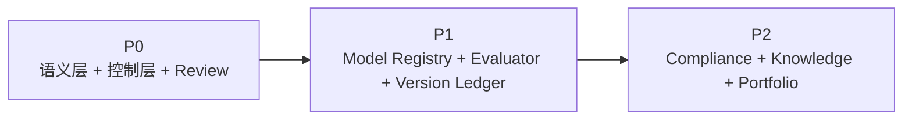
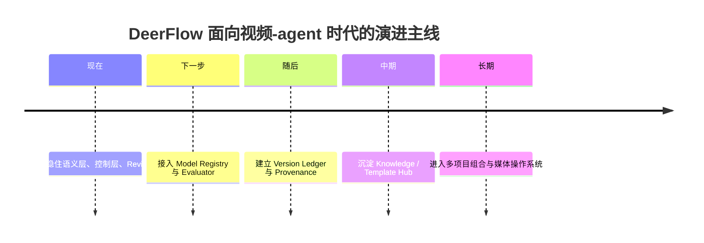
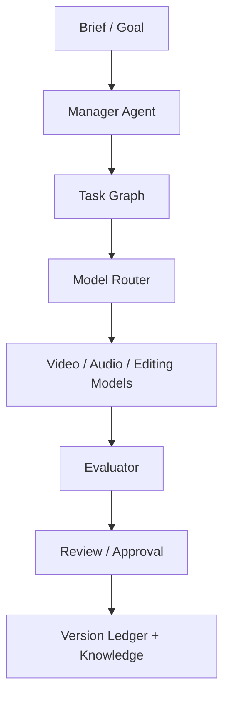
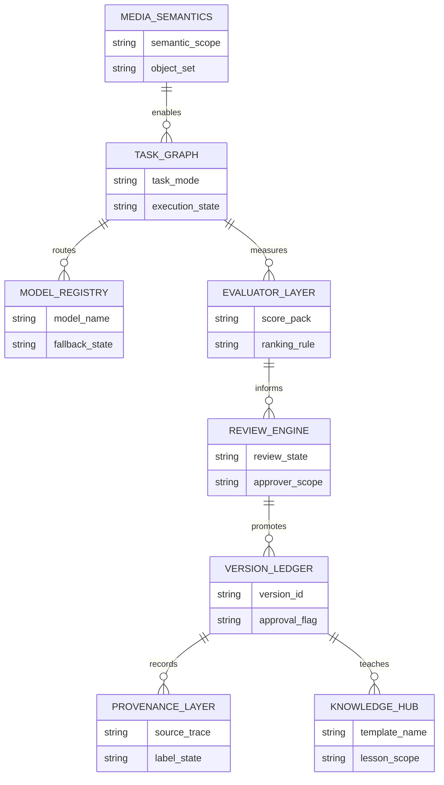
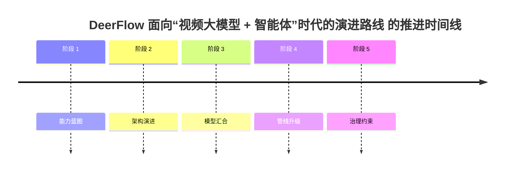

# 110. DeerFlow 面向“视频大模型 + 智能体”时代的演进路线

这一篇聚焦：

**如果说前面几篇是在分析趋势，那么这一篇就是把趋势翻译成 DeerFlow 的下一步路线。核心问题只有一个：当视频模型和智能体开始汇合，DeerFlow 应该补什么、先补什么、怎么补，才能站到未来媒体操作系统的中心。**

---

## 1. 先说结论：DeerFlow 不应该变成“又一个视频面板”，而应该变成“视频工作流总控”

这是最重要的战略判断。

因为未来会有很多：

- 视频模型
- 视频工作台
- 创作面板

但真正稀缺的，反而是：

- 能够把目标、对象、任务、模型、审批、版本、知识串起来的总控系统

所以 DeerFlow 的未来定位应该是：

- media workflow operating system

而不是：

- another media generation app

---

## 2. DeerFlow 面向未来，需要补的不是“更多能力”，而是“更高层能力”

建议把能力分成三层。

### 第一层：媒体语义层

负责理解：

- shot
- sequence
- asset
- style package
- model run
- review round

### 第二层：编排控制层

负责：

- manager agent
- task graph
- model routing
- human approval
- state transitions

### 第三层：治理与复利层

负责：

- version ledger
- provenance
- evaluation
- memory
- template reuse

如果这三层成立，视频模型换了也不怕。

---

## 3. 一张图：DeerFlow 在视频-agent 时代的目标位置

---

## 4. DeerFlow 下一阶段最值得新增的 8 个核心能力

### 能力一：Model Registry

需要记录：

- 模型类别
- 适用任务
- 成本 / 延迟
- 可用区域
- 稳定性
- 退场状态

这是为了应对模型快速换位和停运。

### 能力二：Media Task Graph

把：

- 生成
- 编辑
- 延展
- 比较
- review

变成正式 task graph，而不是聊天里的一串请求。

### 能力三：PromptPack + ReferencePack

未来媒体生成不是一句 prompt，而是：

- 角色参考
- 场景参考
- 风格参考
- 镜头约束
- 声音约束

一起组成的输入包。

### 能力四：Evaluator Layer

自动做：

- 一致性评分
- 风格匹配评分
- brief 对齐度评分
- 版本对比

### 能力五：Review / Approval Engine

支持：

- 人工复核
- gate 推进
- 打回重做
- 发布批准

### 能力六：Version Ledger

记录：

- 谁在什么时候用哪个模型产出了哪一版
- 哪一版被批准
- 哪一版被废弃

### 能力七：Provenance / Compliance Layer

支持：

- AI 标识
- 文件元数据
- 素材来源记录
- 授权边界

### 能力八：Knowledge / Template Hub

沉淀：

- 模型使用经验
- 风格模板
- 项目模板
- 失败案例

---

## 5. 一张优先级图：DeerFlow 应该怎么补能力

### 一张演进时间线

这张图把 110 的优先级图补成了时间维度，更容易从战略规划角度理解“先补什么、后补什么”。

---

## 6. 一个务实判断：DeerFlow 不要先去做“最强生成体验”

这是一个很重要的产品边界判断。

原因有三个：

### 第一，生成体验会被前沿厂商不断刷新

工作台厂商会持续优化：

- 交互
- 模板
- 生成速度
- 内置编辑体验

如果 DeerFlow 直接在这个平面和他们硬拼，会很吃力。

### 第二，真正难的是组织和治理

大多数团队最终卡住的，不是“能不能生成”，而是：

- 结果太散
- 版本太多
- 审批太乱
- 经验无法复用

### 第三，这正好是 DeerFlow 的天然优势

DeerFlow 更擅长的是：

- orchestrate
- govern
- track
- evaluate

这比直接做消费级视频产品更有平台价值。

---

## 7. DeerFlow 未来最适合打的三类场景

### 场景一：电影与剧集前期预演系统

最适合：

- 剧本拆解
- style board
- shot plan
- previs 管线

### 场景二：企业级媒体生产控制台

最适合：

- 品牌视频
- 电商内容
- 多版本宣发
- 审批与批量输出

### 场景三：AI 原生影视工作流中台

最适合：

- 多模型统一接入
- 版本与审批
- 资产与知识沉淀

这三类场景都更接近 DeerFlow 的优势，而不是要求它独立做最好的视频生成器。

---

## 8. 一张流程图：DeerFlow 如何承接一次未来媒体任务

---

## 9. 一个长期判断：DeerFlow 最终应该更像“媒体 ERP + Agent OS”

未来如果 DeerFlow 真做成平台，它不会像普通创意工具，而会更像：

- 媒体对象数据库
- agent 编排系统
- 审批与版本系统
- 评估与知识系统

这也是为什么它最终会更偏：

- system of record
- system of execution

而不是只做：

- system of generation

---

如果把 110 的 8 项核心能力放进依赖关系图，会更容易看出为什么这条路线必须“先语义和控制，再治理和复利”：

---

## 10. 核心结论

当视频模型和智能体进入同一个时代，DeerFlow 最值得做的不是“模仿前沿视频工作台”，而是：

- 成为它们之上的工作流总控

也就是说：

- 让模型负责生成和编辑
- 让 agent 负责理解和调度
- 让 DeerFlow 负责组织、治理、评估和沉淀

这条路线既更稳定，也更容易形成真正的平台护城河。

---

## 参考资料

- [OpenAI: New tools for building agents](https://openai.com/index/new-tools-for-building-agents/)
- [OpenAI: A practical guide to building agents](https://cdn.openai.com/business-guides-and-resources/a-practical-guide-to-building-agents.pdf)
- [Google: Flow for filmmaking](https://blog.google/innovation-and-ai/products/google-flow-veo-ai-filmmaking-tool/)
- [Runway: Introducing GWM-1](https://runwayml.com/research/introducing-runway-gwm-1)
- [ByteDance Seed: Seedance 2.0 Official Launch](https://seed.bytedance.com/en/blog/official-launch-of-seedance-2-0)
- [OpenAI Help Center: What to know about the Sora discontinuation](https://help.openai.com/zh-hant/articles/20001152-what-to-know-about-the-sora-discontinuation)

---

<!-- movie-visuals:start -->
## 补充图示：换一种视角看本篇

下面这张 时间线 把“DeerFlow 面向“视频大模型 + 智能体”时代的演进路线”再压缩成一个可快速扫读的结构视图，便于先抓关键关系，再回到正文细节。

<!-- movie-visuals:end -->

<!-- movie-doc-nav:start -->
## 文档导航

- 总入口：[README.md](./README.md)
- 阅读地图：[00-reading-map.md](./00-reading-map.md)
- 所在分组：103-111 未来能力与媒体操作系统演进
- 上一篇：[109. AI 原生媒体生产管线的未来：从前期预演到交互式后期](./109-ai-native-media-production-pipeline-future.md)
- 下一篇：[111. 视频大模型与智能体时代的风险、评估与治理](./111-video-agents-risk-evals-and-governance.md)

### 同组文档
- [103. DeerFlow 结合电影 AI 化的总体推进方案总梳理](./103-deerflow-movie-integration-strategy-summary.md)
- [104. DeerFlow 未来应该增加的能力蓝图](./104-deerflow-future-capability-blueprint.md)
- [105. DeerFlow 未来能力的参考架构与图示说明](./105-deerflow-future-reference-architecture.md)
- [106. 视频大模型未来发展的主线：从生成器走向世界模拟器](./106-video-foundation-models-future-evolution.md)
- [107. 智能体未来发展的主线：从对话助手走向工作操作系统](./107-agents-future-evolution.md)
- [108. 视频大模型与智能体的汇合：从生成工具走向媒体操作系统](./108-video-models-and-agents-convergence.md)
- [109. AI 原生媒体生产管线的未来：从前期预演到交互式后期](./109-ai-native-media-production-pipeline-future.md)
- 110. DeerFlow 面向“视频大模型 + 智能体”时代的演进路线（当前）
- [111. 视频大模型与智能体时代的风险、评估与治理](./111-video-agents-risk-evals-and-governance.md)
<!-- movie-doc-nav:end -->
