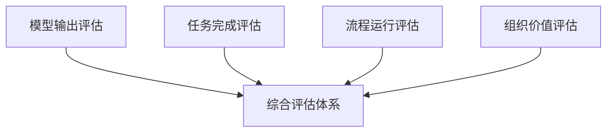
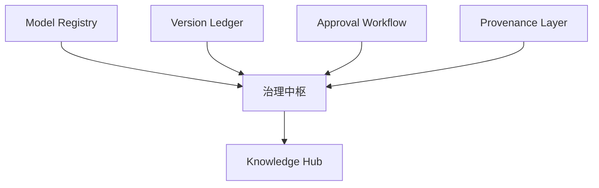
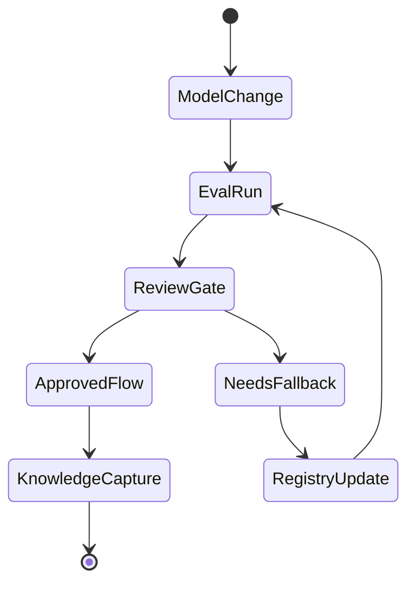
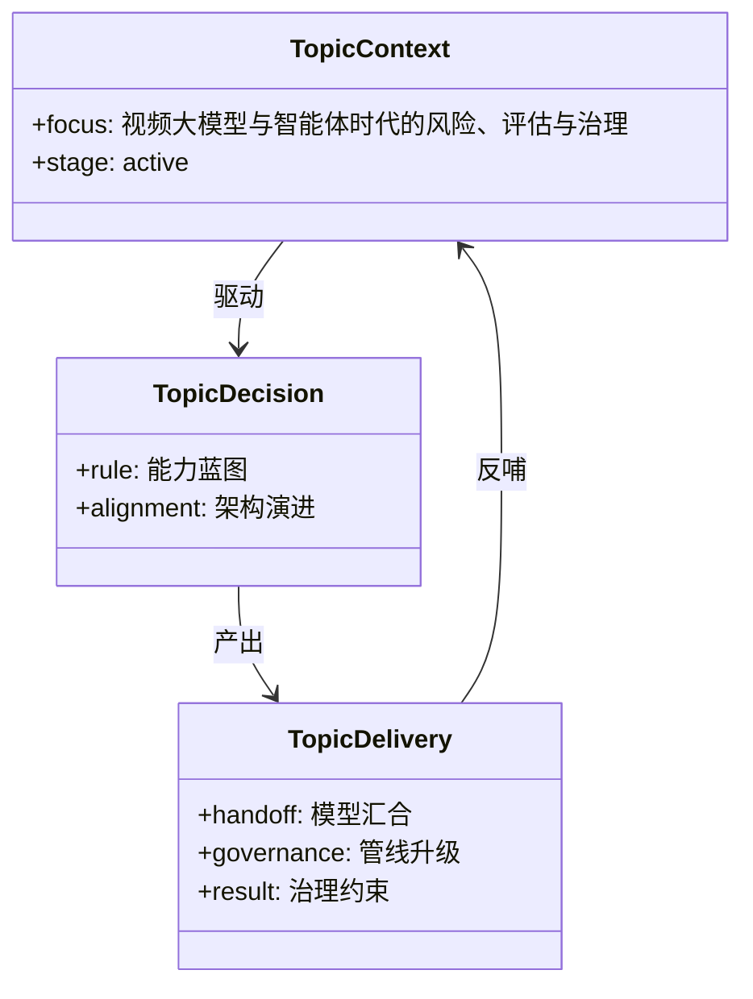

# 111. 视频大模型与智能体时代的风险、评估与治理

这一篇聚焦：

**视频大模型和智能体一旦真正进入生产，最大的难题往往不再是“能不能做出来”，而是“能不能稳定、可审、可追、可复用地做出来”。因此，未来媒体系统的核心能力之一，将是风险控制、评估体系和治理基础设施。**

---

## 1. 为什么这一篇一定要单独写

因为未来很多团队会低估一个问题：

- 生成能力的增长速度，会远快于治理能力

这会直接带来系统性风险：

- 结果太多，人工审不过来
- 版本太乱，正式产物不清楚
- 模型频繁变化，流程不稳定
- 素材来源与授权边界不清
- 项目经验无法沉淀

所以未来的媒体系统，如果没有治理层，基本不可能进入正式生产。

---

## 2. 未来最大的五类风险

### 风险一：模型波动风险

包括：

- 模型性能忽高忽低
- 前沿榜单快速换位
- API 价格波动
- 产品停运或策略变化

### 风险二：输出一致性风险

包括：

- 人物不连续
- 世界观不连续
- 风格漂移
- 声画不同步

### 风险三：流程失控风险

包括：

- 版本泛滥
- 任务无归属
- 审批链缺失
- 结果进入正式交付边界不清

### 风险四：权利与合规风险

包括：

- 训练与参考素材来源不清
- 数字替身与声音复制风险
- 标识缺失
- 地区合规差异

### 风险五：组织复用风险

包括：

- 同样的错误反复出现
- 模型经验只留在人脑里
- 团队换人后系统失忆

---

## 3. 一张风险图：未来媒体系统的风险不是单点，而是链式

```mermaid
flowchart LR
    A["模型波动"] --> F["输出风险"]
    B["输出一致性问题"] --> F
    C["流程失控"] --> G["交付风险"]
    D["权利与合规问题"] --> G
    E["知识不沉淀"] --> H["组织风险"]

    F --> I["平台级风险"]
    G --> I
    H --> I
```

---

## 4. 未来评估体系应该怎么搭

建议不要只做“主观打分”，而要做四层评估。

### 第一层：模型输出评估

关注：

- 画面质量
- 音频质量
- 一致性
- 指令遵循

### 第二层：任务完成评估

关注：

- 是否达成 brief
- 是否达成 shot 目标
- 是否满足风格要求

### 第三层：流程运行评估

关注：

- 任务耗时
- review 轮次
- 打回率
- version churn

### 第四层：组织价值评估

关注：

- 模板复用率
- 经验引用率
- 返工降低情况
- ROI 改善

---

## 5. 一张评估架构图

---

## 6. 为什么“模型评估”必须和“工作流评估”分开

这是很多团队会忽略的点。

一个模型可能：

- 生成效果很好

但仍然不适合某个正式流程，因为它可能：

- 太慢
- 太不稳定
- 太难复现
- 太难治理

所以未来必须把：

- model quality

和：

- workflow fitness

分开评估。

---

## 7. 一套未来媒体系统最少需要哪些治理机制

### 机制一：Model Registry

记录：

- 当前可用模型
- 适用任务
- 质量与成本
- 风险等级
- 退场状态

### 机制二：Version Ledger

记录：

- 每次产出
- 使用模型
- 输入包
- 审批状态
- 去向

### 机制三：Approval Workflow

记录：

- 谁审核
- 谁打回
- 谁批准
- 哪一版成为正式版本

### 机制四：Provenance Layer

记录：

- 内容来源
- 参考来源
- AI 参与度
- 标识状态

### 机制五：Knowledge Hub

记录：

- 最佳实践
- 常见失败模式
- 风格模板
- 项目复盘

---

## 8. 一张治理骨架图

---

## 9. 为什么 Sora 2 的退出是一个治理提醒

Sora 的退出并不只是市场新闻，它对系统设计有一个很实际的提醒：

- 供应商不会永远稳定存在

这意味着未来平台必须具备：

- 迁移
- fallback
- 导出
- 替换
- 重评估

否则一旦产品停运，项目资产和工作流都会被牵连。

---

## 10. 为什么中国前沿模型的快速换位同样是治理提醒

Seedance 2.0、HappyHorse-1.0 等中国模型的快速上升，说明另一种风险：

- 新模型可能很快变得更强

如果平台不能快速比较、路由、回滚和替换，就会陷入：

- 明知更好的模型出现了，但系统换不起

所以治理不是保守，而是为了更快适应变化。

---

## 11. DeerFlow 最值得建立的未来治理能力

对 DeerFlow 来说，最关键的不是“再多加一个 dashboard”，而是建立真正可运行的治理闭环：

- 模型注册
- task 留痕
- review / approval
- version ledger
- provenance
- evals
- lessons learned

这些能力一旦做成，DeerFlow 就不只是“能接模型”，而是：

- 能管理模型生态

---

如果把风险、评估、治理放进闭环状态图，会更容易看出为什么未来平台真正比拼的是“能否持续消化不确定性”：

---

## 12. 核心结论

视频大模型与智能体时代，真正会拉开平台差距的，不只是生成质量，而是：

- 评估是否成体系
- 风险是否可前置
- 治理是否可运行
- 知识是否能复利

所以未来最强的平台，未必是“最会生成”的平台，而很可能是：

- 最会控制不确定性的平台

这也是 DeerFlow 最有希望建立长期价值的位置。

---

## 参考资料

- [OpenAI: New tools for building agents](https://openai.com/index/new-tools-for-building-agents/)
- [OpenAI: A practical guide to building agents](https://cdn.openai.com/business-guides-and-resources/a-practical-guide-to-building-agents.pdf)
- [OpenAI Help Center: What to know about the Sora discontinuation](https://help.openai.com/zh-hant/articles/20001152-what-to-know-about-the-sora-discontinuation)
- [Runway: Introducing GWM-1](https://runwayml.com/research/introducing-runway-gwm-1)
- [ByteDance Seed: Seedance 2.0 Official Launch](https://seed.bytedance.com/en/blog/official-launch-of-seedance-2-0)
- [Anthropic: Introducing the Model Context Protocol](https://www.anthropic.com/news/model-context-protocol)
- [Caixin Global: Alibaba unveils HappyHorse](https://www.caixinglobal.com/2026-04-10/alibaba-unveils-happyhorse-after-ai-model-tops-video-rankings-under-alias-102432775.html)

---

<!-- movie-visuals:start -->
## 补充图示：换一种视角看本篇

下面这张 类图 把“视频大模型与智能体时代的风险、评估与治理”再压缩成一个可快速扫读的结构视图，便于先抓关键关系，再回到正文细节。

<!-- movie-visuals:end -->

<!-- movie-doc-nav:start -->
## 文档导航

- 总入口：[README.md](./README.md)
- 阅读地图：[00-reading-map.md](./00-reading-map.md)
- 所在分组：103-111 未来能力与媒体操作系统演进
- 上一篇：[110. DeerFlow 面向“视频大模型 + 智能体”时代的演进路线](./110-deerflow-roadmap-for-video-agent-era.md)
- 下一篇：[112. 利用 AI 编程与多智能体推进当前计划落地的总实施方案](./112-ai-coding-and-multi-agent-delivery-plan.md)

### 同组文档
- [103. DeerFlow 结合电影 AI 化的总体推进方案总梳理](./103-deerflow-movie-integration-strategy-summary.md)
- [104. DeerFlow 未来应该增加的能力蓝图](./104-deerflow-future-capability-blueprint.md)
- [105. DeerFlow 未来能力的参考架构与图示说明](./105-deerflow-future-reference-architecture.md)
- [106. 视频大模型未来发展的主线：从生成器走向世界模拟器](./106-video-foundation-models-future-evolution.md)
- [107. 智能体未来发展的主线：从对话助手走向工作操作系统](./107-agents-future-evolution.md)
- [108. 视频大模型与智能体的汇合：从生成工具走向媒体操作系统](./108-video-models-and-agents-convergence.md)
- [109. AI 原生媒体生产管线的未来：从前期预演到交互式后期](./109-ai-native-media-production-pipeline-future.md)
- [110. DeerFlow 面向“视频大模型 + 智能体”时代的演进路线](./110-deerflow-roadmap-for-video-agent-era.md)
- 111. 视频大模型与智能体时代的风险、评估与治理（当前）
<!-- movie-doc-nav:end -->
