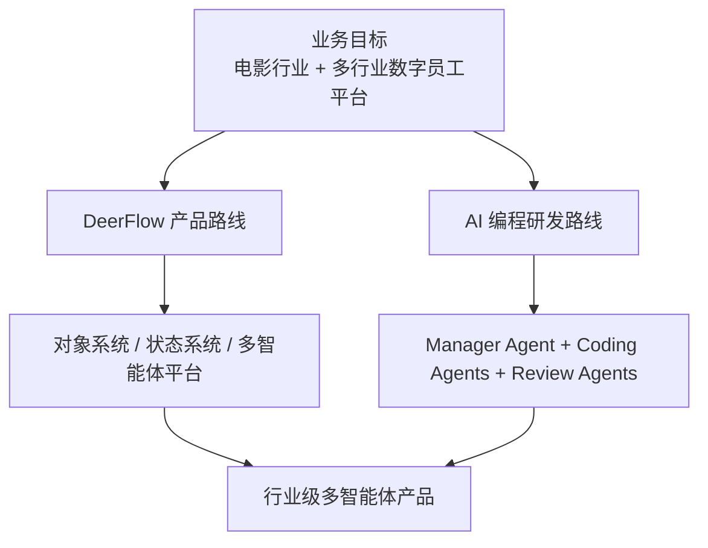
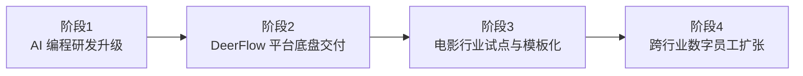
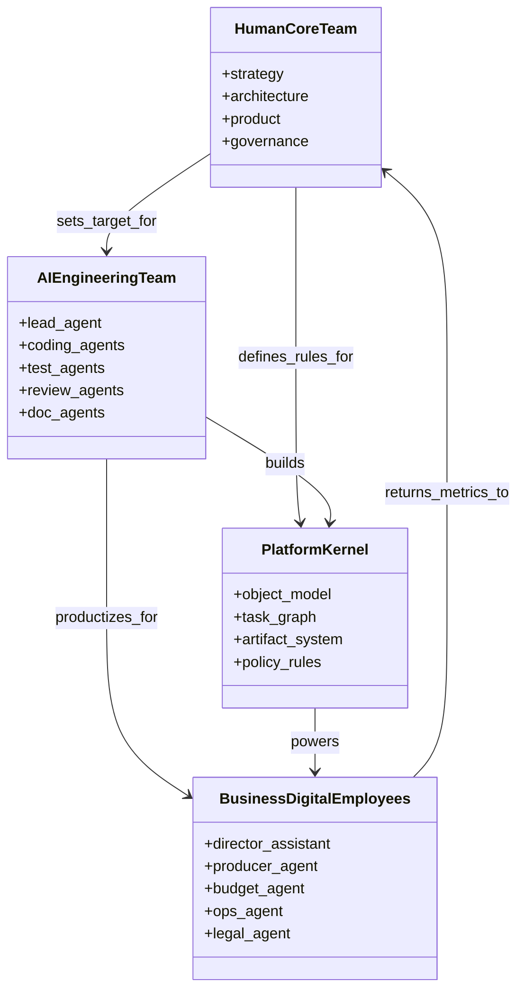

# 112. 利用 AI 编程与多智能体推进当前计划落地的总实施方案

这一篇聚焦：

**结合前面整套文档体系，如果现在就要推进 DeerFlow 的落地，最现实的路径不是先搭一个“大而全平台”，而是借助 AI 编程和多智能体，把平台研发本身也变成一条 agent-first 的交付链。**

---

## 1. 先把一句话结论说清楚

当前计划的落地，应该同时推进两条线：

- 一条是产品线：把 DeerFlow 做成面向电影与更多行业的多智能体操作系统
- 一条是研发线：用 AI 编程和多智能体，把 DeerFlow 自己的研发过程 agent 化

换句话说：

- 不是“先做平台，再考虑 AI 编程”
- 而是“平台建设过程本身，就应该由 AI 编程和多智能体加速”

这会带来两个直接收益：

- 研发交付速度显著提升
- 平台本身的组织方式可以先在内部被验证

---

## 2. 为什么现在是落地的好时点

2025-2026 年，AI 编程与 agent 开发已经出现了几个关键变化：

- OpenAI 把 Responses API、built-in tools、Agents SDK 和 observability 组合成 agent builder 平台
- OpenAI Codex app 明确把“同时管理多个 agent、并行工作、长任务协作”做成产品形态
- Anthropic 把 Claude Code 做成 agentic coding system，并把 MCP 推成连接数据与工具的开放协议
- Google 用 Gemini CLI 和 Antigravity 把 manager surface、多 agent 异步工作、Artifacts review 做成开发者工作台
- GitHub 把 Copilot coding agent、Copilot CLI、IDE agent mode 和 MCP 支持推向正式开发流程

这些变化说明：

- AI 编程已经不再只是代码补全
- 多智能体协作也不再只是研究概念

对于 DeerFlow 来说，这正好是把“产品路线”和“研发路线”统一起来的窗口期。

---

## 3. 一张总图：如何一边造平台，一边用平台的思想造平台

---

## 4. 建议按四层来推进落地

### 第一层：研发方式升级

先把团队的研发方式从：

- 人工串行开发

升级为：

- 人类架构主导 + AI 编程并行交付

这一层的核心目标是：

- 让研发效率先提升
- 让团队先习惯 agent-first 的工作方式

### 第二层：平台底盘交付

在 AI 编程协助下，优先落：

- 对象系统
- 线程状态
- Lead Agent 总控
- subagent registry
- movie tools runtime
- review / approval / version 基础设施

### 第三层：行业场景试点

先用电影行业跑通：

- 前期方案闭环
- 中期执行闭环
- 后期 review / release 闭环

然后沉淀成模板。

### 第四层：跨行业数字员工扩张

在电影行业完成模板化之后，把 DeerFlow 的核心抽象扩展到：

- 内容行业
- 电商
- 教育
- 金融运营
- 法务与合规
- 客服和企业服务

也就是说：

- 电影是第一垂类
- 数字员工平台才是长期平台目标

---

## 5. 一张路线图：怎么从“项目落地”走向“数字员工平台”

---

## 6. 利用 AI 编程推进落地，最现实的做法是什么

建议不要一开始就让 AI “自动写完整个平台”，而要采用：

- 人类负责架构、边界、关键决策
- AI 负责并行探索、模块实现、测试修复、文档同步

更具体一点：

### 人类负责

- 目标定义
- 架构设计
- 核心接口
- 安全边界
- 最终 review

### AI coding agents 负责

- 单模块实现
- 测试编写与修复
- 文档更新
- 工具接入
- 回归验证
- 样例和模板生成

这本质上就是：

- 把研发团队本身变成一个人机混编团队

---

## 7. 未来落地时最值得采用的研发组织模式

建议使用三层组织。

### 第一层：人类核心团队

负责：

- 战略
- 架构
- 产品
- 安全与治理

### 第二层：AI 团队

负责：

- 编码 agent
- 测试 agent
- 文档 agent
- 研究 agent
- review agent
- 运维与回归 agent

### 第三层：行业数字员工层

负责：

- 导演助理 agent
- 制片 agent
- 预算 agent
- 运营 agent
- 客服 agent
- 法务 agent

前两层用来“造平台”，第三层用来“跑业务”。

---

## 8. 一个关键判断：平台落地的真正瓶颈已经不是编码，而是组织

随着 AI 编程越来越强，真正限制速度的往往不再是：

- 有没有人写代码

而是：

- 有没有清晰的对象模型
- 有没有稳定的任务拆分
- 有没有正式 review 流程
- 有没有足够好的产出管理

所以当前计划要想落地，必须同步建设：

- 工程组织
- 人机协作模式
- 产出治理

---

## 9. 这篇的操作性结论

如果把这篇压缩成一句执行建议，就是：

**用 AI 编程和多智能体来建设 DeerFlow，自身先跑通一套 agent-first 研发组织，再把这套组织能力产品化，变成面向电影行业和更多行业的数字员工平台。**

---

## 参考资料

- [OpenAI: New tools for building agents](https://openai.com/index/new-tools-for-building-agents/)
- [OpenAI: A practical guide to building agents](https://cdn.openai.com/business-guides-and-resources/a-practical-guide-to-building-agents.pdf)
- [OpenAI: Introducing Codex](https://openai.com/index/introducing-codex/)
- [OpenAI: Introducing the Codex app](https://openai.com/index/introducing-the-codex-app/)
- [OpenAI: Introducing GPT-5.3-Codex](https://openai.com/index/introducing-gpt-5-3-codex/)
- [Anthropic: Claude Code](https://www.anthropic.com/product/claude-code)
- [Anthropic: Introducing the Model Context Protocol](https://www.anthropic.com/news/model-context-protocol)
- [Google: Gemini CLI](https://blog.google/innovation-and-ai/technology/developers-tools/introducing-gemini-cli-open-source-ai-agent/)
- [Google Developers Blog: Antigravity](https://developers.googleblog.com/build-with-google-antigravity-our-new-agentic-development-platform/)
- [GitHub: Copilot coding agent GA](https://github.blog/changelog/2025-09-25-copilot-coding-agent-is-now-generally-available/)

---

<!-- movie-visuals:start -->
## 补充图示：换一种视角看本篇

下面这张类图把“平台建设团队”和“数字员工业务层”放进同一张图里，能更直接看清这篇最重要的主线：先由人类核心团队定义边界，再由 AI 研发团队把平台做出来，最后让业务数字员工运行在这个平台之上。

<!-- movie-visuals:end -->

<!-- movie-doc-nav:start -->
## 文档导航

- 总入口：[README.md](./README.md)
- 阅读地图：[00-reading-map.md](./00-reading-map.md)
- 所在分组：112-118 AI 研发组织、交付与协作模式
- 上一篇：[111. 视频大模型与智能体时代的风险、评估与治理](./111-video-agents-risk-evals-and-governance.md)
- 下一篇：[113. 人类团队与 AI 团队的组织设计](./113-human-team-and-ai-team-organization-design.md)

### 同组文档
- 112. 利用 AI 编程与多智能体推进当前计划落地的总实施方案（当前）
- [113. 人类团队与 AI 团队的组织设计](./113-human-team-and-ai-team-organization-design.md)
- [114. AI 编程工厂与多智能体研发协作模式](./114-ai-engineering-factory-and-collaboration-mode.md)
- [115. 人类与 AI、多智能体之间的协作手册](./115-human-ai-collaboration-playbook.md)
- [116. 产出管理、Artifacts 与知识沉淀体系](./116-output-management-and-agent-artifacts-system.md)
- [117. 数字员工扩张框架：从电影行业走向各行各业的多智能体需求](./117-digital-employees-expansion-framework.md)
- [118. 项目治理、推进路线与经营指标](./118-program-governance-roadmap-and-operating-metrics.md)
<!-- movie-doc-nav:end -->
