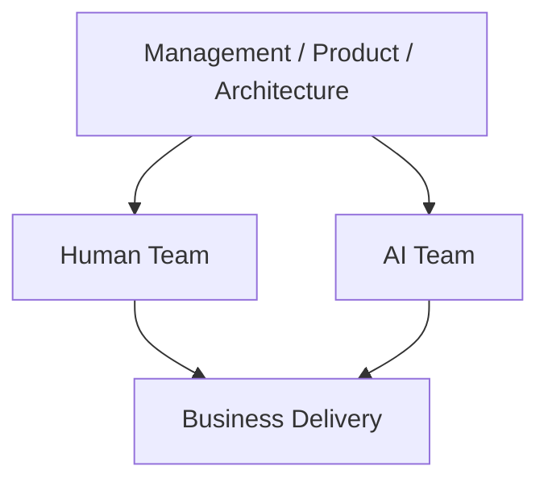
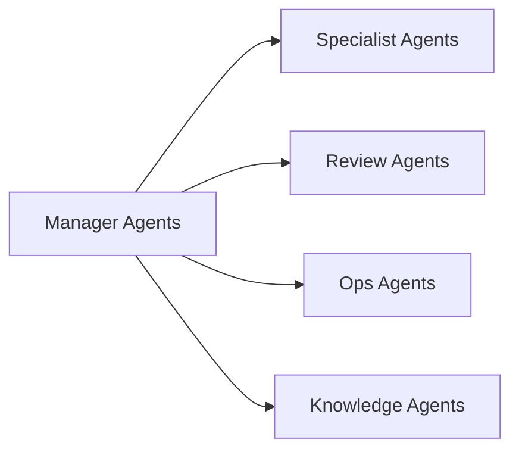
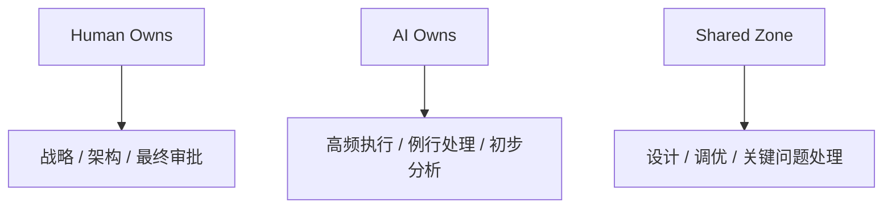
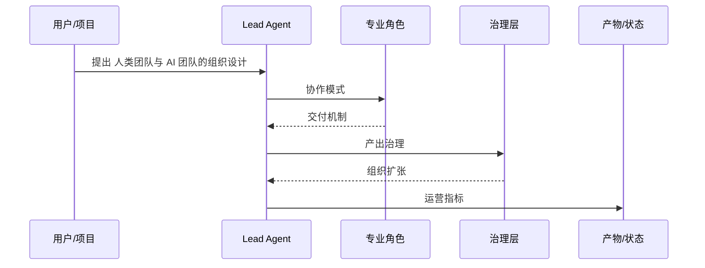

# 113. 人类团队与 AI 团队的组织设计

这一篇聚焦：

**当 DeerFlow 进入多智能体和数字员工时代，组织设计就不能只停留在人类岗位表上，而要同时设计“人类团队结构”和“AI 团队结构”，并明确两者如何协作、谁做决策、谁做执行、谁做守门。**

---

## 1. 为什么要把“AI 团队”单独建模

如果还用传统组织图来看未来团队，很容易漏掉一个事实：

- AI 不再只是工具
- AI 开始承担持续性的岗位职责

这意味着组织里会逐渐出现两种团队：

- Human Team
- AI Team

如果不把 AI 团队单独建模，最终很容易出现：

- 没人知道哪些事是 agent 在做
- 没人知道谁在管理 agent
- 没人知道 agent 的产出如何进入正式流程

---

## 2. 一张总图：未来团队的双层组织

---

## 3. 建议的人类核心团队结构

### 3.1 平台负责人

负责：

- 平台战略
- 优先级
- 预算与资源
- 对外业务结果

### 3.2 产品与场景团队

负责：

- 行业需求拆解
- 工作流定义
- 数字员工角色设计
- 用户体验与试点推进

### 3.3 架构与平台团队

负责：

- 对象模型
- agent runtime
- tool runtime
- review / version / audit 体系

### 3.4 安全与治理团队

负责：

- 权限
- 合规
- 风险策略
- 数据与审计

### 3.5 行业解决方案团队

负责：

- 电影
- 电商
- 教育
- 金融
- 法务等垂类方案模板

---

## 4. 建议的 AI 团队结构

AI 团队不应该被理解成“一个总 agent”，而应该是多角色组织。

### 4.1 Manager Agents

负责：

- 理解目标
- 拆分任务
- 路由子 agent
- 汇总结果

### 4.2 Specialist Agents

负责：

- 剧本分析
- 编码
- 测试
- 文档
- 预算
- 排期
- 法务
- 客服

### 4.3 Review Agents

负责：

- 风险初筛
- 一致性检查
- 规则检查
- 版本比较

### 4.4 Ops Agents

负责：

- 回归验证
- 监控
- 任务重试
- 产物整理
- 指标采集

### 4.5 Knowledge Agents

负责：

- 模板沉淀
- 经验归档
- FAQ / SOP 更新
- 跨项目知识回收

---

## 5. 一张图：AI 团队的内部分工

---

## 6. 人类团队和 AI 团队如何分工

建议遵循三个原则。

### 原则一：决策权留在人类

包括：

- 战略
- 架构
- 风险授权
- 最终审批

### 原则二：高频执行交给 AI

包括：

- 文档整理
- 代码实现
- 回归验证
- 版本比较
- 例行分析

### 原则三：边界工作由人机共同完成

包括：

- 方案设计
- 复杂排障
- 关键版本放行
- 客户沟通

---

## 7. 一张职责边界图

---

## 8. 为什么未来要设“AI Team Lead”

这会是一个非常重要的新角色。

AI Team Lead 不只是“懂提示词的人”，而是负责：

- agent 角色设计
- 任务边界设计
- 质量守门
- 模型路由策略
- 评估指标
- agent roster 管理

这个角色未来很像：

- 人类团队中的 AI 组织经理

---

## 9. 团队扩张时，应该先加人还是先加数字员工

建议优先判断三件事：

### 第一，任务是否高度重复

如果是，就先加数字员工。

### 第二，任务是否需要复杂授权判断

如果是，就先保留在人类主导。

### 第三，任务是否可以结构化

如果可以，就非常适合 agent 化。

因此未来很多团队的扩张逻辑会逐步变成：

- 先加 agent
- 再看是否必须加人

---

## 10. 各行业数字员工会怎么长出来

未来数字员工不会只出现在电影行业。

它们会沿着“高频流程 + 多文档 + 多系统 + 多审批”的行业长出来，例如：

- 电商：选品 agent、投放 agent、客服 agent、退货治理 agent
- 教育：课程设计 agent、教辅生成 agent、助教 agent、教务 agent
- 金融运营：报表 agent、风控辅助 agent、合规文档 agent
- 法务：合同审阅 agent、知识检索 agent、流程跟踪 agent
- 软件研发：编码 agent、测试 agent、review agent、发布 agent

电影行业只是第一批非常好的试验场。

---

## 11. 核心结论

未来组织设计必须同时回答两件事：

1. 人类团队怎么搭
2. AI 团队怎么搭

真正成熟的平台，不会只是“给团队发几个 AI 工具”，而是：

- 让团队拥有正式的 AI 组织结构

这也是 DeerFlow 长期最值得建设的组织能力底座。

---

## 参考资料

- [OpenAI: Introducing the Codex app](https://openai.com/index/introducing-the-codex-app/)
- [OpenAI: Introducing GPT-5.3-Codex](https://openai.com/index/introducing-gpt-5-3-codex/)
- [Anthropic: Claude Code](https://www.anthropic.com/product/claude-code)
- [Google Developers Blog: Antigravity](https://developers.googleblog.com/build-with-google-antigravity-our-new-agentic-development-platform/)
- [GitHub: Copilot coding agent GA](https://github.blog/changelog/2025-09-25-copilot-coding-agent-is-now-generally-available/)

---

<!-- movie-visuals:start -->
## 补充图示：换一种视角看本篇

下面这张 时序图 把“人类团队与 AI 团队的组织设计”再压缩成一个可快速扫读的结构视图，便于先抓关键关系，再回到正文细节。

<!-- movie-visuals:end -->

<!-- movie-doc-nav:start -->
## 文档导航

- 总入口：[README.md](./README.md)
- 阅读地图：[00-reading-map.md](./00-reading-map.md)
- 所在分组：112-118 AI 研发组织、交付与协作模式
- 上一篇：[112. 利用 AI 编程与多智能体推进当前计划落地的总实施方案](./112-ai-coding-and-multi-agent-delivery-plan.md)
- 下一篇：[114. AI 编程工厂与多智能体研发协作模式](./114-ai-engineering-factory-and-collaboration-mode.md)

### 同组文档
- [112. 利用 AI 编程与多智能体推进当前计划落地的总实施方案](./112-ai-coding-and-multi-agent-delivery-plan.md)
- 113. 人类团队与 AI 团队的组织设计（当前）
- [114. AI 编程工厂与多智能体研发协作模式](./114-ai-engineering-factory-and-collaboration-mode.md)
- [115. 人类与 AI、多智能体之间的协作手册](./115-human-ai-collaboration-playbook.md)
- [116. 产出管理、Artifacts 与知识沉淀体系](./116-output-management-and-agent-artifacts-system.md)
- [117. 数字员工扩张框架：从电影行业走向各行各业的多智能体需求](./117-digital-employees-expansion-framework.md)
- [118. 项目治理、推进路线与经营指标](./118-program-governance-roadmap-and-operating-metrics.md)
<!-- movie-doc-nav:end -->
