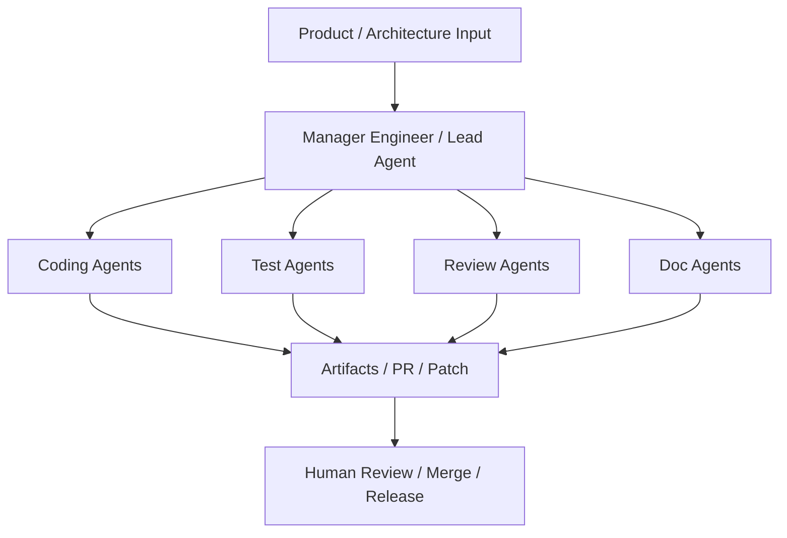
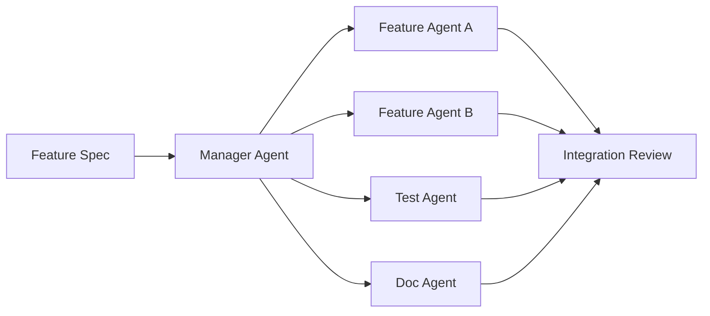

# 114. AI 编程工厂与多智能体研发协作模式

这一篇聚焦：

**如果 DeerFlow 要真正落地，研发组织本身也应该升级成一座“AI 编程工厂”。核心不是每个人都去单独用一个 coding agent，而是建立一种多智能体并行研发、Artifacts review、异步协作、可回放交付的工程模式。**

---

## 1. 为什么要从“工程团队”升级成“AI 编程工厂”

因为 2026 年 AI 编程工具已经明显出现几个共同特征：

- 支持长任务
- 支持多 agent 并行
- 支持 terminal / IDE / browser 一体工作
- 支持通过 Artifacts 而不是纯日志来 review
- 支持异步委派

这意味着未来研发效率不再只取决于：

- 工程师个人写代码的速度

还取决于：

- 组织是否能高效调度多个 coding agents

---

## 2. 一张图：AI 编程工厂的基本结构

---

## 3. 建议的研发协作模式：三段式

### 第一段：人类定义目标

包括：

- 范围
- 边界
- 验收标准
- 风险点

### 第二段：AI 并行生产

包括：

- 模块实现
- 测试生成
- 文档同步
- 回归验证

### 第三段：人类 review 与整合

包括：

- 架构对齐
- 安全检查
- 行为确认
- 放行与回滚策略

这三段式特别适合 DeerFlow 这种复杂平台建设。

---

## 4. 为什么要强调 Artifacts，而不是只看日志

Google Antigravity 提出一个很重要的判断：

- review 应该基于 Artifacts，而不只是 raw logs

这对 DeerFlow 非常有启发。

研发里最适合 review 的 artifact 包括：

- 实现计划
- patch summary
- test results
- screenshots
- browser recordings
- PR draft
- migration notes

因为真正能建立信任的，不是“agent 说自己做完了”，而是：

- agent 能给出可审阅的产物

---

## 5. 多智能体研发时，建议如何分角色

### 5.1 Lead Engineer / Manager Agent

负责：

- 总任务拆解
- agent 指派
- 结果整合
- 风险汇报

### 5.2 Feature Agents

负责：

- 独立模块开发
- UI / API / backend slice 改动

### 5.3 Test Agents

负责：

- 测试编写
- 失败复现
- 回归验证

### 5.4 Review Agents

负责：

- 差异比对
- 规范扫描
- 风险点提示

### 5.5 Documentation Agents

负责：

- README
- 变更说明
- ADR / RFC
- 操作手册

---

## 6. 一张并行开发图

---

## 7. DeerFlow 团队最适合采用的节奏

建议不是一周一个大瀑布，而是：

- 日常异步多 agent 并行
- 周度人类整合 review
- 双周架构复盘

更具体一点：

### 日常

- 产品出 issue / task
- manager agent 派发
- coding agents 并行
- review agents 做初筛

### 周度

- 人类 lead review 核心 PR / patch
- 调整 agent roster
- 调整模型策略

### 双周

- 看 metrics
- 看返工率
- 看 agent 成功率
- 更新 SOP 和模板

---

## 8. 为什么“异步协作”会成为主流

Codex app、Copilot coding agent、Antigravity manager surface 都在强调一件事：

- agent 不一定要同步跟着你聊天

更高效的方式是：

- 你发任务
- 它后台跑
- 产出 artifact
- 你回来 review

这会让研发越来越像：

- 管理一组数字工程师，而不是实时驱动一个补全工具

---

## 9. AI 编程工厂里最重要的四个指标

### 指标一：交付吞吐量

- 每周完成的任务数
- 每周并行 agent 数

### 指标二：质量稳定性

- 测试通过率
- review 打回率
- 生产回归率

### 指标三：协作效率

- 从需求到首个 artifact 的时间
- 从 artifact 到 merge 的时间

### 指标四：知识复用率

- 模板使用率
- 相似问题复用率

---

## 10. 核心结论

未来 DeerFlow 的研发团队最值得追求的，不是“每个人各自配一个 AI 工具”，而是：

- 建立一座 AI 编程工厂

它的核心特征是：

- 多智能体并行
- Artifacts 驱动 review
- 异步协作
- 指标化运营
- 持续沉淀模板

这也是 DeerFlow 最适合先在自己内部验证、再产品化输出给客户的能力。

---

## 参考资料

- [OpenAI: Introducing the Codex app](https://openai.com/index/introducing-the-codex-app/)
- [OpenAI: Introducing GPT-5.3-Codex](https://openai.com/index/introducing-gpt-5-3-codex/)
- [Anthropic: Claude Code](https://www.anthropic.com/product/claude-code)
- [Google Developers Blog: Antigravity](https://developers.googleblog.com/build-with-google-antigravity-our-new-agentic-development-platform/)
- [Google: Gemini CLI](https://blog.google/innovation-and-ai/technology/developers-tools/introducing-gemini-cli-open-source-ai-agent/)
- [GitHub: Copilot coding agent GA](https://github.blog/changelog/2025-09-25-copilot-coding-agent-is-now-generally-available/)
- [GitHub: Copilot CLI GA](https://github.blog/changelog/2026-02-25-github-copilot-cli-is-now-generally-available/)

---

---

<!-- movie-doc-nav:start -->
## 文档导航

- 总入口：[README.md](./README.md)
- 阅读地图：[00-reading-map.md](./00-reading-map.md)
- 所在分组：112-118 AI 研发组织、交付与协作模式
- 上一篇：[113. 人类团队与 AI 团队的组织设计](./113-human-team-and-ai-team-organization-design.md)
- 下一篇：[115. 人类与 AI、多智能体之间的协作手册](./115-human-ai-collaboration-playbook.md)

### 同组文档
- [112. 利用 AI 编程与多智能体推进当前计划落地的总实施方案](./112-ai-coding-and-multi-agent-delivery-plan.md)
- [113. 人类团队与 AI 团队的组织设计](./113-human-team-and-ai-team-organization-design.md)
- 114. AI 编程工厂与多智能体研发协作模式（当前）
- [115. 人类与 AI、多智能体之间的协作手册](./115-human-ai-collaboration-playbook.md)
- [116. 产出管理、Artifacts 与知识沉淀体系](./116-output-management-and-agent-artifacts-system.md)
- [117. 数字员工扩张框架：从电影行业走向各行各业的多智能体需求](./117-digital-employees-expansion-framework.md)
- [118. 项目治理、推进路线与经营指标](./118-program-governance-roadmap-and-operating-metrics.md)
<!-- movie-doc-nav:end -->
