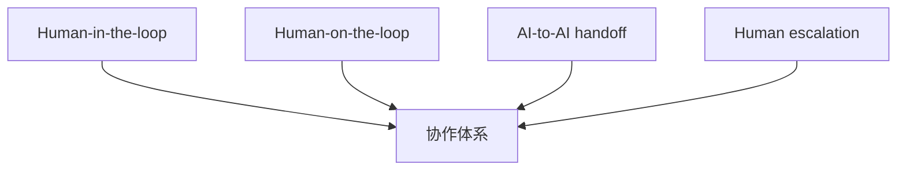
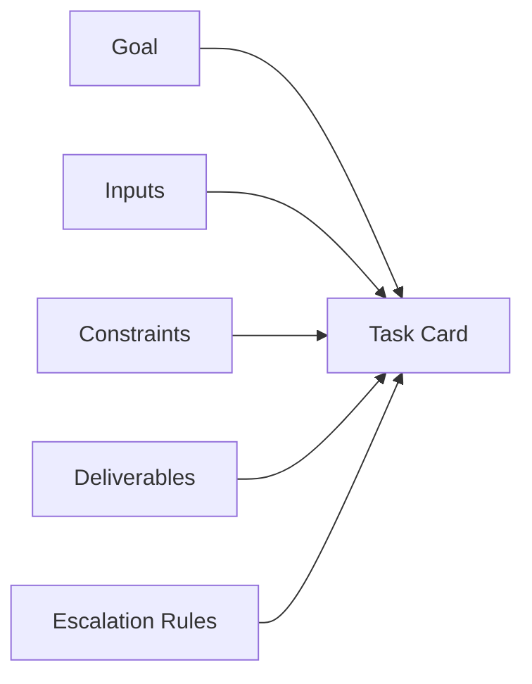
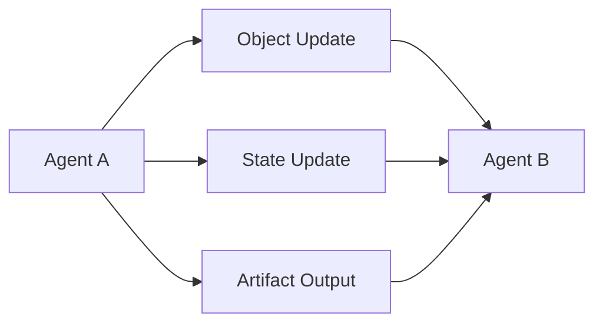
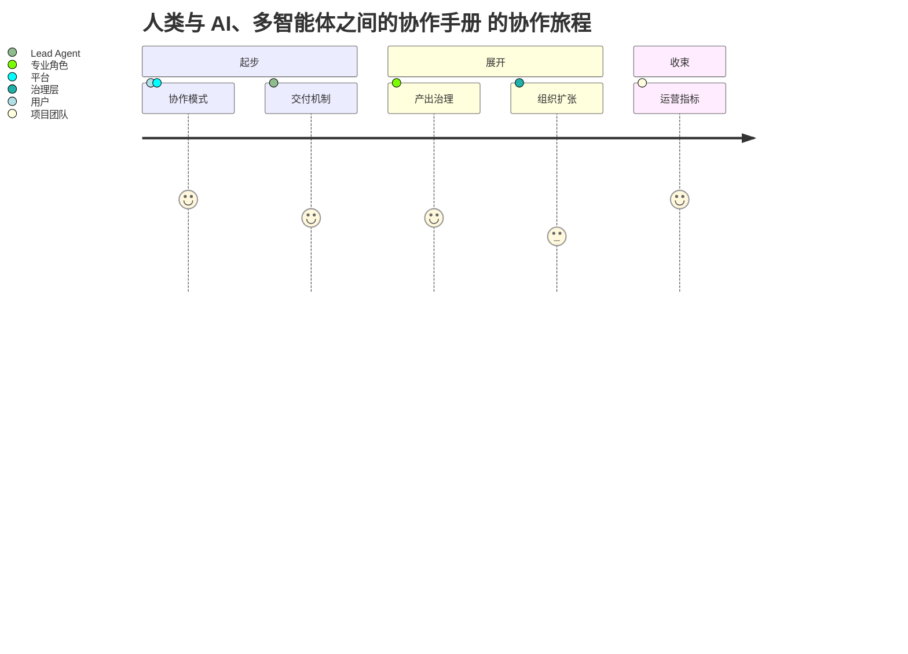

# 115. 人类与 AI、多智能体之间的协作手册

这一篇聚焦：

**平台落地真正会卡住的地方，通常不是模型能力，而是协作模式。人类怎么给任务、AI 怎么回产物、AI 与 AI 怎么接力、人类什么时候介入、什么东西必须审批，这些都必须被写成正式 playbook。**

---

## 1. 协作模式为什么要被制度化

如果没有明确协作模式，团队很容易陷入：

- AI 什么都能做一点
- 但没人知道怎么安全地用它

所以未来组织需要的不只是工具使用指南，而是：

- 协作制度

---

## 2. 建议采用四种协作模式

### 模式一：Human-in-the-loop

适合：

- 关键决策
- 高风险任务
- 正式放行

特点：

- AI 先产出
- 人类确认后继续

### 模式二：Human-on-the-loop

适合：

- 中风险执行任务
- 可回滚任务
- 流程化工作

特点：

- AI 连续执行
- 人类通过面板和 artifact 观察

### 模式三：AI-to-AI handoff

适合：

- 多步骤任务
- 不同专业角色分工

特点：

- manager agent 发起
- specialist agent 接力

### 模式四：Human escalation

适合：

- 无法判断
- 规则冲突
- 权限不足
- 业务高风险

特点：

- AI 主动升级给人类

---

## 3. 一张图：未来协作模式总览

---

## 4. 任务应该怎么写，AI 才能稳定协作

建议每个任务至少包含六个字段：

- 目标
- 输入
- 约束
- 输出
- 验收标准
- 升级条件

这样做的原因是：

- AI 不是靠“感觉”稳定工作的
- AI 需要结构化任务

---

## 5. 一张任务卡模板图

---

## 6. 人类应该在什么时候介入

建议把介入点固定在下面这些节点：

### 节点一：目标设定

人类必须参与。

### 节点二：关键方案选择

人类必须参与。

### 节点三：高风险发布

人类必须参与。

### 节点四：不确定性过高

AI 必须升级。

### 节点五：异常复盘

人类必须参与。

这样做的意义是：

- 把人类注意力用在最关键的地方

---

## 7. AI 与 AI 之间如何接力，才不会失控

多智能体最大的风险是：

- 互相甩锅
- 上下文丢失
- 输出格式不兼容

所以 AI-to-AI handoff 必须统一三件事：

- 对象
- 状态
- artifact

也就是说，A agent 不能只说“我做完了”，而必须输出：

- 当前对象更新
- 当前状态变化
- 当前产物

这样 B agent 才接得住。

---

## 8. 一张 handoff 图

---

## 9. 如何避免团队被 AI 打断节奏

一个常见误区是：

- 大家不停地实时和 agent 来回聊天

这会非常低效。

更好的方式是：

- 目标先写清
- agent 异步执行
- 用 artifact review
- 在固定节点同步

这会让团队协作更稳定，也更适合多 agent 并行。

---

## 10. 各行业协作模式如何迁移

这套 playbook 不只适用于电影。

### 电商

- 选品 agent -> 内容 agent -> 投放 agent -> 人类审批

### 教育

- 课程拆解 agent -> 课件 agent -> 助教 agent -> 教研老师审核

### 金融运营

- 数据整理 agent -> 报表 agent -> 风控初筛 agent -> 人类复核

### 法务

- 条款提取 agent -> 风险检查 agent -> 合规对比 agent -> 律师审批

也就是说：

- 协作模式比单一行业更通用

---

## 11. 核心结论

未来多智能体系统能不能真正落地，关键不在“agent 多不多”，而在：

- 协作模式是否清楚
- 任务卡是否结构化
- handoff 是否标准化
- 人类介入点是否明确

把这些写成制度，数字员工团队才会真正可用。

---

## 参考资料

- [OpenAI: A practical guide to building agents](https://cdn.openai.com/business-guides-and-resources/a-practical-guide-to-building-agents.pdf)
- [OpenAI: New tools for building agents](https://openai.com/index/new-tools-for-building-agents/)
- [Anthropic: Introducing the Model Context Protocol](https://www.anthropic.com/news/model-context-protocol)
- [Google Developers Blog: Antigravity](https://developers.googleblog.com/build-with-google-antigravity-our-new-agentic-development-platform/)

---

<!-- movie-visuals:start -->
## 补充图示：换一种视角看本篇

下面这张 旅程图 把“人类与 AI、多智能体之间的协作手册”再压缩成一个可快速扫读的结构视图，便于先抓关键关系，再回到正文细节。

<!-- movie-visuals:end -->

<!-- movie-doc-nav:start -->
## 文档导航

- 总入口：[README.md](./README.md)
- 阅读地图：[00-reading-map.md](./00-reading-map.md)
- 所在分组：112-118 AI 研发组织、交付与协作模式
- 上一篇：[114. AI 编程工厂与多智能体研发协作模式](./114-ai-engineering-factory-and-collaboration-mode.md)
- 下一篇：[116. 产出管理、Artifacts 与知识沉淀体系](./116-output-management-and-agent-artifacts-system.md)

### 同组文档
- [112. 利用 AI 编程与多智能体推进当前计划落地的总实施方案](./112-ai-coding-and-multi-agent-delivery-plan.md)
- [113. 人类团队与 AI 团队的组织设计](./113-human-team-and-ai-team-organization-design.md)
- [114. AI 编程工厂与多智能体研发协作模式](./114-ai-engineering-factory-and-collaboration-mode.md)
- 115. 人类与 AI、多智能体之间的协作手册（当前）
- [116. 产出管理、Artifacts 与知识沉淀体系](./116-output-management-and-agent-artifacts-system.md)
- [117. 数字员工扩张框架：从电影行业走向各行各业的多智能体需求](./117-digital-employees-expansion-framework.md)
- [118. 项目治理、推进路线与经营指标](./118-program-governance-roadmap-and-operating-metrics.md)
<!-- movie-doc-nav:end -->
