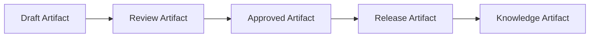
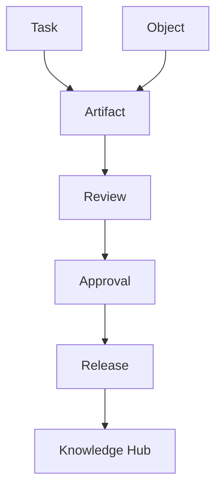
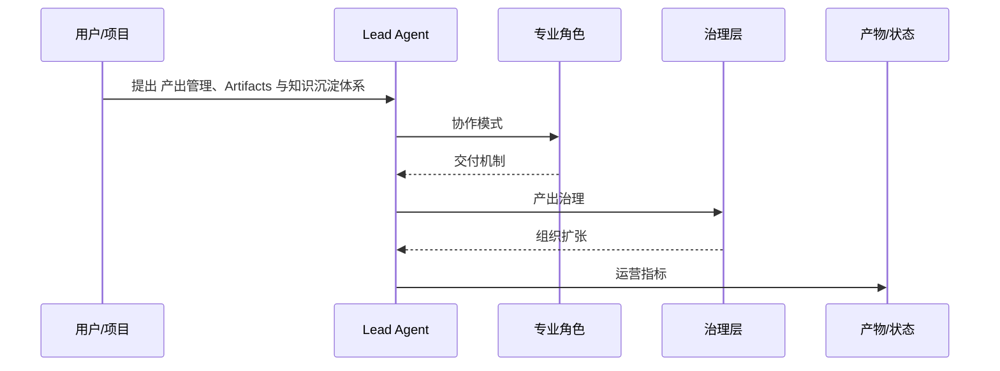

# 116. 产出管理、Artifacts 与知识沉淀体系

这一篇聚焦：

**未来多智能体平台的核心，不只是任务流转，还包括产出管理。没有正式的 artifact 体系，团队很快就会陷入“东西做出来了，但找不到、审不清、复用不了”的状态。**

---

## 1. 为什么 artifact 会成为未来平台的主对象

随着 AI 和多智能体进入生产，产出会爆炸式增加。

包括：

- 文档
- 代码
- 图像
- 视频
- 测试结果
- 审批记录
- 评估报告
- 版本包

如果没有统一 artifact 体系，这些东西最后只会散落在：

- 文件夹
- 群聊
- issue
- PR
- 临时链接

这会迅速拖垮平台可治理性。

---

## 2. 建议的 artifact 分类

### 第一类：工作中间产物

例如：

- 计划
- 方案
- 草稿
- 预演

### 第二类：可审阅产物

例如：

- PR
- 截图
- demo
- 测试报告
- 版本比较

### 第三类：正式交付产物

例如：

- release package
- deliverable
- 合规记录
- 发布版

### 第四类：知识沉淀产物

例如：

- SOP
- 模板
- lessons learned
- FAQ

---

## 3. 一张 artifact 生命周期图

---

## 4. 为什么未来 review 要围绕 artifact，而不是围绕对话

因为对话很快就会丢失结构，而 artifact 可以被：

- 标注
- 审批
- 追踪
- 复用

这就是为什么 future manager surfaces 都越来越强调：

- artifacts, not logs

---

## 5. 产出管理最少需要哪些字段

建议每个 artifact 至少记录：

- artifact type
- source agent / source human
- linked task
- linked object
- linked version
- status
- review comments
- approval state
- downstream usage

这会让 artifact 真正进入系统，而不是只是一份文件。

---

## 6. 一张结构图：artifact 如何连接任务与知识

---

## 7. 产出管理应该怎么和 AI 团队结合

建议每一类 agent 都要对产出负责。

### Coding Agents

产出：

- patch
- PR
- test output

### Media Agents

产出：

- shot pack
- storyboard
- reference pack

### Review Agents

产出：

- diff summary
- risk notes
- approval recommendation

### Knowledge Agents

产出：

- SOP
- lessons learned
- reusable template

这样 artifact 才会形成完整链条。

---

## 8. 各行业里的 artifact 管理应该怎么迁移

### 电影行业

- script pack
- shot pack
- review package
- release package

### 电商行业

- campaign brief
- asset pack
- ad experiment package
- performance report

### 教育行业

- course pack
- lesson artifact
- assessment package
- teaching review report

### 金融与法务

- analysis package
- compliance package
- approval dossier
- audit archive

因此 artifact 体系本身是跨行业可迁移的。

---

## 9. 为什么知识沉淀一定要从 artifact 里长出来

很多团队会单独做“知识库”，但效果常常不好。  
原因是知识没有和真实产出绑定。

更好的方式是：

- 从 artifact 里提炼知识

比如：

- 哪种 prompt pack 最有效
- 哪种 review comment 最常见
- 哪个版本最容易被打回

这会让知识库更真实、更能被复用。

---

## 10. 核心结论

未来多智能体平台如果想真正稳定运行，artifact 必须从“附属文件”升级为“正式对象”。

这样才能做到：

- 产出可审
- 结果可追
- 版本可管
- 知识可复用

对 DeerFlow 来说，artifact 系统将会是连接任务流、评审流和组织记忆的关键枢纽。

---

## 参考资料

- [Google Developers Blog: Antigravity](https://developers.googleblog.com/build-with-google-antigravity-our-new-agentic-development-platform/)
- [OpenAI: Introducing the Codex app](https://openai.com/index/introducing-the-codex-app/)
- [OpenAI: New tools for building agents](https://openai.com/index/new-tools-for-building-agents/)
- [GitHub: Copilot coding agent GA](https://github.blog/changelog/2025-09-25-copilot-coding-agent-is-now-generally-available/)

---

<!-- movie-visuals:start -->
## 补充图示：换一种视角看本篇

下面这张 时序图 把“产出管理、Artifacts 与知识沉淀体系”再压缩成一个可快速扫读的结构视图，便于先抓关键关系，再回到正文细节。

<!-- movie-visuals:end -->

<!-- movie-doc-nav:start -->
## 文档导航

- 总入口：[README.md](./README.md)
- 阅读地图：[00-reading-map.md](./00-reading-map.md)
- 所在分组：112-118 AI 研发组织、交付与协作模式
- 上一篇：[115. 人类与 AI、多智能体之间的协作手册](./115-human-ai-collaboration-playbook.md)
- 下一篇：[117. 数字员工扩张框架：从电影行业走向各行各业的多智能体需求](./117-digital-employees-expansion-framework.md)

### 同组文档
- [112. 利用 AI 编程与多智能体推进当前计划落地的总实施方案](./112-ai-coding-and-multi-agent-delivery-plan.md)
- [113. 人类团队与 AI 团队的组织设计](./113-human-team-and-ai-team-organization-design.md)
- [114. AI 编程工厂与多智能体研发协作模式](./114-ai-engineering-factory-and-collaboration-mode.md)
- [115. 人类与 AI、多智能体之间的协作手册](./115-human-ai-collaboration-playbook.md)
- 116. 产出管理、Artifacts 与知识沉淀体系（当前）
- [117. 数字员工扩张框架：从电影行业走向各行各业的多智能体需求](./117-digital-employees-expansion-framework.md)
- [118. 项目治理、推进路线与经营指标](./118-program-governance-roadmap-and-operating-metrics.md)
<!-- movie-doc-nav:end -->
