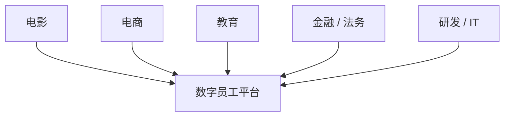
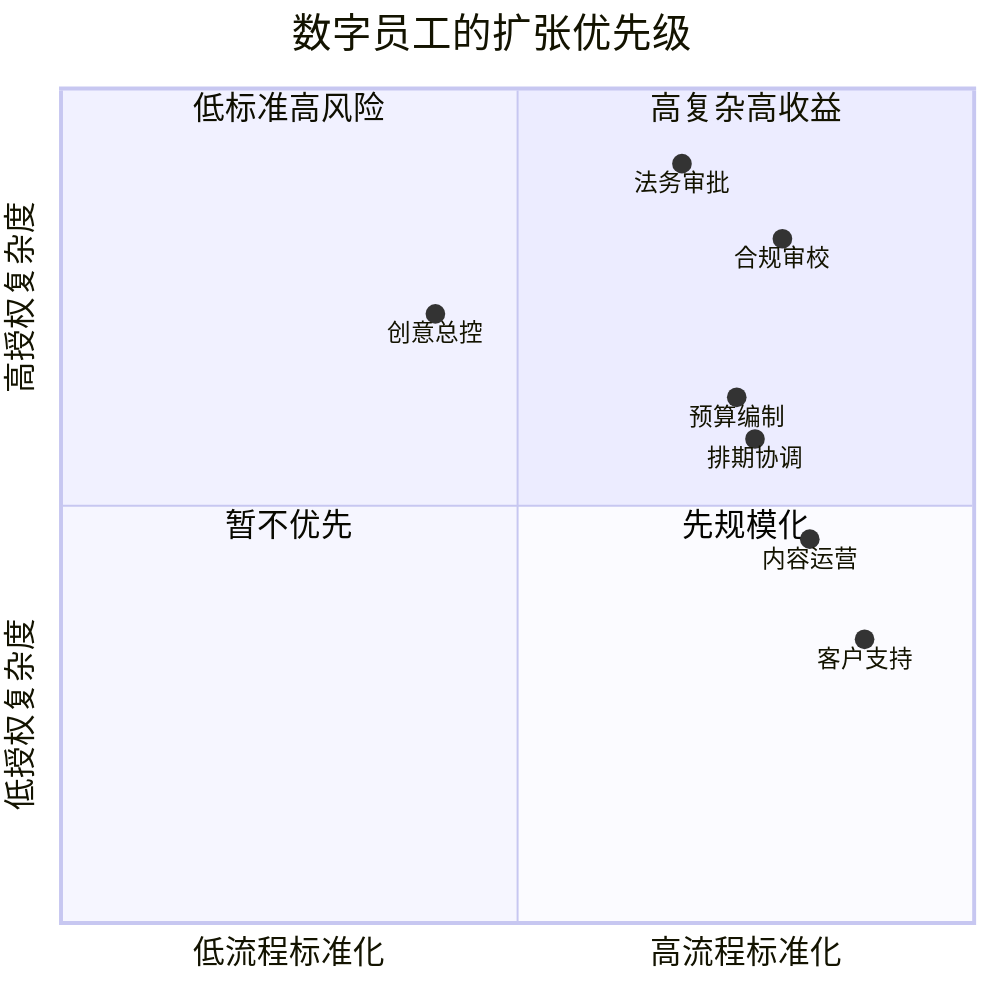

# 117. 数字员工扩张框架：从电影行业走向各行各业的多智能体需求

这一篇聚焦：

**如果 DeerFlow 只把自己理解成电影行业平台，天花板会比较早出现；如果把电影行业看成第一垂类，把数字员工和多智能体协作看成平台核心，那么 DeerFlow 就有机会演进成面向各行各业的多智能体操作系统。**

---

## 1. 为什么“数字员工扩张”应该被提前设计

因为电影行业已经非常适合做第一批验证：

- 任务多
- 角色多
- 文档多
- 评审多
- 版本多

但它并不是唯一有这种结构的行业。

未来大量行业都会出现类似需求：

- 复杂工作流
- 大量文档与系统
- 人机协作
- 多级审批
- 重复性执行任务

这意味着 DeerFlow 应该尽早把平台能力抽象成：

- 数字员工平台

而不仅仅是：

- 电影工具集

---

## 2. 什么样的岗位最容易变成数字员工

建议优先看三类岗位。

### 第一类：高频、流程化岗位

例如：

- 客服
- 运营支持
- 报表整理
- 内容整理

### 第二类：多文档、多系统岗位

例如：

- 法务支持
- 金融运营
- 教务
- 制片统筹

### 第三类：需要多轮 review 的岗位

例如：

- 营销内容
- 教学内容
- 合规材料
- 影视方案与交付包

---

## 3. 一张图：数字员工的扩张逻辑

---

## 4. 建议把数字员工拆成四种层级

### 层级一：个人助理型

特点：

- 辅助单个员工
- 提升个人效率

### 层级二：岗位执行型

特点：

- 负责一个明确岗位职责
- 有固定输入和产出

### 层级三：团队协作型

特点：

- 多 agent 协作完成一条流程
- 有 manager-agent

### 层级四：组织基础设施型

特点：

- 接系统
- 管权限
- 管审批
- 管版本

DeerFlow 未来真正的目标应该是第三层到第四层。

---

## 5. 各行业的数字员工图谱示例

### 电影

- 导演助理 agent
- 制片 agent
- 预算 agent
- 排期 agent
- 后期 review agent

### 电商

- 选品 agent
- 商品页 agent
- 投放 agent
- 复盘 agent

### 教育

- 课程设计 agent
- 课件生成 agent
- 助教 agent
- 教务 agent

### 金融运营

- 报表 agent
- 风控辅助 agent
- 合规材料 agent
- 流程跟踪 agent

### 法务

- 合同对比 agent
- 条款提取 agent
- 法规检索 agent
- 审批包 agent

### 研发与 IT

- coding agent
- test agent
- release agent
- incident triage agent

---

## 6. 一张行业扩张图

---

## 7. DeerFlow 要如何支持这种扩张

为了支持跨行业数字员工扩张，平台必须具备五种通用能力：

- 通用对象系统
- 通用 task / workflow 系统
- 可配置 agent registry
- review / approval / audit 机制
- artifact / knowledge 中枢

行业差异更多落在：

- 对象 schema
- agent roster
- tool set
- policy set

这说明 DeerFlow 的扩张方式应该是：

- 平台共用
- 垂类配置

---

## 8. 为什么“增加更多数字员工”不等于“无限增加 agent 数量”

这个判断很重要。

未来平台不是 agent 越多越好，而是：

- 角色越清晰越好
- handoff 越标准越好
- 守门越明确越好

否则数字员工越多，组织只会越乱。

所以真正的扩张，不是简单加 agent，而是：

- 建立角色库
- 建立能力模板
- 建立治理边界

---

## 9. 一个务实的扩张顺序

建议 DeerFlow 的扩张顺序是：

1. 电影行业验证平台能力
2. 研发团队内部验证 AI 编程工厂
3. 内容与营销行业验证批量媒体工作流
4. 文档密集行业验证审批与合规能力
5. 最终形成通用数字员工平台

这个顺序的好处是：

- 从最复杂但最典型的场景入手
- 再逐步复制到流程相似的行业

---

## 10. 核心结论

未来 DeerFlow 最值得追求的，不只是“电影行业多智能体平台”，而是：

- 从电影行业长出来的数字员工操作系统

电影行业给了它第一个复杂场景；
各行各业会给它更大的平台空间。

因此现在就应该在设计上留出：

- 多行业 schema
- 多角色 roster
- 多策略模板
- 多合规边界

这会决定 DeerFlow 长期是不是一个真正的平台。

---

## 参考资料

- [OpenAI: Introducing the Codex app](https://openai.com/index/introducing-the-codex-app/)
- [Anthropic: Claude Code](https://www.anthropic.com/product/claude-code)
- [Anthropic: Introducing the Model Context Protocol](https://www.anthropic.com/news/model-context-protocol)
- [Google Developers Blog: Antigravity](https://developers.googleblog.com/build-with-google-antigravity-our-new-agentic-development-platform/)
- [GitHub: Copilot coding agent GA](https://github.blog/changelog/2025-09-25-copilot-coding-agent-is-now-generally-available/)

---

<!-- movie-visuals:start -->
## 补充图示：换一种视角看本篇

下面这张象限图把“哪些岗位适合先变成数字员工”画成判断矩阵，和正文里关于结构化程度、授权复杂度、扩张顺序的讨论更对齐。

<!-- movie-visuals:end -->

<!-- movie-doc-nav:start -->
## 文档导航

- 总入口：[README.md](./README.md)
- 阅读地图：[00-reading-map.md](./00-reading-map.md)
- 所在分组：112-118 AI 研发组织、交付与协作模式
- 上一篇：[116. 产出管理、Artifacts 与知识沉淀体系](./116-output-management-and-agent-artifacts-system.md)
- 下一篇：[118. 项目治理、推进路线与经营指标](./118-program-governance-roadmap-and-operating-metrics.md)

### 同组文档
- [112. 利用 AI 编程与多智能体推进当前计划落地的总实施方案](./112-ai-coding-and-multi-agent-delivery-plan.md)
- [113. 人类团队与 AI 团队的组织设计](./113-human-team-and-ai-team-organization-design.md)
- [114. AI 编程工厂与多智能体研发协作模式](./114-ai-engineering-factory-and-collaboration-mode.md)
- [115. 人类与 AI、多智能体之间的协作手册](./115-human-ai-collaboration-playbook.md)
- [116. 产出管理、Artifacts 与知识沉淀体系](./116-output-management-and-agent-artifacts-system.md)
- 117. 数字员工扩张框架：从电影行业走向各行各业的多智能体需求（当前）
- [118. 项目治理、推进路线与经营指标](./118-program-governance-roadmap-and-operating-metrics.md)
<!-- movie-doc-nav:end -->
