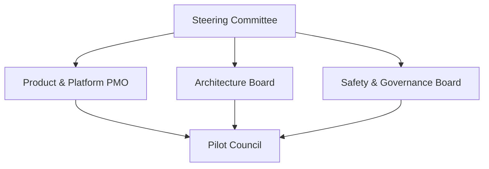
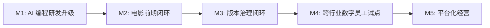
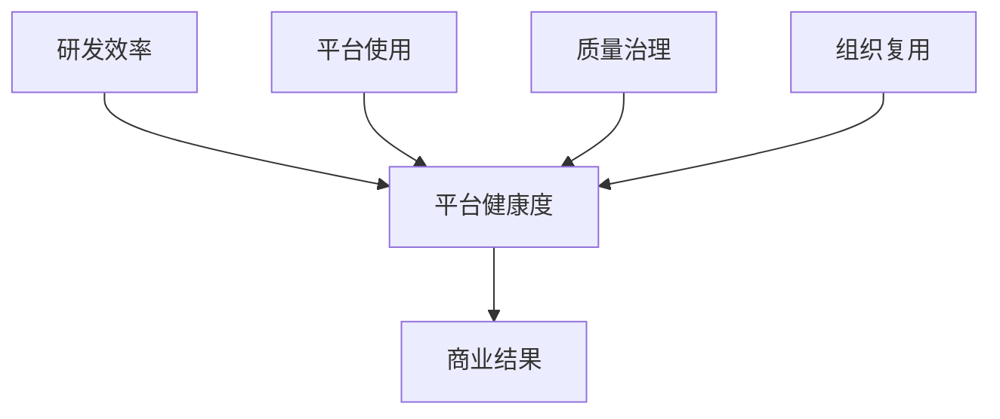

# 118. 项目治理、推进路线与经营指标

这一篇聚焦：

**要把 DeerFlow 从方案推进到真正落地，除了产品、技术和团队，还需要一套项目治理机制和经营指标体系。否则团队会一直写文档、做 demo、跑试点，但很难形成真实的推进节奏和商业闭环。**

---

## 1. 为什么这一篇很关键

因为平台落地通常不是死在“不会做”，而是死在：

- 没有统一推进节奏
- 没有明确里程碑
- 没有指标
- 没有经营视角

所以这篇要解决的是：

- DeerFlow 怎么被当成一个项目群、产品线和平台业务一起推进

---

## 2. 建议的治理结构

### 2.1 Steering Committee

负责：

- 战略方向
- 资源配置
- 重大风险
- 阶段性 go / no-go

### 2.2 Product & Platform PMO

负责：

- 路线图
- 里程碑
- 跨团队协同
- 试点跟踪

### 2.3 Architecture Board

负责：

- 技术边界
- 核心 schema
- agent / tool / protocol 决策

### 2.4 Safety & Governance Board

负责：

- 合规
- 权限
- 审计
- 对外发布边界

### 2.5 Pilot Council

负责：

- 行业试点选择
- 验收标准
- 客户反馈闭环

---

## 3. 一张治理图

---

## 4. 建议的推进路线

### 里程碑 1：研发方式升级

验收重点：

- AI 编程流程跑通
- manager + coding agents 协作跑通
- 基础 artifact review 流程跑通

### 里程碑 2：电影前期闭环上线

验收重点：

- 剧本拆解
- shot plan
- style package
- review package

### 里程碑 3：后期与版本治理闭环上线

验收重点：

- version ledger
- approval workflow
- release package

### 里程碑 4：跨行业数字员工试点

验收重点：

- 至少 2 个行业可复制
- agent roster 可配置
- schema 可扩展

### 里程碑 5：平台化经营

验收重点：

- 多项目并行
- 经营指标看板
- 模板复用与组织知识沉淀

---

## 5. 一张路线图

---

## 6. 最应该看的经营指标是什么

建议把指标拆成五组。

### 6.1 研发效率指标

- 每周任务吞吐量
- AI 参与度
- 平均交付时长
- 回归修复时间

### 6.2 平台使用指标

- 活跃项目数
- 活跃 agent 数
- 人类活跃用户数
- 数字员工调用次数

### 6.3 质量与治理指标

- review 打回率
- 正式版本通过率
- 审计链完备率
- provenance 覆盖率

### 6.4 组织复用指标

- 模板复用率
- 跨项目知识复用率
- 行业方案复制速度

### 6.5 商业指标

- 单项目交付周期改善
- 人均吞吐提升
- 试点转正式客户比率
- 数字员工渗透率

---

## 7. 一张指标金字塔

---

## 8. PMO 应该怎么运作

建议 PMO 不只是做排期，而要做五件事：

- 管里程碑
- 管 agent roster 演化
- 管试点复制
- 管 artifact 模板
- 管指标看板

这会让 PMO 从传统项目管理，升级为：

- 人类团队 + AI 团队的联合运营中枢

---

## 9. 为什么要从第一天起就用“经营视角”推进

因为 DeerFlow 最终不是一个内部实验项目，而会演化成：

- 产品
- 平台
- 数字员工基础设施

如果一开始没有经营视角，后面很容易出现：

- 技术做了很多
- 平台价值说不清

所以经营指标必须和研发、治理、试点一起推进。

---

## 10. 核心结论

要让 DeerFlow 真正落地，必须把它当成：

- 一个被 AI 编程加速的产品项目
- 一个由人类团队和 AI 团队共同推进的平台工程
- 一个未来可以长成数字员工基础设施的业务系统

因此推进方式也必须升级为：

- 有治理
- 有里程碑
- 有指标
- 有经营闭环

这会让前面的文档体系，从“方案”真正走向“项目”。

---

## 参考资料

- [OpenAI: New tools for building agents](https://openai.com/index/new-tools-for-building-agents/)
- [OpenAI: Introducing the Codex app](https://openai.com/index/introducing-the-codex-app/)
- [OpenAI: Introducing GPT-5.3-Codex](https://openai.com/index/introducing-gpt-5-3-codex/)
- [Anthropic: Claude Code](https://www.anthropic.com/product/claude-code)
- [Google Developers Blog: Antigravity](https://developers.googleblog.com/build-with-google-antigravity-our-new-agentic-development-platform/)
- [GitHub: Copilot coding agent GA](https://github.blog/changelog/2025-09-25-copilot-coding-agent-is-now-generally-available/)

---

---

<!-- movie-doc-nav:start -->
## 文档导航

- 总入口：[README.md](./README.md)
- 阅读地图：[00-reading-map.md](./00-reading-map.md)
- 所在分组：112-118 AI 研发组织、交付与协作模式
- 上一篇：[117. 数字员工扩张框架：从电影行业走向各行各业的多智能体需求](./117-digital-employees-expansion-framework.md)
- 下一篇：无，已经到达当前目录末尾，建议回到 [README.md](./README.md) 选择其他阅读路线。

### 同组文档
- [112. 利用 AI 编程与多智能体推进当前计划落地的总实施方案](./112-ai-coding-and-multi-agent-delivery-plan.md)
- [113. 人类团队与 AI 团队的组织设计](./113-human-team-and-ai-team-organization-design.md)
- [114. AI 编程工厂与多智能体研发协作模式](./114-ai-engineering-factory-and-collaboration-mode.md)
- [115. 人类与 AI、多智能体之间的协作手册](./115-human-ai-collaboration-playbook.md)
- [116. 产出管理、Artifacts 与知识沉淀体系](./116-output-management-and-agent-artifacts-system.md)
- [117. 数字员工扩张框架：从电影行业走向各行各业的多智能体需求](./117-digital-employees-expansion-framework.md)
- 118. 项目治理、推进路线与经营指标（当前）
<!-- movie-doc-nav:end -->
