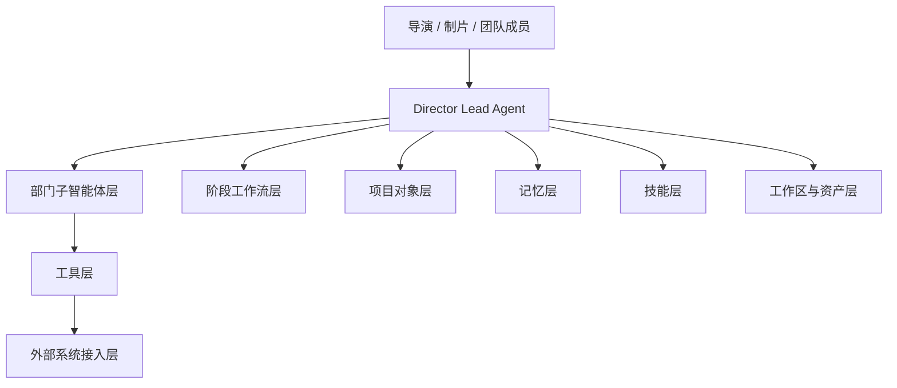

# 13. 体系化设计稿：导演智能体平台系统蓝图

这一篇不是单纯的源码对照，而是把前面的方案与源码入口收束成一份更完整的系统蓝图。

目标是回答：

**如果现在正式立项，这个系统应该如何被定义成一个可实施的平台。**

---

## 1. 系统定位

系统名称建议：

- Movie Director OS
- DeerFlow Movie Runtime
- Director Intelligence Platform

无论名字如何，系统定位应该明确为：

**一个面向电影制作全流程的导演智能体平台，而不是单一聊天助手。**

---

## 2. 平台目标

### 创作目标
- 帮助导演快速形成风格统一的前期方案
- 帮助团队把剧本转成镜头、预算、排期、资产

### 制作目标
- 帮助制片与助理导演控制进度、成本、资源
- 帮助各部门围绕统一项目对象协作

### 管理目标
- 建立阶段推进、审批、版本、复盘机制
- 让项目从“对话”变成“可管理对象”

---

## 3. 平台分层蓝图

---

## 4. 平台核心模块

## 4.1 Director Lead Agent

职责：
- 统一创作目标
- 统一阶段推进
- 统一部门委派
- 统一结果汇总
- 统一最终判断

源码承接点：
- `make_lead_agent`
- `AgentConfig`
- `SOUL.md`

---

## 4.2 Department Agents

职责：
- 承担部门专业任务
- 在隔离上下文中执行
- 输出结构化结果

源码承接点：
- `task_tool`
- `SubagentExecutor`
- `SubagentConfig`
- `registry.py`

---

## 4.3 Project Object Layer

职责：
- 承载剧本、预算、排期、镜头、审核、版本
- 作为所有 agent 的共享事实来源

源码承接点：
- `ThreadState`
- 后续独立项目存储层

---

## 4.4 Workflow Layer

职责：
- 管理前期 / 中期 / 后期阶段
- 管理任务清单
- 管理审批节点
- 管理退出条件

源码承接点：
- TodoMiddleware
- MemoryMiddleware
- 自定义 middleware / factory 扩展

---

## 4.5 Tool Layer

职责：
- 提供剧本、预算、排期、分镜、后期、宣发等行业工具

源码承接点：
- `get_available_tools()` 体系
- builtins / configured tools / MCP tools

---

## 5. 平台中的关键对象

建议平台围绕以下对象构建：

- Project
- Script
- Scene
- Character
- Budget
- Schedule
- Casting
- Location
- ShotPlan
- Review
- AssetVersion
- Deliverable

这些对象不是附属信息，而是平台的核心事实层。

---

## 6. 平台中的关键角色

### 核心角色
- Director
- Producer
- Assistant Director
- Script Analyst
- Storyboard
- Cinematography
- VFX Supervisor
- Editor
- Marketing

### 扩展角色
- Casting Director
- Location Manager
- Lighting
- Sound Designer
- Colorist
- Composer
- Retrospective Analyst

---

## 7. 平台中的关键流程

### 前期流程
剧本 -> 拆解 -> 风格 -> 分镜 -> 预算 -> 排期 -> 前期方案包

### 中期流程
前期方案包 -> 日计划 -> 调度 -> 执行 -> 日审 -> 偏差修正

### 后期流程
素材 -> 粗剪 -> 审核 -> 精剪 -> 声音/调色/视效 -> 交付 -> 宣发 -> 复盘

---

## 8. 平台中的关键治理机制

### 并发治理
通过子智能体并发限制控制部门任务数量。

### 上下文治理
通过主从式结构与子智能体隔离上下文，避免信息污染。

### 记忆治理
通过项目记忆与阶段记忆保持长期一致性。

### 审批治理
通过审核节点控制关键产物进入下一阶段。

### 版本治理
通过资产版本对象管理修订历史与交付状态。

---

## 9. 平台的最小可用形态

如果只做最小可用版本，建议包含：

- 一个 Director Lead Agent
- 六个核心部门子智能体
- 一组前期核心工具
- 一组基础项目对象
- 一条前期阶段工作流

这就足以形成一个真正有价值的前期导演智能体系统。

---

## 10. 这一篇最重要的结论

### 结论一
导演智能体平台必须被定义成“平台”，而不是“单个 agent”。

### 结论二
平台的核心不是 prompt，而是：

- 角色
- 对象
- 流程
- 工具
- 治理

### 结论三
当前 DeerFlow 已经具备平台化演进的关键底座。
