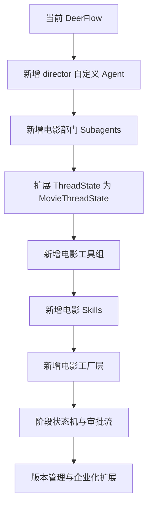

# 14. 实施设计稿：从当前仓库出发的具体改造草案

这一篇是最接近实施的设计稿。

目标是把前面的方案进一步压缩成：

- 第一批要改什么
- 第二批要改什么
- 每一块建议落在哪个代码位置

---

## 1. 第一批改造目标

建议第一批只做“前期导演智能体 MVP”。

### 目标能力
- 剧本分析
- 风格参考
- 对白设计
- 文字分镜
- 概念图提示词
- 初步预算
- 初步排期
- 演员 / 场地建议

### 为什么先做这一批
因为它：

- 最容易验证价值
- 最适合当前 DeerFlow 架构
- 对项目对象与审批流要求相对较低

---

## 2. 第一批建议新增的 Agent

### 2.1 `director`
类型：Lead Agent

职责：
- 统一创作目标
- 统一任务拆解
- 委派给部门子智能体
- 汇总结果

落点：
- `agents/director/config.yaml`
- `agents/director/SOUL.md`

---

### 2.2 第一批部门子智能体

建议新增：

- `producer`
- `script-analyst`
- `budget-controller`
- `storyboard`
- `cinematography`
- `style-research`

落点：
- `subagents/builtins/` 或新的电影子智能体注册模块
- `subagents/registry.py`
- `subagents/config.py`

---

## 3. 第一批建议新增的状态字段

建议先在 `ThreadState` 上扩展：

```text
project
phase
script_state
budget_state
schedule_state
casting_state
location_state
shot_plan_state
review_state
asset_versions
```

落点：
- `backend/packages/harness/deerflow/agents/thread_state.py`

### 原则
- 先做轻量扩展
- 不急着一开始就上独立数据库模型

---

## 4. 第一批建议新增的工具组

### 剧本工具组
- parse_script
- extract_scenes
- extract_characters
- generate_beat_sheet

### 分镜工具组
- generate_shot_list
- generate_storyboard_prompt
- generate_dialogue_variants

### 制片工具组
- build_budget_sheet
- estimate_scene_cost
- build_shooting_schedule
- location_match

### 风格工具组
- audience_positioning_analysis
- style_reference_analysis
- lens_language_recommender

落点：
- `backend/packages/harness/deerflow/tools/` 下新增电影工具模块
- `get_available_tools()` 的工具组注册逻辑

---

## 5. 第一批建议新增的 Skills

建议新增：

- `movie-preproduction`
- `dialogue-polish`
- `storyboard-design`
- `cinematography-language`
- `budget-control`
- `style-reference-analysis`

落点：
- skills 目录
- agent config 中的 `skills`

---

## 6. 第一批建议新增的工厂封装

建议新增一个电影制作工厂层。

### `create_director_agent(...)`
职责：
- 绑定导演默认模型
- 绑定导演默认 skills
- 绑定电影工具组
- 开启 plan mode
- 开启 subagent
- 使用扩展状态

### `create_movie_department_agent(role, ...)`
职责：
- 根据角色绑定 prompt
- 根据角色绑定工具白名单
- 根据角色绑定模型与超时

落点：
- 新增电影工厂模块
- 基于 `create_deerflow_agent(...)` 封装

---

## 7. 第二批改造目标

当第一批跑通后，再做：

- 阶段状态机
- 审批流
- 版本管理
- 中期拍摄执行
- 后期版本协同

### 重点新增
- `assistant-director`
- `daily-review`
- `editor`
- `sound-designer`
- `colorist`
- `marketing`

---

## 8. 第三批改造目标

再往后做：

- 独立项目对象存储层
- 多项目并行
- 权限体系
- 外部系统集成
- 企业级审计与追踪

---

## 9. 一张实施草图



---

## 10. 推荐的代码改造顺序

### 第一步
先做 `director` agent 配置。

### 第二步
扩展 subagent registry，加入电影角色。

### 第三步
扩展 ThreadState。

### 第四步
增加电影工具组。

### 第五步
增加电影 skills。

### 第六步
增加电影工厂层。

### 第七步
增加阶段状态机与审批流。

---

## 11. 这一篇最重要的结论

### 结论一
第一批不要做太大，只做前期导演智能体 MVP。

### 结论二
最优先的改造点是：

- 自定义 agent
- subagent registry
- ThreadState
- 电影工具组
- 电影 skills

### 结论三
当前仓库已经足够支撑第一批改造，不需要推倒重来。
