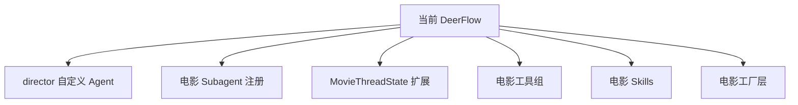
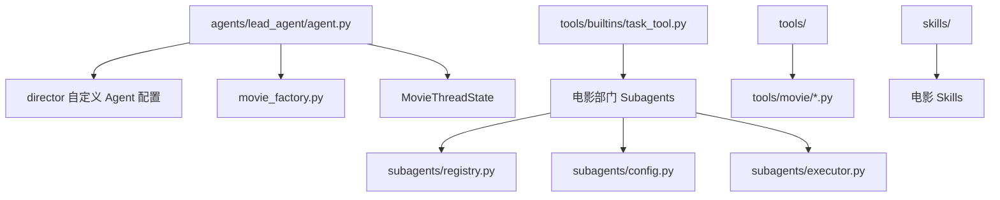

# 15A. 代码级设计草案：导演智能体第一批代码改造方案

这一篇对应你前面说的 A：**代码级设计草案**。

目标不是直接改代码，而是把第一批改造拆到“文件级、模块级、职责级”，让后续真正动手时有明确落点。

---

## 1. 设计目标

第一批代码级设计只服务于一个目标：

**在当前 DeerFlow 仓库上，落出一个可运行的“前期导演智能体 MVP”。**

它至少要支持：

- 剧本分析
- 风格参考
- 对白设计
- 文字分镜
- 初步预算
- 初步排期
- 演员 / 场地建议

---

## 2. 第一批建议新增的代码模块

建议新增或扩展以下模块：



---

## 3. 模块一：`director` 自定义 Agent

### 目标
先把“总导演智能体”落成一个可配置的自定义 agent。

### 建议新增目录

```text
backend/.deer-flow/agents/director/
  config.yaml
  SOUL.md
```

### `config.yaml` 建议字段

```yaml
name: director
description: 负责电影项目的总体创作方向、阶段推进与部门协同
model: <默认导演模型>
tool_groups:
  - movie-preproduction
  - movie-planning
skills:
  - movie-preproduction
  - dialogue-polish
  - storyboard-design
  - style-reference-analysis
```

### `SOUL.md` 建议内容
- 导演人格
- 创作原则
- 风格统一原则
- 与制片约束的平衡原则
- 对部门协作的要求

### 对应当前源码入口
- `config/agents_config.py`
- `tools/builtins/setup_agent_tool.py`
- `agents/lead_agent/agent.py`

---

## 4. 模块二：电影 Subagent 注册层

### 目标
把当前通用 subagent 扩展成电影部门角色。

### 建议新增角色
第一批先做：

- `producer`
- `script-analyst`
- `budget-controller`
- `storyboard`
- `cinematography`
- `style-research`

### 建议新增模块

```text
backend/packages/harness/deerflow/subagents/movie/
  __init__.py
  builtins.py
  prompts/
```

或者先轻量地直接扩展现有 builtins 注册表。

### 每个角色建议配置项
- `name`
- `description`
- `system_prompt`
- `tools`
- `model`
- `max_turns`
- `timeout_seconds`

### 对应当前源码入口
- `subagents/config.py`
- `subagents/registry.py`
- `subagents/executor.py`
- `tools/builtins/task_tool.py`

---

## 5. 模块三：MovieThreadState 扩展

### 目标
把当前通用线程状态扩展成电影项目状态。

### 建议方式
第一阶段不一定要新建独立状态类，也可以先扩展 `ThreadState`。

如果想更清晰，建议新增：

```text
backend/packages/harness/deerflow/agents/movie_thread_state.py
```

### 建议字段

```text
project
phase
script_state
budget_state
schedule_state
casting_state
location_state
shot_plan_state
review_state
asset_versions
approvals
style_reference_state
```

### 设计原则
- 先支持前期核心对象
- 字段尽量结构化
- 与现有 `sandbox` / `thread_data` / `artifacts` 共存

### 对应当前源码入口
- `agents/thread_state.py`
- `agents/lead_agent/agent.py`
- `subagents/executor.py`
- `agents/factory.py`

---

## 6. 模块四：电影工具组

### 目标
把电影制作能力从 prompt 变成真正的工具层。

### 建议新增目录

```text
backend/packages/harness/deerflow/tools/movie/
  __init__.py
  script_tools.py
  storyboard_tools.py
  budget_tools.py
  schedule_tools.py
  style_tools.py
```

### 第一批建议工具

#### script_tools.py
- `parse_script`
- `extract_scenes`
- `extract_characters`
- `generate_beat_sheet`

#### storyboard_tools.py
- `generate_shot_list`
- `generate_storyboard_prompt`
- `generate_dialogue_variants`

#### budget_tools.py
- `build_budget_sheet`
- `estimate_scene_cost`

#### schedule_tools.py
- `build_shooting_schedule`
- `location_match`

#### style_tools.py
- `style_reference_analysis`
- `audience_positioning_analysis`
- `lens_language_recommender`

### 对应当前源码入口
- `tools/` 总装配逻辑
- `get_available_tools()`
- `lead_agent/agent.py` 中的 `tool_groups`

---

## 7. 模块五：电影 Skills

### 目标
把电影制作方法论沉淀成可复用 skill 包。

### 建议新增 skills

```text
movie-preproduction
dialogue-polish
storyboard-design
cinematography-language
budget-control
style-reference-analysis
```

### 每个 skill 建议包含
- 适用场景
- 工作方法
- 输出模板
- 检查清单
- 常见错误

### 对应当前源码入口
- skills 系统
- `AgentConfig.skills`
- `task_tool.py` 中的 skills prompt 注入

---

## 8. 模块六：电影工厂层

### 目标
把电影制作 agent 的装配逻辑从通用工厂中抽出来。

### 建议新增模块

```text
backend/packages/harness/deerflow/agents/movie_factory.py
```

### 建议提供的函数

#### `create_director_agent(...)`
- 绑定导演默认模型
- 绑定导演默认 skills
- 绑定电影工具组
- 开启 plan mode
- 开启 subagent
- 使用 MovieThreadState

#### `create_movie_department_agent(role, ...)`
- 根据角色绑定 prompt
- 根据角色绑定工具白名单
- 根据角色绑定模型与超时

### 对应当前源码入口
- `agents/factory.py`
- `agents/lead_agent/agent.py`

---

## 9. 一张文件级改造图



---

## 10. 第一批代码级设计的优先顺序

### 优先级 1
- `director` 自定义 agent
- 电影 subagent 注册

### 优先级 2
- MovieThreadState 扩展
- 电影工具组

### 优先级 3
- 电影 skills
- 电影工厂层

---

## 11. 这一篇最重要的结论

### 结论一
第一批代码改造不需要推翻当前架构，只需要在现有扩展点上做电影领域化。

### 结论二
最关键的代码落点是：

- 自定义 agent
- subagent registry
- ThreadState
- tools
- skills
- factory

### 结论三
如果这六块设计清楚，后续真正写代码会非常顺。