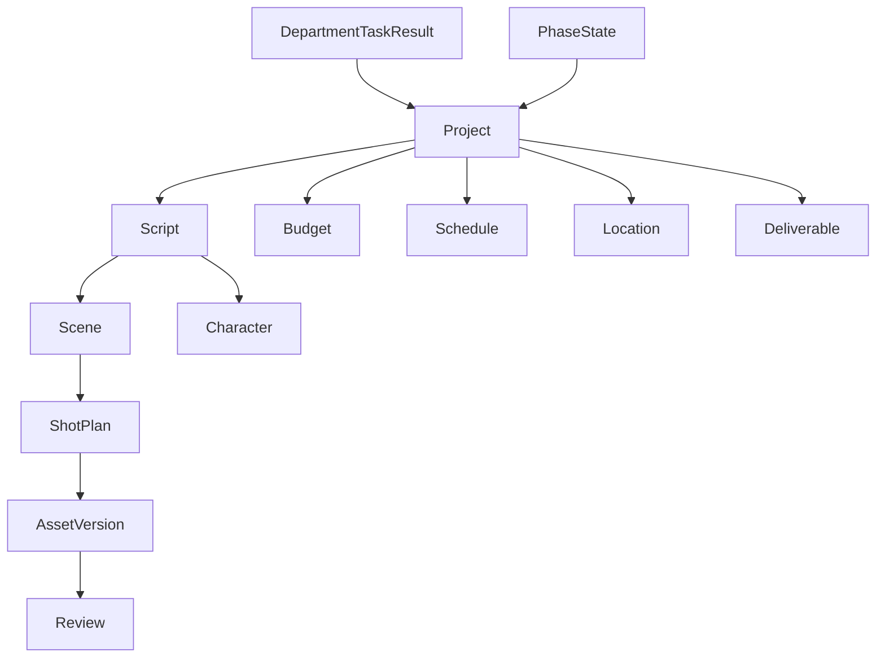
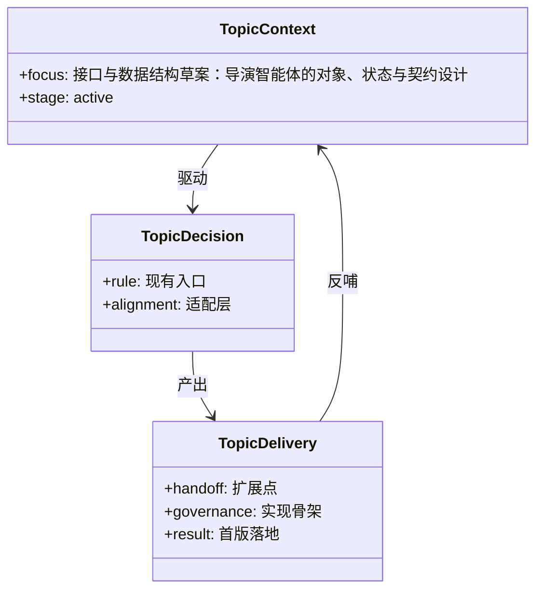

# 16B. 接口与数据结构草案：导演智能体的对象、状态与契约设计

这一篇对应你前面说的 B：**接口与数据结构草案**。

目标是把导演智能体系统里最关键的对象、状态、输入输出契约定义清楚，避免后续实现时全靠自然语言约定。

---

## 1. 设计目标

这份草案主要解决三个问题：

1. 系统内部到底管理哪些核心对象
2. 主智能体与子智能体之间如何交换结构化结果
3. 阶段推进、审核、版本管理依赖哪些状态字段

---

## 2. 顶层对象：Project

Project 是整个系统的根对象。

### 建议结构

```yaml
Project:
  project_id: string
  title: string
  genre: string
  format: string
  target_duration: number
  target_audience: string
  style_keywords: string[]
  current_phase: string
  status: string
  owner: string
  created_at: datetime
  updated_at: datetime
```

### 说明
- `genre`：科幻、广告、武打等
- `format`：长片、短片、广告、预告片
- `current_phase`：development / pre_production / production / post_production / delivery / retrospective
- `status`：active / paused / archived / completed

---

## 3. 剧本对象：Script / Scene / Character

## 3.1 Script

```yaml
Script:
  script_id: string
  project_id: string
  version: string
  status: string
  summary: string
  theme: string
  tone: string
  revision_notes: string[]
```

## 3.2 Scene

```yaml
Scene:
  scene_id: string
  script_id: string
  order: number
  location_type: string
  time_of_day: string
  description: string
  characters: string[]
  props: string[]
  wardrobe: string[]
  vfx_flag: boolean
  estimated_complexity: string
```

## 3.3 Character

```yaml
Character:
  character_id: string
  script_id: string
  name: string
  role_type: string
  age_range: string
  personality: string
  performance_notes: string[]
  casting_status: string
```

---

## 4. 制片对象：Budget / Schedule / Casting / Location

## 4.1 Budget

```yaml
Budget:
  budget_id: string
  project_id: string
  version: string
  total_budget: number
  department_budgets: object
  actual_costs: object
  variance: number
  approval_status: string
```

## 4.2 Schedule

```yaml
Schedule:
  schedule_id: string
  project_id: string
  version: string
  milestones: object[]
  shooting_days: object[]
  dependencies: object[]
  risk_flags: string[]
  approval_status: string
```

## 4.3 Casting

```yaml
Casting:
  casting_id: string
  role_id: string
  candidates: object[]
  confirmed_actor: object | null
  availability: object[]
  notes: string[]
```

## 4.4 Location

```yaml
Location:
  location_id: string
  project_id: string
  name: string
  type: string
  cost: number
  permit_status: string
  weather_risk: string
  constraints: string[]
```

---

## 5. 创作执行对象：ShotPlan

```yaml
ShotPlan:
  shot_id: string
  scene_id: string
  shot_type: string
  camera_movement: string
  lens: string
  framing: string
  lighting_notes: string[]
  performance_notes: string[]
  dialogue_notes: string[]
  vfx_flag: boolean
  storyboard_ref: string | null
  prompt_ref: string | null
  status: string
```

### 说明
`ShotPlan` 是连接剧本、分镜、摄影、灯光、表演、视效的桥梁对象。

---

## 6. 审核与版本对象：Review / AssetVersion / Deliverable

## 6.1 Review

```yaml
Review:
  review_id: string
  target_type: string
  target_id: string
  reviewer: string
  comments: string[]
  decision: string
  created_at: datetime
```

## 6.2 AssetVersion

```yaml
AssetVersion:
  asset_id: string
  asset_type: string
  version: string
  file_path: string
  summary: string
  parent_version: string | null
  status: string
```

## 6.3 Deliverable

```yaml
Deliverable:
  deliverable_id: string
  project_id: string
  type: string
  version: string
  status: string
  checklist: object[]
```

---

## 7. 主智能体状态契约

建议主智能体运行时至少维护以下状态：

```yaml
DirectorRuntimeState:
  project: Project
  phase: string
  script_state: Script | null
  budget_state: Budget | null
  schedule_state: Schedule | null
  casting_state: Casting[]
  location_state: Location[]
  shot_plan_state: ShotPlan[]
  review_state: Review[]
  asset_versions: AssetVersion[]
  approvals: object[]
  todos: object[]
  artifacts: string[]
```

---

## 8. 子智能体结果契约

建议所有电影部门子智能体都返回统一结构，而不是只返回一段自然语言。

### 通用结果结构

```yaml
DepartmentTaskResult:
  role: string
  task_type: string
  summary: string
  outputs: object[]
  risks: string[]
  decisions_needed: string[]
  next_actions: string[]
  artifact_paths: string[]
```

### 示例：Storyboard 子智能体

```yaml
role: storyboard
task_type: generate_storyboard_pack
summary: 已完成前 12 个场景的文字分镜与提示词包
outputs:
  - shot_list_ref: shot-plan-v1
  - prompt_pack_ref: storyboard-prompts-v1
risks:
  - 第 8 场景动作设计仍不明确
  - 第 11 场景夜景灯光方案未锁定
decisions_needed:
  - 是否采用手持镜头风格
next_actions:
  - 补充第 8 场景动作设计
artifact_paths:
  - /mnt/user-data/outputs/storyboard_v1.md
```

---

## 9. 阶段状态契约

建议阶段状态统一定义为：

```yaml
PhaseState:
  phase: string
  required_inputs: string[]
  required_outputs: string[]
  approval_gates: string[]
  completion_criteria: string[]
  blockers: string[]
```

### 示例：前期阶段

```yaml
phase: pre_production
required_inputs:
  - script_draft
required_outputs:
  - script_breakdown
  - budget_draft
  - schedule_draft
  - storyboard_pack
approval_gates:
  - script_lock_review
  - budget_review
  - visual_direction_review
completion_criteria:
  - 剧本锁定
  - 预算通过
  - 分镜方向确认
blockers: []
```

---

## 10. 接口设计建议

如果后续要做 API 或内部服务接口，建议至少定义：

### 项目接口
- `create_project`
- `get_project`
- `update_project_phase`

### 剧本接口
- `create_script_version`
- `analyze_script`
- `lock_script`

### 分镜接口
- `generate_shot_plan`
- `generate_storyboard_pack`

### 制片接口
- `generate_budget_draft`
- `generate_schedule_draft`
- `review_budget`

### 审核接口
- `submit_review`
- `list_reviews`
- `approve_asset_version`

---

## 11. 一张对象与契约关系图



---

## 12. 这一篇最重要的结论

### 结论一
导演智能体系统必须建立在结构化对象与结构化结果之上。

### 结论二
Project、Script、Budget、Schedule、ShotPlan、Review、AssetVersion 是最核心的一组契约对象。

### 结论三
如果主智能体和子智能体之间没有统一结果契约，后续阶段推进和审批流会非常难做。

---

<!-- movie-visuals:start -->
## 补充图示：换一种视角看本篇

下面这张 类图 把“接口与数据结构草案：导演智能体的对象、状态与契约设计”再压缩成一个可快速扫读的结构视图，便于先抓关键关系，再回到正文细节。


<!-- movie-visuals:end -->

<!-- movie-doc-nav:start -->
## 文档导航

- 总入口：[README.md](./README.md)
- 阅读地图：[00-reading-map.md](./00-reading-map.md)
- 所在分组：09-19 源码映射与实施草案
- 上一篇：[15A. 代码级设计草案：导演智能体第一批代码改造方案](./15-a-code-design-draft.md)
- 下一篇：[17C. 第一版代码落地方案：从文档走向最小可实现代码](./17-c-first-code-drop-plan.md)

### 同组文档
- [09. 源码对照总览：导演智能体方案如何映射到当前仓库](./09-source-mapping-overview.md)
- [10. 源码对照：主智能体与运行时链如何承接导演智能体](./10-source-mapping-agent-runtime.md)
- [11. 源码对照：子智能体、委派机制与电影部门角色如何落地](./11-source-mapping-subagents.md)
- [12. 源码对照：状态、配置与工厂扩展如何承接电影项目系统](./12-source-mapping-state-and-config.md)
- [13. 体系化设计稿：导演智能体平台系统蓝图](./13-system-blueprint.md)
- [14. 实施设计稿：从当前仓库出发的具体改造草案](./14-implementation-draft.md)
- [15A. 代码级设计草案：导演智能体第一批代码改造方案](./15-a-code-design-draft.md)
- 16B. 接口与数据结构草案：导演智能体的对象、状态与契约设计（当前）
- [17C. 第一版代码落地方案：从文档走向最小可实现代码](./17-c-first-code-drop-plan.md)
- [18. 方案1细稿：可直接开发的 Markdown 细稿集合](./18-solution-1-detailed-md-drafts.md)
- [19. 方案2细稿：最小 MVP 代码实现路径与模块关系图](./19-solution-2-mvp-implementation-path.md)
<!-- movie-doc-nav:end -->
