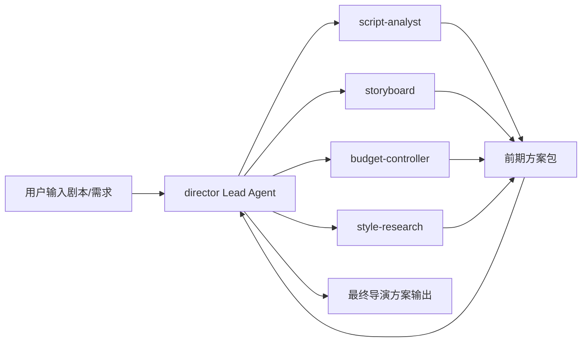

# 17C. 第一版代码落地方案：从文档走向最小可实现代码

这一篇对应你前面说的 C：**直接开始落第一版代码的方案**。

这份文档不是立即改代码，而是把“第一版代码应该怎么落”拆成最小可执行步骤，方便后续直接进入实现。

---

## 1. 第一版代码落地目标

第一版代码不追求完整电影工业系统，只追求一个最小可运行闭环：

**用户输入剧本或项目需求 -> Director Lead Agent 拆解任务 -> 委派给电影部门子智能体 -> 产出前期方案包。**

---

## 2. 第一版代码闭环



---

## 3. 第一版建议直接落的代码项

## 3.1 新增 `director` 自定义 agent

### 目标
让当前主智能体可以以 `director` 身份运行。

### 最小落地内容
- 新增 `agents/director/config.yaml`
- 新增 `agents/director/SOUL.md`

### 验收标准
- 能通过 `agent_name=director` 启动
- 能加载导演专属 description / skills / tool_groups

---

## 3.2 新增第一批电影 subagents

### 目标
让 `task` 工具可以委派给电影部门角色。

### 第一批建议角色
- `script-analyst`
- `storyboard`
- `budget-controller`
- `style-research`
- `producer`

### 最小落地内容
- 在 subagent builtins 或 registry 中注册这些角色
- 为每个角色提供 system prompt
- 为每个角色配置工具白名单

### 验收标准
- `task(subagent_type="storyboard")` 能正常执行
- 子智能体能返回结构化结果摘要

---

## 3.3 扩展状态层

### 目标
让运行时能保存电影项目的最小状态。

### 最小落地字段
- `project`
- `phase`
- `script_state`
- `budget_state`
- `shot_plan_state`
- `asset_versions`

### 落地方式
- 先直接扩展 `ThreadState`
- 暂不引入独立数据库

### 验收标准
- 主 agent 能在状态中读写这些字段
- 子智能体能继承必要项目上下文

---

## 3.4 新增第一批电影工具

### 目标
让电影子智能体不只是“会说”，而是“能产出结构化资产”。

### 第一批建议工具
- `parse_script`
- `extract_scenes`
- `extract_characters`
- `generate_shot_list`
- `generate_storyboard_prompt`
- `build_budget_sheet`
- `build_shooting_schedule`
- `style_reference_analysis`

### 验收标准
- 工具能被主 agent / 子 agent 调用
- 工具能输出文件或结构化结果
- 结果能进入 `artifacts` 或项目状态

---

## 3.5 新增第一批电影 skills

### 目标
让导演与部门角色具备电影制作方法论，而不是只靠通用推理。

### 第一批建议 skills
- `movie-preproduction`
- `dialogue-polish`
- `storyboard-design`
- `style-reference-analysis`

### 验收标准
- `director` agent 能加载这些 skills
- 子智能体在执行时也能继承相关 skills 提示

---

## 4. 第一版建议的开发顺序

### Step 1
先落 `director` agent 配置。

### Step 2
注册第一批电影 subagents。

### Step 3
扩展 `ThreadState`。

### Step 4
增加第一批电影工具。

### Step 5
增加第一批电影 skills。

### Step 6
做一个端到端 demo：
- 输入剧本摘要
- 输出前期导演方案包

---

## 5. 第一版建议的输出产物

第一版系统至少应该能产出：

- 剧本拆解摘要
- 场景列表
- 角色列表
- 风格参考分析
- 文字分镜草案
- 分镜提示词包
- 初步预算草案
- 初步排期草案
- 导演总结建议

这些产物建议都落到工作区输出目录中。

---

## 6. 第一版建议的目录级改造草案

```text
docs/movie/
backend/packages/harness/deerflow/
  agents/
    movie_factory.py
    movie_thread_state.py
  subagents/
    movie/
      builtins.py
      prompts/
  tools/
    movie/
      script_tools.py
      storyboard_tools.py
      budget_tools.py
      schedule_tools.py
      style_tools.py
skills/
  movie-preproduction/
  dialogue-polish/
  storyboard-design/
  style-reference-analysis/
backend/.deer-flow/agents/
  director/
    config.yaml
    SOUL.md
```

---

## 7. 第一版建议的验收标准

### 功能验收
- 能启动 `director` agent
- 能委派给电影 subagents
- 能生成前期方案包
- 能把产物写入工作区

### 结构验收
- 状态层已具备最小电影项目语义
- 工具层已具备最小电影制作能力
- skills 已具备最小电影方法论能力

### 体验验收
- 用户能看到任务拆解过程
- 用户能看到子任务执行过程
- 用户能拿到结构化前期方案输出

---

## 8. 第一版之后的自然扩展

第一版跑通后，下一步最自然的是：

- 增加 `assistant-director`
- 增加 `daily-review`
- 增加阶段状态机
- 增加审核流
- 增加版本管理

也就是说，第一版不是终点，而是平台化演进的起点。

---

## 9. 这一篇最重要的结论

### 结论一
第一版代码应该只追求“前期导演智能体闭环”，不要一开始做全流程。

### 结论二
第一版最关键的代码项是：

- director agent
- 电影 subagents
- 最小状态扩展
- 最小电影工具组
- 最小电影 skills

### 结论三
只要第一版能从剧本出发产出前期方案包，这个方向就已经具备很强的验证价值。