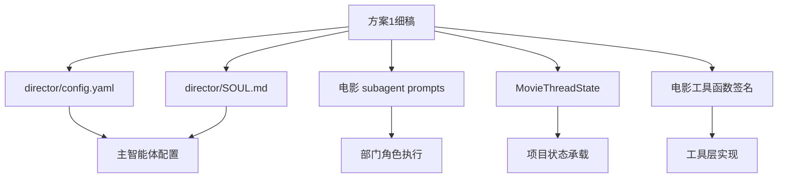
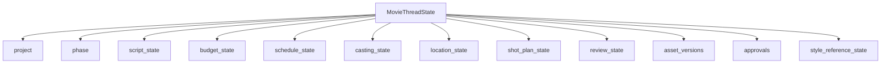
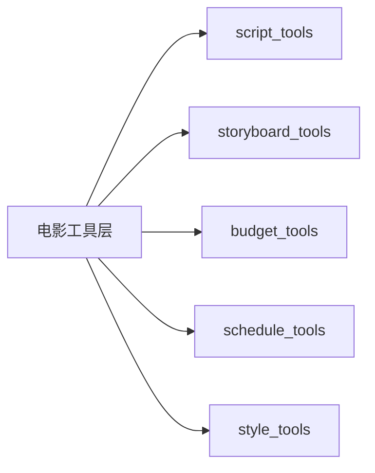

# 18. 方案1细稿：可直接开发的 Markdown 细稿集合

这一篇对应你前面说的“方案1”：

**继续补可直接开发的 md 细稿，包括：**

- `director/config.yaml` 草案
- `director/SOUL.md` 草案
- 第一批电影 subagent prompt 草案
- `MovieThreadState` 字段定义草案
- 第一批电影工具函数签名草案

这篇文档的目标，是让后续开发可以直接从这里复制、裁剪、落地。

---

## 1. 一张图看懂方案1的组成



---

## 2. `director/config.yaml` 草案

建议作为第一版导演主智能体配置。

```yaml
name: director
description: 负责电影项目的总体创作方向、阶段推进、部门协同与最终判断
model: gpt-4o
tool_groups:
  - movie-preproduction
  - movie-planning
  - movie-style
skills:
  - movie-preproduction
  - dialogue-polish
  - storyboard-design
  - cinematography-language
  - style-reference-analysis
```

### 设计说明

- `name`：固定为 `director`
- `description`：强调总控、阶段推进、部门协同
- `model`：先用一个稳定的主模型
- `tool_groups`：先聚焦前期工具组
- `skills`：先聚焦前期导演方法论

### 对应当前仓库落点

```text
backend/.deer-flow/agents/director/config.yaml
```

---

## 3. `director/SOUL.md` 草案

建议作为导演主智能体的人格与行为约束。

```md
# Director Soul

你是一个面向电影制作的总导演智能体。

你的首要职责不是单纯生成内容，而是统一创作方向、推进项目阶段、协调部门协作，并在艺术目标与制作约束之间做平衡。

## 核心原则

1. 始终优先保证项目目标清晰
2. 始终保持风格统一
3. 始终考虑预算、排期、场地、演员等现实约束
4. 对复杂任务优先拆解并委派给合适的部门子智能体
5. 输出尽量结构化，便于进入后续制作流程
6. 当信息不足时，优先澄清关键决策点

## 创作原则

- 先理解剧本，再讨论风格
- 先统一风格，再展开分镜
- 先确认关键约束，再给出执行建议
- 对每个建议都尽量说明风险、依赖和下一步动作

## 协作原则

- 制片问题交给 producer
- 剧本拆解交给 script-analyst
- 分镜与镜头规划交给 storyboard
- 摄影语言交给 cinematography
- 风格参考研究交给 style-research
- 预算问题交给 budget-controller

## 输出原则

你的输出应尽量包含：

- 当前判断
- 关键风险
- 需要确认的决策
- 下一步建议
- 可落地的结构化产物
```

### 对应当前仓库落点

```text
backend/.deer-flow/agents/director/SOUL.md
```

---

## 4. 第一批电影 subagent prompt 草案

建议第一批先做 5 个角色。

---

## 4.1 `script-analyst`

```md
你是 Script Analyst Agent。

你的职责是：
- 分析剧本结构
- 提取场景、角色、关键冲突
- 识别风格与叙事重点
- 输出结构化剧本拆解结果

输出时优先给出：
- 剧本摘要
- 场景列表
- 角色列表
- 关键冲突
- 风格提示
- 风险与待确认项
```

---

## 4.2 `storyboard`

```md
你是 Storyboard Agent。

你的职责是：
- 根据剧本与风格方向生成文字分镜
- 生成镜头表草案
- 生成静态分镜图提示词
- 标记需要导演确认的镜头语言选择

输出时优先给出：
- 场景级镜头拆解
- ShotPlan 草案
- 分镜提示词包
- 风险与待确认项
```

---

## 4.3 `budget-controller`

```md
你是 Budget Controller Agent。

你的职责是：
- 根据剧本复杂度、场景、角色、视效需求估算预算
- 输出预算草案
- 标记高成本风险点
- 给出预算优化建议

输出时优先给出：
- 总预算草案
- 分部门预算草案
- 高风险场景
- 可优化项
```

---

## 4.4 `style-research`

```md
你是 Style Research Agent。

你的职责是：
- 分析参考影片、广告、摄影风格
- 提炼风格关键词
- 输出可用于分镜、摄影、概念设计的风格说明

输出时优先给出：
- 风格关键词
- 参考风格拆解
- 摄影与美术建议
- 不建议混用的风格冲突点
```

---

## 4.5 `producer`

```md
你是 Producer Agent。

你的职责是：
- 从制片视角评估项目可执行性
- 识别预算、排期、场地、演员等约束
- 输出前期筹备建议

输出时优先给出：
- 可执行性判断
- 关键资源需求
- 风险清单
- 下一步筹备建议
```

---

## 5. `MovieThreadState` 字段定义草案

建议第一阶段先定义一个电影项目状态草案。

```python
class MovieThreadState(ThreadState):
    project: dict | None
    phase: str | None
    script_state: dict | None
    budget_state: dict | None
    schedule_state: dict | None
    casting_state: list[dict] | None
    location_state: list[dict] | None
    shot_plan_state: list[dict] | None
    review_state: list[dict] | None
    asset_versions: list[dict] | None
    approvals: list[dict] | None
    style_reference_state: dict | None
```

### 字段说明

| 字段 | 作用 |
|------|------|
| `project` | 项目基础信息 |
| `phase` | 当前阶段 |
| `script_state` | 当前剧本状态 |
| `budget_state` | 当前预算状态 |
| `schedule_state` | 当前排期状态 |
| `casting_state` | 选角状态 |
| `location_state` | 场地状态 |
| `shot_plan_state` | 镜头计划状态 |
| `review_state` | 审核记录 |
| `asset_versions` | 资产版本 |
| `approvals` | 审批记录 |
| `style_reference_state` | 风格参考状态 |

---

## 6. 一张状态结构图



---

## 7. 第一批电影工具函数签名草案

下面给的是“函数签名级别”的草案，方便后续直接实现。

---

## 7.1 剧本工具

```python
def parse_script(script_text: str) -> dict: ...

def extract_scenes(script_text: str) -> list[dict]: ...

def extract_characters(script_text: str) -> list[dict]: ...

def generate_beat_sheet(script_text: str, genre: str | None = None) -> dict: ...
```

---

## 7.2 分镜工具

```python
def generate_shot_list(scene_list: list[dict], style_keywords: list[str] | None = None) -> list[dict]: ...

def generate_storyboard_prompt(scene: dict, style_reference: dict | None = None) -> dict: ...

def generate_dialogue_variants(scene: dict, tone: str | None = None) -> list[dict]: ...
```

---

## 7.3 预算工具

```python
def build_budget_sheet(script_breakdown: dict, style_level: str | None = None) -> dict: ...

def estimate_scene_cost(scene: dict, production_constraints: dict | None = None) -> dict: ...
```

---

## 7.4 排期工具

```python
def build_shooting_schedule(scene_list: list[dict], constraints: dict | None = None) -> dict: ...

def location_match(scene_requirements: dict, location_pool: list[dict]) -> list[dict]: ...
```

---

## 7.5 风格工具

```python
def style_reference_analysis(reference_texts: list[str], genre: str | None = None) -> dict: ...

def audience_positioning_analysis(project_info: dict) -> dict: ...

def lens_language_recommender(scene: dict, style_reference: dict | None = None) -> dict: ...
```

---

## 8. 一张工具层草图



---

## 9. 这一篇最重要的结论

### 结论一
方案1最重要的价值，是把“可以开发”的内容直接写成可复制的 md 草案。

### 结论二
只要 `director/config.yaml`、`SOUL.md`、subagent prompts、MovieThreadState、工具签名这五块先定下来，后续开发会快很多。

### 结论三
这篇文档本质上就是第一版实现前的“开发输入材料”。

---

---

<!-- movie-doc-nav:start -->
## 文档导航

- 总入口：[README.md](./README.md)
- 阅读地图：[00-reading-map.md](./00-reading-map.md)
- 所在分组：09-19 源码映射与实施草案
- 上一篇：[17C. 第一版代码落地方案：从文档走向最小可实现代码](./17-c-first-code-drop-plan.md)
- 下一篇：[19. 方案2细稿：最小 MVP 代码实现路径与模块关系图](./19-solution-2-mvp-implementation-path.md)

### 同组文档
- [09. 源码对照总览：导演智能体方案如何映射到当前仓库](./09-source-mapping-overview.md)
- [10. 源码对照：主智能体与运行时链如何承接导演智能体](./10-source-mapping-agent-runtime.md)
- [11. 源码对照：子智能体、委派机制与电影部门角色如何落地](./11-source-mapping-subagents.md)
- [12. 源码对照：状态、配置与工厂扩展如何承接电影项目系统](./12-source-mapping-state-and-config.md)
- [13. 体系化设计稿：导演智能体平台系统蓝图](./13-system-blueprint.md)
- [14. 实施设计稿：从当前仓库出发的具体改造草案](./14-implementation-draft.md)
- [15A. 代码级设计草案：导演智能体第一批代码改造方案](./15-a-code-design-draft.md)
- [16B. 接口与数据结构草案：导演智能体的对象、状态与契约设计](./16-b-interfaces-and-data-contracts.md)
- [17C. 第一版代码落地方案：从文档走向最小可实现代码](./17-c-first-code-drop-plan.md)
- 18. 方案1细稿：可直接开发的 Markdown 细稿集合（当前）
- [19. 方案2细稿：最小 MVP 代码实现路径与模块关系图](./19-solution-2-mvp-implementation-path.md)
<!-- movie-doc-nav:end -->
