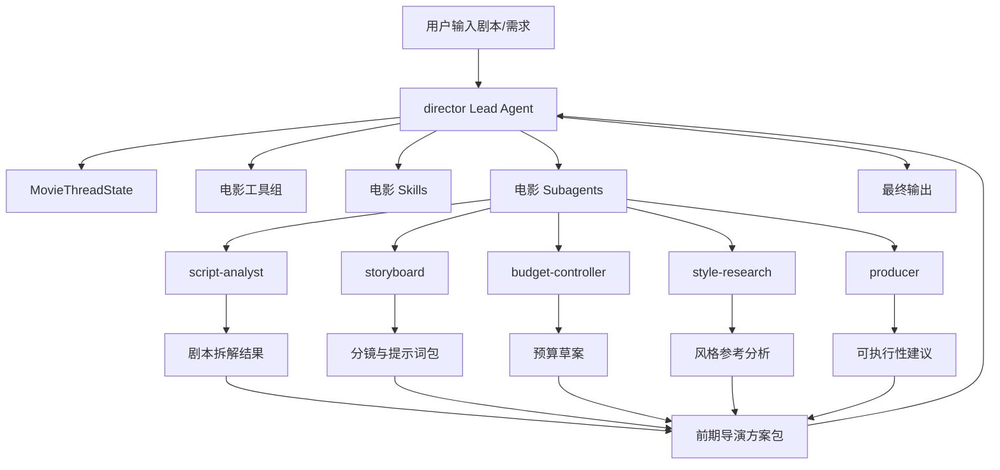
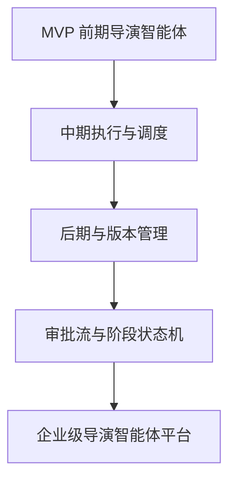

# 19. 方案2细稿：最小 MVP 代码实现路径与模块关系图

这一篇对应你前面说的“方案2”：

**直接开始落第一版代码，但先把最小 MVP 的实现路径、模块关系、开发顺序和验收方式写成 md。**

这篇文档比 17 更进一步，重点是“怎么组织实现过程”。

---

## 1. 方案2的目标

目标不是一次性做完整平台，而是做一个最小可运行的前期导演智能体闭环。

### MVP 闭环目标

```text
输入剧本或项目需求
-> director 主智能体理解任务
-> 委派给 script-analyst / storyboard / budget-controller / style-research
-> 汇总结果
-> 输出前期导演方案包
```

---

## 2. 一张 MVP 模块关系图



---

## 3. MVP 的最小模块集合

建议 MVP 只包含 5 类模块：

1. `director` 主智能体配置
2. 第一批电影 subagents
3. 最小状态扩展
4. 最小电影工具组
5. 最小电影 skills

### 为什么只做这 5 类
因为这 5 类已经足够形成一个完整闭环。

---

## 4. MVP 的实现顺序

## Step 1：落 `director` 主智能体

### 目标
让系统能以导演身份运行。

### 需要做的事
- 新增 `director/config.yaml`
- 新增 `director/SOUL.md`
- 验证 `agent_name=director` 能正常加载

### 验收
- 能启动 director agent
- 能加载导演专属 skills / tool_groups

---

## Step 2：落第一批电影 subagents

### 目标
让主智能体能委派给电影部门角色。

### 需要做的事
- 注册 `script-analyst`
- 注册 `storyboard`
- 注册 `budget-controller`
- 注册 `style-research`
- 注册 `producer`

### 验收
- `task(subagent_type=...)` 能正常执行
- 子智能体能返回结构化摘要

---

## Step 3：落最小状态扩展

### 目标
让系统能保存电影项目的最小状态。

### 需要做的事
- 扩展 `ThreadState` 或新增 `MovieThreadState`
- 增加 `project` / `phase` / `script_state` / `budget_state` / `shot_plan_state`

### 验收
- 主 agent 能读写这些字段
- 子智能体能继承必要上下文

---

## Step 4：落最小电影工具组

### 目标
让系统能真正产出前期方案资产。

### 需要做的事
- 实现剧本解析工具
- 实现分镜工具
- 实现预算工具
- 实现风格分析工具

### 验收
- 工具可被调用
- 工具能输出结构化结果或文件

---

## Step 5：落最小电影 skills

### 目标
让系统具备电影制作方法论。

### 需要做的事
- 新增 `movie-preproduction`
- 新增 `dialogue-polish`
- 新增 `storyboard-design`
- 新增 `style-reference-analysis`

### 验收
- director 能加载 skills
- 子智能体能继承相关 skills 提示

---

## Step 6：做端到端 demo

### 目标
验证整个闭环。

### 输入
- 一段剧本摘要或项目需求

### 输出
- 剧本拆解
- 风格分析
- 分镜草案
- 预算草案
- 导演总结建议

### 验收
- 产物进入工作区
- 主智能体能汇总子任务结果
- 用户能看到完整前期方案包

---

## 5. 一张开发顺序图


---

## 6. MVP 的目录级落地草案

```text
backend/.deer-flow/agents/
  director/
    config.yaml
    SOUL.md

backend/packages/harness/deerflow/
  agents/
    movie_thread_state.py
    movie_factory.py
  subagents/
    movie/
      builtins.py
      prompts/
  tools/
    movie/
      script_tools.py
      storyboard_tools.py
      budget_tools.py
      style_tools.py

skills/
  movie-preproduction/
  dialogue-polish/
  storyboard-design/
  style-reference-analysis/
```

---

## 7. MVP 的最小验收矩阵

| 模块 | 验收点 | 是否必须 |
|------|--------|----------|
| director agent | 能启动并加载配置 | 必须 |
| subagents | 能被 task 调用 | 必须 |
| state | 能保存最小项目状态 | 必须 |
| tools | 能产出结构化结果 | 必须 |
| skills | 能注入电影方法论 | 必须 |
| demo | 能输出前期方案包 | 必须 |

---

## 8. MVP 之后的自然扩展

MVP 跑通后，下一步最自然的是：

- 增加 `assistant-director`
- 增加 `daily-review`
- 增加阶段状态机
- 增加审核流
- 增加版本管理
- 增加后期角色

也就是说，MVP 不是终点，而是平台化演进的第一块基石。

---

## 9. 一张从 MVP 到平台的演进图



---

## 10. 这一篇最重要的结论

### 结论一
方案2的关键不是“立刻写很多代码”，而是先把最小闭环跑通。

### 结论二
MVP 只需要 5 类模块，就足以验证方向。

### 结论三
只要 director + subagents + state + tools + skills 这五块跑通，后续平台化扩展就有了坚实基础。

---

<!-- movie-visuals:start -->
## 补充图示：换一种视角看本篇

下面这张 流程图 把“方案2细稿：最小 MVP 代码实现路径与模块关系图”再压缩成一个可快速扫读的结构视图，便于先抓关键关系，再回到正文细节。


<!-- movie-visuals:end -->

<!-- movie-doc-nav:start -->
## 文档导航

- 总入口：[README.md](./README.md)
- 阅读地图：[00-reading-map.md](./00-reading-map.md)
- 所在分组：09-19 源码映射与实施草案
- 上一篇：[18. 方案1细稿：可直接开发的 Markdown 细稿集合](./18-solution-1-detailed-md-drafts.md)
- 下一篇：[20. 50+ 文档总规划：面向大规模电影制作的导演智能体平台](./20-master-plan-50-docs.md)

### 同组文档
- [09. 源码对照总览：导演智能体方案如何映射到当前仓库](./09-source-mapping-overview.md)
- [10. 源码对照：主智能体与运行时链如何承接导演智能体](./10-source-mapping-agent-runtime.md)
- [11. 源码对照：子智能体、委派机制与电影部门角色如何落地](./11-source-mapping-subagents.md)
- [12. 源码对照：状态、配置与工厂扩展如何承接电影项目系统](./12-source-mapping-state-and-config.md)
- [13. 体系化设计稿：导演智能体平台系统蓝图](./13-system-blueprint.md)
- [14. 实施设计稿：从当前仓库出发的具体改造草案](./14-implementation-draft.md)
- [15A. 代码级设计草案：导演智能体第一批代码改造方案](./15-a-code-design-draft.md)
- [16B. 接口与数据结构草案：导演智能体的对象、状态与契约设计](./16-b-interfaces-and-data-contracts.md)
- [17C. 第一版代码落地方案：从文档走向最小可实现代码](./17-c-first-code-drop-plan.md)
- [18. 方案1细稿：可直接开发的 Markdown 细稿集合](./18-solution-1-detailed-md-drafts.md)
- 19. 方案2细稿：最小 MVP 代码实现路径与模块关系图（当前）
<!-- movie-doc-nav:end -->
