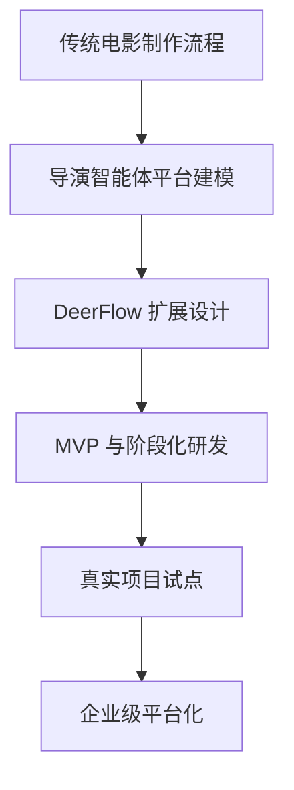
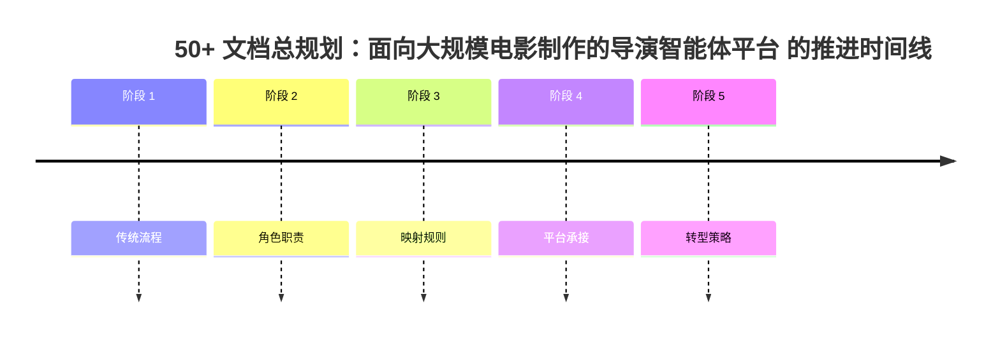

# 20. 50+ 文档总规划：面向大规模电影制作的导演智能体平台

这一篇是整个新一轮文档体系的总规划。

目标不是只回答“AI 能做什么”，而是回答三个更难的问题：

1. 传统电影制作在没有 AI 的情况下是如何真实运转的
2. 这些真实流程、岗位、文档、审批、交付物如何映射到导演智能体平台
3. 如何基于当前 DeerFlow 项目，做系统性、渐进式、可研发、可实践的落地

---

## 1. 总体目标

这套 50+ 文档将覆盖五个层面：

- 传统电影工业流程
- 电影导演智能体平台设计
- DeerFlow 源码映射与扩展点
- 研发实施路线
- 真实项目实践与组织落地

---

## 2. 一张总览图

---

## 3. 为什么必须先研究“没有 AI 如何制作电影”

传统电影制作不是一个“灵感生成问题”，而是一个高度组织化的工业流程问题。

根据传统电影制作流程资料，前期制作的关键交付物包括：剧本锁定、预算、排期、镜头表、分镜、场地协议、演员合同、剧组合同；而 1st AD 的排期与 line producer 的预算是前期最核心的两个运营文档。脚本一旦锁定，后续预算、设计、排期都会联动变化。[来源：Tools for Film, Pre-Production](https://www.toolsforfilm.com/glossary/pre-production)

这意味着：

- 导演智能体不能只会生成内容
- 它必须理解“文档之间的联动关系”
- 它必须理解“角色之间的责任边界”
- 它必须理解“变更会如何影响预算、排期、场地、演员、后期”

---

## 4. 50+ 文档的主题分组

### 第一组：总览与方法论
- 20. 总规划
- 21. 传统电影制作全流程总览
- 22. 无 AI 电影制作的组织结构
- 23. 从传统流程到导演智能体平台的映射方法
- 24. DeerFlow 改造总路线图

### 第二组：前期制作体系
- 25. 剧本开发与锁稿
- 26. 剧本拆解与 breakdown sheet
- 27. 预算体系与 line producer 视角
- 28. 排期体系与 1st AD 视角
- 29. 选角流程与演员管理
- 30. 场地勘景与场地锁定
- 31. 美术、服装、道具协同
- 32. 摄影、灯光、视效前期协同
- 33. 文字分镜与镜头表
- 34. 静态分镜图与氛围图
- 35. 风格参考分析与风格统一
- 36. 对白设计与润色

### 第三组：中期制作体系
- 37. principal photography 现场组织
- 38. call sheet 与每日拍摄计划
- 39. 助理导演调度系统
- 40. 进度控制与成本控制
- 41. 现场问题升级与决策机制
- 42. 演员表演指导与导演反馈
- 43. 摄影、灯光、录音、视效现场协同
- 44. dailies、出片与审核

### 第四组：后期制作体系
- 45. 剪辑流程与版本推进
- 46. 配音、配乐、音效协同
- 47. 调色流程与视觉统一
- 48. VFX 后期协同与交付
- 49. 审核流、版本管理与发布包
- 50. 宣发素材与发行协同
- 51. 项目复盘与知识沉淀

### 第五组：智能体平台设计
- 52. 导演主智能体设计
- 53. 制片子智能体设计
- 54. 剧本分析子智能体设计
- 55. 分镜子智能体设计
- 56. 预算子智能体设计
- 57. 排期子智能体设计
- 58. 选角子智能体设计
- 59. 场地子智能体设计
- 60. 摄影语言子智能体设计
- 61. 风格研究子智能体设计
- 62. 后期统筹子智能体设计

### 第六组：对象、状态、工作流
- 63. Project 对象体系
- 64. Script / Scene / Character 对象体系
- 65. Budget / Schedule / CallSheet 对象体系
- 66. ShotPlan / Storyboard / StyleBoard 对象体系
- 67. Review / Approval / Version 对象体系
- 68. MovieThreadState 设计
- 69. 阶段状态机设计
- 70. 审批流设计

### 第七组：DeerFlow 源码映射与研发
- 71. Lead Agent 改造方案
- 72. task tool 与子任务委派扩展
- 73. Subagent registry 电影化扩展
- 74. ThreadState 扩展方案
- 75. movie tools 设计
- 76. movie skills 设计
- 77. movie factory 设计
- 78. 自定义 agent 配置体系
- 79. 工作区、产物与文件流
- 80. 观测、日志与评估

### 第八组：研发与实践落地
- 81. MVP 范围定义
- 82. 第一阶段研发计划
- 83. 第二阶段研发计划
- 84. 第三阶段研发计划
- 85. 试点项目实施手册
- 86. 团队组织与角色分工
- 87. 数据治理与资产治理
- 88. 安全、权限与审计
- 89. 评估指标与 ROI
- 90. 企业级落地路线图

---

## 5. 一张文档分层图

---

## 6. 这套文档如何与当前 DeerFlow 结合

当前 DeerFlow 已经具备：

- Lead Agent
- task 工具
- SubagentExecutor
- ThreadState
- Skills
- Sandbox / artifacts
- 自定义 agent 配置

因此这 50+ 文档不会脱离当前仓库空谈，而是会持续回答：

- 哪个电影流程对应哪个 agent
- 哪个交付物对应哪个对象模型
- 哪个协作动作对应哪个 tool / skill / state
- 哪个研发步骤对应哪个源码扩展点

---

## 7. 输出策略

为了保证质量，这一轮文档会采用“完整目录 + 分批生成”的方式推进：

1. 先建立总规划与分组
2. 再批量生成每组文档
3. 每篇都带图
4. 每篇都尽量与 DeerFlow 结合
5. README 最终统一更新为 50+ 导览

---

## 8. 这一篇最重要的结论

### 结论一
要把 DeerFlow 改造成电影导演智能体，必须先理解传统电影工业的真实组织方式。

### 结论二
导演智能体平台的本质不是“生成内容”，而是“管理创作、资源、流程、审批与交付”。

### 结论三
50+ 文档不是为了堆数量，而是为了把“行业流程 -> 平台建模 -> 源码扩展 -> 研发落地 -> 项目试点”完整打通。

---

<!-- movie-visuals:start -->
## 补充图示：换一种视角看本篇

下面这张 时间线 把“50+ 文档总规划：面向大规模电影制作的导演智能体平台”再压缩成一个可快速扫读的结构视图，便于先抓关键关系，再回到正文细节。

<!-- movie-visuals:end -->

<!-- movie-doc-nav:start -->
## 文档导航

- 总入口：[README.md](./README.md)
- 阅读地图：[00-reading-map.md](./00-reading-map.md)
- 所在分组：20-24 方法论、传统流程与转型起点
- 上一篇：[19. 方案2细稿：最小 MVP 代码实现路径与模块关系图](./19-solution-2-mvp-implementation-path.md)
- 下一篇：[21. 传统电影制作全流程总览](./21-traditional-filmmaking-overview.md)

### 同组文档
- 20. 50+ 文档总规划：面向大规模电影制作的导演智能体平台（当前）
- [21. 传统电影制作全流程总览](./21-traditional-filmmaking-overview.md)
- [22. 无 AI 电影制作的组织结构](./22-non-ai-filmmaking-organization.md)
- [23. 从传统流程到导演智能体平台的映射方法](./23-mapping-traditional-process-to-agent-platform.md)
- [24. DeerFlow 改造总路线图](./24-deerflow-transformation-roadmap.md)
<!-- movie-doc-nav:end -->
