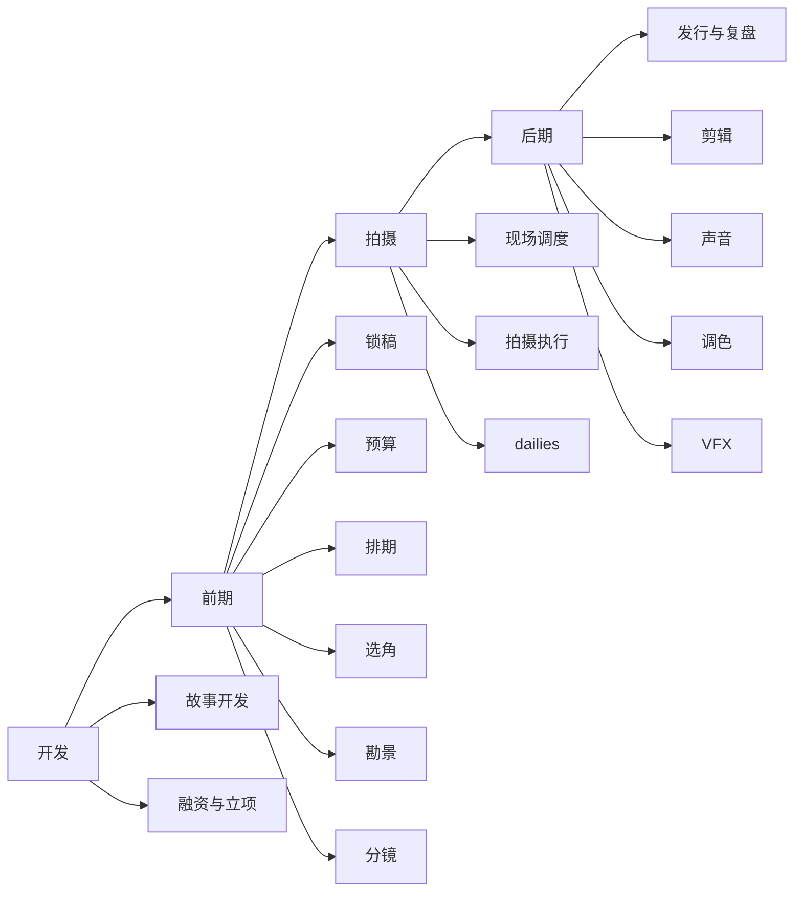
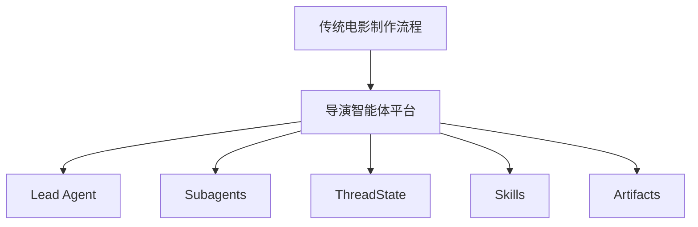

# 21. 传统电影制作全流程总览

这一篇回答一个基础问题：

**在没有 AI 的情况下，一部电影是如何从想法走到成片的。**

只有把这个问题讲清楚，后面的导演智能体平台设计才不会悬空。

---

## 1. 传统电影制作的本质

传统电影制作不是单点创作，而是一个跨阶段、跨部门、跨文档的协同系统。

它通常分为四个大阶段：

- 开发（development）
- 前期（pre-production）
- 拍摄（production / principal photography）
- 后期（post-production）

其中前期的质量，直接决定拍摄效率、成本控制和创作一致性。传统制作资料普遍强调：剧本锁定、预算、排期、镜头表、分镜、场地协议、演员合同、剧组合同等，都是前期的关键交付物；而 1st AD 的排期与 line producer 的预算，是前期最核心的两个运营文档。[来源：Tools for Film, Pre-Production](https://www.toolsforfilm.com/glossary/pre-production)

---

## 2. 一张全流程图

---

## 3. 开发阶段在做什么

开发阶段的目标不是拍摄，而是确认“值不值得拍、拍什么、谁来拍、钱从哪里来”。

核心工作包括：

- 故事开发
- 剧本写作与修改
- 导演与制片初步绑定
- 融资与立项
- 初步市场定位

这一阶段的输出通常是：

- 剧本版本
- 项目简介
- 预算级别判断
- 目标受众判断
- 初步融资方案

---

## 4. 前期阶段在做什么

前期是把“剧本”变成“可执行生产计划”的阶段。

核心工作包括：

- 剧本锁定
- 剧本拆解
- 预算编制
- 排期编制
- 选角
- 勘景
- 美术、服装、道具准备
- 摄影、灯光、视效前期设计
- 分镜与镜头表
- 风格统一

这一阶段的关键不是创意本身，而是把创意转成：

- 人员安排
- 时间安排
- 资源安排
- 风险安排
- 文档安排

---

## 5. 拍摄阶段在做什么

拍摄阶段是成本最敏感的阶段。

因为一旦进入 principal photography，每一天都在消耗：

- 人工成本
- 设备成本
- 场地成本
- 交通与后勤成本
- 时间窗口成本

所以拍摄阶段的核心不是“再想一想”，而是：

- 按计划执行
- 快速处理现场问题
- 控制变更
- 保证素材质量
- 保证进度与成本不失控

---

## 6. 后期阶段在做什么

后期不是简单拼接素材，而是把拍摄素材变成最终可交付作品。

核心工作包括：

- 素材整理
- 粗剪 / 精剪
- ADR / 配音
- 配乐
- 音效设计
- 调色
- VFX 合成
- 审核与版本推进
- 交付包制作

后期的关键问题是：

- 版本管理
- 审核流
- 返工控制
- 交付标准

---

## 7. 为什么这对导演智能体很重要

如果不了解传统电影制作全流程，就很容易把导演智能体误做成“会写提示词的内容生成器”。

但真实世界里，导演智能体至少要承担五类能力：

- 创作理解
- 资源协调
- 阶段推进
- 风险识别
- 交付管理

也就是说，它必须像一个“项目型创作操作系统”，而不是单一生成模型。

---

## 8. 与 DeerFlow 的映射

在当前 DeerFlow 中，可以这样理解映射关系：

- Lead Agent -> 总导演 / 总控中枢
- task tool -> 部门委派机制
- Subagent -> 制片、剧本、分镜、预算、排期等部门角色
- ThreadState -> 项目运行状态
- Skills -> 电影方法论与专业知识
- Sandbox / artifacts -> 文档、镜头表、预算表、分镜提示词等产物

---

## 9. 一张映射图

---

## 10. 这一篇最重要的结论

### 结论一
传统电影制作是一个跨阶段、跨部门、跨文档的工业协同系统。

### 结论二
导演智能体必须理解真实制作流程，而不是只做内容生成。

### 结论三
DeerFlow 的多智能体底座，天然适合承接这种“总控 + 委派 + 状态 + 产物”的电影制作系统。

---

---

<!-- movie-doc-nav:start -->
## 文档导航

- 总入口：[README.md](./README.md)
- 阅读地图：[00-reading-map.md](./00-reading-map.md)
- 所在分组：20-24 方法论、传统流程与转型起点
- 上一篇：[20. 50+ 文档总规划：面向大规模电影制作的导演智能体平台](./20-master-plan-50-docs.md)
- 下一篇：[22. 无 AI 电影制作的组织结构](./22-non-ai-filmmaking-organization.md)

### 同组文档
- [20. 50+ 文档总规划：面向大规模电影制作的导演智能体平台](./20-master-plan-50-docs.md)
- 21. 传统电影制作全流程总览（当前）
- [22. 无 AI 电影制作的组织结构](./22-non-ai-filmmaking-organization.md)
- [23. 从传统流程到导演智能体平台的映射方法](./23-mapping-traditional-process-to-agent-platform.md)
- [24. DeerFlow 改造总路线图](./24-deerflow-transformation-roadmap.md)
<!-- movie-doc-nav:end -->
