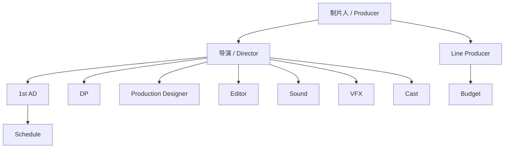
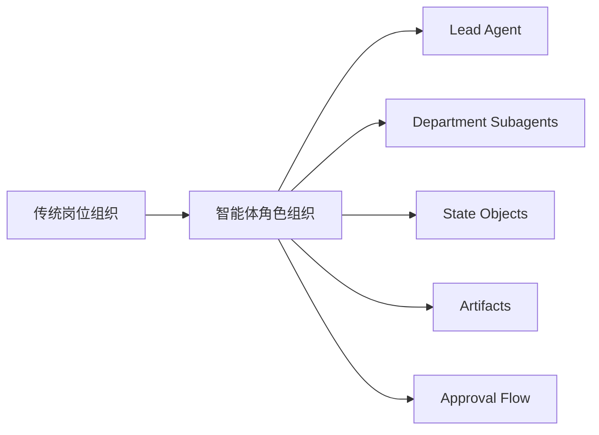

# 22. 无 AI 电影制作的组织结构

这一篇聚焦一个关键问题：

**在没有 AI 的情况下，电影项目是靠什么组织起来的。**

答案不是“靠导演一个人”，而是靠一整套明确的岗位分工、责任边界和文档流。

---

## 1. 传统电影制作的组织原则

传统电影制作的组织方式有三个核心原则：

- 创作权与执行权分层
- 部门职责清晰
- 文档驱动协作

导演负责创作方向，但并不直接替代制片、1st AD、摄影指导、美术指导、后期总监等岗位。

---

## 2. 一张组织结构图

---

## 3. 核心岗位分别负责什么

### Producer / 制片人
负责项目成立、融资、资源协调、关键决策。

### Line Producer
负责预算、成本控制、资源配置。

### Director / 导演
负责创作方向、表演、镜头语言、风格统一。

### 1st AD
负责排期、现场调度、拍摄秩序。

### DP / 摄影指导
负责摄影方案、镜头语言、灯光协同。

### Production Designer
负责视觉世界、美术、场景、道具方向。

### Editor
负责后期剪辑结构与版本推进。

### Sound / Music / VFX
负责声音、音乐、视效等后期专业环节。

---

## 4. 为什么组织结构比“灵感”更重要

在真实项目里，灵感当然重要，但真正决定项目能否完成的，是：

- 谁负责什么
- 谁批准什么
- 谁交付什么
- 谁在什么时间点接手
- 变更由谁评估影响

如果这些边界不清晰，项目就会出现：

- 重复劳动
- 责任漂移
- 预算失控
- 排期失控
- 创作方向反复

---

## 5. 文档如何支撑组织结构

传统电影制作不是靠口头沟通维持，而是靠文档维持。

常见关键文档包括：

- 剧本版本
- breakdown sheet
- 预算表
- 排期表
- call sheet
- shot list
- storyboard
- location agreement
- cast contract
- review notes
- version log

这些文档本质上就是组织协作的“状态载体”。

---

## 6. 这对导演智能体意味着什么

如果要把 DeerFlow 改造成导演智能体平台，就不能只建一个“director agent”。

必须同时建：

- 主智能体：负责总控
- 部门子智能体：负责专业职责
- 状态对象：负责承载项目状态
- 文档产物：负责承载协作结果
- 审批流：负责控制变更与推进

---

## 7. 与 DeerFlow 的组织映射

可以把当前 DeerFlow 的能力映射成：

- Lead Agent -> 导演 / 总控
- Subagents -> 制片、预算、排期、分镜、风格、后期等部门角色
- ThreadState -> 项目状态与文档状态
- Artifacts -> 预算表、镜头表、分镜、审核记录
- Middleware -> 约束、澄清、记忆、并发控制

---

## 8. 一张平台组织映射图

---

## 9. 研发上的启示

从研发角度看，最重要的不是先做“最聪明的模型”，而是先做：

- 最清晰的角色边界
- 最稳定的状态结构
- 最可追踪的文档流
- 最可验证的审批流

因为电影制作首先是组织问题，其次才是生成问题。

---

## 10. 这一篇最重要的结论

### 结论一
无 AI 电影制作依赖的是岗位分工、责任边界和文档流。

### 结论二
导演智能体平台必须复刻这种组织结构，而不是只做一个万能 agent。

### 结论三
DeerFlow 的主从多智能体结构，非常适合映射传统电影制作的组织方式。

---

---

<!-- movie-doc-nav:start -->
## 文档导航

- 总入口：[README.md](./README.md)
- 阅读地图：[00-reading-map.md](./00-reading-map.md)
- 所在分组：20-24 方法论、传统流程与转型起点
- 上一篇：[21. 传统电影制作全流程总览](./21-traditional-filmmaking-overview.md)
- 下一篇：[23. 从传统流程到导演智能体平台的映射方法](./23-mapping-traditional-process-to-agent-platform.md)

### 同组文档
- [20. 50+ 文档总规划：面向大规模电影制作的导演智能体平台](./20-master-plan-50-docs.md)
- [21. 传统电影制作全流程总览](./21-traditional-filmmaking-overview.md)
- 22. 无 AI 电影制作的组织结构（当前）
- [23. 从传统流程到导演智能体平台的映射方法](./23-mapping-traditional-process-to-agent-platform.md)
- [24. DeerFlow 改造总路线图](./24-deerflow-transformation-roadmap.md)
<!-- movie-doc-nav:end -->
