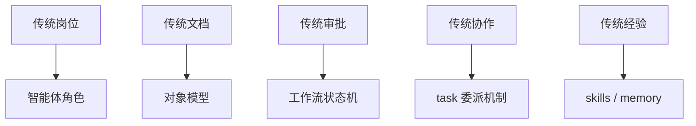
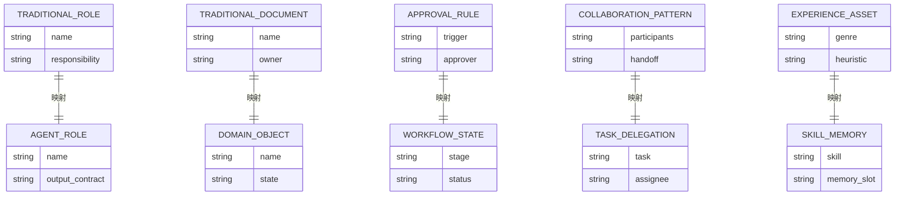
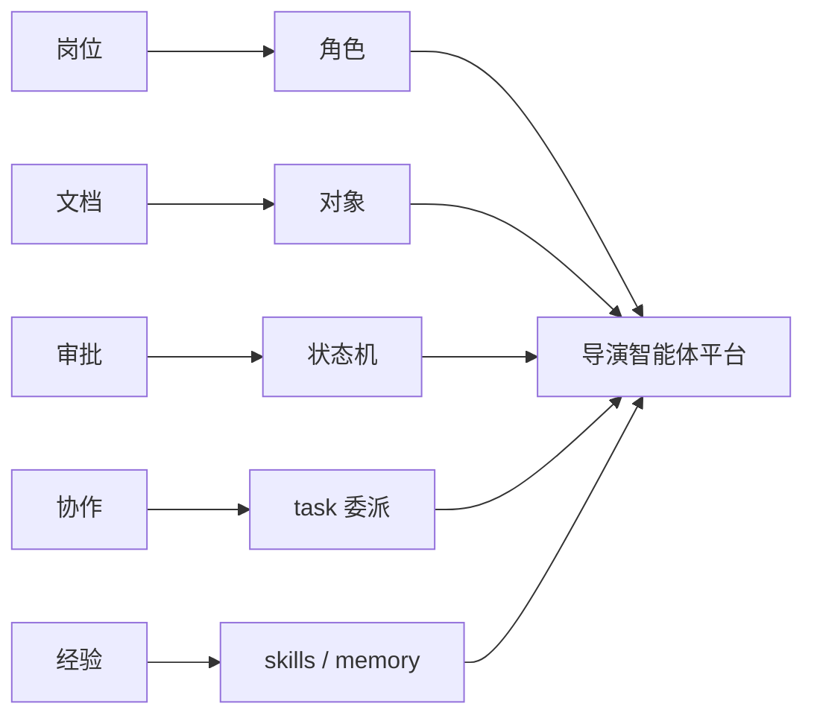
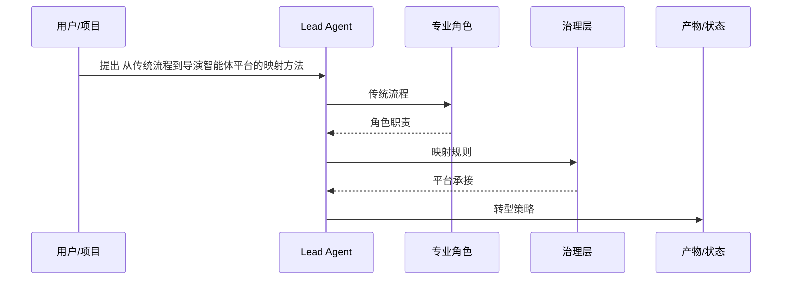

# 23. 从传统流程到导演智能体平台的映射方法

这一篇解决一个核心问题：

**传统电影制作流程，如何一步一步映射成导演智能体平台。**

---

## 1. 映射不是“替代人”，而是“结构化职责”

把传统电影制作映射成智能体平台，不意味着 AI 直接替代所有岗位。

更现实的做法是：

- 把岗位职责结构化
- 把文档流结构化
- 把审批流结构化
- 把阶段推进结构化
- 把变更影响结构化

这样平台才能真正落地。

---

## 2. 一张映射方法图

---

## 3. 第一步：岗位映射成角色

例如：

- Director -> Lead Agent
- Producer -> producer subagent
- Script Analyst -> script-analyst subagent
- 1st AD -> scheduling / assistant-director subagent
- DP -> cinematography subagent
- Editor -> post supervisor / editor subagent

这样做的好处是：

- 角色边界清晰
- 委派逻辑清晰
- 输出责任清晰

---

## 4. 第二步：文档映射成对象

传统电影制作中的关键文档，需要映射成系统对象。

例如：

- 剧本 -> Script
- 场景拆解 -> SceneBreakdown
- 预算表 -> Budget
- 排期表 -> Schedule
- call sheet -> CallSheet
- 镜头表 -> ShotPlan
- 审核意见 -> Review
- 版本记录 -> AssetVersion

这样系统才能真正管理项目，而不是只管理聊天记录。

---

## 5. 第三步：审批映射成状态机

传统电影制作中，很多工作不是“生成完就结束”，而是要经过：

- 提交
- 审核
- 修改
- 再审核
- 批准
- 归档

所以平台必须有：

- 阶段状态机
- 审批状态机
- 版本推进机制

---

## 6. 第四步：协作映射成委派机制

在 DeerFlow 中，这一步最自然的映射就是：

- 主智能体负责理解目标
- `task` 工具负责委派子任务
- 子智能体负责专业输出
- 主智能体负责汇总与决策

这与传统电影制作中的“导演 / 制片 / 部门负责人协作”非常接近。

---

## 7. 第五步：经验映射成 skills 与 memory

传统电影制作中，很多能力来自经验：

- 科幻片的镜头语言
- 广告片的节奏控制
- 武打片的动作设计
- 商业片的观众定位

这些经验在平台里不能只靠临时 prompt，而应该沉淀为：

- skills
- memory
- 风格模板
- 参考案例库

把五类映射放到对象关系里看，会更容易发现这不是单点替换，而是一组并行结构化动作：

---

## 8. 一张完整映射图

---

## 9. 与 DeerFlow 的真实落地关系

当前 DeerFlow 已经具备：

- Lead Agent
- task tool
- SubagentExecutor
- ThreadState
- Skills
- Artifacts

所以映射工作不是从零开始，而是：

- 给现有 agent 体系加电影角色
- 给现有 state 体系加电影对象
- 给现有 tool 体系加电影工具
- 给现有 skill 体系加电影知识
- 给现有 artifacts 体系加电影交付物

---

## 10. 这一篇最重要的结论

### 结论一
导演智能体平台的关键不是“更强模型”，而是“更强映射”。

### 结论二
只有把岗位、文档、审批、协作、经验都映射进去，平台才会真实可用。

### 结论三
DeerFlow 已经具备映射所需的大部分底座，关键在于行业化扩展。

---

<!-- movie-visuals:start -->
## 补充图示：换一种视角看本篇

下面这张 时序图 把“从传统流程到导演智能体平台的映射方法”再压缩成一个可快速扫读的结构视图，便于先抓关键关系，再回到正文细节。

<!-- movie-visuals:end -->

<!-- movie-doc-nav:start -->
## 文档导航

- 总入口：[README.md](./README.md)
- 阅读地图：[00-reading-map.md](./00-reading-map.md)
- 所在分组：20-24 方法论、传统流程与转型起点
- 上一篇：[22. 无 AI 电影制作的组织结构](./22-non-ai-filmmaking-organization.md)
- 下一篇：[24. DeerFlow 改造总路线图](./24-deerflow-transformation-roadmap.md)

### 同组文档
- [20. 50+ 文档总规划：面向大规模电影制作的导演智能体平台](./20-master-plan-50-docs.md)
- [21. 传统电影制作全流程总览](./21-traditional-filmmaking-overview.md)
- [22. 无 AI 电影制作的组织结构](./22-non-ai-filmmaking-organization.md)
- 23. 从传统流程到导演智能体平台的映射方法（当前）
- [24. DeerFlow 改造总路线图](./24-deerflow-transformation-roadmap.md)
<!-- movie-doc-nav:end -->
