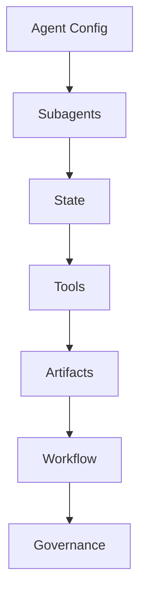

# 24. DeerFlow 改造总路线图

这一篇回答：

**如果从当前 DeerFlow 出发，应该如何渐进式改造成面向大规模电影制作的导演智能体平台。**

---

## 1. 改造原则

改造不能一步到位，否则会同时失控在三个维度：

- 研发复杂度
- 业务复杂度
- 组织复杂度

所以必须采用渐进式路线。

---

## 2. 一张总路线图

---

## 3. 第一阶段：前期导演智能体 MVP

目标：

- 能理解剧本或项目需求
- 能委派给剧本、分镜、预算、风格等子智能体
- 能输出前期方案包

关键模块：

- director agent
- script-analyst
- storyboard
- budget-controller
- style-research
- MovieThreadState
- movie tools
- movie skills

---

## 4. 第二阶段：中期执行与调度系统

目标：

- 支持拍摄排期
- 支持 call sheet
- 支持现场问题升级
- 支持进度与成本联动

关键模块：

- assistant-director agent
- scheduling tools
- call sheet objects
- escalation workflow
- daily review artifacts

---

## 5. 第三阶段：后期与版本管理系统

目标：

- 支持剪辑版本推进
- 支持声音、调色、VFX 协同
- 支持审核流与交付包

关键模块：

- post supervisor agent
- review workflow
- asset version objects
- deliverable package tools

---

## 6. 第四阶段：企业级平台化

目标：

- 多项目并行
- 权限与审计
- 数据治理
- 评估与 ROI
- 企业级知识沉淀

关键模块：

- project portfolio layer
- permission layer
- audit layer
- analytics layer
- knowledge layer

---

## 7. 为什么这条路线真实可行

因为它符合传统电影制作的真实节奏：

- 先把前期计划能力做强
- 再把现场执行能力做强
- 再把后期版本与审核能力做强
- 最后再做企业级治理

这比一开始就做“全流程万能平台”更现实。

---

## 8. 与 DeerFlow 源码的对应关系

### 第一阶段主要改：
- 自定义 agent 配置
- subagent registry
- ThreadState 扩展
- movie tools
- movie skills

### 第二阶段主要改：
- workflow state
- scheduling tools
- artifacts pipeline

### 第三阶段主要改：
- review / version objects
- deliverable tools
- approval flow

### 第四阶段主要改：
- governance
- analytics
- audit
- multi-project orchestration

---

## 9. 一张源码改造层次图

---

## 10. 研发管理上的建议

为了让路线图真正落地，研发上建议：

- 每阶段只做一个闭环
- 每阶段都定义验收标准
- 每阶段都保留人工审核点
- 每阶段都沉淀对象与文档规范
- 每阶段都做试点项目验证

---

## 11. 这一篇最重要的结论

### 结论一
DeerFlow 的电影化改造必须走阶段化路线，而不是一次性重构。

### 结论二
最合理的顺序是：前期 -> 中期 -> 后期 -> 企业级治理。

### 结论三
当前仓库已经具备第一阶段 MVP 的大部分底座。

---

---

<!-- movie-doc-nav:start -->
## 文档导航

- 总入口：[README.md](./README.md)
- 阅读地图：[00-reading-map.md](./00-reading-map.md)
- 所在分组：20-24 方法论、传统流程与转型起点
- 上一篇：[23. 从传统流程到导演智能体平台的映射方法](./23-mapping-traditional-process-to-agent-platform.md)
- 下一篇：[25. 剧本开发与锁稿](./25-script-development-and-lock.md)

### 同组文档
- [20. 50+ 文档总规划：面向大规模电影制作的导演智能体平台](./20-master-plan-50-docs.md)
- [21. 传统电影制作全流程总览](./21-traditional-filmmaking-overview.md)
- [22. 无 AI 电影制作的组织结构](./22-non-ai-filmmaking-organization.md)
- [23. 从传统流程到导演智能体平台的映射方法](./23-mapping-traditional-process-to-agent-platform.md)
- 24. DeerFlow 改造总路线图（当前）
<!-- movie-doc-nav:end -->
