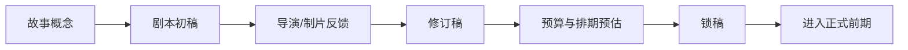
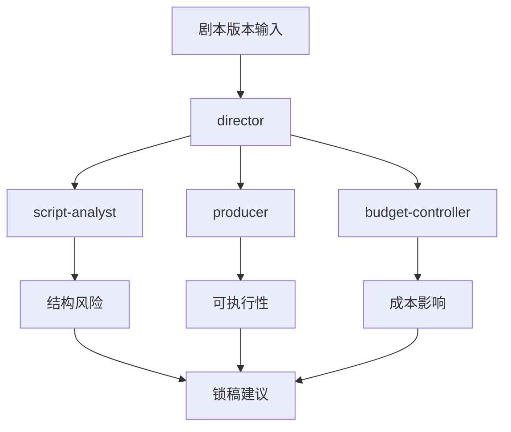

# 25. 剧本开发与锁稿

这一篇聚焦前期制作的第一核心问题：

**剧本如何从创意文本，变成可执行生产的锁定版本。**

---

## 1. 为什么锁稿是前期的起点

在传统电影制作中，剧本没有锁定，预算、排期、场景设计、选角、分镜都无法稳定推进。

传统前期资料强调：剧本锁定之后，预算、设计、排期才能真正进入稳定编制；锁稿后的改动会引发连锁修订。[来源：Tools for Film, Pre-Production](https://www.toolsforfilm.com/glossary/pre-production)

---

## 2. 一张锁稿流程图

---

## 3. 剧本开发阶段的真实工作

剧本开发通常包括：

- 故事梗概
- treatment
- 初稿
- 多轮修订
- 导演意见整合
- 制片可执行性评估
- 市场定位评估

这意味着剧本不是单纯文学文本，而是生产计划的源头。

---

## 4. 锁稿前必须回答的问题

- 这个故事的核心冲突是否清晰
- 场景数量是否可控
- 角色数量是否可控
- 是否存在高成本场景
- 是否存在高难度拍摄需求
- 是否存在大量 VFX 依赖
- 是否适合当前预算级别

---

## 5. 锁稿后的变化意味着什么

一旦锁稿后再改剧本，通常会影响：

- 场景数量
- 拍摄天数
- 演员档期
- 场地需求
- 美术与道具需求
- 预算结构
- 分镜与镜头表
- 后期工作量

所以导演智能体必须具备“变更影响分析”能力。

---

## 6. 导演智能体如何承接锁稿流程

可以把锁稿流程拆成几个智能体职责：

- director：判断创作方向是否稳定
- script-analyst：拆解结构与风险
- producer：评估可执行性
- budget-controller：评估成本影响
- storyboard：预估镜头复杂度

---

## 7. 与 DeerFlow 的落地映射

在 DeerFlow 中，锁稿流程可以映射为：

- Lead Agent 读取剧本与项目目标
- 调用 `task` 委派给 script-analyst / producer / budget-controller
- 汇总结构化结果
- 更新 `script_state`
- 生成锁稿建议文档

---

## 8. 一张平台锁稿图

---

## 9. 研发建议

第一版系统不需要做复杂编剧协同平台，但至少要支持：

- 剧本版本输入
- 剧本结构拆解
- 锁稿建议输出
- 变更影响摘要
- 锁稿状态字段

---

## 10. 这一篇最重要的结论

### 结论一
锁稿是前期制作真正开始的分水岭。

### 结论二
导演智能体必须理解“剧本变更会引发生产连锁变化”。

### 结论三
锁稿流程是 DeerFlow 电影化改造中最适合优先落地的能力之一。