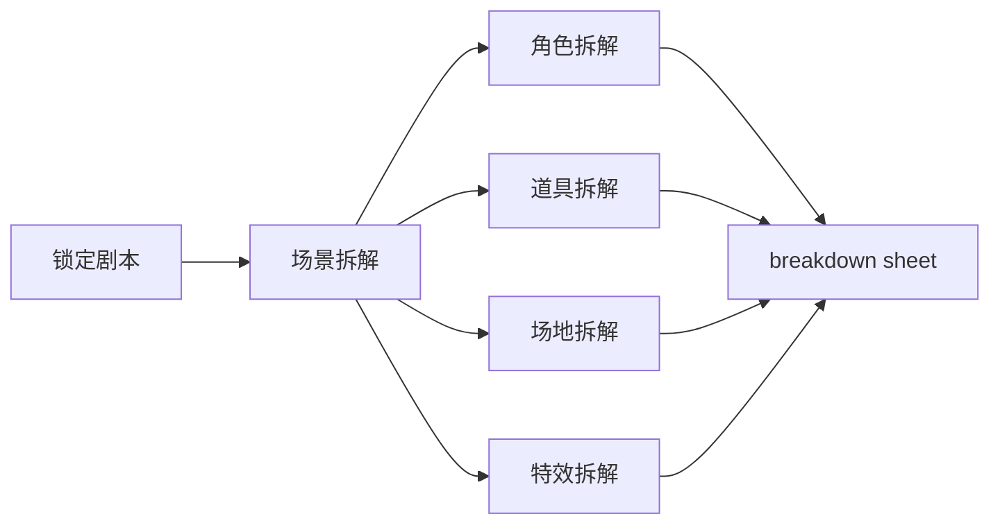
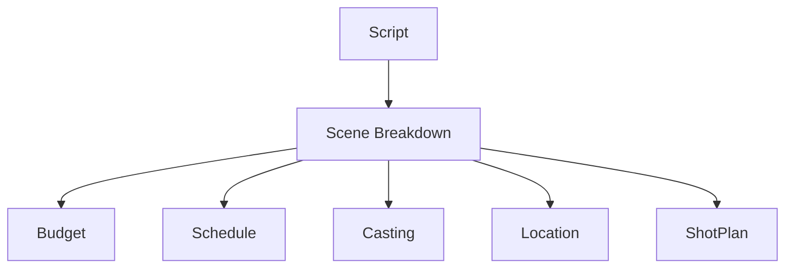

# 26. 剧本拆解与 breakdown sheet

这一篇聚焦：

**剧本如何被拆成可供预算、排期、选角、场地、美术、摄影使用的生产信息。**

---

## 1. 什么是 breakdown

breakdown 的本质，是把剧本从叙事文本转成生产结构。

它通常会识别：

- 场景编号
- 内外景
- 日夜
- 角色出场
- 群演需求
- 道具需求
- 服装需求
- 特殊效果需求
- 动作需求
- 场地需求

---

## 2. 一张 breakdown 流程图

---

## 3. 为什么 breakdown 是生产中枢

因为预算、排期、选角、勘景、美术、摄影几乎都依赖 breakdown。

如果 breakdown 不准确，后面所有环节都会偏差。

所以它不是一个附属文档，而是前期制作的中枢文档之一。

---

## 4. breakdown sheet 的典型字段

- scene_id
- INT / EXT
- DAY / NIGHT
- location
- characters
- extras
- props
- wardrobe
- makeup
- stunts
- VFX
- SFX
- vehicles
- animals
- notes

---

## 5. 导演智能体如何承接 breakdown

可以拆成：

- script-analyst：识别场景与角色
- producer：识别资源需求
- budget-controller：识别成本敏感项
- scheduling：识别排期敏感项
- storyboard：识别镜头复杂项

---

## 6. 与 DeerFlow 的落地映射

在 DeerFlow 中，breakdown 可以作为：

- `script_tools.py` 的核心输出
- `MovieThreadState.script_state` 的核心组成
- budget / schedule / location / casting 的上游输入

---

## 7. 一张对象流图

---

## 8. 第一版实现建议

第一版不需要做到工业级 breakdown 全覆盖，但至少要支持：

- 场景列表提取
- 角色列表提取
- 场景属性识别
- 高成本场景标记
- 高复杂度场景标记

---

## 9. 为什么这一步适合 AI + 人工协同

因为 breakdown 既有结构化规律，也有大量需要人工确认的边界情况。

所以更现实的做法是：

- AI 先做初步拆解
- 人工审核关键字段
- 系统保留修订记录

---

## 10. 这一篇最重要的结论

### 结论一
breakdown 是把剧本转成生产计划的关键桥梁。

### 结论二
导演智能体平台必须把 breakdown 作为核心对象，而不是临时文本。

### 结论三
在 DeerFlow 中，breakdown 最适合作为第一批 movie tools 的核心能力。