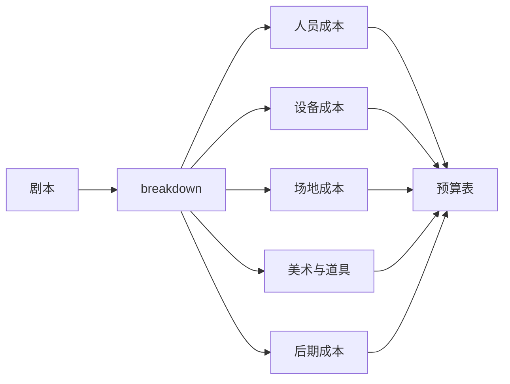
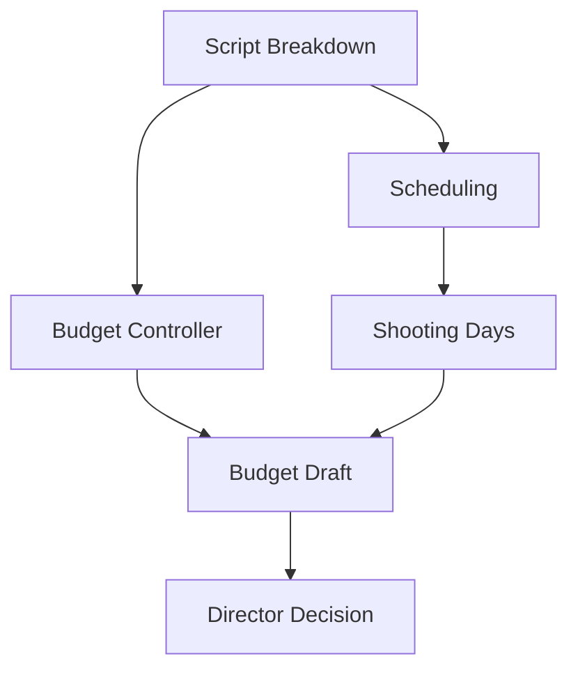
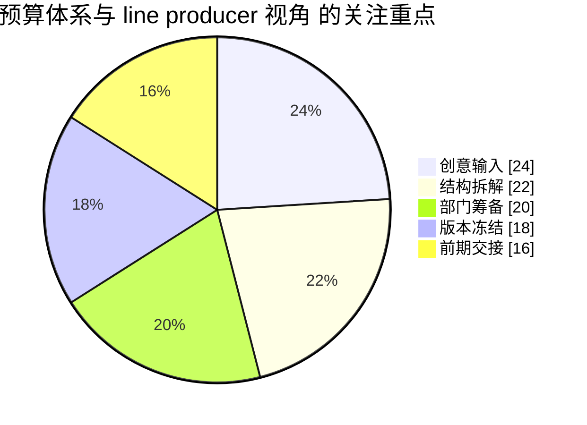

# 27. 预算体系与 line producer 视角

这一篇聚焦：

**电影预算不是简单估价，而是把剧本拆解结果转成资源与成本结构。**

---

## 1. 为什么预算是前期核心文档

传统前期资料强调，line producer 的预算与 1st AD 的排期，是前期最核心的两个运营文档之一。[来源：Tools for Film, Pre-Production](https://www.toolsforfilm.com/glossary/pre-production)

预算不是财务附属品，而是整个项目可执行性的硬边界。

---

## 2. 一张预算形成图

---

## 3. 预算的真实组成

预算通常包括：

- above the line
- below the line
- equipment
- locations
- art department
- wardrobe / makeup
- transportation
- catering
- post-production
- contingency

预算的关键不是“总数”，而是结构。

---

## 4. 为什么预算必须和排期一起看

行业实践普遍强调：排期和预算必须一起编制，因为拍摄天数变化会直接影响人工、设备、场地等成本；每增加一天拍摄，都会带来明显的底层成本变化。[来源：Saturation, Film Budget 101](https://saturation.io/blog/film-budget-101-the-key-to-successful-film-production)

这意味着导演智能体必须具备：

- 预算与排期联动分析
- 变更成本评估
- 风险缓冲建议

---

## 5. line producer 的视角是什么

line producer 关心的不是“这个镜头酷不酷”，而是：

- 这个场景要多少资源
- 这个资源是否可获得
- 这个安排是否超预算
- 这个变更是否值得
- 哪些地方必须留 contingency

---

## 6. 导演智能体如何承接预算能力

可以拆成：

- budget-controller：生成预算草案
- producer：评估资源可行性
- director：平衡创作与成本
- scheduling：评估拍摄天数影响

---

## 7. 与 DeerFlow 的落地映射

在 DeerFlow 中，预算能力可以落在：

- `tools/movie/budget_tools.py`
- `budget_state`
- `DepartmentTaskResult` 的成本风险字段
- artifacts 中的预算表输出

---

## 8. 一张预算联动图

---

## 9. 第一版实现建议

第一版预算能力建议先支持：

- 场景级成本估算
- 总预算草案
- 高成本场景标记
- 预算风险摘要
- 预算优化建议

---

## 10. 这一篇最重要的结论

### 结论一
预算是电影项目可执行性的硬边界。

### 结论二
预算必须与排期联动，而不是单独存在。

### 结论三
在导演智能体平台中，预算子智能体必须是核心角色，而不是附属工具。

---

<!-- movie-visuals:start -->
## 补充图示：换一种视角看本篇

下面这张 占比图 把“预算体系与 line producer 视角”再压缩成一个可快速扫读的结构视图，便于先抓关键关系，再回到正文细节。

<!-- movie-visuals:end -->

<!-- movie-doc-nav:start -->
## 文档导航

- 总入口：[README.md](./README.md)
- 阅读地图：[00-reading-map.md](./00-reading-map.md)
- 所在分组：25-36 前期制作
- 上一篇：[26. 剧本拆解与 breakdown sheet](./26-script-breakdown-and-breakdown-sheet.md)
- 下一篇：[28. 排期体系与 1st AD 视角](./28-scheduling-and-first-ad-view.md)

### 同组文档
- [25. 剧本开发与锁稿](./25-script-development-and-lock.md)
- [26. 剧本拆解与 breakdown sheet](./26-script-breakdown-and-breakdown-sheet.md)
- 27. 预算体系与 line producer 视角（当前）
- [28. 排期体系与 1st AD 视角](./28-scheduling-and-first-ad-view.md)
- [29. 选角流程与演员管理](./29-casting-and-actor-management.md)
- [30. 场地勘景与场地锁定](./30-location-scouting-and-lock.md)
- [31. 美术、服装、道具协同](./31-art-costume-props-collaboration.md)
- [32. 摄影、灯光、视效前期协同](./32-cinematography-lighting-vfx-preproduction.md)
- [33. 文字分镜与镜头表](./33-text-storyboard-and-shot-list.md)
- [34. 静态分镜图与氛围图](./34-static-storyboards-and-moodboards.md)
- [35. 风格参考分析与风格统一](./35-style-reference-analysis-and-unification.md)
- [36. 对白设计与润色](./36-dialogue-design-and-polish.md)
<!-- movie-doc-nav:end -->
