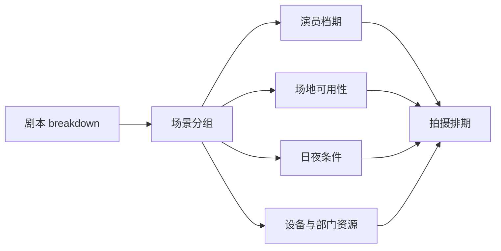
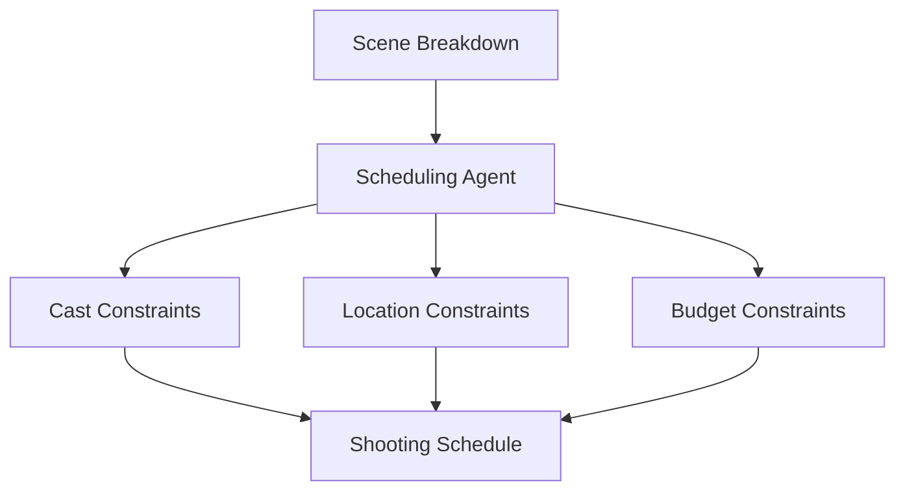

# 28. 排期体系与 1st AD 视角

这一篇聚焦：

**电影排期为什么不是简单日历，而是整个拍摄执行系统的骨架。**

---

## 1. 为什么排期是前期核心文档

传统前期资料强调，1st AD 的排期是前期最核心的运营文档之一。排期决定场景拍摄顺序，而这个顺序通常并不是剧本顺序，而是围绕演员档期、场地、设备、日夜条件等进行优化。[来源：Tools for Film, Pre-Production](https://www.toolsforfilm.com/glossary/pre-production)

---

## 2. 一张排期逻辑图

---

## 3. 1st AD 真正在做什么

1st AD 的工作不是“排个表”，而是：

- 把剧本拆成可拍摄单元
- 优化拍摄顺序
- 减少 company move
- 压缩资源浪费
- 控制每日工作量
- 保障现场秩序

这本质上是一个复杂约束优化问题。

---

## 4. 行业实践中的关键约束

行业实践强调，排期通常会用 stripboard 或数字等价物，把场景按地点、演员可用性、日夜条件等重新排列，以减少 company move 和时间浪费。[来源：Block Reel DAO, Pre-Production Mastery](https://www.blockreeldao.com/blog/pre-production-mastery-the-ultimate-checklist-for-independent-filmmakers)

这意味着排期系统必须理解：

- location grouping
- cast availability
- day / night grouping
- setup complexity
- move cost

---

## 5. 导演智能体如何承接排期能力

可以拆成：

- scheduling / assistant-director subagent：生成排期草案
- producer：评估资源可行性
- budget-controller：评估成本影响
- director：决定创作优先级是否允许调整

---

## 6. 与 DeerFlow 的落地映射

在 DeerFlow 中，排期能力可以落在：

- `tools/movie/schedule_tools.py`
- `schedule_state`
- `CallSheet` / `Schedule` 对象
- `assistant-director` 子智能体

---

## 7. 一张排期联动图

---

## 8. 第一版实现建议

第一版排期能力建议先支持：

- 场景分组
- 日夜标记
- 演员可用性约束
- 场地约束
- 初步拍摄顺序建议

---

## 9. 为什么排期是导演智能体平台的关键能力

因为排期是把“创作目标”转成“执行顺序”的桥梁。

没有排期能力，导演智能体就只能停留在前期创意层，无法进入真实制作系统。

---

## 10. 这一篇最重要的结论

### 结论一
排期是拍摄执行系统的骨架，而不是附属表格。

### 结论二
1st AD 视角本质上是复杂约束优化视角。

### 结论三
在 DeerFlow 的电影化改造中，排期子智能体应当是第二阶段的核心模块。

---

---

<!-- movie-doc-nav:start -->
## 文档导航

- 总入口：[README.md](./README.md)
- 阅读地图：[00-reading-map.md](./00-reading-map.md)
- 所在分组：25-36 前期制作
- 上一篇：[27. 预算体系与 line producer 视角](./27-budgeting-and-line-producer-view.md)
- 下一篇：[29. 选角流程与演员管理](./29-casting-and-actor-management.md)

### 同组文档
- [25. 剧本开发与锁稿](./25-script-development-and-lock.md)
- [26. 剧本拆解与 breakdown sheet](./26-script-breakdown-and-breakdown-sheet.md)
- [27. 预算体系与 line producer 视角](./27-budgeting-and-line-producer-view.md)
- 28. 排期体系与 1st AD 视角（当前）
- [29. 选角流程与演员管理](./29-casting-and-actor-management.md)
- [30. 场地勘景与场地锁定](./30-location-scouting-and-lock.md)
- [31. 美术、服装、道具协同](./31-art-costume-props-collaboration.md)
- [32. 摄影、灯光、视效前期协同](./32-cinematography-lighting-vfx-preproduction.md)
- [33. 文字分镜与镜头表](./33-text-storyboard-and-shot-list.md)
- [34. 静态分镜图与氛围图](./34-static-storyboards-and-moodboards.md)
- [35. 风格参考分析与风格统一](./35-style-reference-analysis-and-unification.md)
- [36. 对白设计与润色](./36-dialogue-design-and-polish.md)
<!-- movie-doc-nav:end -->
