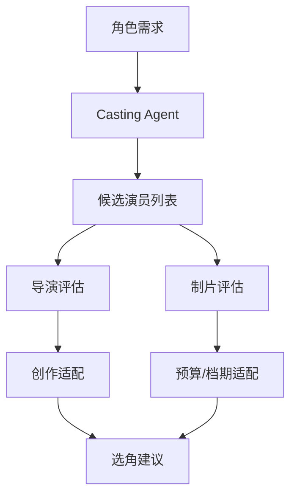

# 29. 选角流程与演员管理

这一篇聚焦：

**选角为什么不是简单找演员，而是创作、市场、预算、排期共同作用的结果。**

---

## 1. 选角在前期中的位置

选角既影响创作，也影响融资、市场、排期和预算。

在很多项目里，主演确认甚至会影响融资推进；而 supporting cast 的确定，则会影响排期与现场组织。

---

## 2. 一张选角流程图

---

## 3. 选角的真实约束

选角通常要同时考虑：

- 角色匹配度
- 表演能力
- 市场价值
- 档期可用性
- 预算可承受性
- 与其他演员的化学反应
- 拍摄难度

所以它不是单一创作判断，而是多目标平衡。

---

## 4. 导演与制片在选角中的分工

- 导演更关注角色适配与表演可能性
- 制片更关注预算、档期、市场与可执行性
- casting director 更关注候选池与试镜流程

这意味着导演智能体平台不能只给“推荐名单”，还要给：

- 风险说明
- 档期说明
- 成本说明
- 替代方案

---

## 5. 与 DeerFlow 的落地映射

可以设计：

- casting subagent
- producer subagent
- `casting_state`
- 演员候选对象
- 档期约束对象
- 选角评估 artifacts

---

## 6. 一张选角平台图

---

## 7. 第一版实现建议

第一版不需要做完整 casting 平台，但可以先支持：

- 角色画像生成
- 候选演员建议
- 档期风险摘要
- 成本风险摘要
- 替代演员建议

---

## 8. 为什么选角适合“AI 辅助 + 人工决策”

因为选角涉及大量主观判断与现实约束。

更现实的方式是：

- AI 做候选筛选与结构化比较
- 导演与制片做最终判断
- 系统记录决策依据

---

## 9. 研发上的启示

选角模块的重点不是“自动决定演员”，而是：

- 结构化角色需求
- 结构化候选比较
- 结构化风险说明
- 结构化决策记录

---

## 10. 这一篇最重要的结论

### 结论一
选角是创作、预算、档期、市场共同作用的结果。

### 结论二
导演智能体平台应当支持选角分析，而不是替代最终人类判断。

### 结论三
在 DeerFlow 中，选角能力适合作为第二批扩展的专业子智能体。

---

---

<!-- movie-doc-nav:start -->
## 文档导航

- 总入口：[README.md](./README.md)
- 阅读地图：[00-reading-map.md](./00-reading-map.md)
- 所在分组：25-36 前期制作
- 上一篇：[28. 排期体系与 1st AD 视角](./28-scheduling-and-first-ad-view.md)
- 下一篇：[30. 场地勘景与场地锁定](./30-location-scouting-and-lock.md)

### 同组文档
- [25. 剧本开发与锁稿](./25-script-development-and-lock.md)
- [26. 剧本拆解与 breakdown sheet](./26-script-breakdown-and-breakdown-sheet.md)
- [27. 预算体系与 line producer 视角](./27-budgeting-and-line-producer-view.md)
- [28. 排期体系与 1st AD 视角](./28-scheduling-and-first-ad-view.md)
- 29. 选角流程与演员管理（当前）
- [30. 场地勘景与场地锁定](./30-location-scouting-and-lock.md)
- [31. 美术、服装、道具协同](./31-art-costume-props-collaboration.md)
- [32. 摄影、灯光、视效前期协同](./32-cinematography-lighting-vfx-preproduction.md)
- [33. 文字分镜与镜头表](./33-text-storyboard-and-shot-list.md)
- [34. 静态分镜图与氛围图](./34-static-storyboards-and-moodboards.md)
- [35. 风格参考分析与风格统一](./35-style-reference-analysis-and-unification.md)
- [36. 对白设计与润色](./36-dialogue-design-and-polish.md)
<!-- movie-doc-nav:end -->
