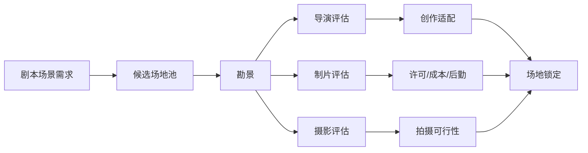
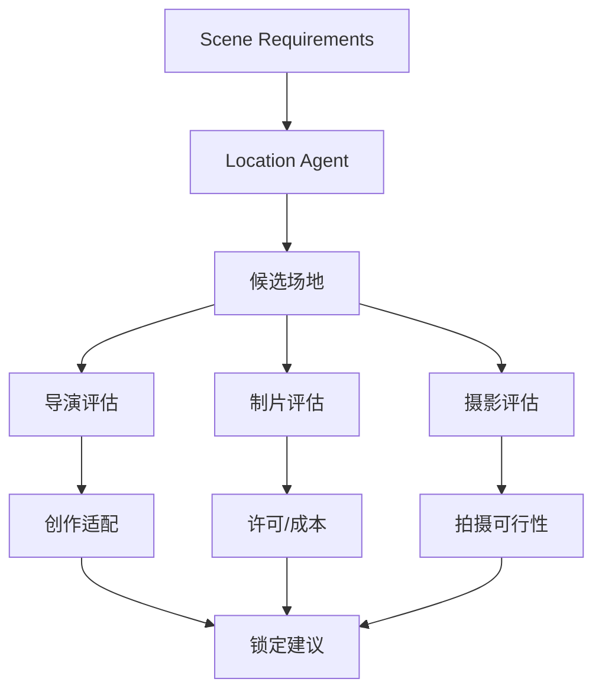

# 30. 场地勘景与场地锁定

这一篇聚焦：

**场地为什么是电影制作中最容易低估、但最容易引发连锁问题的资源。**

---

## 1. 场地不是背景，而是生产约束

在真实电影制作中，场地不仅影响画面，还影响：

- 拍摄许可
- 时间窗口
- 交通与后勤
- 灯光与摄影方案
- 美术改造成本
- 声音条件
- company move 成本

所以场地不是“找个好看的地方”，而是生产系统中的关键约束。

---

## 2. 一张勘景流程图

---

## 3. 场地锁定前必须回答的问题

- 是否符合剧本需求
- 是否符合风格需求
- 是否可获得拍摄许可
- 是否满足拍摄时间窗口
- 是否适合灯光与摄影布置
- 是否存在噪音问题
- 是否会增加大量 company move
- 是否会显著增加预算

---

## 4. 为什么场地会引发连锁变化

场地一旦变化，通常会影响：

- 排期
- 预算
- 摄影方案
- 美术方案
- 灯光方案
- 交通与后勤
- 演员到场安排

所以导演智能体必须具备“场地变更影响分析”能力。

---

## 5. 与 DeerFlow 的落地映射

可以设计：

- location subagent
- `location_state`
- 场地候选对象
- 场地评估对象
- 场地锁定 artifacts

---

## 6. 一张平台场地图

---

## 7. 第一版实现建议

第一版场地能力建议先支持：

- 场景需求摘要
- 候选场地匹配
- 场地风险摘要
- 场地锁定建议
- 场地变更影响摘要

---

## 8. 为什么场地模块很适合真实试点

因为场地问题非常具体、非常现实、非常容易验证。

这意味着它很适合作为导演智能体平台的试点模块之一：

- 输入清晰
- 约束明确
- 输出可验证
- 与预算/排期联动明显

---

## 9. 研发上的启示

场地模块的重点不是“自动选景”，而是：

- 结构化场景需求
- 结构化场地评估
- 结构化风险说明
- 结构化锁定建议

---

## 10. 这一篇最重要的结论

### 结论一
场地是电影制作中的关键生产约束，而不是单纯视觉背景。

### 结论二
导演智能体必须理解场地与预算、排期、摄影、美术之间的联动关系。

### 结论三
在 DeerFlow 中，场地模块非常适合作为真实项目试点能力。