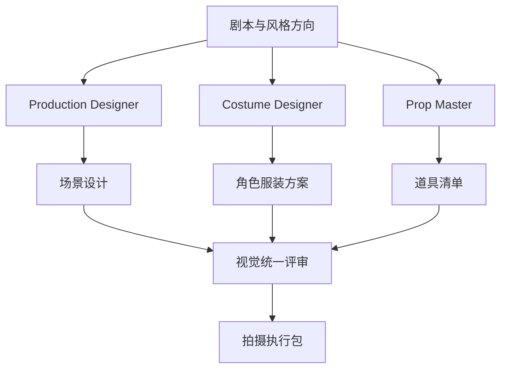
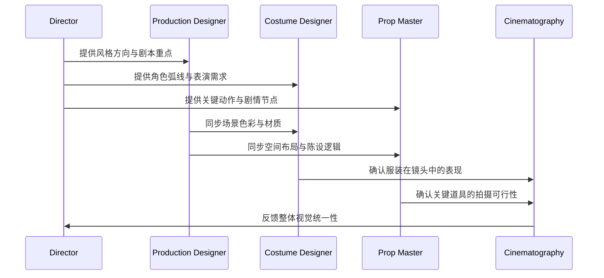
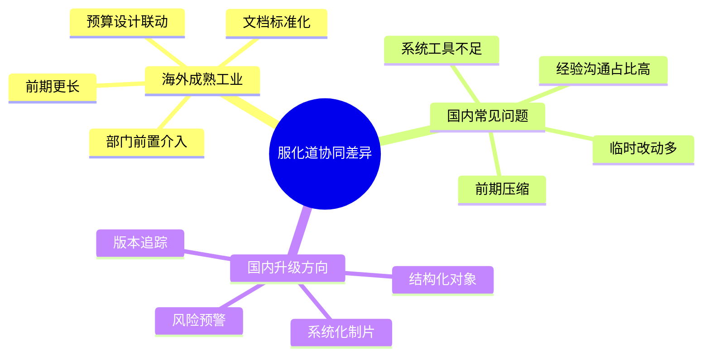
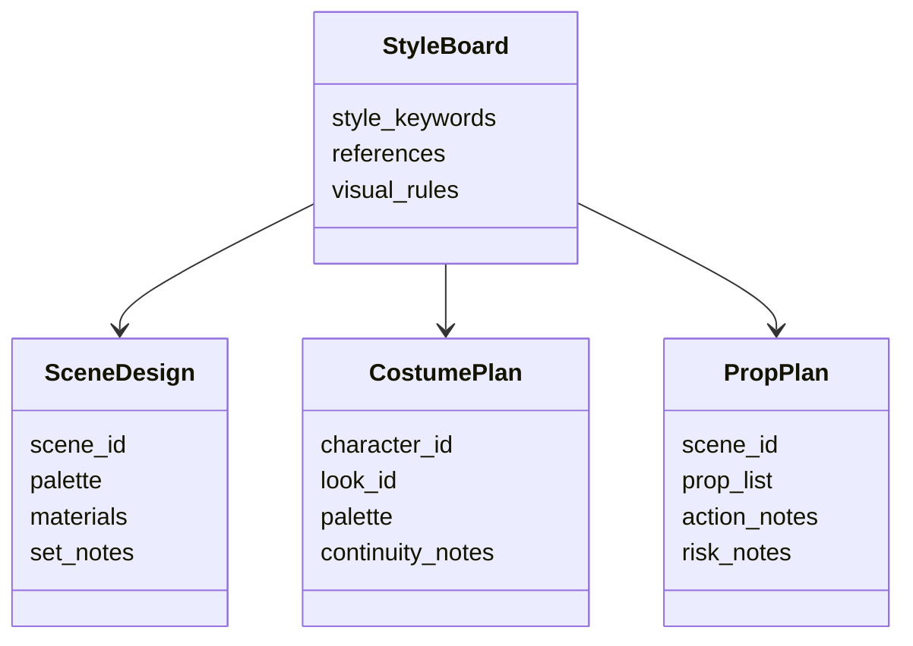

# 31. 美术、服装、道具协同

这一篇聚焦：

**为什么美术、服装、道具不是独立部门，而是共同构成电影视觉世界的生产系统。**

---

## 1. 三个部门为什么必须协同

在真实电影制作中：

- 美术决定空间与视觉世界
- 服装决定人物身份、时代感与角色状态
- 道具决定动作可执行性与场景可信度

如果三者不同步，就会出现：

- 时代错位
- 风格不统一
- 镜头细节穿帮
- 拍摄执行受阻

---

## 2. 一张协同总图

---

## 3. 真实项目中的协同顺序

通常不是三个部门各做各的，而是：

1. 根据剧本与导演风格方向建立视觉基调
2. 美术先定义空间、材质、色彩与时代感
3. 服装根据角色弧线与场景环境做适配
4. 道具根据动作、剧情与镜头需求做配置
5. 摄影与导演再确认镜头中的整体统一性

---

## 4. 一张时序图

---

## 5. 国内外差异：美术协同的组织方式

从全网资料与行业实践看，海外成熟工业体系更强调：

- 部门前置介入
- 设计文档标准化
- 预算与设计同步联动
- 通过 breakdown 和 schedule 提前锁定资源

而国内项目中，常见问题是：

- 前期压缩，设计时间不足
- 依赖经验型沟通，文档化不足
- 临时改动较多，导致服化道返工
- 制片系统化工具不足时，跨部门同步成本高

国内也在出现“系统化制片”实践，例如《消失的证人》案例中，项目管理系统覆盖预算、进度、物资与人员调度、后期节点，减少了信息延迟问题。[来源：海报新闻《技术加速电影生产方式变革，系统化制片探索见成效》](http://hb.dzwww.com/p/p439rri030.html)

---

## 6. 一张国内外差异对比图

---

## 7. 导演智能体如何承接这类协同

导演智能体平台不能只输出“风格建议”，还要支持：

- 场景视觉对象
- 角色服装对象
- 道具对象
- 视觉统一性评审
- 变更影响分析

---

## 8. 与 DeerFlow 的落地映射

可以设计：

- art-direction subagent
- costume subagent
- props subagent
- `StyleBoard` / `SceneDesign` / `PropPlan` 对象
- `review_state` 中的视觉统一性审核

---

## 9. 一张对象关系图

---

## 10. 第一版实现建议

第一版不需要做完整美术管理系统，但建议支持：

- 场景视觉摘要
- 角色服装建议
- 关键道具清单
- 视觉统一性检查
- 变更影响摘要

---

## 11. 这一篇最重要的结论

### 结论一
美术、服装、道具本质上是一个共同构成视觉世界的协同系统。

### 结论二
国内外差异的关键，不只是审美差异，更是前期组织化程度与文档化程度的差异。

### 结论三
导演智能体平台应当把服化道协同建模成对象、流程和审核，而不是零散提示词。

---

---

<!-- movie-doc-nav:start -->
## 文档导航

- 总入口：[README.md](./README.md)
- 阅读地图：[00-reading-map.md](./00-reading-map.md)
- 所在分组：25-36 前期制作
- 上一篇：[30. 场地勘景与场地锁定](./30-location-scouting-and-lock.md)
- 下一篇：[32. 摄影、灯光、视效前期协同](./32-cinematography-lighting-vfx-preproduction.md)

### 同组文档
- [25. 剧本开发与锁稿](./25-script-development-and-lock.md)
- [26. 剧本拆解与 breakdown sheet](./26-script-breakdown-and-breakdown-sheet.md)
- [27. 预算体系与 line producer 视角](./27-budgeting-and-line-producer-view.md)
- [28. 排期体系与 1st AD 视角](./28-scheduling-and-first-ad-view.md)
- [29. 选角流程与演员管理](./29-casting-and-actor-management.md)
- [30. 场地勘景与场地锁定](./30-location-scouting-and-lock.md)
- 31. 美术、服装、道具协同（当前）
- [32. 摄影、灯光、视效前期协同](./32-cinematography-lighting-vfx-preproduction.md)
- [33. 文字分镜与镜头表](./33-text-storyboard-and-shot-list.md)
- [34. 静态分镜图与氛围图](./34-static-storyboards-and-moodboards.md)
- [35. 风格参考分析与风格统一](./35-style-reference-analysis-and-unification.md)
- [36. 对白设计与润色](./36-dialogue-design-and-polish.md)
<!-- movie-doc-nav:end -->
