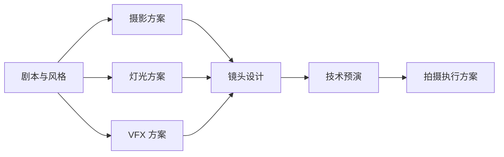
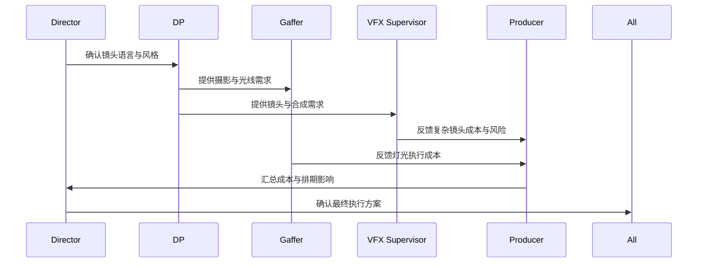
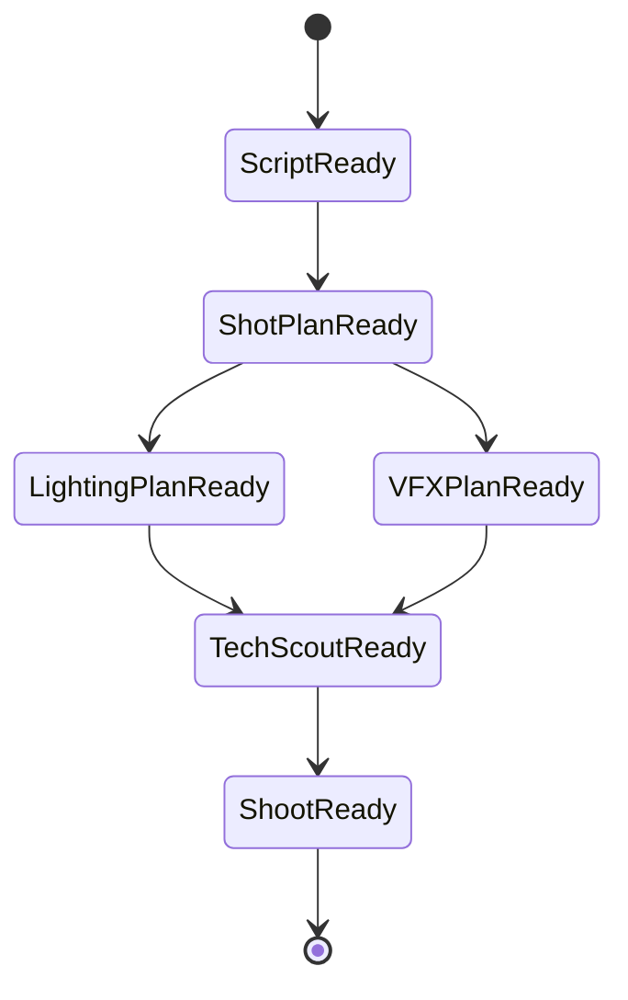

# 32. 摄影、灯光、视效前期协同

这一篇聚焦：

**为什么摄影、灯光、视效必须在前期就协同，而不能等到现场再临时决定。**

---

## 1. 前期协同的本质

摄影、灯光、视效共同决定：

- 镜头语言
- 光线逻辑
- 现场执行复杂度
- 后期合成难度
- 成本与拍摄天数

如果这三者前期不同步，现场就会出现：

- 灯位与机位冲突
- 绿幕 / LED / 实景方案冲突
- 后期无法无损接续
- 拍摄时间失控

---

## 2. 一张协同架构图

---

## 3. 海外成熟流程的特点

海外成熟工业体系通常会更早做：

- tech scout
- previs
- lens / camera tests
- VFX breakdown
- lighting plan

这意味着很多复杂镜头在开拍前就已经被拆解成：

- 机位
- 灯位
- 运动路径
- 合成层
- 后期交付要求

---

## 4. 国内常见差异

国内项目中，尤其在中小体量项目里，常见情况是：

- 前期时间被压缩
- 视效前置拆解不足
- 摄影与后期交接标准不统一
- 现场临时决策比例更高

但随着虚拟制片、系统化制片和数字化流程推进，这种情况正在改善，尤其在科幻、悬疑、商业片中更明显。

---

## 5. 一张时序图

---

## 6. 真实落地中的关键文档

这类协同通常依赖：

- shot list
- lens plan
- lighting diagram
- VFX breakdown
- tech scout notes
- previs / animatic

这些文档本质上就是导演智能体平台未来要管理的 artifacts。

---

## 7. 与 DeerFlow 的落地映射

可以设计：

- cinematography subagent
- lighting-planning subagent
- vfx-planning subagent
- `ShotPlan` / `LightingPlan` / `VFXPlan` 对象
- 技术预演 artifacts

---

## 8. 一张对象依赖图

---

## 9. 国内外差异对导演智能体设计的启示

如果平台要适配国内外项目，必须支持两种模式：

- 标准化前置模式：适合成熟工业流程
- 压缩式快速协同模式：适合时间紧、资源有限的项目

也就是说，平台不能只支持理想流程，还要支持现实中的压缩流程。

---

## 10. 第一版实现建议

第一版建议先支持：

- 镜头复杂度标记
- 灯光需求摘要
- VFX 风险摘要
- 技术预演建议
- 复杂镜头优先级排序

---

## 11. 这一篇最重要的结论

### 结论一
摄影、灯光、视效的前期协同，本质上是在前置解决现场成本与后期返工问题。

### 结论二
国内外差异的关键，在于前期协同深度与文档标准化程度。

### 结论三
导演智能体平台应当把这类协同沉淀为对象、状态和技术预演流程。